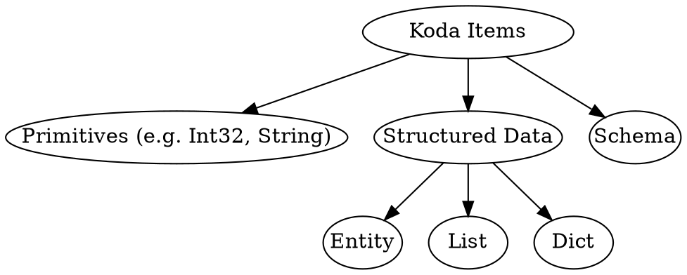
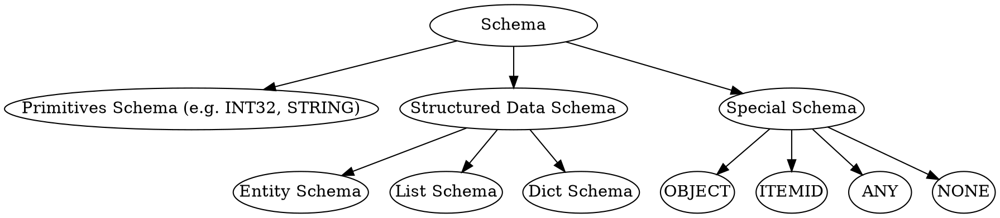

<!-- go/markdown -->

# Common Pitfalls and Gotchas

This guide goes through common pitfalls new users could encounter in Koda. It is
recommended to read through the guide after finishing reading
[Koda Fundamentals](fundamentals.md). It can be used as a tutorial to check your
understanding of Koda or as references to individual
issues.

* TOC
{:toc}

## Koda Item Categorization

On the high level, a Koda item can be a primitive, structured data or schema.
Entities/lists/dicts are Koda items that store structured data (i.e. a set of
attributes, ordered elements, a set of key/value pairs).



To create Koda items, we can use the following APIs:

Type       | APIs
---------- | -------------------------
Primitives | `kd.int32`, `kd.str`, ...
Entity     | `kd.new`
List       | `kd.list`
Dict       | `kd.dict`

## Objects

Objects are special Koda items which know their own schemas and can be any
primitives or special entities/lists/dicts storing their own schema as an
attribute (i.e. the internal `__schema__` attribute). Objects with different
types can be mixed in the same DataSlice and provide more flexibility.

```py
# It fails because of incompatible schemas
# kd.slice([1, kd.new(a=1), kd.list([1, 2]), kd.dict({1: 2})])

# It works as all items are objects and the resulting DataSlice has OBJECT schema
kd.slice([1, kd.obj(a=1), kd.obj([1, 2]), kd.obj({1: 2})])
```

To create objects, we can use `kd.obj(input)` API where `input` can be a Python
primitive, a Python list/dict, a Koda primitive, a entity/list/dict or variadic
keyword arguments of attributes. When `input` is a entity/list/dict, it embeds
the schema into the `__schema__` attribute.

```py
# Primitive objects
kd.obj(1)
kd.obj('2')
kd.obj(kd.float64(3.0))  # 3.0 is converted to FLOAT32 by default

# Entity objects
kd.obj(a=1, b=2)
kd.obj(kd.new(a=1, b=2))

# List objects
kd.obj([1, 2, 3])
kd.obj(kd.list([1, 2, 3]))

# Dict objects
kd.obj({1: 2})
kd.obj(kd.dict({1: 2}))
```

NOTE: schemas themselves cannot be objects.

```py
# They fail
# kd.obj(kd.INT32)
# kd.obj(kd.list_schema(kd.INT32))
```

## Non-objects vs Objects

The following table highlights the differences between objects and non-objects:

|                       | Non-objects             | Objects                  |
| --------------------- | ----------------------- | ------------------------ |
| Analogous to          | Protos or C++ structs   | Python objects (that     |
:                       : (whose type information : store type information   :
:                       : is stored externally)   : in the `__class__`       :
:                       :                         : attribute)               :
| Allow mixed type in a | No                      | Yes                      |
: DataSlice             :                         :                          :
| Where schema(s) are   | DataSlice level         | Level of Iindividual     |
: stored                :                         : items (as `__schema__`   :
:                       :                         : attribute or inferred    :
:                       :                         : from primitive data)     :
| Performance           | Faster because of       | Somewhat slower          |
:                       : homogeneous data        :                          :
| Flexibility           | Less flexible           | More flexible            |
| Suitable use cases    | Data with well-defined  | Mixed data with          |
:                       : schema,                 : different schemas, quick :
:                       : performance-critical    : experiments,             :
:                       : workflows               : non-performance-critical :
:                       :                         : workflows                :

## Koda Schema Categorization

Schemas can be further categorized as follows:



To create/use Koda schemas, we can use the following APIs:

Type              | APIs
----------------- | -------------------------------------------
Primitive Schemas | `kd.INT32`, `kd.STRING`, ...
Entity Schema     | `kd.named_schema` or `kd.schema.new_schema`
List Schema       | `kd.list_schema`
Dict Schema       | `kd.dict_schema`
OBJECT Schema     | `kd.OBJECT`
ITEMID Schema     | `kd.ITEMID`
ANY Schema        | `kd.ANY`
NONE Schema       | `kd.NONE`

## List/Dict/Named schemas are Uu Schemas

Uu schemas are structured data schemas (i.e. entity/list/dict schemas) whose
Itemids are UUIDs. Uu schemas are useful because we can put items with the same
schema into a DataSlice. Otherwise, we need to make them objects at the cost of
performance.

List and dict schemas are always uu schemas. Entity schemas created using
`kd.named_schema` or `kd.uu_schema` are Uu schemas while these created using
`kd.schema.new_schema` are not.

```py
ls1 = kd.list_schema(kd.INT32)
ls2 = kd.list_schema(kd.INT32)
assert ls1 == ls2
ls3 = kd.list_schema(kd.STRING)
assert ls1 != ls3

ds1 = kd.dict_schema(kd.STRING, kd.INT32)
ds2 = kd.dict_schema(kd.STRING, kd.INT32)
assert ds1 == ds2
ds3 = kd.dict_schema(kd.STRING, kd.FLOAT32)
assert ds1 != ds3

us1 = kd.uu_schema(a=kd.INT32)
us2 = kd.uu_schema(a=kd.INT32)
assert us1 == us2
us3 = kd.uu_schema(a=kd.INT64)
assert us1 != us3
```

The UUID of a named schema only depends on its schema name and not on its schema
attributes.

```py
ns1 = kd.named_schema('Schema', a=kd.INT32)
ns2 = kd.named_schema('Schema', a=kd.STRING)
assert ns1 == ns2
ns3 = kd.named_schema('DiffSchema', a=kd.INT32)
assert ns1 != ns3
```

NOTE: Creating multiple named schemas with the same name is dangerous as one can
override the other when underlying bags are merged.

```py
ns1 = kd.named_schema('Schema', a=kd.INT32)
ns2 = kd.named_schema('Schema', a=kd.STRING, b=kd.BOOL)
assert ns1 == ns2
ns2.updated(ns1.get_bag())  # Schema(a=INT32, b=BOOLEAN)
```

## Vectorized Creation of Entities

To create entities in a vectorized way, we use `kd.new(**kwargs_in_ds)`.
`**kwargs_in_ds` are first aligned to have the same shape.

```py
# Note 'x' is first wrapped into kd.str('x') then broadcasted to kd.str(['x', 'x', 'x'])
kd.new(a=kd.slice([1, 2, 3]), b='x', c=kd.new(d=kd.slice([4, 5, 6])))
# -> [Entity(a=1, b='x', c=Entity(d=4)),
#     Entity(a=2, b='x', c=Entity(d=5)),
#     Entity(a=3, b='x', c=Entity(d=6))]
```

Creating entity objects is similar. We use `kd.obj(**kwargs_in_ds)`.

```py
kd.obj(a=kd.slice([1, 2, 3]), b='x', c=kd.obj(d=kd.slice([4, 5, 6])))
# -> [Obj(a=1, b='x', c=Obj(d=4)),
#     Obj(a=2, b='x', c=Obj(d=5)),
#     Obj(a=3, b='x', c=Obj(d=6))]
```

## Explicit Entity Schemas vs Implicit Entity Schemas

Entity schemas created explicitly using schema creation APIs or as a by-product
of `kd.new(**kwargs)` are called explicit entity schemas. Those created
implicitly as a by-product of `kd.obj(**kwargs)` are called implicit schemas.

Explicit entity schemas and implicit entity schemas differ by how they handle
schema conflicts during assignment. Attributes of an explicit entity schema
cannot be overridden unless `update_schema=True` is set while attributes of an
implicit entity schema can be overridden by default.

```py
entity = kd.new(a=1)
# Fail as schemas are not compatible
# entity.with_attrs(a='2')
entity = entity.with_attrs(a='2', update_schema=True)
entity.get_schema()  # SCHEMA(a=STRING)

obj = kd.obj(a=1)
obj = obj.with_attrs(a='2')
obj.get_obj_schema()  # IMPLICIT_SCHEMA(a=STRING)
```

The motivation behind this is that an explicit entity schema can be used by
multiple entities while an implicit schema cannot. Thus overriding schema
attributes of an explicit schema without `update_schema=True` is dangerous. For
example,

```py
entities = kd.new(a=kd.slice([1, 2]))
# Only update the first item
# We want to assign it to '3' rather than 3 by mistake
# Imagine the following line succeeds without update_schema=True
upd = kd.attrs(entities.S[0], a='3', update_schema=True)
entities = entities.updated(upd)
# Fails because one value is 2 but schema is STRING
entities.a
```

However, it is not a problem for an implicit schema and allowing direct
overrides makes the code more concise.

```py
objs = kd.obj(a=kd.slice([1, 2]))
objs.a  # DataSlice([1, 2], schema: INT32, ndims: 1, size: 2)
upd = kd.attrs(objs.S[0], a='3')
objs = objs.updated(upd)
# It is fine as objects have different implicit schemas
objs.a  # DataSlice(['3', 2], schema: OBJECT, ndims: 1, size: 2)
```

NOTE: Adding new attributes is allowed for both explicit and implicit entity
schemas.

```py
entity = kd.new(a=1)
entity = entity.with_attrs(b='2')
entity.get_schema()  # SCHEMA(a=INT32, b=STRING)

obj = kd.obj(a=1)
obj = obj.with_attrs(b='2')
obj.get_obj_schema()  # IMPLICIT_SCHEMA(a=INT32, b=STRING)
```

## `kd.obj(**kwargs_in_ds)` and `kd.obj(kd.new(**kwargs_in_ds))` Are Different

`kd.obj(**kwargs_in_ds)` is not equivalent to `kd.obj(kd.new(**kwargs_in_ds))`.
`kd.new(**kwargs_in_ds)` creates entities with the same schema and
`kd.obj(entities)` then embeds the schema into each entity.
`kd.obj(**kwargs_in_ds)` creates objects with different schemas.

```py
kwargs_in_ds = dict(a=kd.slice([1, 2, 3]), b='x')
entities = kd.new(**kwargs_in_ds)
objs_1 = kd.obj(entities)
objs_1.get_obj_schema() == entities.get_schema()  # [present, present, present]
# Schemas are the same
objs_1.get_obj_schema().get_itemid()
# [Schema:$7IzNK3toe5Fiq3uZOg396n, Schema:$7IzNK3toe5Fiq3uZOg396n, Schema:$7IzNK3toe5Fiq3uZOg396n]

# Modification of the schema of one item affects the other items
upd = kd.attrs(objs_1.S[1], c=4.0)
objs_1.updated(upd)
# [Obj(a=1, b='x', c=None), Obj(a=2, b='x', c=4.0), Obj(a=3, b='x', c=None)]

objs_2 = kd.obj(**kwargs_in_ds)
# Schemas are different
objs_2.get_obj_schema().get_itemid()
# [Schema:#6wYkMBuiRTtW7jaIQfyPEy, Schema:#6wYkMBuiRTtW7jaIQfyPEz, Schema:#6wYkMBuiRTtW7jaIQfyPF0]

# Modification of the schema for one item does not affect the other items
upd = kd.attrs(objs_2.S[1], c=4.0)
objs_2.updated(upd)
# [Obj(a=1, b='x'), Obj(a=2, b='x', c=4.0), Obj(a=3, b='x')]
```

## Vectorized Creation of Lists Using `kd.implode`

To create lists in a vectorized way, we use `kd.implode(ds)` rather than
`kd.list(ds)` because it is unclear how many dimensions of `ds` should be
imploded into lists when using `kd.list(ds)` and `ds.get_ndim() > 1`.

```py
# DataSlice with three dimensions
ds = kd.slice([[[1, 2], [3]], [[4], [5, 6]], [[7], [None]], [[], [8]]])

# Implode the last dimension
kd.implode(ds)
kd.implode(ds, ndim=1)  # Same as above
# DataSlice([
#   [List[1, 2], List[3]], [List[4], List[5, 6]],
#   [List[7], List[None]], [List[], List[8]]
# ], schema: LIST[INT32], ndims: 2, size: 8)

# Implode the last two dimensions
kd.implode(ds, ndim=2)
# DataSlice([
#   List[List[1, 2], List[3]],
#   List[List[4], List[5, 6]],
#   List[List[7], List[None]],
#   List[List[], List[8]],
# ], schema: LIST[LIST[INT32]], ndims: 1, size: 4)

# Implode the last three dimensions
kd.implode(ds, ndim=3)
kd.implode(ds, ndim=-1)  # Same as above, implode repeatedly until the result is a DataItem
# DataItem(List[
#   List[List[1, 2], List[3]],
#   List[List[4], List[5, 6]],
#   List[List[7], List[None]],
#   List[List[], List[8]],
# ], schema: LIST[LIST[LIST[INT32]]])
```

NOTE: `kd.list(py_list)` is equivalent to `kd.implode(kd.slice(py_list),
ndim=-1)`. That is, `kd.list(py_list)` always implodes all dimensions into lists
if `py_list` is a nested Python list.

TIP: `ds.implode(ndim)` is a shortcut for `kd.implode(ds, ndim)`.

## Vectorized Creation of Dicts Using `kd.dict`

To create dicts in a vectorized way, we use `kd.dict(key_ds, value_ds)`.

```py
kd.dict(kd.item(1), kd.item(2))  # Dict{1=2}
kd.dict(kd.slice([1]), kd.slice([2]))  # Dict{1=2}
kd.dict(kd.slice([1, 2]), kd.slice([3, 4]))  # Dict{1=3, 2=4}
kd.dict(kd.slice([[1, 2], [3]]), kd.slice([5, 6])) # [Dict{2=5, 1=5}, Dict{3=6}]
```

## Check if a DataSlice is a Primitive/Entity/List/Dict DataSlice

`kd.is_primitive(ds)`, `kd.is_entity(ds)`, `kd.is_list(ds)` and `kd.is_dict(ds)`
return `present` if `ds` can **behave** like a primitive/entity/list/dict. That
is, `ds` either has a corresponding primitive/entity/list/dict schema or its
schema is `OBJECT` schema and all its present items are
primitives/entities/lists/dicts.

```py
kd.is_primitive(kd.slice([1, 2]))  # present
kd.is_primitive(kd.slice([1, 2], kd.OBJECT))  # present
kd.is_primitive(kd.slice([1, 2, None, '3'], kd.OBJECT))  # present

kd.is_entity(kd.new(a=kd.slice([1, 2, 3])))  # present
kd.is_entity(kd.obj(a=kd.slice([1, 2, 3])))  # present
kd.is_entity(kd.slice([kd.obj(a=1), None, kd.obj(a=3)]))  # present

kd.is_list(kd.list([1, 2]))  # present
kd.is_list(kd.obj(kd.list([1, 2])))  # present

kd.is_dict(kd.dict({1: 2}))  # present
kd.is_dict(kd.obj(kd.dict({1: 2})))  # present
```

NOTE: `kd.is_primitive(ds)`, `kd.is_entity(ds)`, `kd.is_list(ds)` and
`kd.is_dict(ds)` always return `present` for an empty DataSlice with `OBJECT`
schema.

```py
empty_ds1 = kd.slice(None, kd.OBJECT)
empty_ds2 = kd.slice([], kd.OBJECT)
empty_ds3 = kd.slice([None, None], kd.OBJECT)

for ds in [empty_ds1, empty_ds2, empty_ds3]:
  assert kd.is_primitive(ds)
  assert kd.is_entity(ds)
  assert kd.is_list(ds)
  assert kd.is_dict(ds)
```

## Check Individual Items in a Mixed OBJECT DataSlice

`kd.has_primitive(ds)`, `kd.has_entity(ds)`, `kd.has_list(ds)` and
`kd.has_dict(ds)` return `present` for each item if the item is respectively a
primitive/entity/list/dict.

NOTE: They are pointwise operations while `kd.is_primitive(ds)`,
`kd.is_entity(ds)`, `kd.is_list(ds)` and `kd.is_dict(ds)` always return a MASK
DataItem.

```py
ds = kd.slice([1, '2', None, kd.obj(a=1), kd.obj([1, 2]), kd.obj({1: 2})])

kd.has_primitive(ds)  # [present, present, missing, missing, missing, missing]
kd.has_entity(ds)  # [missing, missing, missing, present, missing, missing]
kd.has_list(ds)  # [missing, missing, missing, missing, present, missing]
kd.has_dict(ds)  # [missing, missing, missing, missing, missing, present]
```

NOTE: `kd.is_xxx(ds)` is not always equivalent to `kd.all(kd.has_xxx(ds))`. For
an empty DataSlice with `OBJECT` schema, `kd.is_xxx(ds)` returns `present` but
`kd.all(kd.has_xxx(ds))` returns `missing`.

```py
ds = kd.slice([None, None], kd.OBJECT)

kd.is_entity(ds)  # present
kd.all(kd.has_entity(ds))  # missing
```

As object items can only be primitives, entities, lists and dicts, `kd.has(ds)`
is always the same as `kd.has_primitive(ds) | kd.has_entity(ds) |
kd.has_list(ds) | kd.has_dict(ds)`.

```py
ds = kd.slice([1, '2', None, kd.obj(), kd.obj(kd.list()), kd.obj(kd.dict())])

# Always returns present
kd.full_equal(kd.has(ds), kd.has_primitive(ds) | kd.has_entity(ds) | kd.has_list(ds) | kd.has_dict(ds))
```

## Pointwise Equality Only Compares ItemIds for Entities/Lists/Dicts

The pointwise equality operator `x == y` only compares **ItemIds** for
structured data (i.e. entities/lists/dicts) and ignores their contents and
underlying bags.

```py
e1 = kd.new(x=1)
e2 = e1.with_attrs(x=2)
assert e1 == e2
assert e1.no_bag() == e2

list_id = kd.allocation.new_listid()
l1 = kd.list([1, 2], itemid=list_id)
l2 = kd.list([3, 4], itemid=list_id)
assert l1 == l2
assert l1.no_bag() == l2

d1 = kd.dict({1: 2})
d2 = d1.with_dict_update(3, 4)
assert d1 == d2
assert d1.no_bag() == d2
```

NOTE: `x == y` and `x != y` require `x` and `y` to have compatible schemas. If
they have incompatible schemas, the comparisons will raise an exception. That
will happen irrespective of the equality or inequality of the ItemIds of `x` and
`y`.

```py
list_id = kd.allocation.new_listid()
l1 = kd.list([1, 2], itemid=list_id)
l2 = kd.list(['3', '4'], itemid=list_id)
# Fails because LIST[INT32] is not compatible with LIST[STRING]
# l1 == l2

# Fails because LIST[INT32] is not compatible with OBJECT
# l1 == kd.obj(l1)

# Both have OBJECT schemas
assert kd.obj(l1) == kd.obj(l2)
```

## Pointwise Equality vs DataSlice Equality

`x == y` is a pointwise equality operation and checks equality of individual
items. In contrast to that, `kd.full_equal(x, y)` checks if `x` and `y` have the
same **sparsity** and all present items are equal.

NOTE: `kd.full_equal(x, y)` is neither equivalent to `kd.all(x == y)` nor
equivalent to `~kd.all(x != y)`.

```py
x = kd.slice([1, None, 3])
y = kd.slice([1, None, 3])

x == y  # [present, missing, present]
kd.all(x == y)  # missing
kd.full_equal(x, y)  # present

x = kd.slice([1, None, 3])
y = kd.slice([1, 2, 3])

x != y  # [missing, missing, missing]
~kd.all(x != y)  # present
kd.full_equal(x, y)  # missing
```

## Masks vs Booleans

As Koda supports sparsity natively, a boolean has three possible states (`True`,
`False`, `None/missing`) whereas a mask only has two possible states (`present`,
`missing`). Koda uses masks rather than booleans to avoid three-value-boolean
problem. Imagine the following cases:

-   `~kd.bool(None)`: should it return `kd.bool(None)` or `kd.bool(True)`
-   `kd.bool(None) & kd.bool(False)`: should it return `kd.bool(None)` or
    `kd.bool(False)`
-   `kd.bool(None) | kd.bool(True)`: should it return `kd.bool(None)` or
    `kd.bool(True)`

In contrast, there is no confusion around masks:

-   `~kd.missing` -> `kd.present`
-   `kd.missing & kd.missing` -> `kd.missing`
-   `kd.missing | kd.present` -> `kd.present`

## Conversion between Koda Masks and Python Booleans

To convert Koda mask DataItems to Python booleans, we can use the Python
built-in `bool()`. This is especially useful when using Koda in a Python `if`
statement.

```py
bool(kd.present)  # True
bool(kd.missing)  # False

ds = kd.slice([1, 2, 3])

if kd.all(kd.has(ds)):
  print('ds is full')

if ds.is_primitive():
  print('ds is primitive')
```

However, `bool()` does not work for mask DataSlices with `ndim > 0`. The items
of such a DataSlice should be aggregated into a mask DataItem first, for example
by using `kd.all` or `kd.any`.

```py
ds = kd.slice([kd.present, kd.missing])
# The next line fails
# bool(ds)

bool(kd.any(ds))  # True
bool(kd.all(ds))  # False
```

When converting from Koda to Python using `to_py` or `to_pytree`, individual
present mask items are mapped to the `kd.present` object as there is no native
mask concept in Python. Users can explicitly convert Koda masks to Koda boolean
first by deciding if `missing` should be interpreted as `False` or `None`.

```py
kd.to_py(kd.present)  # DataItem(present, schema: MASK)
kd.to_py(kd.missing)  # None

ds = kd.slice([kd.present, kd.missing])
kd.to_py(ds) # [DataItem(present, schema: MASK), None]

kd.to_py(kd.cond(ds, True, False))  # [True, False]
kd.to_py(kd.cond(ds, True, None))  # [True, None]
```

To convert Python booleans to Koda mask, users can first convert them to Koda
boolean and decide how `False` and `missing` should be handled.

```py
ds_bool = kd.slice([True, False, None])

# Treat False as present
kd.has(ds_bool)  # [present, present, missing]
# Treat False as missing
ds_bool == True # [present, missing, missing]
```

## Sparsity Rule And `x != y` vs `~(x == y)`

Many Koda operations are pointwise operations. For example, adding two
DataSlices first aligns their shapes and then perform addition for the
corresponding pairs of items. The sparsity rule for pointwise operation states
any pointwise operations involving a missing value return a missing value. For
example,

```py
x = kd.slice([1, None, 3])
y = kd.int32(1)

x + y  # [2, None, 4], as y is broadcasted to [1, 1, 1] before pointwise addition
```

However, there is one exception: the `kd.has_not` operator (which is the same as
`~`) returns `kd.present` for missing values.

```py
kd.has_not(x)  # [missing, present, missing]
~x  # [missing, present, missing]
```

Because of how sparsity is handled, `x != y` is not equivalent to `~(x == y)`.

```py
x = kd.slice([1, None, 3])
y = kd.int32(1)

x != y  # [missing, missing, present]
x == y  # [present, missing, missing]
~(x == y)  # [missing, present, present]
```

## Broadcasting DataSlices of Entities/Lists/Dicts Replicates ItemIds

Entities/lists/dicts in a DataSlice are not fully copied when broadcasting the
DataSlice, but their ItemIds are replicated. It is similar to `[a] * 10` in
Python, which duplicates the reference to `a` 10 times in Python. After
broadcasting, modifying one entity/list/dict will affect the others too.

```py
ds1 = kd.new(a=kd.slice([1, 2]))
ds2 = kd.slice([[0, 0], [0, 0]])
ds3 = ds1.expand_to(ds2)  # [[Entity(a=1), Entity(a=1)], [Entity(a=2), Entity(a=2)]]
ds3.get_itemid()
# [
#   [Entity:$009KNMsAwrXS5TiSE706kY, Entity:$009KNMsAwrXS5TiSE706kY],
#   [Entity:$009KNMsAwrXS5TiSE706kZ, Entity:$009KNMsAwrXS5TiSE706kZ],
# ]

# Only modify the first element
# Note the items with the same ItemIds are modfied too
ds3.updated(kd.attrs(ds3.S[..., 0], a=3))  # [[Entity(a=3), Entity(a=3)], [Entity(a=3), Entity(a=3)]]
```

It can yield unanticipated results, especially when the broadcasting happens
implicitly (e.g. as part of assignment). For example,

```py
z = kd.new(x=1)
a = kd.new(x=kd.slice([1, 2, 3]))
a = a.with_attrs(z=z)  # the same ItemId is auto-expanded
a.S[0].z.get_itemid() == a.S[1].z.get_itemid()  # yes
# update 2nd object in a, but it is the same as 0th and 1st
a = a.updated(kd.attrs(a.S[2].z, x=10))
a.z.x  # [10, 10, 10]
```

If this is undesirable, you use `kd.clone` or `kd.new_like` to create new
entities with distinct ItemIds.

```py
z = kd.new(x=1)
a = kd.new(x=kd.slice([1, 2, 3]))
a = a.with_attrs(z=z.expand_to(a).clone())
a.S[0].z.get_itemid() != a.S[1].z.get_itemid()  # yes
# update only 2nd object in a
a = a.updated(kd.attrs(a.S[2].z, x=10))
a.z.x  # [1, 1, 10]

a = a.with_attrs(y=kd.new_like(a))
a.S[0].y.get_itemid() != a.S[1].y.get_itemid()  # yes
# update only 2nd object in a
a = a.updated(kd.attrs(a.S[2].y, x=100))
a.y.x  # [None, None, 100]
```
