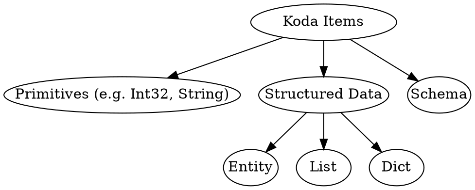
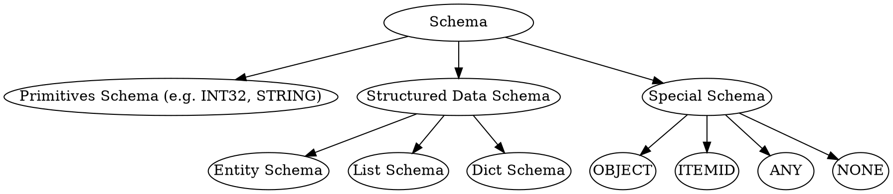

<!-- go/markdown -->

# Common Pitfalls and Gotchas

This guide goes through common pitfalls new users could encounter in Koda. It is
recommended to read through the guide after finishing reading
[Koda Fundamentals](fundamentals.md). It can be used as a tutorial to check your
understanding of Koda or as references to individual
issues.

* TOC
{:toc}

## Koda Item Categorization

On the high level, a Koda item can be a primitive, structured data or schema.
Entities/lists/dicts are Koda items that store structured data (i.e. a set of
attributes, ordered elements, a set of key/value pairs).



To create Koda items, we can use the following APIs:

Type       | APIs
---------- | -------------------------
Primitives | `kd.int32`, `kd.str`, ...
Entity     | `kd.new`
List       | `kd.list`
Dict       | `kd.dict`

## Objects

Objects are special Koda items which know their own schemas and can be any
primitives or special entities/lists/dicts storing their own schema as an
attribute (i.e. the internal `__schema__` attribute). Objects with different
types can be mixed in the same DataSlice and provide more flexibility.

```py
# It fails because of incompatible schemas
# kd.slice([1, kd.new(a=1), kd.list([1, 2]), kd.dict({1: 2})])

# It works as all items are objects and the resulting DataSlice has OBJECT schema
kd.slice([1, kd.obj(a=1), kd.obj([1, 2]), kd.obj({1: 2})])
```

To create objects, we can use `kd.obj(input)` API where `input` can be a Python
primitive, a Python list/dict, a Koda primitive, a entity/list/dict or variadic
keyword arguments of attributes. When `input` is a entity/list/dict, it embeds
the schema into the `__schema__` attribute.

```py
# Primitive objects
kd.obj(1)
kd.obj('2')
kd.obj(kd.float64(3.0))  # 3.0 is converted to FLOAT32 by default

# Entity objects
kd.obj(a=1, b=2)
kd.obj(kd.new(a=1, b=2))

# List objects
kd.obj([1, 2, 3])
kd.obj(kd.list([1, 2, 3]))

# Dict objects
kd.obj({1: 2})
kd.obj(kd.dict({1: 2}))
```

NOTE: schemas themselves cannot be objects.

```py
# They fail
# kd.obj(kd.INT32)
# kd.obj(kd.list_schema(kd.INT32))
```

## Non-objects vs Objects

The following table highlights the differences between objects and non-objects:

|                       | Non-objects             | Objects                  |
| --------------------- | ----------------------- | ------------------------ |
| Analogous to          | Protos or C++ structs   | Python objects (that     |
:                       : (whose type information : store type information   :
:                       : is stored externally)   : in the `__class__`       :
:                       :                         : attribute)               :
| Allow mixed type in a | No                      | Yes                      |
: DataSlice             :                         :                          :
| Where schema(s) are   | DataSlice level         | Level of Iindividual     |
: stored                :                         : items (as `__schema__`   :
:                       :                         : attribute or inferred    :
:                       :                         : from primitive data)     :
| Performance           | Faster because of       | Somewhat slower          |
:                       : homogeneous data        :                          :
| Flexibility           | Less flexible           | More flexible            |
| Suitable use cases    | Data with well-defined  | Mixed data with          |
:                       : schema,                 : different schemas, quick :
:                       : performance-critical    : experiments,             :
:                       : workflows               : non-performance-critical :
:                       :                         : workflows                :

## Koda List vs DataSlice vs DataSlice of Lists

On the high level, here is a quick summary:

-   **Koda list**: represents a single, ordered sequence of items (similar to a
    Python list). It is similar to a Python list or a repeated proto field.
-   **Koda DataSlice**: represents a multi-dimensional array (potentially
    jagged) of Koda items. It's the fundamental data structure for vectorized
    operations. It is similar to a Panda DataFrame.
-   **DataSlice of lists**: a specific type of DataSlice where each item is a
    Koda list. It is an unique concept in Koda and used for vectorized
    operations on lists items.

Dimensions (or structures) in a Python list are represented by nested list
structures. In Koda, dimensions can be captured by nested Koda lists, DataSlice
jagged shape or a combination of them.

### Creating a Koda List or a DataSlice from a Python List

To create a Koda list from a Python list, we use `kd.list(py_list)`. To create a
DataSlice, we use `kd.slice(py_list)`.

Note: All Koda items including lists are accessed via DataSlice interface. A
Koda list is also a DataItem containing a single list.

Let's look at a simple example where `py_list` is a one-dimensional Python list.

```py
l1 = kd.list([1, 2, 3])  # DataItem(List[1, 2, 3])
assert kd.is_slice(l1)
assert kd.is_item(l1)
l1.get_ndim()  # 0
l1.get_schema()  # LIST[INT32]

ds1 = kd.slice([1, 2, 3])  # DataSlice([1, 2, 3])
assert kd.is_slice(ds1)
assert not kd.is_item(ds1)
ds1.get_ndim()  # 1
ds1.get_schema()  # INT32
```

When `py_list` is a nested Python list, `kd.list(py_list)` creates Koda lists
for corresponding Python lists recursively and the final result is a DataItem
containing a Koda list. On the other hand, `kd.slice(py_list)` converts the
nested Python list structure into a jagged shape for the resulting DataSlice.

```py
l2 = kd.list([[1, 2], [3, 4, 5]])  # DataItem(List[List[1, 2], List[3, 4, 5]])
l2.get_ndim()  # 0
l2.get_schema()  # LIST[LIST[INT32]]

ds2 = kd.slice([[1, 2], [3, 4, 5]])  # DataSlice([[1, 2], [3, 4, 5]])
ds2.get_ndim()  # 2
ds2.get_schema()  # INT32
```

TIP: To check what type of items a DataSlice contains, we can get its schema
using `kd.get_schema()`. The schema is also part of the DataSlice `repr`. In the
examples above, we can easily tell if items are lists or integers.

TIP: In the DataSlice `repr`, the jagged shape of a DataSlice is represented by
nested square brackets (i.e. `[]`). By counting the number of adjacent opening
brackets (i.e. `[`), we can easily know the `ndim` of a DataSlice. By looking at
the part right after the opening brackets, we can see the first item of the
DataSlice. For example, `DataSlice([[1, 2], [3, 4, 5]])` has two dimensions
because we see`[[` before the first item, which is `1`.

TIP: In the DataSlice `repr`, a list item is shown as `List[e1, e2, ...]`.
Similar to a Python list, elements of a list item can be lists as well. For
example, `List[List[1, 2], List[3, 4, 5]]`.

What if `py_list` is a Python list containing Koda lists rather than primitives?
Koda lists are treated as individual items similar to primitive items and only
the Python list dimensions are converted to Koda lists or DataSlice jagged
shape.

```py
l3 = kd.list([kd.list([1, 2]), kd.list([3, 4, 5])])  # DataItem(List[List[1, 2], List[3, 4, 5]])
l3.get_ndim()  # 0
l3.get_size()  # 1
l3.get_schema()  # LIST[LIST[INT32]]

ds3 = kd.slice([kd.list([1, 2]), kd.list([3, 4, 5])])  # DataSlice([List[1, 2], List[3, 4, 5]])
ds3.get_ndim()  # 1
ds3.get_size()  # 2
# Note items of `ds3` are 2 Koda lists of INT32s.
ds3.get_schema()  # LIST[INT32]
```

Now we can summarize how `kd.list` and `kd.slice` work.

-   `kd.list(py_list)` converts the Python list structure to corresponding Koda
    list structure and the result is a list DataItem.
-   `kd.slice(py_list)` converts the Python list structure to the jagged shape
    of the result DataSlice.

What if we want to control what gets converted to Koda lists and what gets
converted to a jagged shape? `kd.from_py(py_list, from_dim=)` allows us to do
that. The first `from_dim` dimensions of `py_list` get converted to DataSlice
jagged shape while remaining dimensions get converted to Koda lists.

```py
py_list = [[[1, 2], [3, 4, 5]], [[7], [], [8, 9]]]

ds1 = kd.from_py(py_list, from_ndim=0)
# -> DataItem(List[List[List[1, 2], List[3, 4, 5]], List[List[7], List[], List[8, 9]]])
# same as kd.list(py_list)
ds1.get_ndim()  # 0
ds1.get_size()  # 1
ds1.get_schema()  # LIST[LIST[LIST[INT32]]]

ds2 = kd.from_py(py_list, from_ndim=1)
# -> DataSlice([List[List[1, 2], List[3, 4, 5]], List[List[7], List[], List[8, 9]]])
ds2.get_ndim()  # 1
ds2.get_size()  # 2
ds2.get_schema()  # LIST[LIST[INT32]]

ds3 = kd.from_py(py_list, from_ndim=2)
# -> DataSlice([[List[1, 2], List[3, 4, 5]], [List[7], List[], List[8, 9]]])
ds3.get_ndim()  # 2
ds3.get_size()  # 5
ds3.get_schema()  # LIST[INT32]

ds4 = kd.from_py(py_list, from_ndim=3)
# -> DataSlice([[[1, 2], [3, 4, 5]], [[7], [], [8, 9]]])
# same as kd.slice(py_list)
ds4.get_ndim()  # 3
ds4.get_size()  # 8
ds4.get_schema()  # INT32
```

<section class='zippy'>

Optional: Why does Koda have two ways to represent list-like data?

The two core Koda features are the ability of expressing complex data
relationship and vectorized operations on both primitives and data with complex
structures.

In order to support expressing complex data relationship, Koda has a native list
type along with dict and entity. A Koda list is similar to a Python list or a
repeated proto field. It is used to express the logic like "a query entity has a
list of doc entities".

Koda DataSlice is used to support vectorization for both primitives and data
with complex structures including lists. In order to support hierarchical
structure (i.e. jagged shape) of vectorized items, Koda DataSlices need to have
a jagged shape.

It is worth noting that Python does not support vectorization natively. In order
to perform operations on a nested Python list, we use nested for-loops. At each
iteration of the nested loop, it is clear whether the current object is a list
in the intermedia dimensions or a value in the last dimension.

```py
py_list = [[[1, 2], [3, 4, 5]], [[7], [], [8, 9]]]
# Top level: pylist
# Lists in the first dimension: pylist[0], pylist[1]
# Lists in the second dimension: pylist[0][0], pylist[0][1], pylist[1][0], pylist[1][1], pylist[1][2]
# Integer values in the third dimension: 1, 2, 3, 4, 5, 7, 8, 9

for l1 in py_list:
  for l2 in l1:
    for v in l2:
      # We can access l1, l2, v here

# DataSlice of integers
int_ds = kd.slice(py_list)

# DataSlice of l2 lists
l2_ds = kd.slice([[kd.list([1, 2]), kd.list([3, 4, 5])],
                  [kd.list([7]), kd.list([], item_schema=kd.INT32), kd.list([8, 9])]])

# DataSlice of l1 lists
l1_ds = kd.slice([kd.list([[1, 2], [3, 4, 5]]),
                  kd.list([[7], [], [8, 9]])])

# DataItem of the top level list
top_l_ds = kd.list([[[1, 2], [3, 4, 5]], [[7], [], [8, 9]]])

# Find the max value across the last dimension
kd.agg_max(ind_ds)  # DataSlice([[2, 5], [7, None, 9]])
# Find the max value across all dimensions
kd.max(int_ds)  # DataItem(9)

# Find list sizes
kd.list_size(l2_ds)  # DataSlice([[2, 3], [1, 0, 2]])
kd.list_size(l1_ds)  # DataSlice([2, 3])
kd.list_size(top_l_ds)  # DataItem(2)

# Below is a more complex example of creating pairs by expanding l2_ds
# to int_ds then explode lists to create cross-product
# Create pairs across the last dimension
kd.obj(a=l2_ds.expand_to(int_ds)[:], b=int_ds).flatten(-2)
# DataSlice([
#  [
#    [Obj(a=1, b=1), Obj(a=2, b=1), Obj(a=1, b=2), Obj(a=2, b=2)],
#    [Obj(a=3, b=3), Obj(a=4, b=3), Obj(a=5, b=3), Obj(a=3, b=4),
#     Obj(a=4, b=4), Obj(a=5, b=4), Obj(a=3, b=5), Obj(a=4, b=5), Obj(a=5, b=5)],
#  ],
#  [
#    [Obj(a=7, b=7)],
#    [],
#    [Obj(a=8, b=8), Obj(a=9, b=8), Obj(a=8, b=9), Obj(a=9, b=9)]
#  ],
# ])

# If it is too hard to understand, you can run the following
# code line by line in Colab and check the results
expanded_l2_ds = l2_ds.expand_to(int_ds)
a = expanded_l2_ds[:]
b = int_ds.expand_to(a)
pairs = kd.obj(a=a, b=b)
pairs = pairs.flatten(-2)  # remove the last extra dimension
```

</section>

### Converting a Non-homogeneous Python List to Koda

`py_list` passed to `kd.slice` or `kd.list` must be homogeneous. A Python nested
list is considered homogeneous if it adheres to the following structure:

-   Leaf Level Consistency: All elements at the deepest level (the "leaves")
    must be non-list data types (e.g. primitives or Koda DataItems).
-   Non-Leaf Level Consistency: All elements at any level above the leaf level
    must be lists.

Here are some examples:

-   `[1, [2, 3]]` is not Homogeneous, because 1 is a primitive at a level that
    should contain lists, or `[2, 3]` is a list at a level should contain
    primitives
-   `[[1, 2], [[3], [4]]]` is not Homogeneous, because `1`, and `2` are
    primitives leaves, but at the same level we also find the lists `[3]` and
    `[4]`.
-   `[1, 2, 3]` is homogeneous, because all elements at the (only) leaf level
    are integer primitives.
-   `[[1], [2, 3]]` is homogeneous, because all leaf elements (`1`, `2`, `3`)
    are integer primitives and all elements at other levels are lists.
-   `[[[1], [2]], [[3], [4]]]` is homogeneous, because All leaf elements (`1`,
    `2`, `3`, `4`) are integer primitives and all elements at other levels are
    lists.

```py
# The following all fail
# kd.list([1, [2, 3]])
# kd.slice([1, [2, 3]])
# kd.list([[1, 2], [[3], [4]]])
# kd.slice([[1, 2], [[3], [4]]])
```

However, it is possible to represent such non-homogeneous structures in Koda
because primitives and Koda lists can be Koda objects. To use `kd.slice` or
`kd.list`, we need to wrap Python lists at the leaf level into Koda list objects
using `kd.obj(py_list)` so that all elements at the leaf level are only contains
primitives or Koda list objects. Alternatively, we can use
`kd.from_py(non_homogeneous_py_list)` which performs the conversion
automatically.

```py
kd.list([1, kd.obj([2, 3])])  # DataItem(List[1, List[2, 3]], schema: LIST[OBJECT])
kd.from_py([1, [2, 3]])  # same as above

kd.slice([1, kd.obj([2, 3])])  # DataSlice([1, List[2, 3]], schema: OBJECT)
kd.from_py([1, [2, 3]], from_dim=1)  # same as above
```

### Koda List Slicing vs DataSlice Sub-slicing vs DataSlice Python-like Slicing

To slice Koda lists, we use `[]` similar to Python lists. However, it differs
from Python list slicing in two ways. First, it is a vectorized operation
applying to each list item of a DataSlice. Second, the resulting DataSlice has
one more dimension. That is why we call `list_ds[:]` list explosion to emphasize
the creation of an extra dimension.

```py
# A DataSlice of two lists: List[1, 2], List[3, 4, 5]
l = kd.slice([kd.list([1, 2]), kd.list([3, 4, 5])])
l.get_ndim()  # 1
l.get_size()  # 2

# Get all items for each list
ds1 = l[:]  # DataSlice([[1, 2], [3, 4, 5]])
ds1.get_ndim()  # 2
ds1.get_size()  # 5

# Get all items from the second to the end for each list
ds2 = l[1:]  # DataSlice([[2], [4, 5]])
ds2.get_ndim()  # 2
ds2.get_size()  # 3
```

List explosion adds an extra dimension because it selects multiple elements per
list. List indexing (i.e. `list_ds[idx]`) returns a DataSlice of the same shape
because it selects one element per list.

```py
l[0]  # DataSlice([1, 3])
l[2]  # DataSlice([None, 5])
```

DataSlice sub-slicing (i.e. `ds.S[*args]`) selects items in the DataSlice and
supports slicing multiple dimensions at the same time.

```py
ds = kd.slice([[1, 2], [3, 4, 5]])

# Only subslice the last dimension
ds.S[1]  # DataSlice([2, 4])
# Get the first item in the first dimension and get all items in the second dimension
ds.S[1, :]  # DataSlice([3, 4, 5])
# Select everything, no-op
ds.S[:, :]
ds.S[:]  # same as above, select everything

# Fails because ds does not have lists
# ds[:]
# ds[1]
```

IMPORTANT: List slicing selects elements within lists of a DataSlice whereas
DataSlice sub-slicing selects items in the DataSlice.

```py
# A DataSlice of two list items
l = kd.slice([kd.list([1, 2]), kd.list([3, 4, 5])])

# Select the first element of each list
l[0]   # DataSlice([1, 3])
# Select the first list item in the DataSlice
l.S[0]  # DataItem(List[1, 2])
# Select the first list item then select the second list element
l.S[0][1]  # DataItem(2)
```

To make it possible for a DataSlice to be sliced like a nested Python list (i.e.
`py_list[idx1][idx2]`), Koda support `ds.L` syntax to slice the outermost
DataSlice dimension. That is, `ds.L[idx1].L[idx2]` is equivalent to `ds.S[idx1,
idx2]` assuming `ds` has two dimensions. It is also possible to use `ds.L` in a
Python for-loop to iterate over items in the first dimension.

```py
ds = kd.slice([[1, 2], [3, 4, 5]])

ds.L[0]  # DataSlice([1, 2])
# Note ds.L[:] is no-op
ds.L[:].L[0]  # DataSlice([1, 2])

# Note that l is a 1D DataSlice and i is INT32 DataItem
for l in ds.L:
  print(repr(l))
  for i in l.L:
    print(repr(i))

# The result is
# DataSlice([1, 2], schema: INT32, ndims: 1, size: 2)
# DataItem(1, schema: INT32)
# DataItem(2, schema: INT32)
# DataSlice([3, 4, 5], schema: INT32, ndims: 1, size: 3)
# DataItem(3, schema: INT32)
# DataItem(4, schema: INT32)
# DataItem(5, schema: INT32)

# This is similar to Python

py_list = [[1, 2], [3, 4, 5]]
py_list[0]  # [1, 2]
py_list[:][0]  # [1, 2]

for l in py_list:
  print(repr(l))
  for i in l:
    print(repr(i))

# The result is
# [1, 2]
# 1
# 2
# [3, 4, 5]
# 3
# 4
# 5
```

### List Explosion and Implosion

List explosion is an operation of getting list items from list(s) in a
DataSlice. It adds an additional dimension to the resulting DataSlice. List
implosion is the opposite operation of folding items of a DataSlice to list(s)
over the last dimension. Since it collapses the last dimension, the resulting
DataSlice has one fewer dimension.

It is possible to perform list explosion or implosion multiple time in a single
operation by setting `ndim=` argument in `ds.explode(ndim=)` or
`ds.implode(ndim=)`. When setting `ndim` to a positive number, it
explodes/implodes `ndim` times. When setting `ndim=-1` for
`ds.explode(ndim=-1)`, it explodes the nested lists until the resulting
DataSlice is not a list DataSlice anymore. When setting `ndim=-1` for
`ds.implode(ndim=-1)`, it implodes all the dimensions of `ds` into a single list
DataItem.

```py
l = kd.list([[[1, 2], [3, 4, 5]], [[7], [], [8, 9]]])

l.explode(ndim=1)  # DataSlice([List[List[1, 2], List[3, 4, 5]], List[List[7], List[], List[8, 9]]])
l.explode()  # the same as above
l[:]  # the same as above

l.explode(ndim=2)  # DataSlice([[List[1, 2], List[3, 4, 5]], [List[7], List[], List[8, 9]]])
l[:][:]  # the same as above

l.explode(ndim=3)  # DataSlice([[[1, 2], [3, 4, 5]], [[7], [], [8, 9]]])
l.explode(ndim=-1)  # the same as above
l[:][:][:]  # the same as above

ds = kd.slice([[[1, 2], [3, 4, 5]], [[7], [], [8, 9]]])

ds.implode(ndim=1)  # DataSlice([[List[1, 2], List[3, 4, 5]], [List[7], List[], List[8, 9]]])
ds.implode()  # the same as above

ds.implode(ndim=2)  # DataSlice([List[List[1, 2], List[3, 4, 5]], List[List[7], List[], List[8, 9]]])

ds.implode(ndim=3)  # DataItem(List([[[1, 2], [3, 4, 5]], [[7], [], [8, 9]]]))
ds.implode(ndim=-1)  # the same as above
```

## Koda Schema Categorization

Schemas can be further categorized as follows:



To create/use Koda schemas, we can use the following APIs:

Type              | APIs
----------------- | -------------------------------------------
Primitive Schemas | `kd.INT32`, `kd.STRING`, ...
Entity Schema     | `kd.named_schema` or `kd.schema.new_schema`
List Schema       | `kd.list_schema`
Dict Schema       | `kd.dict_schema`
OBJECT Schema     | `kd.OBJECT`
ITEMID Schema     | `kd.ITEMID`
ANY Schema        | `kd.ANY`
NONE Schema       | `kd.NONE`

## List/Dict/Named schemas are Uu Schemas

Uu schemas are structured data schemas (i.e. entity/list/dict schemas) whose
Itemids are UUIDs. Uu schemas are useful because we can put items with the same
schema into a DataSlice. Otherwise, we need to make them objects at the cost of
performance.

List and dict schemas are always uu schemas. Entity schemas created using
`kd.named_schema` or `kd.uu_schema` are Uu schemas while these created using
`kd.schema.new_schema` are not.

```py
ls1 = kd.list_schema(kd.INT32)
ls2 = kd.list_schema(kd.INT32)
assert ls1 == ls2
ls3 = kd.list_schema(kd.STRING)
assert ls1 != ls3

ds1 = kd.dict_schema(kd.STRING, kd.INT32)
ds2 = kd.dict_schema(kd.STRING, kd.INT32)
assert ds1 == ds2
ds3 = kd.dict_schema(kd.STRING, kd.FLOAT32)
assert ds1 != ds3

us1 = kd.uu_schema(a=kd.INT32)
us2 = kd.uu_schema(a=kd.INT32)
assert us1 == us2
us3 = kd.uu_schema(a=kd.INT64)
assert us1 != us3
```

The UUID of a named schema only depends on its schema name and not on its schema
attributes.

```py
ns1 = kd.named_schema('Schema', a=kd.INT32)
ns2 = kd.named_schema('Schema', a=kd.STRING)
assert ns1 == ns2
ns3 = kd.named_schema('DiffSchema', a=kd.INT32)
assert ns1 != ns3
```

NOTE: Creating multiple named schemas with the same name is dangerous as one can
override the other when underlying bags are merged.

```py
ns1 = kd.named_schema('Schema', a=kd.INT32)
ns2 = kd.named_schema('Schema', a=kd.STRING, b=kd.BOOL)
assert ns1 == ns2
ns2.updated(ns1.get_bag())  # Schema(a=INT32, b=BOOLEAN)
```

## Vectorized Creation of Entities

To create entities in a vectorized way, we use `kd.new(**kwargs_in_ds)`.
`**kwargs_in_ds` are first aligned to have the same shape.

```py
# Note 'x' is first wrapped into kd.str('x') then broadcasted to kd.str(['x', 'x', 'x'])
kd.new(a=kd.slice([1, 2, 3]), b='x', c=kd.new(d=kd.slice([4, 5, 6])))
# -> [Entity(a=1, b='x', c=Entity(d=4)),
#     Entity(a=2, b='x', c=Entity(d=5)),
#     Entity(a=3, b='x', c=Entity(d=6))]
```

Creating entity objects is similar. We use `kd.obj(**kwargs_in_ds)`.

```py
kd.obj(a=kd.slice([1, 2, 3]), b='x', c=kd.obj(d=kd.slice([4, 5, 6])))
# -> [Obj(a=1, b='x', c=Obj(d=4)),
#     Obj(a=2, b='x', c=Obj(d=5)),
#     Obj(a=3, b='x', c=Obj(d=6))]
```

## Explicit Entity Schemas vs Implicit Entity Schemas

Entity schemas created explicitly using schema creation APIs or as a by-product
of `kd.new(**kwargs)` are called explicit entity schemas. Those created
implicitly as a by-product of `kd.obj(**kwargs)` are called implicit schemas.

Explicit entity schemas and implicit entity schemas differ by how they handle
schema conflicts during assignment. Attributes of an explicit entity schema
cannot be overridden unless `update_schema=True` is set while attributes of an
implicit entity schema can be overridden by default.

```py
entity = kd.new(a=1)
# Fail as schemas are not compatible
# entity.with_attrs(a='2')
entity = entity.with_attrs(a='2', update_schema=True)
entity.get_schema()  # SCHEMA(a=STRING)

obj = kd.obj(a=1)
obj = obj.with_attrs(a='2')
obj.get_obj_schema()  # IMPLICIT_SCHEMA(a=STRING)
```

The motivation behind this is that an explicit entity schema can be used by
multiple entities while an implicit schema cannot. Thus overriding schema
attributes of an explicit schema without `update_schema=True` is dangerous. For
example,

```py
entities = kd.new(a=kd.slice([1, 2]))
# Only update the first item
# We want to assign it to '3' rather than 3 by mistake
# Imagine the following line succeeds without update_schema=True
upd = kd.attrs(entities.S[0], a='3', update_schema=True)
entities = entities.updated(upd)
# Fails because one value is 2 but schema is STRING
entities.a
```

However, it is not a problem for an implicit schema and allowing direct
overrides makes the code more concise.

```py
objs = kd.obj(a=kd.slice([1, 2]))
objs.a  # DataSlice([1, 2], schema: INT32, ndims: 1, size: 2)
upd = kd.attrs(objs.S[0], a='3')
objs = objs.updated(upd)
# It is fine as objects have different implicit schemas
objs.a  # DataSlice(['3', 2], schema: OBJECT, ndims: 1, size: 2)
```

NOTE: Adding new attributes is allowed for both explicit and implicit entity
schemas.

```py
entity = kd.new(a=1)
entity = entity.with_attrs(b='2')
entity.get_schema()  # SCHEMA(a=INT32, b=STRING)

obj = kd.obj(a=1)
obj = obj.with_attrs(b='2')
obj.get_obj_schema()  # IMPLICIT_SCHEMA(a=INT32, b=STRING)
```

## `kd.obj(**kwargs_in_ds)` and `kd.obj(kd.new(**kwargs_in_ds))` Are Different

`kd.obj(**kwargs_in_ds)` is not equivalent to `kd.obj(kd.new(**kwargs_in_ds))`.
`kd.new(**kwargs_in_ds)` creates entities with the same schema and
`kd.obj(entities)` then embeds the schema into each entity.
`kd.obj(**kwargs_in_ds)` creates objects with different schemas.

```py
kwargs_in_ds = dict(a=kd.slice([1, 2, 3]), b='x')
entities = kd.new(**kwargs_in_ds)
objs_1 = kd.obj(entities)
objs_1.get_obj_schema() == entities.get_schema()  # [present, present, present]
# Schemas are the same
objs_1.get_obj_schema().get_itemid()
# [Schema:$7IzNK3toe5Fiq3uZOg396n, Schema:$7IzNK3toe5Fiq3uZOg396n, Schema:$7IzNK3toe5Fiq3uZOg396n]

# Modification of the schema of one item affects the other items
upd = kd.attrs(objs_1.S[1], c=4.0)
objs_1.updated(upd)
# [Obj(a=1, b='x', c=None), Obj(a=2, b='x', c=4.0), Obj(a=3, b='x', c=None)]

objs_2 = kd.obj(**kwargs_in_ds)
# Schemas are different
objs_2.get_obj_schema().get_itemid()
# [Schema:#6wYkMBuiRTtW7jaIQfyPEy, Schema:#6wYkMBuiRTtW7jaIQfyPEz, Schema:#6wYkMBuiRTtW7jaIQfyPF0]

# Modification of the schema for one item does not affect the other items
upd = kd.attrs(objs_2.S[1], c=4.0)
objs_2.updated(upd)
# [Obj(a=1, b='x'), Obj(a=2, b='x', c=4.0), Obj(a=3, b='x')]
```

## Vectorized Creation of Lists Using `kd.implode`

To create lists in a vectorized way, we use `kd.implode(ds)` rather than
`kd.list(ds)` because it is unclear how many dimensions of `ds` should be
imploded into lists when using `kd.list(ds)` and `ds.get_ndim() > 1`.

```py
# DataSlice with three dimensions
ds = kd.slice([[[1, 2], [3]], [[4], [5, 6]], [[7], [None]], [[], [8]]])

# Implode the last dimension
kd.implode(ds)
kd.implode(ds, ndim=1)  # Same as above
# DataSlice([
#   [List[1, 2], List[3]], [List[4], List[5, 6]],
#   [List[7], List[None]], [List[], List[8]]
# ], schema: LIST[INT32], ndims: 2, size: 8)

# Implode the last two dimensions
kd.implode(ds, ndim=2)
# DataSlice([
#   List[List[1, 2], List[3]],
#   List[List[4], List[5, 6]],
#   List[List[7], List[None]],
#   List[List[], List[8]],
# ], schema: LIST[LIST[INT32]], ndims: 1, size: 4)

# Implode the last three dimensions
kd.implode(ds, ndim=3)
kd.implode(ds, ndim=-1)  # Same as above, implode repeatedly until the result is a DataItem
# DataItem(List[
#   List[List[1, 2], List[3]],
#   List[List[4], List[5, 6]],
#   List[List[7], List[None]],
#   List[List[], List[8]],
# ], schema: LIST[LIST[LIST[INT32]]])
```

NOTE: `kd.list(py_list)` is equivalent to `kd.implode(kd.slice(py_list),
ndim=-1)`. That is, `kd.list(py_list)` always implodes all dimensions into lists
if `py_list` is a nested Python list.

TIP: `ds.implode(ndim)` is a shortcut for `kd.implode(ds, ndim)`.

## Vectorized Creation of Dicts Using `kd.dict`

To create dicts in a vectorized way, we use `kd.dict(key_ds, value_ds)`.

```py
kd.dict(kd.item(1), kd.item(2))  # Dict{1=2}
kd.dict(kd.slice([1]), kd.slice([2]))  # Dict{1=2}
kd.dict(kd.slice([1, 2]), kd.slice([3, 4]))  # Dict{1=3, 2=4}
kd.dict(kd.slice([[1, 2], [3]]), kd.slice([5, 6])) # [Dict{2=5, 1=5}, Dict{3=6}]
```

## Check if a DataSlice is a Primitive/Entity/List/Dict DataSlice

`kd.is_primitive(ds)`, `kd.is_entity(ds)`, `kd.is_list(ds)` and `kd.is_dict(ds)`
return `present` if `ds` can **behave** like a primitive/entity/list/dict. That
is, `ds` either has a corresponding primitive/entity/list/dict schema or its
schema is `OBJECT` schema and all its present items are
primitives/entities/lists/dicts.

```py
kd.is_primitive(kd.slice([1, 2]))  # present
kd.is_primitive(kd.slice([1, 2], kd.OBJECT))  # present
kd.is_primitive(kd.slice([1, 2, None, '3'], kd.OBJECT))  # present

kd.is_entity(kd.new(a=kd.slice([1, 2, 3])))  # present
kd.is_entity(kd.obj(a=kd.slice([1, 2, 3])))  # present
kd.is_entity(kd.slice([kd.obj(a=1), None, kd.obj(a=3)]))  # present

kd.is_list(kd.list([1, 2]))  # present
kd.is_list(kd.obj(kd.list([1, 2])))  # present

kd.is_dict(kd.dict({1: 2}))  # present
kd.is_dict(kd.obj(kd.dict({1: 2})))  # present
```

NOTE: `kd.is_primitive(ds)`, `kd.is_entity(ds)`, `kd.is_list(ds)` and
`kd.is_dict(ds)` always return `present` for an empty DataSlice with `OBJECT`
schema.

```py
empty_ds1 = kd.slice(None, kd.OBJECT)
empty_ds2 = kd.slice([], kd.OBJECT)
empty_ds3 = kd.slice([None, None], kd.OBJECT)

for ds in [empty_ds1, empty_ds2, empty_ds3]:
  assert kd.is_primitive(ds)
  assert kd.is_entity(ds)
  assert kd.is_list(ds)
  assert kd.is_dict(ds)
```

## Check Individual Items in a Mixed OBJECT DataSlice

`kd.has_primitive(ds)`, `kd.has_entity(ds)`, `kd.has_list(ds)` and
`kd.has_dict(ds)` return `present` for each item if the item is respectively a
primitive/entity/list/dict.

NOTE: They are pointwise operations while `kd.is_primitive(ds)`,
`kd.is_entity(ds)`, `kd.is_list(ds)` and `kd.is_dict(ds)` always return a MASK
DataItem.

```py
ds = kd.slice([1, '2', None, kd.obj(a=1), kd.obj([1, 2]), kd.obj({1: 2})])

kd.has_primitive(ds)  # [present, present, missing, missing, missing, missing]
kd.has_entity(ds)  # [missing, missing, missing, present, missing, missing]
kd.has_list(ds)  # [missing, missing, missing, missing, present, missing]
kd.has_dict(ds)  # [missing, missing, missing, missing, missing, present]
```

NOTE: `kd.is_xxx(ds)` is not always equivalent to `kd.all(kd.has_xxx(ds))`. For
an empty DataSlice with `OBJECT` schema, `kd.is_xxx(ds)` returns `present` but
`kd.all(kd.has_xxx(ds))` returns `missing`.

```py
ds = kd.slice([None, None], kd.OBJECT)

kd.is_entity(ds)  # present
kd.all(kd.has_entity(ds))  # missing
```

As object items can only be primitives, entities, lists and dicts, `kd.has(ds)`
is always the same as `kd.has_primitive(ds) | kd.has_entity(ds) |
kd.has_list(ds) | kd.has_dict(ds)`.

```py
ds = kd.slice([1, '2', None, kd.obj(), kd.obj(kd.list()), kd.obj(kd.dict())])

# Always returns present
kd.full_equal(kd.has(ds), kd.has_primitive(ds) | kd.has_entity(ds) | kd.has_list(ds) | kd.has_dict(ds))
```

## Pointwise Equality Only Compares ItemIds for Entities/Lists/Dicts {#pointwise-equality}

The pointwise equality operator `x == y` only compares **ItemIds** for
structured data (i.e. entities/lists/dicts) and ignores their contents and
underlying bags.

```py
e1 = kd.new(x=1)
e2 = e1.with_attrs(x=2)
assert e1 == e2
assert e1.no_bag() == e2

list_id = kd.allocation.new_listid()
l1 = kd.list([1, 2], itemid=list_id)
l2 = kd.list([3, 4], itemid=list_id)
assert l1 == l2
assert l1.no_bag() == l2

d1 = kd.dict({1: 2})
d2 = d1.with_dict_update(3, 4)
assert d1 == d2
assert d1.no_bag() == d2
```

NOTE: `x == y` and `x != y` require `x` and `y` to have compatible schemas. If
they have incompatible schemas, the comparisons will raise an exception. That
will happen irrespective of the equality or inequality of the ItemIds of `x` and
`y`.

```py
list_id = kd.allocation.new_listid()
l1 = kd.list([1, 2], itemid=list_id)
l2 = kd.list(['3', '4'], itemid=list_id)
# Fails because LIST[INT32] is not compatible with LIST[STRING]
# l1 == l2

# Fails because LIST[INT32] is not compatible with OBJECT
# l1 == kd.obj(l1)

# Both have OBJECT schemas
assert kd.obj(l1) == kd.obj(l2)
```

## Pointwise Equality vs DataSlice Equality

`x == y` is a pointwise equality operation and checks equality of individual
items. In contrast to that, `kd.full_equal(x, y)` checks if `x` and `y` have the
same **sparsity** and all present items are equal.

NOTE: `kd.full_equal(x, y)` is neither equivalent to `kd.all(x == y)` nor
equivalent to `~kd.all(x != y)`.

```py
x = kd.slice([1, None, 3])
y = kd.slice([1, None, 3])

x == y  # [present, missing, present]
kd.all(x == y)  # missing
kd.full_equal(x, y)  # present

x = kd.slice([1, None, 3])
y = kd.slice([1, 2, 3])

x != y  # [missing, missing, missing]
~kd.all(x != y)  # present
kd.full_equal(x, y)  # missing
```

## Compare Entities/Lists/Dicts by Value

As we explained [above](#pointwise-equality), the pointwise equality operator
`x == y` compares ItemIds for entities/lists/dicts rather than the values of
their contents. To compare by value, we can use `kd.deep_uuid` to generate uuids
based on the values of the contents and then compare the generated uuids.

```py
import dataclasses

@dataclasses.dataclass
class Foo:
  x: int
  y: int

foo1 = Foo(x=1, y=2)
foo2 = Foo(x=1, y=2)
assert foo1 == foo2  # Compare by value in Python

es = kd.schema_from_py(Foo)
e1 = kd.from_py(foo1, schema=es)
e2 = kd.from_py(foo2, schema=es)
assert e1 != e2
assert kd.deep_uuid(e1) == kd.deep_uuid(e2)
```

```py
py_l1 = [1, 2, 3]
py_l2 = [1, 2, 3]
assert py_l1 == py_l2

l1 = kd.list(py_l1)
l2 = kd.list(py_l2)
assert l1 != l2
assert kd.deep_uuid(l1) == kd.deep_uuid(l2)
```

```py
py_d1 = {'a': 1, 'b': 2}
py_d2 = {'a': 1, 'b': 2}
assert py_d1 == py_d2

d1 = kd.dict(py_d1)
d2 = kd.dict(py_d2)
assert d1 != d2
assert kd.deep_uuid(d1) == kd.deep_uuid(d2)
```

NOTE: `kd.deep_uuid` works for nested structured data.

```py
i1 = kd.obj(a=kd.obj(b=kd.obj(c=1),
                    d=kd.list([2, 3]),
                    e=kd.dict({'f': 4})))
i2 = kd.obj(a=kd.obj(b=kd.obj(c=1),
                    d=kd.list([2, 3]),
                    e=kd.dict({'f': 4})))

assert kd.deep_uuid(i1) == kd.deep_uuid(i2)
```

NOTE: Even though certain values are considered as the same in Python,
`kd.deep_uuid()` treats them as different values if they have different Koda
dtypes.

```py
o1 = kd.obj(x=1)
o2 = kd.obj(x=kd.int64(1))
assert kd.deep_uuid(o1) != kd.deep_uuid(o2)

assert 1 == 1.0
o3 = kd.obj(x=1.0)
assert kd.deep_uuid(o1) != kd.deep_uuid(o3)
```

However, `kd.deep_uuid` does not print out a nice error message to explain which
sub-parts are different, which is useful in unit test debugging. To get a better
error message, the current recommendation is to convert to pytrees and use
Python comparison assertions.

```py
self.assertEqual(i1.to_pytree(max_depth=-1), i2.to_pytree(max_depth=-1))
```

## Masks vs Booleans

As Koda supports sparsity natively, a boolean has three possible states (`True`,
`False`, `None/missing`) whereas a mask only has two possible states (`present`,
`missing`). Koda uses masks rather than booleans to avoid three-value-boolean
problem. Imagine the following cases:

-   `~kd.bool(None)`: should it return `kd.bool(None)` or `kd.bool(True)`
-   `kd.bool(None) & kd.bool(False)`: should it return `kd.bool(None)` or
    `kd.bool(False)`
-   `kd.bool(None) | kd.bool(True)`: should it return `kd.bool(None)` or
    `kd.bool(True)`

In contrast, there is no confusion around masks:

-   `~kd.missing` -> `kd.present`
-   `kd.missing & kd.missing` -> `kd.missing`
-   `kd.missing | kd.present` -> `kd.present`

## Conversion between Koda Masks and Python Booleans

To convert Koda mask DataItems to Python booleans, we can use the Python
built-in `bool()`. This is especially useful when using Koda in a Python `if`
statement.

```py
bool(kd.present)  # True
bool(kd.missing)  # False

ds = kd.slice([1, 2, 3])

if kd.all(kd.has(ds)):
  print('ds is full')

if ds.is_primitive():
  print('ds is primitive')
```

However, `bool()` does not work for mask DataSlices with `ndim > 0`. The items
of such a DataSlice should be aggregated into a mask DataItem first, for example
by using `kd.all` or `kd.any`.

```py
ds = kd.slice([kd.present, kd.missing])
# The next line fails
# bool(ds)

bool(kd.any(ds))  # True
bool(kd.all(ds))  # False
```

When converting from Koda to Python using `to_py` or `to_pytree`, individual
present mask items are mapped to the `kd.present` object as there is no native
mask concept in Python. Users can explicitly convert Koda masks to Koda boolean
first by deciding if `missing` should be interpreted as `False` or `None`.

```py
kd.to_py(kd.present)  # DataItem(present, schema: MASK)
kd.to_py(kd.missing)  # None

ds = kd.slice([kd.present, kd.missing])
kd.to_py(ds) # [DataItem(present, schema: MASK), None]

kd.to_py(kd.cond(ds, True, False))  # [True, False]
kd.to_py(kd.cond(ds, True, None))  # [True, None]
```

To convert Python booleans to Koda mask, users can first convert them to Koda
boolean and decide how `False` and `missing` should be handled.

```py
ds_bool = kd.slice([True, False, None])

# Treat False as present
kd.has(ds_bool)  # [present, present, missing]
# Treat False as missing
ds_bool == True # [present, missing, missing]
```

## Sparsity Rule And `x != y` vs `~(x == y)`

Many Koda operations are pointwise operations. For example, adding two
DataSlices first aligns their shapes and then perform addition for the
corresponding pairs of items. The sparsity rule for pointwise operation states
any pointwise operations involving a missing value return a missing value. For
example,

```py
x = kd.slice([1, None, 3])
y = kd.int32(1)

x + y  # [2, None, 4], as y is broadcasted to [1, 1, 1] before pointwise addition
```

However, there is one exception: the `kd.has_not` operator (which is the same as
`~`) returns `kd.present` for missing values.

```py
kd.has_not(x)  # [missing, present, missing]
~x  # [missing, present, missing]
```

Because of how sparsity is handled, `x != y` is not equivalent to `~(x == y)`.

```py
x = kd.slice([1, None, 3])
y = kd.int32(1)

x != y  # [missing, missing, present]
x == y  # [present, missing, missing]
~(x == y)  # [missing, present, present]
```

## List Updates are More Expensive than Entity/Dict Updates

Entity attributes and dict key/value pairs can be updated using `with_attrs` and
`with_dict_updated`, respectively. Entity attributes and key/value pairs have no
order and are stored internally in a hashmap-like data structure. Updates can be
represented as bags which can be created at a cost of `O(N)` where `N` is the
number of **updated** attributes or key/value pairs. Also, looking up through a
chain of fallback bags can be done efficiently. For example, when looking up an
attribute, we can stop when the attribute is found in the first bag of the
fallback bag chain.

In contrast to that, list elements are ordered and lists cannot be updated as
efficiently as entities/dicts. The cost of creating list updates is `O(N + M)`
where `N` is the number of **updated** elements and `M` is the number of
elements in the original list.

<section class='zippy'>

Optional: Why cannot list updates be represented efficiently?

Most commonly, list elements are stored sequentially in memory and element
access is cheap. However, it poses problems in immutable workflows where
modification is done by creating updates that overlay the original unmodified
data. We would have to be able to represent updates to elements in the middle of
the list, for example, and somehow retain the efficiency of accesses.
Representing lists as index/value pairs in a hashmap-like structure is possible,
but it makes accesses much slower. Koda chose not to do so.

</section>

WARNING: `with_list_append_update` is still WIP and will be available in next
few days.

```py
l1 = kd.list([1, 2, 3])
l2 = l1.with_list_append_update(4)  # List[1, 2, 3, 4]
assert l1.get_itemid() == l2.get_itemid()
l3 = l2.with_list_append_update(kd.slice([4, 5]))  # List[1, 2, 3, 4, 5]
assert l2.get_itemid() == l3.get_itemid()
```

If a new distinct ItemId is preferred, we can use `kd.concat_lists(*lists)` or
`kd.appended_list(list, values_to_append)` to create new lists.

```py
l1 = kd.list([1, 2, 3])
l2 = kd.appended_list(l1, 4)  # List[1, 2, 3, 4]
assert l1.get_itemid() != l2.get_itemid()
l3 = kd.appended_list(l1, kd.slice([4, 5]))  # List[1, 2, 3, 4, 5]
assert l1.get_itemid() != l3.get_itemid()

l4 = kd.list([4, 5])
l5 = kd.list([6, 7])
l6 = kd.concat_lists(l1, l4, l5)  # List[1, 2, 3, 4, 5, 6, 7]
assert l1.get_itemid() != l6.get_itemid()
```

## Multiple Versions of Entities/Lists/Dicts with the Same ItemIds

Using multiple versions of entities/lists/dicts with the same ItemIds but
different data can lead to **unexpected overrides**.

The following example uses entities but the same applies to lists and dicts.

```py
a = kd.new(b=kd.new(c=1))
# Let's say we want to create a new b with c=2 and add it back to a
new_b = a.b.with_attrs(c=2)
a = a.with_attrs(new_b=new_b)
# Note that a.b.c is also updated to 2
a  # Entity(b=Entity(c=2), new_b=Entity(c=2))
```

It is similar to copying by reference and then modifying the reference in
Python.

```py
a = {'b': {'c': 1}}
new_b = a['b']  # Instead, it should be a['b'].copy()
new_b['c'] = 2
a['new_b'] = new_b
a  # {'b': {'c': 2}, 'new_b': {'c': 2}}
```

If this is undesirable, you use `kd.clone` to create new entities with distinct
ItemIds.

```py
a = kd.new(b=kd.new(c=1))
new_b = a.b.clone().with_attrs(c=2)
a = a.with_attrs(new_b=new_b)
a  # Entity(b=Entity(c=1), new_b=Entity(c=2))
```

Sometimes, it can lead to **conflicts** rather than implicit overrides.

```py
a = kd.new(b=kd.new(c=1))
new_b1 = a.b.with_attrs(c=2)
new_b2 = a.b.with_attrs(c=3)
# It fails with conflicting values for c: 2 vs 3
# a.with_attrs(new_b1=new_b1, new_b2=new_b2)
```

To fix this, we can use `kd.clone` or `kd.deep_clone`.

```py
a = kd.new(b=kd.new(c=1))
new_b1 = a.b.clone().with_attrs(c=2)
new_b2 = a.b.clone().with_attrs(c=3)
a = a.with_attrs(new_b1=new_b1, new_b2=new_b2)
a  # Entity(b=Entity(c=1), new_b1=Entity(c=2), new_b2=Entity(c=3))
```

## Broadcasting DataSlices of Entities/Lists/Dicts Replicates ItemIds

Entities/lists/dicts in a DataSlice are not fully copied when broadcasting the
DataSlice, but their ItemIds are replicated. It is similar to `[a] * 10` in
Python, which duplicates the reference to `a` 10 times in Python. After
broadcasting, modifying one entity/list/dict will affect the others too.

```py
ds1 = kd.new(a=kd.slice([1, 2]))
ds2 = kd.slice([[0, 0], [0, 0]])
ds3 = ds1.expand_to(ds2)  # [[Entity(a=1), Entity(a=1)], [Entity(a=2), Entity(a=2)]]
ds3.get_itemid()
# [
#   [Entity:$009KNMsAwrXS5TiSE706kY, Entity:$009KNMsAwrXS5TiSE706kY],
#   [Entity:$009KNMsAwrXS5TiSE706kZ, Entity:$009KNMsAwrXS5TiSE706kZ],
# ]

# Only modify the first element
# Note the items with the same ItemIds are modfied too
ds3.updated(kd.attrs(ds3.S[..., 0], a=3))  # [[Entity(a=3), Entity(a=3)], [Entity(a=3), Entity(a=3)]]
```

It can yield unanticipated results, especially when the broadcasting happens
implicitly (e.g. as part of assignment). For example,

```py
z = kd.new(x=1)
a = kd.new(x=kd.slice([1, 2, 3]))
a = a.with_attrs(z=z)  # the same ItemId is auto-expanded
a.S[0].z.get_itemid() == a.S[1].z.get_itemid()  # yes
# update 2nd object in a, but it is the same as 0th and 1st
a = a.updated(kd.attrs(a.S[2].z, x=10))
a.z.x  # [10, 10, 10]
```

If this is undesirable, you can use `kd.clone` or `kd.new_like` to create new
entities with distinct ItemIds.

```py
z = kd.new(x=1)
a = kd.new(x=kd.slice([1, 2, 3]))
a = a.with_attrs(z=z.expand_to(a).clone())
a.S[0].z.get_itemid() != a.S[1].z.get_itemid()  # yes
# update only 2nd object in a
a = a.updated(kd.attrs(a.S[2].z, x=10))
a.z.x  # [1, 1, 10]

a = a.with_attrs(y=kd.new_like(a))
a.S[0].y.get_itemid() != a.S[1].y.get_itemid()  # yes
# update only 2nd object in a
a = a.updated(kd.attrs(a.S[2].y, x=100))
a.y.x  # [None, None, 100]
```

## Mutable APIs cannot be Traced

When a Python function using Koda is traced to create a Koda functor, the
corresponding logic is converted to a computation graph. Koda requires traceable
logic to only use Koda operators which are immutable. Tracing a function that
uses mutable APIs will fail.

<section class='zippy'>

Optional: Why cannot mutable APIs be traced?

Immutability helps to make the execution more flexible and efficient. For
example:

-   It is possible to execute sub-graphs of the traced computation graph in
    parallel when needed. The sub-graphs cannot interfere with each other
    because there are no concurrent writes to the same data.
-   There is a lot of flexibility to perform optimizations, for example to
    re-order the execution of operations, to eliminate common subexpressions,
    etc. Without immutability, the operations would have to be executed pretty
    much in the same order in which they were defined in the Python logic.

</section>

```py
def f1():
  a = kd.new(x=1)
  return kd.new(y=a)

traced_f1 = kd.fn(f1)

def f2():
  bag = kd.bag()
  a = bag.new(x=1)  # mutable API
  return bag.new(y=a)

# The following line fails
# kd.fn(f2)
```
