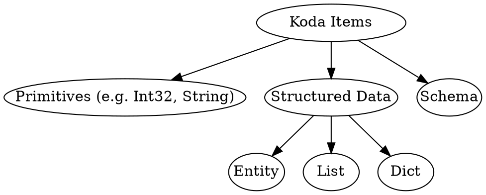
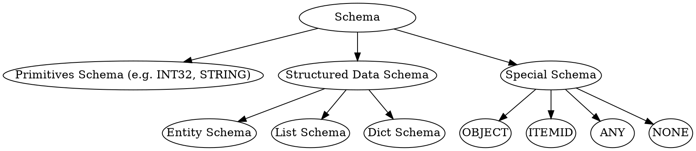

<!-- go/markdown -->

# Common Pitfalls and Gotchas

This guide goes through common pitfalls new users could encounter in Koda. It is
recommended to read through the guide after finishing reading
[Koda Fundamentals](fundamentals.md). It can be used as a tutorial to check your
understanding of Koda or as references to individual
issues.

* TOC
{:toc}

## Koda Item Categorization

On the high level, a Koda item can be a primitive, structured data or schema.
Entities/lists/dicts are Koda items that store structured data (i.e. a set of
attributes, ordered elements, a set of key/value pairs).



To create Koda items, we can use the following APIs:

Type       | APIs
---------- | -------------------------
Primitives | `kd.int32`, `kd.str`, ...
Entity     | `kd.new`
List       | `kd.list`
Dict       | `kd.dict`

## Objects

Objects are special Koda items which know their own schemas and can be any
primitives or special entities/lists/dicts storing their own schema as an
attribute (i.e. the internal `__schema__` attribute). Objects with different
types can be mixed in the same DataSlice and provide more flexibility.

```py
# It fails because of incompatible schemas
# kd.slice([1, kd.new(a=1), kd.list([1, 2]), kd.dict({1: 2})])

# It works as all items are objects and the resulting DataSlice has OBJECT schema
kd.slice([1, kd.obj(a=1), kd.obj([1, 2]), kd.obj({1: 2})])
```

To create objects, we can use `kd.obj(input)` API where `input` can be a Python
primitive, a Python list/dict, a Koda primitive, a entity/list/dict or variadic
keyword arguments of attributes. When `input` is a entity/list/dict, it embeds
the schema into the `__schema__` attribute.

```py
# Primitive objects
kd.obj(1)
kd.obj('2')
kd.obj(kd.float64(3.0))  # 3.0 is converted to FLOAT32 by default

# Entity objects
kd.obj(a=1, b=2)
kd.obj(kd.new(a=1, b=2))

# List objects
kd.obj([1, 2, 3])
kd.obj(kd.list([1, 2, 3]))

# Dict objects
kd.obj({1: 2})
kd.obj(kd.dict({1: 2}))
```

NOTE: schemas themselves cannot be objects.

```py
# They fail
# kd.obj(kd.INT32)
# kd.obj(kd.list_schema(kd.INT32))
```

## Non-objects vs Objects

The following table highlights the differences between objects and non-objects:

|                       | Non-objects             | Objects                  |
| --------------------- | ----------------------- | ------------------------ |
| Analogous to          | Protos or C++ structs   | Python objects (that     |
:                       : (whose type information : store type information   :
:                       : is stored externally)   : in the `__class__`       :
:                       :                         : attribute)               :
| Allow mixed type in a | No                      | Yes                      |
: DataSlice             :                         :                          :
| Where schema(s) are   | DataSlice level         | Level of Iindividual     |
: stored                :                         : items (as `__schema__`   :
:                       :                         : attribute or inferred    :
:                       :                         : from primitive data)     :
| Performance           | Faster because of       | Somewhat slower          |
:                       : homogeneous data        :                          :
| Flexibility           | Less flexible           | More flexible            |
| Suitable use cases    | Data with well-defined  | Mixed data with          |
:                       : schema,                 : different schemas, quick :
:                       : performance-critical    : experiments,             :
:                       : workflows               : non-performance-critical :
:                       :                         : workflows                :

## Koda Schema Categorization

Schemas can be further categorized as follows:



To create/use Koda schemas, we can use the following APIs:

Type              | APIs
----------------- | -------------------------------------------
Primitive Schemas | `kd.INT32`, `kd.STRING`, ...
Entity Schema     | `kd.named_schema` or `kd.schema.new_schema`
List Schema       | `kd.list_schema`
Dict Schema       | `kd.dict_schema`
OBJECT Schema     | `kd.OBJECT`
ITEMID Schema     | `kd.ITEMID`
ANY Schema        | `kd.ANY`
NONE Schema       | `kd.NONE`

## List/Dict/Named schemas are Uu Schemas

Uu schemas are structured data schemas (i.e. entity/list/dict schemas) whose
Itemids are UUIDs. Uu schemas are useful because we can put items with the same
schema into a DataSlice. Otherwise, we need to make them objects at the cost of
performance.

List and dict schemas are always uu schemas. Entity schemas created using
`kd.named_schema` or `kd.uu_schema` are Uu schemas while these created using
`kd.schema.new_schema` are not.

```py
ls1 = kd.list_schema(kd.INT32)
ls2 = kd.list_schema(kd.INT32)
assert ls1 == ls2
ls3 = kd.list_schema(kd.STRING)
assert ls1 != ls3

ds1 = kd.dict_schema(kd.STRING, kd.INT32)
ds2 = kd.dict_schema(kd.STRING, kd.INT32)
assert ds1 == ds2
ds3 = kd.dict_schema(kd.STRING, kd.FLOAT32)
assert ds1 != ds3

us1 = kd.uu_schema(a=kd.INT32)
us2 = kd.uu_schema(a=kd.INT32)
assert us1 == us2
us3 = kd.uu_schema(a=kd.INT64)
assert us1 != us3
```

The UUID of a named schema only depends on its schema name and not on its schema
attributes.

```py
ns1 = kd.named_schema('Schema', a=kd.INT32)
ns2 = kd.named_schema('Schema', a=kd.STRING)
assert ns1 == ns2
ns3 = kd.named_schema('DiffSchema', a=kd.INT32)
assert ns1 != ns3
```

NOTE: Creating multiple named schemas with the same name is dangerous as one can
override the other when underlying bags are merged.

```py
ns1 = kd.named_schema('Schema', a=kd.INT32)
ns2 = kd.named_schema('Schema', a=kd.STRING, b=kd.BOOL)
assert ns1 == ns2
ns2.updated(ns1.get_bag())  # Schema(a=INT32, b=BOOLEAN)
```

## Check if a DataSlice is a Primitive/Entity/List/Dict DataSlice

`kd.is_primitive(ds)`, `kd.is_entity(ds)`, `kd.is_list(ds)` and `kd.is_dict(ds)`
return `present` if `ds` can **behave** like a primitive/entity/list/dict. That
is, `ds` either has a corresponding primitive/entity/list/dict schema or its
schema is `OBJECT` schema and all its present items are
primitives/entities/lists/dicts.

```py
kd.is_primitive(kd.slice([1, 2]))  # present
kd.is_primitive(kd.slice([1, 2], kd.OBJECT))  # present
kd.is_primitive(kd.slice([1, 2, None, '3'], kd.OBJECT))  # present

kd.is_entity(kd.new(a=kd.slice([1, 2, 3])))  # present
kd.is_entity(kd.obj(a=kd.slice([1, 2, 3])))  # present
kd.is_entity(kd.slice([kd.obj(a=1), None, kd.obj(a=3)]))  # present

kd.is_list(kd.list([1, 2]))  # present
kd.is_list(kd.obj(kd.list([1, 2])))  # present

kd.is_dict(kd.dict({1: 2}))  # present
kd.is_dict(kd.obj(kd.dict({1: 2})))  # present
```

NOTE: `kd.is_primitive(ds)`, `kd.is_entity(ds)`, `kd.is_list(ds)` and
`kd.is_dict(ds)` always return `present` for an empty DataSlice with `OBJECT`
schema.

```py
empty_ds1 = kd.slice(None, kd.OBJECT)
empty_ds2 = kd.slice([], kd.OBJECT)
empty_ds3 = kd.slice([None, None], kd.OBJECT)

for ds in [empty_ds1, empty_ds2, empty_ds3]:
  assert kd.is_primitive(ds)
  assert kd.is_entity(ds)
  assert kd.is_list(ds)
  assert kd.is_dict(ds)
```

## Check Individual Items in a Mixed OBJECT DataSlice

`kd.has_primitive(ds)`, `kd.has_entity(ds)`, `kd.has_list(ds)` and
`kd.has_dict(ds)` return `present` for each item if the item is respectively a
primitive/entity/list/dict.

NOTE: They are pointwise operations while `kd.is_primitive(ds)`,
`kd.is_entity(ds)`, `kd.is_list(ds)` and `kd.is_dict(ds)` always return a MASK
DataItem.

```py
ds = kd.slice([1, '2', None, kd.obj(a=1), kd.obj([1, 2]), kd.obj({1: 2})])

kd.has_primitive(ds)  # [present, present, missing, missing, missing, missing]
kd.has_entity(ds)  # [missing, missing, missing, present, missing, missing]
kd.has_list(ds)  # [missing, missing, missing, missing, present, missing]
kd.has_dict(ds)  # [missing, missing, missing, missing, missing, present]
```

NOTE: `kd.is_xxx(ds)` is not always equivalent to `kd.all(kd.has_xxx(ds))`. For
an empty DataSlice with `OBJECT` schema, `kd.is_xxx(ds)` returns `present` but
`kd.all(kd.has_xxx(ds))` returns `missing`.

```py
ds = kd.slice([None, None], kd.OBJECT)

kd.is_entity(ds)  # present
kd.all(kd.has_entity(ds))  # missing
```

As object items can only be primitives, entities, lists and dicts, `kd.has(ds)`
is always the same as `kd.has_primitive(ds) | kd.has_entity(ds) |
kd.has_list(ds) | kd.has_dict(ds)`.

```py
ds = kd.slice([1, '2', None, kd.obj(), kd.obj(kd.list()), kd.obj(kd.dict())])

# Always returns present
kd.full_equal(kd.has(ds), kd.has_primitive(ds) | kd.has_entity(ds) | kd.has_list(ds) | kd.has_dict(ds))
```

## Pointwise Equality Only Compares ItemIds for Entities/Lists/Dicts

The pointwise equality operator `x == y` only compares **ItemIds** for
structured data (i.e. entities/lists/dicts) and ignores their contents and
underlying bags.

```py
e1 = kd.new(x=1)
e2 = e1.with_attrs(x=2)
assert e1 == e2
assert e1.no_bag() == e2

list_id = kd.allocation.new_listid()
l1 = kd.list([1, 2], itemid=list_id)
l2 = kd.list([3, 4], itemid=list_id)
assert l1 == l2
assert l1.no_bag() == l2

d1 = kd.dict({1: 2})
d2 = d1.with_dict_update(3, 4)
assert d1 == d2
assert d1.no_bag() == d2
```

NOTE: `x == y` and `x != y` require `x` and `y` to have compatible schemas. If
they have incompatible schemas, the comparisons will raise an exception. That
will happen irrespective of the equality or inequality of the ItemIds of `x` and
`y`.

```py
list_id = kd.allocation.new_listid()
l1 = kd.list([1, 2], itemid=list_id)
l2 = kd.list(['3', '4'], itemid=list_id)
# Fails because LIST[INT32] is not compatible with LIST[STRING]
# l1 == l2

# Fails because LIST[INT32] is not compatible with OBJECT
# l1 == kd.obj(l1)

# Both have OBJECT schemas
assert kd.obj(l1) == kd.obj(l2)
```

## Pointwise Equality vs DataSlice Equality

`x == y` is a pointwise equality operation and checks equality of individual
items. In contrast to that, `kd.full_equal(x, y)` checks if `x` and `y` have the
same **sparsity** and all present items are equal.

NOTE: `kd.full_equal(x, y)` is neither equivalent to `kd.all(x == y)` nor
equivalent to `~kd.all(x != y)`.

```py
x = kd.slice([1, None, 3])
y = kd.slice([1, None, 3])

x == y  # [present, missing, present]
kd.all(x == y)  # missing
kd.full_equal(x, y)  # present

x = kd.slice([1, None, 3])
y = kd.slice([1, 2, 3])

x != y  # [missing, missing, missing]
~kd.all(x != y)  # present
kd.full_equal(x, y)  # missing
```
