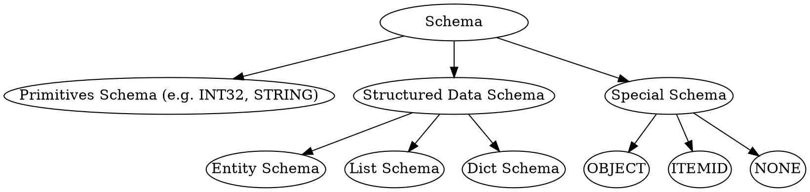

<!-- go/markdown -->

# Common Pitfalls and Gotchas

This guide goes through common pitfalls new users could encounter in Koda. It is
recommended to read through the guide after finishing reading
[Koda Fundamentals](fundamentals.md). It can be used as a tutorial to check your
understanding of Koda or as references to individual
issues.

* TOC
{:toc}

## Koda Item Categorization

On the high level, a Koda item can be a primitive, structured data or schema.
Entities/lists/dicts are Koda items that store structured data (i.e. a set of
attributes, ordered elements, a set of key/value pairs).


To create Koda items, we can use the following APIs:

Type       | APIs
---------- | -------------------------
Primitives | `kd.int32`, `kd.str`, ...
Entity     | `kd.new`
List       | `kd.list`
Dict       | `kd.dict`

## Objects

Objects are special Koda items which know their own schemas and can be any
primitives or special entities/lists/dicts storing their own schema as an
attribute (i.e. the internal `__schema__` attribute). Objects with different
types can be mixed in the same DataSlice and provide more flexibility.

```py {.pycon-doctest}
>>> from koladata import kd
>>> # It fails because of incompatible schemas
>>> # kd.slice([1, kd.new(a=1), kd.list([1, 2]), kd.dict({1: 2})])

>>> # It works as all items are objects and the resulting DataSlice has OBJECT schema
>>> kd.slice([1, kd.obj(a=1), kd.obj([1, 2]), kd.obj({1: 2})])
DataSlice([1, Obj(a=1), List[1, 2], Dict{1=2}], schema: OBJECT,...)
```

To create objects, we can use `kd.obj(input)` API where `input` can be a Python
primitive, a Python list/dict, a Koda primitive, a entity/list/dict or variadic
keyword arguments of attributes. When `input` is a entity/list/dict, it embeds
the schema into the `__schema__` attribute.

```py {.pycon-doctest}
>>> # Primitive objects
>>> kd.obj(1)
DataItem(1, schema: OBJECT,...)
>>> kd.obj('2')
DataItem('2', schema: OBJECT,...)
>>> kd.obj(kd.float64(3.0))  # 3.0 is converted to FLOAT32 by default
DataItem(float64{3.0}, schema: OBJECT,...)

>>> # Entity objects
>>> kd.obj(a=1, b=2)
DataItem(Obj(a=1, b=2), schema: OBJECT,...)
>>> kd.obj(kd.new(a=1, b=2))
DataItem(Obj(a=1, b=2), schema: OBJECT,...)

>>> # List objects
>>> kd.obj([1, 2, 3])
DataItem(List[1, 2, 3], schema: OBJECT,...)
>>> kd.obj(kd.list([1, 2, 3]))
DataItem(List[1, 2, 3], schema: OBJECT,...)

>>> # Dict objects
>>> kd.obj({1: 2})
DataItem(Dict{1=2}, schema: OBJECT,...)
>>> kd.obj(kd.dict({1: 2}))
DataItem(Dict{1=2}, schema: OBJECT,...)
```

NOTE: schemas themselves cannot be objects.

```py {.pycon-doctest}
>>> # They fail
>>> # kd.obj(kd.INT32)
>>> # kd.obj(kd.list_schema(kd.INT32))
```

## Non-objects vs Objects

The following table highlights the differences between objects and non-objects:

|                       | Non-objects             | Objects                  |
| --------------------- | ----------------------- | ------------------------ |
| Analogous to          | Protos or C++ structs   | Python objects (that     |
:                       : (whose type information : store type information   :
:                       : is stored externally)   : in the `__class__`       :
:                       :                         : attribute)               :
| Allow mixed type in a | No                      | Yes                      |
: DataSlice             :                         :                          :
| Where schema(s) are   | DataSlice level         | Level of Individual      |
: stored                :                         : items (as `__schema__`   :
:                       :                         : attribute or inferred    :
:                       :                         : from primitive data)     :
| Performance           | Faster because of       | Somewhat slower          |
:                       : homogeneous data        :                          :
| Flexibility           | Less flexible           | More flexible            |
| Suitable use cases    | Data with well-defined  | Mixed data with          |
:                       : schema,                 : different schemas, quick :
:                       : performance-critical    : experiments,             :
:                       : workflows               : non-performance-critical :
:                       :                         : workflows                :

## Koda List vs DataSlice vs DataSlice of Lists

On the high level, here is a quick summary:

-   **Koda list**: represents a single, ordered sequence of items (similar to a
    Python list). It is similar to a Python list or a repeated proto field.
-   **Koda DataSlice**: represents a multi-dimensional array (potentially
    jagged) of Koda items. It's the fundamental data structure for vectorized
    operations. It is similar to a Panda DataFrame.
-   **DataSlice of lists**: a specific type of DataSlice where each item is a
    Koda list. It is an unique concept in Koda and used for vectorized
    operations on lists items.

Dimensions (or structures) in a Python list are represented by nested list
structures. In Koda, dimensions can be captured by nested Koda lists, DataSlice
jagged shape or a combination of them.

### Creating a Koda List or a DataSlice from a Python List

To create a Koda list from a Python list, we use `kd.list(py_list)`. To create a
DataSlice, we use `kd.slice(py_list)`.

Note: All Koda items including lists are accessed via DataSlice interface. A
Koda list is also a DataItem containing a single list.

Let's look at a simple example where `py_list` is a one-dimensional Python list.

```py {.pycon-doctest}
>>> l1 = kd.list([1, 2, 3])  # DataItem(List[1, 2, 3])
>>> assert kd.is_slice(l1)
>>> assert kd.is_item(l1)
>>> l1.get_ndim()
DataItem(0, schema: INT64)
>>> l1.get_schema()
DataItem(LIST[INT32], schema: SCHEMA,...)

>>> ds1 = kd.slice([1, 2, 3])  # DataSlice([1, 2, 3])
>>> assert kd.is_slice(ds1)
>>> assert not kd.is_item(ds1)
>>> ds1.get_ndim()
DataItem(1, schema: INT64)
>>> ds1.get_schema()
DataItem(INT32, schema: SCHEMA)
```

When `py_list` is a nested Python list, `kd.list(py_list)` creates Koda lists
for corresponding Python lists recursively and the final result is a DataItem
containing a Koda list. On the other hand, `kd.slice(py_list)` converts the
nested Python list structure into a jagged shape for the resulting DataSlice.

```py {.pycon-doctest}
>>> l2 = kd.list([[1, 2], [3, 4, 5]])  # DataItem(List[List[1, 2], List[3, 4, 5]])
>>> l2.get_ndim()
DataItem(0, schema: INT64)
>>> l2.get_schema()
DataItem(LIST[LIST[INT32]], schema: SCHEMA,...)

>>> ds2 = kd.slice([[1, 2], [3, 4, 5]])  # DataSlice([[1, 2], [3, 4, 5]])
>>> ds2.get_ndim()
DataItem(2, schema: INT64)
>>> ds2.get_schema()
DataItem(INT32, schema: SCHEMA)
```

TIP: To check what type of items a DataSlice contains, we can get its schema
using `kd.get_schema()`. The schema is also part of the DataSlice `repr`. In the
examples above, we can easily tell if items are lists or integers.

TIP: In the DataSlice `repr`, the jagged shape of a DataSlice is represented by
nested square brackets (i.e. `[]`). By counting the number of adjacent opening
brackets (i.e. `[`), we can easily know the `ndim` of a DataSlice. By looking at
the part right after the opening brackets, we can see the first item of the
DataSlice. For example, `DataSlice([[1, 2], [3, 4, 5]])` has two dimensions
because we see`[[` before the first item, which is `1`.

TIP: In the DataSlice `repr`, a list item is shown as `List[e1, e2, ...]`.
Similar to a Python list, elements of a list item can be lists as well. For
example, `List[List[1, 2], List[3, 4, 5]]`.

What if `py_list` is a Python list containing Koda lists rather than primitives?
Koda lists are treated as individual items similar to primitive items and only
the Python list dimensions are converted to Koda lists or DataSlice jagged
shape.

```py {.pycon-doctest}
>>> l3 = kd.list([kd.list([1, 2]), kd.list([3, 4, 5])])  # DataItem(List[List[1, 2], List[3, 4, 5]])
>>> l3.get_ndim()
DataItem(0, schema: INT64)
>>> l3.get_size()
DataItem(1, schema: INT64)
>>> l3.get_schema()
DataItem(LIST[LIST[INT32]], schema: SCHEMA,...)

>>> ds3 = kd.slice([kd.list([1, 2]), kd.list([3, 4, 5])])  # DataSlice([List[1, 2], List[3, 4, 5]])
>>> ds3.get_ndim()
DataItem(1, schema: INT64)
>>> ds3.get_size()
DataItem(2, schema: INT64)
>>> # Note items of `ds3` are 2 Koda lists of INT32s.
>>> ds3.get_schema()
DataItem(LIST[INT32], schema: SCHEMA,...)
```

Now we can summarize how `kd.list` and `kd.slice` work.

-   `kd.list(py_list)` converts the Python list structure to corresponding Koda
    list structure and the result is a list DataItem.
-   `kd.slice(py_list)` converts the Python list structure to the jagged shape
    of the result DataSlice.

What if we want to control what gets converted to Koda lists and what gets
converted to a jagged shape? `kd.from_py(py_list, from_dim=, schema=None)`
allows us to do that. The first `from_dim` dimensions of `py_list` get converted
to DataSlice jagged shape while remaining dimensions get converted to Koda
lists. We also need to pass `schema=None` to enable automatic schema detection.

```py {.pycon-doctest}
>>> py_list = [[[1, 2], [3, 4, 5]], [[7], [], [8, 9]]]

>>> ds1 = kd.from_py(py_list, from_dim=0, schema=None)
>>> # -> DataItem(List[List[List[1, 2], List[3, 4, 5]], List[List[7], List[], List[8, 9]]])
>>> # same as kd.list(py_list)
>>> ds1.get_ndim()
DataItem(0, schema: INT64)
>>> ds1.get_size()
DataItem(1, schema: INT64)
>>> ds1.get_schema()
DataItem(LIST[LIST[LIST[INT32]]], schema: SCHEMA,...)

>>> ds2 = kd.from_py(py_list, from_dim=1, schema=None)
>>> # -> DataSlice([List[List[1, 2], List[3, 4, 5]], List[List[7], List[], List[8, 9]]])
>>> ds2.get_ndim()
DataItem(1, schema: INT64)
>>> ds2.get_size()
DataItem(2, schema: INT64)
>>> ds2.get_schema()
DataItem(LIST[LIST[INT32]], schema: SCHEMA,...)

>>> ds3 = kd.from_py(py_list, from_dim=2, schema=None)
>>> # -> DataSlice([[List[1, 2], List[3, 4, 5]], [List[7], List[], List[8, 9]]])
>>> ds3.get_ndim()
DataItem(2, schema: INT64)
>>> ds3.get_size()
DataItem(5, schema: INT64)
>>> ds3.get_schema()
DataItem(LIST[INT32], schema: SCHEMA,...)

>>> ds4 = kd.from_py(py_list, from_dim=3, schema=None)
>>> # -> DataSlice([[[1, 2], [3, 4, 5]], [[7], [], [8, 9]]])
>>> # same as kd.slice(py_list)
>>> ds4.get_ndim()
DataItem(3, schema: INT64)
>>> ds4.get_size()
DataItem(8, schema: INT64)
>>> ds4.get_schema()
DataItem(INT32, schema: SCHEMA)
```

<section class='zippy'>

Optional: Why does Koda have two ways to represent list-like data?

The two core Koda features are the ability of expressing complex data
relationship and vectorized operations on both primitives and data with complex
structures.

In order to support expressing complex data relationship, Koda has a native list
type along with dict and entity. A Koda list is similar to a Python list or a
repeated proto field. It is used to express the logic like "a query entity has a
list of doc entities".

Koda DataSlice is used to support vectorization for both primitives and data
with complex structures including lists. In order to support hierarchical
structure (i.e. jagged shape) of vectorized items, Koda DataSlices need to have
a jagged shape.

It is worth noting that Python does not support vectorization natively. In order
to perform operations on a nested Python list, we use nested for-loops. At each
iteration of the nested loop, it is clear whether the current object is a list
in the intermedia dimensions or a value in the last dimension.

```py {.pycon-doctest}
>>> py_list = [[[1, 2], [3, 4, 5]], [[7], [], [8, 9]]]
>>> # Top level: pylist
>>> # Lists in the first dimension: pylist[0], pylist[1]
>>> # Lists in the second dimension: pylist[0][0], pylist[0][1], pylist[1][0], pylist[1][1], pylist[1][2]
>>> # Integer values in the third dimension: 1, 2, 3, 4, 5, 7, 8, 9

>>> for l1 in py_list:
...   for l2 in l1:
...     for v in l2:
...       # We can access l1, l2, v here
...       pass

>>> # DataSlice of integers
>>> int_ds = kd.slice(py_list)

>>> # DataSlice of l2 lists
>>> l2_ds = kd.slice([[kd.list([1, 2]), kd.list([3, 4, 5])],
...                   [kd.list([7]), kd.list([], item_schema=kd.INT32), kd.list([8, 9])]])

>>> # DataSlice of l1 lists
>>> l1_ds = kd.slice([kd.list([[1, 2], [3, 4, 5]]),
...                   kd.list([[7], [], [8, 9]])])

>>> # DataItem of the top level list
>>> top_l_ds = kd.list([[[1, 2], [3, 4, 5]], [[7], [], [8, 9]]])

>>> # Find the max value across the last dimension
>>> kd.agg_max(int_ds)
DataSlice([[2, 5], [7, None, 9]], schema: INT32,...)
>>> # Find the max value across all dimensions
>>> kd.max(int_ds)
DataItem(9, schema: INT32)

>>> # Find list sizes
>>> kd.list_size(l2_ds)
DataSlice([[2, 3], [1, 0, 2]], schema: INT64,...)
>>> kd.list_size(l1_ds)
DataSlice([2, 3], schema: INT64,...)
>>> kd.list_size(top_l_ds)
DataItem(2, schema: INT64)

>>> # Below is a more complex example of creating pairs by expanding l2_ds
>>> # to int_ds then explode lists to create cross-product
>>> # Create pairs across the last dimension
>>> kd.obj(a=l2_ds.expand_to(int_ds)[:], b=int_ds).flatten(-2)
DataSlice([
  [
    [Obj(a=1, b=1), Obj(a=2, b=1), Obj(a=1, b=2), Obj(a=2, b=2)],
    [
      Obj(a=3, b=3), Obj(a=4, b=3), Obj(a=5, b=3), Obj(a=3, b=4), Obj(a=4, b=4),
      Obj(a=5, b=4), Obj(a=3, b=5), Obj(a=4, b=5), Obj(a=5, b=5),
    ],
  ],
  [[Obj(a=7, b=7)],
    [],
    [Obj(a=8, b=8), Obj(a=9, b=8), Obj(a=8, b=9), Obj(a=9, b=9)]],
], schema: OBJECT, present: 18/18,...)

>>> # If it is too hard to understand, you can run the following
>>> # code line by line in Colab and check the results
>>> expanded_l2_ds = l2_ds.expand_to(int_ds)
>>> a = expanded_l2_ds[:]
>>> b = int_ds.expand_to(a)
>>> pairs = kd.obj(a=a, b=b)
>>> pairs = pairs.flatten(-2)  # remove the last extra dimension
```

</section>

### Converting a Non-homogeneous Python List to Koda

`py_list` passed to `kd.slice` or `kd.list` must be homogeneous. A Python nested
list is considered homogeneous if it adheres to the following structure:

-   Leaf Level Consistency: All elements at the deepest level (the "leaves")
    must be non-list data types (e.g. primitives or Koda DataItems).
-   Non-Leaf Level Consistency: All elements at any level above the leaf level
    must be lists.

Here are some examples:

-   `[1, [2, 3]]` is not Homogeneous, because 1 is a primitive at a level that
    should contain lists, or `[2, 3]` is a list at a level should contain
    primitives
-   `[[1, 2], [[3], [4]]]` is not Homogeneous, because `1`, and `2` are
    primitives leaves, but at the same level we also find the lists `[3]` and
    `[4]`.
-   `[1, 2, 3]` is homogeneous, because all elements at the (only) leaf level
    are integer primitives.
-   `[[1], [2, 3]]` is homogeneous, because all leaf elements (`1`, `2`, `3`)
    are integer primitives and all elements at other levels are lists.
-   `[[[1], [2]], [[3], [4]]]` is homogeneous, because All leaf elements (`1`,
    `2`, `3`, `4`) are integer primitives and all elements at other levels are
    lists.

```py {.pycon-doctest}
>>> # The following all fail
>>> # kd.list([1, [2, 3]])
>>> # kd.slice([1, [2, 3]])
>>> # kd.list([[1, 2], [[3], [4]]])
>>> # kd.slice([[1, 2], [[3], [4]]])
```

However, it is possible to represent such non-homogeneous structures in Koda
because primitives and Koda lists can be Koda objects. To use `kd.slice` or
`kd.list`, we need to wrap Python lists at the leaf level into Koda list objects
using `kd.obj(py_list)` so that all elements at the leaf level are only contains
primitives or Koda list objects.

```py {.pycon-doctest}
>>> kd.list([1, kd.obj([2, 3])])
DataItem(List[1, List[2, 3]], schema: LIST[OBJECT],...)
>>> kd.from_py([1, [2, 3]])  # Note that without schema=None, the default is OBJECT.
DataItem(List[1, List[2, 3]], schema: OBJECT,...)

>>> kd.slice([1, kd.obj([2, 3])])
DataSlice([1, List[2, 3]], schema: OBJECT,...)
>>> kd.from_py([1, [2, 3]], from_dim=1)  # same as above
DataSlice([1, List[2, 3]], schema: OBJECT,...)
```

### Koda List Slicing vs DataSlice Sub-slicing vs DataSlice Python-like Slicing

To slice Koda lists, we use `[]` similar to Python lists. However, it differs
from Python list slicing in two ways. First, it is a vectorized operation
applying to each list item of a DataSlice. Second, the resulting DataSlice has
one more dimension. That is why we call `list_ds[:]` list explosion to emphasize
the creation of an extra dimension.

```py {.pycon-doctest}
>>> # A DataSlice of two lists: List[1, 2], List[3, 4, 5]
>>> l = kd.slice([kd.list([1, 2]), kd.list([3, 4, 5])])
>>> l.get_ndim()
DataItem(1, schema: INT64)
>>> l.get_size()
DataItem(2, schema: INT64)

>>> # Get all items for each list
>>> ds1 = l[:]
>>> ds1
DataSlice([[1, 2], [3, 4, 5]], schema: INT32,...)
>>> ds1.get_ndim()
DataItem(2, schema: INT64)
>>> ds1.get_size()
DataItem(5, schema: INT64)

>>> # Get all items from the second to the end for each list
>>> ds2 = l[1:]
>>> ds2
DataSlice([[2], [4, 5]], schema: INT32,...)
>>> ds2.get_ndim()
DataItem(2, schema: INT64)
>>> ds2.get_size()
DataItem(3, schema: INT64)
```

List explosion adds an extra dimension because it selects multiple elements per
list. List indexing (i.e. `list_ds[idx]`) returns a DataSlice of the same shape
because it selects one element per list.

```py {.pycon-doctest}
>>> l[0]
DataSlice([1, 3], schema: INT32,...)
>>> l[2]
DataSlice([None, 5], schema: INT32,...)
```

DataSlice sub-slicing (i.e. `ds.S[*args]`) selects items in the DataSlice and
supports slicing multiple dimensions at the same time.

```py {.pycon-doctest}
>>> ds = kd.slice([[1, 2], [3, 4, 5]])

>>> # Only subslice the last dimension
>>> ds.S[1]
DataSlice([2, 4], schema: INT32,...)
>>> # Get the first item in the first dimension and get all items in the second dimension
>>> ds.S[1, :]
DataSlice([3, 4, 5], schema: INT32,...)
>>> # Select everything, no-op
>>> ds.S[:, :]
DataSlice([[1, 2], [3, 4, 5]], schema: INT32,...)
>>> ds.S[:]  # same as above, select everything
DataSlice([[1, 2], [3, 4, 5]], schema: INT32,...)

>>> # Fails because ds does not have lists
>>> # ds[:]
>>> # ds[1]
```

IMPORTANT: List slicing selects elements within lists of a DataSlice whereas
DataSlice sub-slicing selects items in the DataSlice.

```py {.pycon-doctest}
>>> # A DataSlice of two list items
>>> l = kd.slice([kd.list([1, 2]), kd.list([3, 4, 5])])

>>> # Select the first element of each list
>>> l[0]
DataSlice([1, 3], schema: INT32,...)
>>> # Select the first list item in the DataSlice
>>> l.S[0]
DataItem(List[1, 2], schema: LIST[INT32],...)
>>> # Select the first list item then select the second list element
>>> l.S[0][1]
DataItem(2, schema: INT32,...)
```

To make it possible for a DataSlice to be sliced like a nested Python list (i.e.
`py_list[idx1][idx2]`), Koda support `ds.L` syntax to slice the outermost
DataSlice dimension. That is, `ds.L[idx1].L[idx2]` is equivalent to `ds.S[idx1,
idx2]` assuming `ds` has two dimensions. It is also possible to use `ds.L` in a
Python for-loop to iterate over items in the first dimension.

```py {.pycon-doctest}
>>> ds = kd.slice([[1, 2], [3, 4, 5]])

>>> ds.L[0]
DataSlice([1, 2], schema: INT32,...)
>>> # Note ds.L[:] is no-op
>>> ds.L[:].L[0]
DataSlice([1, 2], schema: INT32,...)

>>> # Note that l is a 1D DataSlice and i is INT32 DataItem
>>> for l in ds.L:
...   print(repr(l))
...   for i in l.L:
...     print(repr(i))
DataSlice([1, 2], schema: INT32,...)
DataItem(1, schema: INT32)
DataItem(2, schema: INT32)
DataSlice([3, 4, 5], schema: INT32,...)
DataItem(3, schema: INT32)
DataItem(4, schema: INT32)
DataItem(5, schema: INT32)

>>> # This is similar to Python

>>> py_list = [[1, 2], [3, 4, 5]]
>>> py_list[0]
[1, 2]
>>> py_list[:][0]
[1, 2]

>>> for l in py_list:
...   print(repr(l))
...   for i in l:
...     print(repr(i))
[1, 2]
1
2
[3, 4, 5]
3
4
5
```

### List Explosion and Implosion

List explosion is an operation of getting list items from list(s) in a
DataSlice. It adds an additional dimension to the resulting DataSlice. List
implosion is the opposite operation of folding items of a DataSlice to list(s)
over the last dimension. Since it collapses the last dimension, the resulting
DataSlice has one fewer dimension.

It is possible to perform list explosion or implosion multiple time in a single
operation by setting `ndim=` argument in `ds.explode(ndim=)` or
`ds.implode(ndim=)`. When setting `ndim` to a positive number, it
explodes/implodes `ndim` times. When setting `ndim=-1` for
`ds.explode(ndim=-1)`, it explodes the nested lists until the resulting
DataSlice is not a list DataSlice anymore. When setting `ndim=-1` for
`ds.implode(ndim=-1)`, it implodes all the dimensions of `ds` into a single list
DataItem.

```py {.pycon-doctest}
>>> l = kd.list([[[1, 2], [3, 4, 5]], [[7], [], [8, 9]]])

>>> l.explode(ndim=1)
DataSlice([List[List[1, 2], List[3, 4, 5]], List[List[7], List[], List[8, 9]]], schema: LIST[LIST[INT32]],...)
>>> l.explode()  # the same as above
DataSlice([List[List[1, 2], List[3, 4, 5]], List[List[7], List[], List[8, 9]]], schema: LIST[LIST[INT32]],...)
>>> l[:]  # the same as above
DataSlice([List[List[1, 2], List[3, 4, 5]], List[List[7], List[], List[8, 9]]], schema: LIST[LIST[INT32]],...)

>>> l.explode(ndim=2)
DataSlice([[List[1, 2], List[3, 4, 5]], [List[7], List[], List[8, 9]]], schema: LIST[INT32],...)
>>> l[:][:]  # the same as above
DataSlice([[List[1, 2], List[3, 4, 5]], [List[7], List[], List[8, 9]]], schema: LIST[INT32],...)

>>> l.explode(ndim=3)
DataSlice([[[1, 2], [3, 4, 5]], [[7], [], [8, 9]]], schema: INT32,...)
>>> l.explode(ndim=-1)  # the same as above
DataSlice([[[1, 2], [3, 4, 5]], [[7], [], [8, 9]]], schema: INT32,...)
>>> l[:][:][:]  # the same as above
DataSlice([[[1, 2], [3, 4, 5]], [[7], [], [8, 9]]], schema: INT32,...)

>>> ds = kd.slice([[[1, 2], [3, 4, 5]], [[7], [], [8, 9]]])

>>> ds.implode(ndim=1)
DataSlice([[List[1, 2], List[3, 4, 5]], [List[7], List[], List[8, 9]]], schema: LIST[INT32],...)
>>> ds.implode()  # the same as above
DataSlice([[List[1, 2], List[3, 4, 5]], [List[7], List[], List[8, 9]]], schema: LIST[INT32],...)

>>> ds.implode(ndim=2)
DataSlice([List[List[1, 2], List[3, 4, 5]], List[List[7], List[], List[8, 9]]], schema: LIST[LIST[INT32]],...)

>>> ds.implode(ndim=3)
DataItem(List[List[List[1, 2], List[3, 4, 5]], List[List[7], List[], List[8, 9]]], schema: LIST[LIST[LIST[INT32]]],...)
>>> ds.implode(ndim=-1)  # the same as above
DataItem(List[List[List[1, 2], List[3, 4, 5]], List[List[7], List[], List[8, 9]]], schema: LIST[LIST[LIST[INT32]]],...)
```

## Koda Schema Categorization

Schemas can be further categorized as follows:



To create/use Koda schemas, we can use the following APIs:

Type              | APIs
----------------- | -------------------------------------------
Primitive Schemas | `kd.INT32`, `kd.STRING`, ...
Entity Schema     | `kd.named_schema` or `kd.schema.new_schema`
List Schema       | `kd.list_schema`
Dict Schema       | `kd.dict_schema`
OBJECT Schema     | `kd.OBJECT`
ITEMID Schema     | `kd.ITEMID`
NONE Schema       | `kd.NONE`

## List/Dict/Named schemas are Uu Schemas

Uu schemas are structured data schemas (i.e. entity/list/dict schemas) whose
Itemids are UUIDs. Uu schemas are useful because we can put items with the same
schema into a DataSlice. Otherwise, we need to make them objects at the cost of
performance.

List and dict schemas are always uu schemas. Entity schemas created using
`kd.named_schema` or `kd.uu_schema` are Uu schemas while these created using
`kd.schema.new_schema` are not.

```py {.pycon-doctest}
>>> ls1 = kd.list_schema(kd.INT32)
>>> ls2 = kd.list_schema(kd.INT32)
>>> assert ls1 == ls2
>>> ls3 = kd.list_schema(kd.STRING)
>>> assert ls1 != ls3

>>> ds1 = kd.dict_schema(kd.STRING, kd.INT32)
>>> ds2 = kd.dict_schema(kd.STRING, kd.INT32)
>>> assert ds1 == ds2
>>> ds3 = kd.dict_schema(kd.STRING, kd.FLOAT32)
>>> assert ds1 != ds3

>>> us1 = kd.uu_schema(a=kd.INT32)
>>> us2 = kd.uu_schema(a=kd.INT32)
>>> assert us1 == us2
>>> us3 = kd.uu_schema(a=kd.INT64)
>>> assert us1 != us3
```

The UUID of a named schema only depends on its schema name and not on its schema
attributes.

```py {.pycon-doctest}
>>> ns1 = kd.named_schema('Schema', a=kd.INT32)
>>> ns2 = kd.named_schema('Schema', a=kd.STRING)
>>> assert ns1 == ns2
>>> ns3 = kd.named_schema('DiffSchema', a=kd.INT32)
>>> assert ns1 != ns3
```

NOTE: Creating multiple named schemas with the same name is dangerous as one can
override the other when underlying bags are merged.

```py {.pycon-doctest}
>>> ns1 = kd.named_schema('Schema', a=kd.INT32)
>>> ns2 = kd.named_schema('Schema', a=kd.STRING, b=kd.BOOLEAN)
>>> assert ns1 == ns2
>>> ns2.updated(ns1.get_bag())
DataItem(Schema(a=INT32, b=BOOLEAN), schema: SCHEMA,...)
```

## Vectorized Creation of Entities

To create entities in a vectorized way, we use `kd.new(**kwargs_in_ds)`.
`**kwargs_in_ds` are first aligned to have the same shape.

```py {.pycon-doctest}
>>> # Note 'x' is first wrapped into kd.str('x') then broadcasted to kd.str(['x', 'x', 'x'])
>>> kd.new(a=kd.slice([1, 2, 3]), b='x', c=kd.new(d=kd.slice([4, 5, 6])))
DataSlice([
  Entity(a=1, b='x', c=Entity(d=4)),
  Entity(a=2, b='x', c=Entity(d=5)),
  Entity(a=3, b='x', c=Entity(d=6)),
], schema: ENTITY(a=INT32, b=STRING, c=ENTITY(d=INT32)),...)
```

Creating entity objects is similar. We use `kd.obj(**kwargs_in_ds)`.

```py {.pycon-doctest}
>>> kd.obj(a=kd.slice([1, 2, 3]), b='x', c=kd.obj(d=kd.slice([4, 5, 6])))
DataSlice([Obj(a=1, b='x', c=Obj(d=4)), Obj(a=2, b='x', c=Obj(d=5)), Obj(a=3, b='x', c=Obj(d=6))], schema: OBJECT,...)
```

## `kd.obj(**kwargs_in_ds)` and `kd.obj(kd.new(**kwargs_in_ds))` Are Different {#kd_obj_vs_kd_obj_kd_new}

`kd.obj(**kwargs_in_ds)` is not equivalent to `kd.obj(kd.new(**kwargs_in_ds))`.
`kd.new(**kwargs_in_ds)` creates entities with the same schema and
`kd.obj(entities)` then embeds the schema into each entity.
`kd.obj(**kwargs_in_ds)` creates objects with different schemas.

```py {.pycon-doctest}
>>> kwargs_in_ds = dict(a=kd.slice([1, 2, 3]), b='x')
>>> entities = kd.new(**kwargs_in_ds)
>>> objs_1 = kd.obj(entities)
>>> objs_1.get_obj_schema() == entities.get_schema()
DataSlice([present, present, present], schema: MASK,...)
>>> # Schemas are the same: [Schema:$7IzNK3toe5Fiq3uZOg396n, Schema:$7IzNK3toe5Fiq3uZOg396n, Schema:$7IzNK3toe5Fiq3uZOg396n]
>>> objs_1.get_obj_schema().get_itemid()
DataSlice(..., schema: ITEMID,...)
>>> # Modification of the schema of one item affects the other items
>>> upd = kd.attrs(objs_1.S[1], c=4.0)
>>> objs_1.updated(upd)
DataSlice([Obj(a=1, b='x', c=None), Obj(a=2, b='x', c=4.0), Obj(a=3, b='x', c=None)], schema: OBJECT,...)
>>> objs_2 = kd.obj(**kwargs_in_ds)
>>> # Schemas are different: [Schema:#6wYkMBuiRTtW7jaIQfyPEy, Schema:#6wYkMBuiRTtW7jaIQfyPEz, Schema:#6wYkMBuiRTtW7jaIQfyPF0]
>>> objs_2.get_obj_schema().get_itemid()
DataSlice(..., schema: ITEMID,...)
>>> # Modification of the schema for one item does not affect the other items
>>> upd = kd.attrs(objs_2.S[1], c=4.0)
>>> objs_2.updated(upd)
DataSlice([Obj(a=1, b='x'), Obj(a=2, b='x', c=4.0), Obj(a=3, b='x')], schema: OBJECT,...)
```

## Vectorized Creation of Lists Using `kd.implode`

To create lists in a vectorized way, we use `kd.implode(ds)` rather than
`kd.list(ds)` because it is unclear how many dimensions of `ds` should be
imploded into lists when using `kd.list(ds)` and `ds.get_ndim() > 1`.

```py {.pycon-doctest}
>>> # DataSlice with three dimensions
>>> ds = kd.slice([[[1, 2], [3]], [[4], [5, 6]], [[7], [None]], [[], [8]]])

>>> # Implode the last dimension
>>> kd.implode(ds)
DataSlice([[List[1, 2], List[3]], [List[4], List[5, 6]], [List[7], List[None]], [List[], List[8]]], schema: LIST[INT32],...)
>>> kd.implode(ds, ndim=1)  # Same as above
DataSlice([[List[1, 2], List[3]], [List[4], List[5, 6]], [List[7], List[None]], [List[], List[8]]], schema: LIST[INT32],...)

>>> # Implode the last two dimensions
>>> kd.implode(ds, ndim=2)
DataSlice([
  List[List[1, 2], List[3]],
  List[List[4], List[5, 6]],
  List[List[7], List[None]],
  List[List[], List[8]],
], schema: LIST[LIST[INT32]],...)

>>> # Implode the last three dimensions
>>> kd.implode(ds, ndim=3)
DataItem(List[
  List[List[1, 2], List[3]],
  List[List[4], List[5, 6]],
  List[List[7], List[None]],
  List[List[], List[8]],
], schema: LIST[LIST[LIST[INT32]]],...)
>>> kd.implode(ds, ndim=-1)  # Same as above, implode repeatedly until the result is a DataItem
DataItem(List[
  List[List[1, 2], List[3]],
  List[List[4], List[5, 6]],
  List[List[7], List[None]],
  List[List[], List[8]],
], schema: LIST[LIST[LIST[INT32]]],...)
```

NOTE: `kd.list(py_list)` is equivalent to `kd.implode(kd.slice(py_list),
ndim=-1)`. That is, `kd.list(py_list)` always implodes all dimensions into lists
if `py_list` is a nested Python list.

TIP: `ds.implode(ndim)` is a shortcut for `kd.implode(ds, ndim)`.

## Vectorized Creation of Dicts Using `kd.dict`

To create dicts in a vectorized way, we use `kd.dict(key_ds, value_ds)`.

```py {.pycon-doctest}
>>> kd.dict(kd.item(1), kd.item(2))
DataItem(Dict{1=2}, schema: DICT{INT32, INT32},...)
>>> kd.dict(kd.slice([1]), kd.slice([2]))
DataItem(Dict{1=2}, schema: DICT{INT32, INT32},...)
>>> kd.dict(kd.slice([1, 2]), kd.slice([3, 4]))
DataItem(Dict{...}, schema: DICT{INT32, INT32},...)
>>> kd.dict(kd.slice([[1, 2], [3]]), kd.slice([5, 6]))
DataSlice([Dict{...}, Dict{3=6}], schema: DICT{INT32, INT32},...)
```

## Check if a DataSlice is a Primitive/Entity/List/Dict DataSlice

`kd.is_primitive(ds)`, `kd.is_entity(ds)`, `kd.is_list(ds)` and `kd.is_dict(ds)`
return `present` if `ds` can **behave** like a primitive/entity/list/dict. That
is, `ds` either has a corresponding primitive/entity/list/dict schema or its
schema is `OBJECT` schema and all its present items are
primitives/entities/lists/dicts.

```py {.pycon-doctest}
>>> kd.is_primitive(kd.slice([1, 2]))
DataItem(present, schema: MASK)
>>> kd.is_primitive(kd.slice([1, 2], kd.OBJECT))
DataItem(present, schema: MASK)
>>> kd.is_primitive(kd.slice([1, 2, None, '3'], kd.OBJECT))
DataItem(present, schema: MASK)

>>> kd.is_entity(kd.new(a=kd.slice([1, 2, 3])))
DataItem(present, schema: MASK)
>>> kd.is_entity(kd.obj(a=kd.slice([1, 2, 3])))
DataItem(present, schema: MASK)
>>> kd.is_entity(kd.slice([kd.obj(a=1), None, kd.obj(a=3)]))
DataItem(present, schema: MASK)

>>> kd.is_list(kd.list([1, 2]))
DataItem(present, schema: MASK)
>>> kd.is_list(kd.obj(kd.list([1, 2])))
DataItem(present, schema: MASK)

>>> kd.is_dict(kd.dict({1: 2}))
DataItem(present, schema: MASK)
>>> kd.is_dict(kd.obj(kd.dict({1: 2})))
DataItem(present, schema: MASK)
```

NOTE: `kd.is_primitive(ds)`, `kd.is_entity(ds)`, `kd.is_list(ds)` and
`kd.is_dict(ds)` always return `present` for an empty DataSlice with `OBJECT`
schema.

```py {.pycon-doctest}
>>> empty_ds1 = kd.slice(None, kd.OBJECT)
>>> empty_ds2 = kd.slice([], kd.OBJECT)
>>> empty_ds3 = kd.slice([None, None], kd.OBJECT)

>>> for ds in [empty_ds1, empty_ds2, empty_ds3]:
...   assert kd.is_primitive(ds)
...   assert kd.is_entity(ds)
...   assert kd.is_list(ds)
...   assert kd.is_dict(ds)
```

## Check Individual Items in a Mixed OBJECT DataSlice

`kd.has_primitive(ds)`, `kd.has_entity(ds)`, `kd.has_list(ds)` and
`kd.has_dict(ds)` return `present` for each item if the item is respectively a
primitive/entity/list/dict.

NOTE: They are pointwise operations while `kd.is_primitive(ds)`,
`kd.is_entity(ds)`, `kd.is_list(ds)` and `kd.is_dict(ds)` always return a MASK
DataItem.

```py {.pycon-doctest}
>>> ds = kd.slice([1, '2', None, kd.obj(a=1), kd.obj([1, 2]), kd.obj({1: 2})])

>>> kd.has_primitive(ds)
DataSlice([present, present, missing, missing, missing, missing], schema: MASK,...)
>>> kd.has_entity(ds)
DataSlice([missing, missing, missing, present, missing, missing], schema: MASK,...)
>>> kd.has_list(ds)
DataSlice([missing, missing, missing, missing, present, missing], schema: MASK,...)
>>> kd.has_dict(ds)
DataSlice([missing, missing, missing, missing, missing, present], schema: MASK,...)
```

NOTE: `kd.is_xxx(ds)` is not always equivalent to `kd.all(kd.has_xxx(ds))`. For
an empty DataSlice with `OBJECT` schema, `kd.is_xxx(ds)` returns `present` but
`kd.all(kd.has_xxx(ds))` returns `missing`.

```py {.pycon-doctest}
>>> ds = kd.slice([None, None], kd.OBJECT)

>>> kd.is_entity(ds)
DataItem(present, schema: MASK)
>>> kd.all(kd.has_entity(ds))
DataItem(missing, schema: MASK)
```

As object items can only be primitives, entities, lists and dicts, `kd.has(ds)`
is always the same as `kd.has_primitive(ds) | kd.has_entity(ds) |
kd.has_list(ds) | kd.has_dict(ds)`.

```py {.pycon-doctest}
>>> ds = kd.slice([1, '2', None, kd.obj(), kd.obj(kd.list()), kd.obj(kd.dict())])

>>> # Always returns present
>>> kd.full_equal(kd.has(ds), kd.has_primitive(ds) | kd.has_entity(ds) | kd.has_list(ds) | kd.has_dict(ds))
DataItem(present, schema: MASK)
```

## Pointwise Equality Only Compares ItemIds for Entities/Lists/Dicts {#pointwise-equality}

The pointwise equality operator `x == y` only compares **ItemIds** for
structured data (i.e. entities/lists/dicts) and ignores their contents and
underlying bags.

```py {.pycon-doctest}
>>> e1 = kd.new(x=1)
>>> e2 = e1.with_attrs(x=2)
>>> assert e1 == e2
>>> assert e1.no_bag() == e2

>>> list_id = kd.allocation.new_listid()
>>> l1 = kd.list([1, 2], itemid=list_id)
>>> l2 = kd.list([3, 4], itemid=list_id)
>>> assert l1 == l2
>>> assert l1.no_bag() == l2

>>> d1 = kd.dict({1: 2})
>>> d2 = d1.with_dict_update(3, 4)
>>> assert d1 == d2
>>> assert d1.no_bag() == d2
```

NOTE: `x == y` and `x != y` require `x` and `y` to have compatible schemas. If
they have incompatible schemas, the comparisons will raise an exception. That
will happen irrespective of the equality or inequality of the ItemIds of `x` and
`y`.

```py {.pycon-doctest}
>>> list_id = kd.allocation.new_listid()
>>> l1 = kd.list([1, 2], itemid=list_id)
>>> l2 = kd.list(['3', '4'], itemid=list_id)
>>> # Fails because LIST[INT32] is not compatible with LIST[STRING]
>>> # l1 == l2

>>> # Fails because LIST[INT32] is not compatible with OBJECT
>>> # l1 == kd.obj(l1)

>>> # Both have OBJECT schemas
>>> assert kd.obj(l1) == kd.obj(l2)
```

## Pointwise Equality vs DataSlice Equality

`x == y` is a pointwise equality operation and checks equality of individual
items. In contrast to that, `kd.full_equal(x, y)` checks if `x` and `y` have the
same **sparsity** and all present items are equal.

NOTE: `kd.full_equal(x, y)` is neither equivalent to `kd.all(x == y)` nor
equivalent to `~kd.all(x != y)`.

```py {.pycon-doctest}
>>> x = kd.slice([1, None, 3])
>>> y = kd.slice([1, None, 3])

>>> x == y
DataSlice([present, missing, present], schema: MASK,...)
>>> kd.all(x == y)
DataItem(missing, schema: MASK)
>>> kd.full_equal(x, y)
DataItem(present, schema: MASK)

>>> x = kd.slice([1, None, 3])
>>> y = kd.slice([1, 2, 3])

>>> x != y
DataSlice([missing, missing, missing], schema: MASK,...)
>>> ~kd.all(x != y)
DataItem(present, schema: MASK)
>>> kd.full_equal(x, y)
DataItem(missing, schema: MASK)
```

## Compare Entities/Lists/Dicts by Value

As we explained [above](#pointwise-equality), the pointwise equality operator
`x == y` compares ItemIds for entities/lists/dicts rather than the values of
their contents. To compare by value, we can use `kd.deep_uuid` to generate uuids
based on the values of the contents and then compare the generated uuids.

```py {.pycon-doctest}
>>> import dataclasses

>>> @dataclasses.dataclass
... class Foo:
...   x: int
...   y: int

>>> foo1 = Foo(x=1, y=2)
>>> foo2 = Foo(x=1, y=2)
>>> assert foo1 == foo2  # Compare by value in Python

>>> es = kd.schema_from_py(Foo)
>>> e1 = kd.from_py(foo1, schema=es)
>>> e2 = kd.from_py(foo2, schema=es)
>>> assert e1 != e2
>>> assert kd.deep_uuid(e1) == kd.deep_uuid(e2)
```

```py {.pycon-doctest}
>>> py_l1 = [1, 2, 3]
>>> py_l2 = [1, 2, 3]
>>> assert py_l1 == py_l2

>>> l1 = kd.list(py_l1)
>>> l2 = kd.list(py_l2)
>>> assert l1 != l2
>>> assert kd.deep_uuid(l1) == kd.deep_uuid(l2)
```

```py {.pycon-doctest}
>>> py_d1 = {'a': 1, 'b': 2}
>>> py_d2 = {'a': 1, 'b': 2}
>>> assert py_d1 == py_d2

>>> d1 = kd.dict(py_d1)
>>> d2 = kd.dict(py_d2)
>>> assert d1 != d2
>>> assert kd.deep_uuid(d1) == kd.deep_uuid(d2)
```

NOTE: `kd.deep_uuid` works for nested structured data.

```py {.pycon-doctest}
>>> i1 = kd.obj(a=kd.obj(b=kd.obj(c=1),
...                     d=kd.list([2, 3]),
...                     e=kd.dict({'f': 4})))
>>> i2 = kd.obj(a=kd.obj(b=kd.obj(c=1),
...                     d=kd.list([2, 3]),
...                     e=kd.dict({'f': 4})))

>>> assert kd.deep_uuid(i1) == kd.deep_uuid(i2)
```

NOTE: Even though certain values are considered as the same in Python,
`kd.deep_uuid()` treats them as different values if they have different Koda
dtypes.

```py {.pycon-doctest}
>>> o1 = kd.obj(x=1)
>>> o2 = kd.obj(x=kd.int64(1))
>>> assert kd.deep_uuid(o1) != kd.deep_uuid(o2)

>>> assert 1 == 1.0
>>> o3 = kd.obj(x=1.0)
>>> assert kd.deep_uuid(o1) != kd.deep_uuid(o3)
```

However, `kd.deep_uuid` does not print out a nice error message to explain which
sub-parts are different, which is useful in unit test debugging. To get a better
error message use kd.testing.assert_equivalent.

```py {.pycon-doctest}
>>> kd.testing.assert_equivalent(o1, o2)
Traceback (most recent call last):
  ...
AssertionError: Expected: is equal to DataItem(Obj(x=1), schema: OBJECT)
Actual: DataItem(Obj(x=1), schema: OBJECT), with difference:
modified schema:
expected.x:
DataItem(INT64, schema: SCHEMA)
-> actual.x:
DataItem(INT32, schema: SCHEMA)
```

## Masks vs Booleans

As Koda supports sparsity natively, a boolean has three possible states (`True`,
`False`, `None/missing`) whereas a mask only has two possible states (`present`,
`missing`). Koda uses masks rather than booleans to avoid three-value-boolean
problem. Imagine the following cases:

-   `~kd.bool(None)`: should it return `kd.bool(None)` or `kd.bool(True)`
-   `kd.bool(None) & kd.bool(False)`: should it return `kd.bool(None)` or
    `kd.bool(False)`
-   `kd.bool(None) | kd.bool(True)`: should it return `kd.bool(None)` or
    `kd.bool(True)`

In contrast, there is no confusion around masks:

-   `~kd.missing` -> `kd.present`
-   `kd.missing & kd.missing` -> `kd.missing`
-   `kd.missing | kd.present` -> `kd.present`

## Conversion between Koda Masks and Python Booleans

To convert Koda mask DataItems to Python booleans, we can use the Python
built-in `bool()`. This is especially useful when using Koda in a Python `if`
statement.

```py {.pycon-doctest}
>>> bool(kd.present)
True
>>> bool(kd.missing)
False

>>> ds = kd.slice([1, 2, 3])

>>> if kd.all(kd.has(ds)):
...   print('ds is full')
ds is full

>>> if ds.is_primitive():
...   print('ds is primitive')
ds is primitive
```

However, `bool()` does not work for mask DataSlices with `ndim > 0`. The items
of such a DataSlice should be aggregated into a mask DataItem first, for example
by using `kd.all` or `kd.any`.

```py {.pycon-doctest}
>>> ds = kd.slice([kd.present, kd.missing])
>>> # The next line fails
>>> # bool(ds)

>>> bool(kd.any(ds))
True
>>> bool(kd.all(ds))
False
```

When converting from Koda to Python using `to_py` or `to_pytree`, individual
present mask items are mapped to the `kd.present` object as there is no native
mask concept in Python. Users can explicitly convert Koda masks to Koda boolean
first by deciding if `missing` should be interpreted as `False` or `None`.

```py {.pycon-doctest}
>>> kd.to_py(kd.present)
DataItem(present, schema: MASK)
>>> kd.to_py(kd.missing) is None
True

>>> ds = kd.slice([kd.present, kd.missing])
>>> kd.to_py(ds)
[DataItem(present, schema: MASK), None]

>>> kd.to_py(kd.cond(ds, True, False))
[True, False]
>>> kd.to_py(kd.cond(ds, True, None))
[True, None]
```

To convert Python booleans to Koda mask, users can first convert them to Koda
boolean and decide how `False` and `missing` should be handled.

```py {.pycon-doctest}
>>> ds_bool = kd.slice([True, False, None])

>>> # Treat False as present
>>> kd.has(ds_bool)
DataSlice([present, present, missing], schema: MASK,...)
>>> # Treat False as missing
>>> ds_bool == True
DataSlice([present, missing, missing], schema: MASK,...)
```

## Sparsity Rule And `x != y` vs `~(x == y)`

Many Koda operations are pointwise operations. For example, adding two
DataSlices first aligns their shapes and then perform addition for the
corresponding pairs of items. The sparsity rule for pointwise operation states
any pointwise operations involving a missing value return a missing value. For
example,

```py {.pycon-doctest}
>>> x = kd.slice([1, None, 3])
>>> y = kd.int32(1)

>>> x + y
DataSlice([2, None, 4], schema: INT32,...)
```

However, there is one exception: the `kd.has_not` operator (which is the same as
`~`) returns `kd.present` for missing values.

```py {.pycon-doctest}
>>> kd.has_not(x)
DataSlice([missing, present, missing], schema: MASK,...)
>>> ~x
DataSlice([missing, present, missing], schema: MASK,...)
```

Because of how sparsity is handled, `x != y` is not equivalent to `~(x == y)`.

```py {.pycon-doctest}
>>> x = kd.slice([1, None, 3])
>>> y = kd.int32(1)

>>> x != y
DataSlice([missing, missing, present], schema: MASK,...)
>>> x == y
DataSlice([present, missing, missing], schema: MASK,...)
>>> ~(x == y)
DataSlice([missing, present, present], schema: MASK,...)
```

## Mask comparison

For masks, the behavior of `x == y` most closely resembles bitwise-AND, where
`present` is 1 and `missing` is 0, and the result becomes `missing` if at least
one of the values are missing. This is consistent with the equality behavior of
other types such as `INT32`.

In some scenarios, we want to check whether a mask value is equal to e.g.
`missing`, and therefore return `present` if both values are `missing`. The
behavior most closely resembles bitwise-equality. Here, `kd.mask_equal` comes in
handy:

```py {.pycon-doctest}
>>> x = kd.slice([kd.present, kd.present, kd.missing, kd.missing])
>>> y = kd.slice([kd.present, kd.missing, kd.present, kd.missing])

>>> x == y
DataSlice([present, missing, missing, missing], schema: MASK,...)
>>> kd.mask_equal(x, y)
DataSlice([present, missing, missing, present], schema: MASK,...)
```

There are corresponding operators for other comparisons: `kd.mask_and`,
`kd.mask_not_equal`, `kd.mask_or` and the inversion operator `~`.

## List Updates are More Expensive than Entity/Dict Updates

Entity attributes and dict key/value pairs can be updated using `with_attrs` and
`with_dict_updated`, respectively. Entity attributes and key/value pairs have no
order and are stored internally in a hashmap-like data structure. Updates can be
represented as bags which can be created at a cost of `O(N)` where `N` is the
number of **updated** attributes or key/value pairs. Also, looking up through a
chain of fallback bags can be done efficiently. For example, when looking up an
attribute, we can stop when the attribute is found in the first bag of the
fallback bag chain.

In contrast to that, list elements are ordered and lists cannot be updated as
efficiently as entities/dicts. The cost of creating list updates is `O(N + M)`
where `N` is the number of **updated** elements and `M` is the number of
elements in the original list.

<section class='zippy'>

Optional: Why cannot list updates be represented efficiently?

Most commonly, list elements are stored sequentially in memory and element
access is cheap. However, it poses problems in immutable workflows where
modification is done by creating updates that overlay the original unmodified
data. We would have to be able to represent updates to elements in the middle of
the list, for example, and somehow retain the efficiency of accesses.
Representing lists as index/value pairs in a hashmap-like structure is possible,
but it makes accesses much slower. Koda chose not to do so.

</section>

```py {.pycon-doctest}
>>> l1 = kd.list([1, 2, 3])
>>> l2 = l1.with_list_append_update(4)  # List[1, 2, 3, 4]
>>> assert l1.get_itemid() == l2.get_itemid()
>>> l3 = l1.with_list_append_update(kd.slice([4, 5]))  # List[1, 2, 3, 4, 5]
>>> assert l2.get_itemid() == l3.get_itemid()
```

If a new distinct ItemId is preferred, we can use `kd.concat_lists(*lists)` or
`kd.appended_list(list, values_to_append)` to create new lists.

```py {.pycon-doctest}
>>> l1 = kd.list([1, 2, 3])
>>> l2 = kd.appended_list(l1, 4)  # List[1, 2, 3, 4]
>>> assert l1.get_itemid() != l2.get_itemid()
>>> l3 = kd.appended_list(l1, kd.slice([4, 5]))  # List[1, 2, 3, 4, 5]
>>> assert l1.get_itemid() != l3.get_itemid()

>>> l4 = kd.list([4, 5])
>>> l5 = kd.list([6, 7])
>>> l6 = kd.concat_lists(l1, l4, l5)  # List[1, 2, 3, 4, 5, 6, 7]
>>> assert l1.get_itemid() != l6.get_itemid()
```

## Multiple Versions of Entities/Lists/Dicts with the Same ItemIds

Immutable APIs (e.g. `with_attrs`, `with_dict_update`,
`with_list_append_update`) create new versions of entities/lists/dicts with the
same ItemIds. Using multiple versions of entities/lists/dicts with the same
ItemIds but different data can lead to **unexpected overrides** or **merge
conflicts**.

The following example uses entities but the same applies to lists and dicts.

```py {.pycon-doctest}
>>> a = kd.new(b=kd.new(c=1))
>>> # Let's say we want to create a new b with c=2 and add it back to a
>>> new_b = a.b.with_attrs(c=2)
>>> a = a.with_attrs(new_b=new_b)
>>> # Note that a.b.c is also updated to 2
>>> a
DataItem(Entity(b=Entity(c=2), new_b=Entity(c=2)), ...)
```

It is similar to copying by reference and then modifying the reference in
Python.

```py
a = {'b': {'c': 1}}
new_b = a['b']  # Instead, it should be a['b'].copy()
new_b['c'] = 2
a['new_b'] = new_b
a  # {'b': {'c': 2}, 'new_b': {'c': 2}}
```

If this is undesirable, you use `kd.clone` to create new entities with distinct
ItemIds.

```py {.pycon-doctest}
>>> a = kd.new(b=kd.new(c=1))
>>> new_b = a.b.clone().with_attrs(c=2)
>>> a = a.with_attrs(new_b=new_b)
>>> a
DataItem(Entity(b=Entity(c=1), new_b=Entity(c=2)), ...)
```

When the same entities are updated in different ways, then merge conflicts can
arise when the updated results are merged at a later point. The reason is that
different values are assigned to the same attribute of entities with the same
ItemIds. To fix this, we can use `kd.clone` or `kd.deep_clone` to create clones
of entities with distinct ItemIds.

```py {.pycon-doctest}
>>> query = kd.obj(text='q')

>>> def run_eval(q, v):
...   return q.with_attrs(res=v)

>>> # kd.new(run1=run_eval(query, 1), run2=run_eval(query, 2))
>>> # raises KodaError: cannot create Item(s)
>>> # The cause is: cannot merge DataBags due to an exception encountered when merging entities.
>>> # The conflicting entities in the both DataBags: Entity():$001Crlf4JV2iJcqMJA8CyR
>>> # The cause is the values of attribute 'res' are different: 1 vs 2

>>> # The fix is to use clone()
>>> kd.obj(run1=run_eval(query.clone(), 1), run2=run_eval(query.clone(), 2))
DataItem(Obj(run1=Obj(res=1, text='q'), run2=Obj(res=2, text='q')), schema: OBJECT,...)
```

Sometimes, the updates are applied to nested attributes. In such cases,
`kd.clone` is not sufficient and we need to use `kd.deep_clone` which creates
clones of entities with distinct ItemIds recursively.

```py {.pycon-doctest}
>>> query_set = kd.obj(query=kd.list([kd.obj(text='q1'), kd.obj(text='q2')]))

>>> def run_eval(qs, v):
...   return qs.query[:].with_attrs(res=v)

>>> # kd.obj(run1=run_eval(query_set.clone(), 1), run2=run_eval(query_set.clone(), 2))
>>> # raises KodaError: cannot create Item(s)
>>> # The cause is: cannot merge DataBags due to an exception encountered when merging entities.
>>> # The conflicting entities in the both DataBags: Entity():$001Crlf4JV2iJcqMJA8Cyd
>>> # The cause is the values of attribute 'res' are different: 1 vs 2

>>> # The fix is to use deep_clone()
>>> kd.obj(run1=run_eval(query_set.deep_clone(), 1),
...        run2=run_eval(query_set.deep_clone(), 2))
DataSlice([
  Obj(run1=Obj(res=1, text='q1'), run2=Obj(res=2, text='q1')),
  Obj(run1=Obj(res=1, text='q2'), run2=Obj(res=2, text='q2')),
], schema: OBJECT,...)
```

## Broadcasting DataSlices of Entities/Lists/Dicts Replicates ItemIds

Entities/lists/dicts in a DataSlice are not fully copied when broadcasting the
DataSlice, but their ItemIds are replicated. It is similar to `[a] * 10` in
Python, which duplicates the reference to `a` 10 times in Python. After
broadcasting, modifying one entity/list/dict will affect the others too.

```py {.pycon-doctest}
>>> ds1 = kd.new(a=kd.slice([1, 2]))
>>> ds2 = kd.slice([[0, 0], [0, 0]])
>>> ds3 = ds1.expand_to(ds2)  # [[Entity(a=1), Entity(a=1)], [Entity(a=2), Entity(a=2)]]
>>> ds3.get_itemid()
DataSlice([
  [Entity:..., Entity:...],
  [Entity:..., Entity:...],
], schema: ITEMID,...)

>>> # Only modify the first element
>>> # Note the items with the same ItemIds are modfied too
>>> ds3.updated(kd.attrs(ds3.S[..., 0], a=3))
DataSlice([[Entity(a=3), Entity(a=3)], [Entity(a=3), Entity(a=3)]], schema: ENTITY(a=INT32),...)
```

It can yield unanticipated results, especially when the broadcasting happens
implicitly (e.g. as part of assignment). For example,

```py {.pycon-doctest}
>>> z = kd.new(x=1)
>>> a = kd.new(x=kd.slice([1, 2, 3]))
>>> a = a.with_attrs(z=z)  # the same ItemId is auto-expanded
>>> a.S[0].z.get_itemid() == a.S[1].z.get_itemid()
DataItem(present, schema: MASK)
>>> # update 2nd object in a, but it is the same as 0th and 1st
>>> a = a.updated(kd.attrs(a.S[2].z, x=10))
>>> a.z.x
DataSlice([10, 10, 10], schema: INT32,...)
```

If this is undesirable, you can use `kd.clone` or `kd.new_like` to create new
entities with distinct ItemIds.

```py {.pycon-doctest}
>>> z = kd.new(x=1)
>>> a = kd.new(x=kd.slice([1, 2, 3]))
>>> a = a.with_attrs(z=z.expand_to(a).clone())
>>> a.S[0].z.get_itemid() != a.S[1].z.get_itemid()
DataItem(present, schema: MASK)
>>> # update only 2nd object in a
>>> a = a.updated(kd.attrs(a.S[2].z, x=10))
>>> a.z.x
DataSlice([1, 1, 10], schema: INT32,...)

>>> a = a.with_attrs(y=kd.new_like(a))
>>> a.S[0].y.get_itemid() != a.S[1].y.get_itemid()
DataItem(present, schema: MASK)
>>> # update only 2nd object in a
>>> a = a.updated(kd.attrs(a.S[2].y, x=100))
>>> a.y.x
DataSlice([None, None, 100], schema: INT32,...)
```

## Mutable APIs cannot be Traced

When a Python function using Koda is traced to create a Koda functor, the
corresponding logic is converted to a computation graph. Koda requires traceable
logic to only use Koda operators which are immutable. Tracing a function that
uses mutable APIs will fail.

<section class='zippy'>

Optional: Why cannot mutable APIs be traced?

Immutability helps to make the execution more flexible and efficient. For
example:

-   It is possible to execute sub-graphs of the traced computation graph in
    parallel when needed. The sub-graphs cannot interfere with each other
    because there are no concurrent writes to the same data.
-   There is a lot of flexibility to perform optimizations, for example to
    re-order the execution of operations, to eliminate common subexpressions,
    etc. Without immutability, the operations would have to be executed pretty
    much in the same order in which they were defined in the Python logic.

</section>

```py {.pycon-doctest}
>>> def f1():
...   a = kd.new(x=1)
...   return kd.new(y=a)

>>> traced_f1 = kd.fn(f1)

>>> def f2():
...   bag = kd.bag()
...   a = bag.new(x=1)  # mutable API
...   return bag.new(y=a)

>>> # The following line fails
>>> # kd.fn(f2)
```

## Tracing with captured variables

When tracing a Python function into a Functor that uses `kd.map_py` (or similar
operators), we need to be careful to not accidentally capture variables. The
following example showcases a variant of a family of problems related to this:

```py {.pycon-doctest}
>>> def fn(ds, scalar_value):
...   def per_item_fn(x):
...     return x + scalar_value
...
...   return kd.map_py(per_item_fn, ds)

>>> functor = kd.fn(fn)  # Traces fine.
>>> functor(kd.slice([1, 2, 3]), 1)
Traceback (most recent call last):
  ...
ValueError: object with unsupported type, arolla.abc.expr.Expr, for value:
  ...
```

During tracing of `fn`, the function is called using `fn(I.ds, I.scalar_value)`.
The `per_item_fn` captures the passed `scalar_value=I.scalar_value` rather than
the materialized input provided during evaluation. During evaluation,
`per_item_fn` is passed `x=kd.slice([1, 2, 3])` and returns `kd.slice([1, 2, 3])
+ I.scalar_value` rather than the intended `kd.slice([1, 2, 3]) + 1`.

To fix this, the `scalar_value` should be passed as an input to `per_item_fn`:

```py {.pycon-doctest}
>>> def fn(ds, scalar_value):
...   def per_item_fn(x, scalar_value):
...     return x + scalar_value
...
...   return kd.map_py(per_item_fn, ds, scalar_value)


>>> functor = kd.fn(fn)
>>> functor(kd.slice([1, 2, 3]), 1)
DataSlice([2, 3, 4], schema: INT32,...)
```

Other errors may be seen for slightly different variations of the problem shown
above.

NOTE: As a rule-of-thumb, functions passed to `kd.map_py` should be pure and not
reference captured variables.

## Conditional Short-Circuiting: `kd.cond` vs `kd.if_`

[`kd.cond`](api_reference.md#kd.masking.cond) and
[`kd.if_`](api_reference.md#kd.functor.if_) are two similar operators that allow
for data selection based on a predicate. They differ in their functionalities,
especially with regards to short-circuiting.

### `kd.cond`

`kd.cond` is a pointwise operator that takes a `MASK` `condition`, a `yes` case,
and a `no` case, and produces an interleaved result based on the `condition`.
All inputs are allowed to be multidimensional. For example:

```py {.pycon-doctest}
>>> kd.cond(kd.present, kd.slice([1, 2, 3]), kd.slice([4, 5, 6]))
DataSlice([1, 2, 3], schema: INT32,...)

>>> kd.cond(kd.missing, kd.slice([1, 2, 3]), kd.slice([4, 5, 6]))
DataSlice([4, 5, 6], schema: INT32,...)

>>> kd.cond(
...   kd.slice([kd.present, kd.missing, kd.present]),
...   kd.slice([1, 2, 3]),
...   kd.slice([4, 5, 6]),
... )
DataSlice([1, 5, 3], schema: INT32,...)
```

Even in a lazy context, both `yes` and `no` branches will *always* be evaluated
irrespective of the `conditional`. This adheres to the Koda evaluation model,
where functors and expressions are evaluated in a bottom-up manner. It's
therefore required that both branches can be evaluated successfully. For
example, the following will fail.

```py {.pycon-doctest}
>>> @kd.fn
... def explode_or_default(x, y):
...   return kd.cond(kd.is_list(x), x[:], y)

>>> explode_or_default(kd.list([1, 2, 3]), 2)
DataSlice([1, 2, 3], schema: INT32,...)

>>> # Fails. `x[:]` is not possible for an entity.
>>> # explode_or_default(kd.new(x=1), 2)
```

### `kd.if_`

`kd.if_` is an operator that takes a *scalar* `MASK` `conditional`, a `yes_fn`
functor, a `no_fn` functor, and arguments passed to each functor. This operator
is a *short-circuiting* alternative to `kd.cond`, where `yes_fn` will only be
evaluated if `condition` is truthy, and `no_fn` otherwise. For example:

```py {.pycon-doctest}
>>> kd.if_(
...   kd.present,
...   lambda: kd.slice([1, 2, 3]),
...   lambda: kd.slice([4, 5, 6]),
... )
DataSlice([1, 2, 3], schema: INT32,...)

>>> kd.if_(
...   kd.missing,
...   lambda: kd.slice([1, 2, 3]),
...   lambda: kd.slice([4, 5, 6]),
... )
DataSlice([4, 5, 6], schema: INT32,...)

>>> # Fails - the conditional is required to be a scalar.
>>> # kd.if_(
>>> #   kd.slice([kd.present, kd.missing, kd.present]),
>>> #   lambda: kd.slice([1, 2, 3]),
>>> #   lambda: kd.slice([4, 5, 6]),
>>> # )
```

Due to the short-circuiting nature of this operator, we can rewrite the
`explode_or_default` functor as follows:

```py {.pycon-doctest}
>>> @kd.fn
... def explode_or_default(x, y):
...   return kd.if_(
...     kd.is_list(x),
...     lambda x, y: x[:],
...     lambda x, y: y,
...     x,
...     y,
...   )

>>> explode_or_default(kd.list([1, 2, 3]), 2)
DataSlice([1, 2, 3], schema: INT32,...)
>>> explode_or_default(kd.new(x=1), 2)
DataItem(2, schema: INT32)
```

Note that this operator still uses the normal evaluation rules, and both
`yes_fn` and `no_fn` will be processed before `kd.if_` is evaluated. However,
since these are *functors* rather than computational expressions, processing
`yes_fn` simply involves returning the provided functor. Since the evaluation of
the functor is deferred, this effectively implements short-circuiting.

### Recommendation

The default choice should be to use `kd.cond`, as it allows for non-scalar
conditionals, avoids internal functor evaluation, and operates according to the
standard evaluation rules.

If you require short-circuiting to 1) conditionally avoid unnecessary and
expensive computation, or 2) perform conditional transformations that otherwise
leads to runtime errors, then `kd.if_` should be considered.
