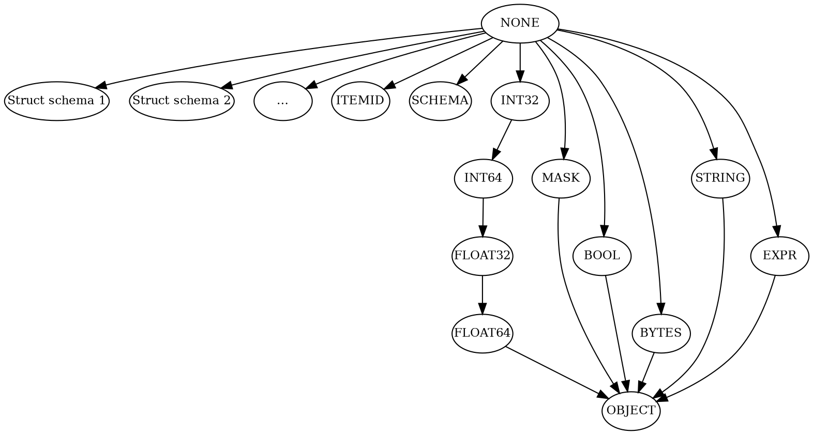
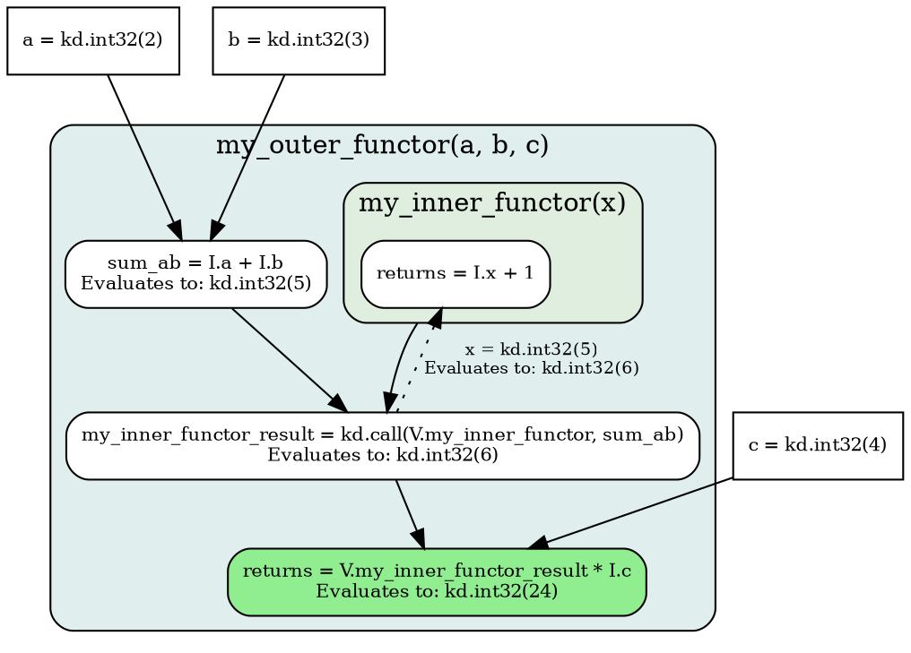

<!-- go/markdown -->

# Technical Deep Dive

This guide offers a technical deep dive into core Koda concepts for those
wanting to gain a deeper understanding of what powers it. This guide does *not*
provide detailed introductions to each topic and it is expected that the reader
is already familiar with Koda before proceeding. Please read
[Koda Overview](overview.md) and [Koda Fundamentals](fundamentals.md) to gain
familiarity with Koda.

WARNING: This page is under construction. Some sections, such as those covering
"DataSlice" and "DataBag", have yet to be added.

* TOC
{:toc}

<!--
## DataSlice

WIP

-->

## JaggedShape

JaggedShapes describe the data partitioning of a DataSlice as a (potentially)
multidimensional and *jagged* partition tree that is representable through a
sequence of size arrays. The number of size arrays corresponds to the *rank*
(i.e. number of dimensions) of the JaggedShape, while the sizes themselves
represent the number of columns for each row. Together with a *flat* array of
data (or a scalar data point in case of scalars), they form a multidimensional
DataSlice.

For example:

```py
x = kd.slice(
  [
    [
      ['a', 'b'],
      ['c']
    ],
    [
      ['d', 'e', 'f']
    ]
  ]
)
```

is a DataSlice with a 3-dimensional JaggedShape. The sizes are `[[2], [2, 1],
[2, 1, 3]]`, indicating that:

*   dim-0 has 1 row with 2 columns.
*   dim-1 has 2 rows, where row-0 has 2 columns, and row-1 has 1 column.
*   dim-2 has 3 rows, where row-0 has 2 columns, row-1 has 1 column, and row-2
    has 3 columns.

NOTE: By convention, *uniform* dimensions (where all column sizes are the same)
are represented with a single scalar. The repr of the above JaggedShape is
therefore `JaggedShape(2, [2, 1], [2, 1, 3])`.

### Broadcasting

Koda differs from most numerical libraries that support multidimensional arrays
in that broadcasting is done based on the *prefix* (lower dimensions) rather
than the *suffix* (higher dimensions) of the shapes.

For a shape `s1` to be considered *broadcastable* or *expandable* to `s2`, we
require that `s1` is a *prefix* of `s2`. For example, in Koda the following is
the case:

```py
ds_1 = kd.slice(['a', 'b'])
ds_2 = kd.slice([['c', 'd', 'e'], ['f', 'g', 'h']])

# Succeeds. `ds_1.get_shape() -> JaggedShape(2)` is a prefix of
# `ds_2.get_shape() -> JaggedShape(2, 3)`.
kd.expand_to_shape(ds_1, ds_2.get_shape()) # kd.slice([['a', 'a', 'a'],
                                           #           ['b', 'b', 'b']])

# Fails. `ds_2.get_shape()` is _not_ a prefix of `ds_1.get_shape()`.
kd.expand_to_shape(ds_2, ds_1.get_shape())

# Fails. `ds_3.get_shape()` is _not_ a prefix of `ds_2.get_shape()`.
ds_3 = kd.slice(['a', 'b', 'c'])
kd.expand_to_shape(ds_3, ds_2.get_shape())
```

NOTE: The *common shape* of a collection of `shapes`, if one exists, is defined
as the shape in `shapes` that all other shapes can be broadcasted to.

In Numpy, on the other hand, a shape `s1` is considered broadcastable to `s2`
only if `s1` is a *suffix* of `s2`. For example:

```py
arr_1 = np.array(['a', 'b'])
arr_2 = np.array([['c', 'd', 'e'], ['f', 'g', 'h']])

# Fails. `arr_1.shape` is _not_ a suffix of `arr_2.shape`.
np.broadcast_to(arr_1, arr_2.shape)

# Succeeds. `arr_3.shape` is a suffix of `arr_2.shape`.
arr_3 = ['a', 'b', 'c']
np.broadcast_to(arr_3, arr_2.shape)  # [['a', 'b', 'c'], ['a', 'b', 'c']]
```

As a consequence of these rules, in Koda the data is broadcasted by repeating
each element for each corresponding partition in the new shape. For
`kd.expand_to_shape(ds_1, ds_2.get_shape())`, `'a'` is repeated once for each
element in `['c', 'd', 'e']`. In Numpy, the entire input is instead repeated for
each corresponding row. For `np.brodcast_to(arr_3, arr_2.shape)`, `['a', 'b',
'c']` is repeated once per row.

The primary motivation is that these broadcast rules more closely adhere to the
Koda data model. A DataSlice is considered a multi-tiered hierarchical
structure, where dimension `i` is a "parent" of dimensions `j` where `i < j`.
Consider a collection of `queries` as a 1d DataSlice, and a collection of
associated documents `docs`, then the broadcasting rules allow us to easily
associate the `queries` with the `docs` in order to do computations:

```py
queries = kd.slice(['query_1', 'query_2'])
docs = kd.slice([['doc_1', 'doc_2'], ['doc_3']])

kd.expand_to(queries, docs)  #  [['query_1', 'query_1'], ['query_2']]
```

The secondary motivation for this difference is technical: in Numpy, all
dimensions are *uniform* and thereby independent of each other - one can freely
change one dimension without affecting the others. For JaggedShapes with
non-uniform dimensions, changing `dim[i]` (or adding prefix dimensions) has a
cascading effect on all `dim[j]`, where `i < j`, as subsequent dimensions are no
longer compatible with the new sizes except in trivial cases. This practically
restricts broadcasting to a prohibitively limited set of cases given how common
jaggedness is in Koda.

NOTE: In Koda, broadcasting normally happens implicitly. For example, `kd.add(x,
y)` produces a result with the *common shape* of `x` and `y`.

### Indexing

Indexing and slicing is done by traversing the dimensions from left to right to
obtain the correct indices in the flattened data. Consider the following
example:

```py
# Has shape: JaggedShape(3, [2, 1, 3])
x = kd.slice(
  [
    ['a', 'b'],
    ['c'],
    ['d', 'e', 'f'],
  ]
)
```

To retrieve `x.S[2, 1]`, we may for illustrative purposes consider the
equivalent (but slower) form `x.S[2, ...].S[1]`:

*   `x.S[2, ...]` returns `kd.slice(['d', 'e', 'f'])` with sizes `[[3]]`.
*   `x.S[2, ...].S[1]` returns `kd.slice('e')` with sizes `[]` - i.e. a scalar.

An observant reader may realize that, to compute the intermediate result of each
level (e.g. `kd.slice(['d', 'e', 'f']))` for `x.S[2, ...]`), we must compute the
`start` and `end` positions in the flattened `data = ['a', 'b', 'c', 'd', 'e',
'f']`. For `x.S[2, ...]`, this is computed through:

```py
# Our index to use.
i = 2
# The sizes of the relevant dimension. Since indexing reduces the
# dimensionality, this is the second dimension.
sizes = [2, 1, 3]

start = sum(sizes[:i])  # -> 3
end = start + sizes[i]  # -> 6
data[start:end]  # -> ['d', 'e', 'f']
```

Note that a linear number of operations is required to compute the start value
from the sizes. This property is shared among many common shape operations, such
as flattening, slicing etc. This is part of the reason why the real
implementation uses *split points* instead of sizes.

### Split Points

The split point representation is simply the cumulative sum of the sizes that we
have previously discussed. For example, `JaggedShape(3, [2, 1, 3])` has split
points `[[0, 3], [0, 2, 3, 6]]`.

We return to above example of `x.S[2, ...]` and show how this is simplified
through split points. For each intermediate step, we have to compute the `start`
and `end` positions of the flattened data in the same manner as with the sizes
implementation. For `x.S[2, ...]`, this is simply:

```py
# Our index to use.
i = 2
# The sizes of the relevant dimension.
split_points = [0, 2, 3, 6]

start = split_points[i]  # -> 3
end = split_points[i + 1]  # -> 6
data[start:end]  # -> ['d', 'e', 'f']
```

The computation involves a few lookups in the split points which is more
efficient than the iteration we saw in the sizes representation.

In short, the split points representation allows us to (e.g. for `split_points =
[0, 2, 3, 6]`):

*   Quickly compute the number of rows for each dimension. This is the same as
    the total number of elements in the previous dimension (if one exists).
    *   `len(split_points) - 1`.
*   Quickly compute the number of columns of each row.
    *   `split_points[i + 1] - split_points[i]`.
*   Quickly compute the total number of elements that are present in each
    dimension. This is the same as the number of rows of the next dimension (if
    one exists).
    *   `split_points[-1]`.
*   Simplify and speed up common operations on shapes such as indexing or
    flattening.

### Edges

The real JaggedShape implementation is represented through a list of *split
point edges*, each representing a dimension. An *edge* is an Arolla abstraction
representing potentially unordered mapping from a parent array to a child array.
Each edge has a `parent_size`, representing the size of the parent, a
`child_size`, representing the size of the child, and a "mapping" from the
parent to the child. For JaggedShapes, the "mapping" is in the form of split
points, which implicitly imposes the restriction that the "mapping" is
monotonically non-decreasing. Additionally, for a JaggedShape with dimensions
`dim`:

*   `dim[0].parent_size() == 1`
*   For all `0 <= i < dim.size() - 1`: `dim[i].child_size() == dim[i +
    1].parent_size()`.

That is, the `parent_size` of each dimension corresponds to the number of
columns in the previous dimension, and the `child_size` corresponds to the
number of rows in the next dimension.

For the 3-dimensional JaggedShape represented by sizes `JaggedShape(2, [2, 1],
[2, 1, 3])`, the implementation looks like:

```py
JaggedShape(
  Edge(split_points=[0, 2], parent_size=1, child_size=2),
  Edge(split_points=[0, 2, 3], parent_size=2, child_size=3),
  Edge(split_points=[0, 2, 3, 6], parent_size=3, child_size=6),
)
```

### Implementation and API

Koda operations are mostly done on slices, and shape modifications during
broadcasting, indexing, and similar are handled automatically. In some cases,
it's still useful to be able to inspect the shape, and to manipulate it
manually. For this, the following functionality is available:

*   `shape = ds.get_shape()` returns the JaggedShape of the DataSlice `ds`.
*   `shape.rank()` returns the rank, i.e. the number of dimensions.
    *   Other methods can be found in the
        [Python implementation](http://py/koladata/types/jagged_shape.py).
*   `kd.shapes.flatten(shape, from_dim=..., to_dim=...)` flattens the shape
    between `from_dim` and `to_dim`.
    *   Other shape operators can be found under the
        [`kd.shapes`](api_reference.md#kd.shapes) section of the Koda API
        Reference.

<!--

## DataBag

WIP

## DataItem

WIP

-->

## Schema

Koda Schemas describe the type of content of a DataSlice. They dictate behavior
for attribute lookup/setting, clone/extract operations, etc. The associated type
promotion rules dictate the behavior of operators involving different but
compatible types.

The schema of a DataSlice can be accessed through `ds.get_schema()` and can be
changed through `kd.cast_to(ds, schema)` which casts `ds` to `schema` and
changes the underlying data if needed, or `ds.with_schema(schema)` which
*reinterprets* `ds` as `schema` without changing the underlying data.

### The Different Schemas

The existing Koda schemas, and their meaning, are listed below. Note that all
schemas allow missing values, so each item in e.g. an `INT32` DataSlice is
either a proper 32-bit integer or missing.

| Schema        | Meaning                                                      |
| ------------- | ------------------------------------------------------------ |
| `NONE`        | The DataSlice holds no values and the type is unspecified. A |
:               : DataSlice with this schema can *never* hold values.          :
| `INT32`       | 32-bit integer.                                              |
| `INT64`       | 64-bit integer.                                              |
| `FLOAT32`     | 32-bit floating point value.                                 |
| `FLOAT64`     | 64-bit floating point value.                                 |
| `BOOLEAN`     | Boolean value.                                               |
| `MASK`        | Mask value.                                                  |
| `BYTES`       | Bytestring value.                                            |
| `STRING`      | UTF-8 encoded text value.                                    |
| `EXPR`        | Quoted Koda Expression value.                                |
| `ITEMID`      | ItemId value, interpreted as an id. Attribute access and     |
:               : similar is disabled.                                         :
| Struct schema | ItemId value. The schema is dynamically allocated and is in  |
:               : itself an ItemId with associated attributes. Includes List,  :
:               : Dict, and Entities.                                          :
| `SCHEMA`      | Schema value. Either as a fixed schema type or as an         |
:               : allocated struct schema.                                     :
| `OBJECT`      | Primitive or ItemId values. Each value includes information  |
:               : about its own type\: primitives have a corresponding         :
:               : primitive schema and ItemIds have an associated Entity       :
:               : `__schema__` attribute giving the schema of the stored       :
:               : value. This schema allows the DataSlice to contain mixed     :
:               : (heterogeneous) values.                                      :

#### Struct Schemas

A DataSlice with a Struct schema holds ItemId values, representing Entities,
Lists or Dicts. The Struct schema is in itself an ItemId with associated
attributes. An attribute `'a'` on the schema gives the schema of attribute `'a'`
of the value. For example, the entity `SCHEMA(x=INT32)` indicates that the
values accessible through the attribute `'x'` are `INT32`. Note that a DataSlice
with an Struct schema have homogeneously typed values.

Entity schemas created through `kd.new` are, unlike all other schemas,
dynamically allocated and associated with values in a DataBag. Like
`kd.new(x=1)` is dynamically allocated, so is `kd.new(x=1).get_schema()`:

```py
e1 = kd.new(x=1)
e2 = kd.new(x=1)

assert e1.get_schema() != e2.get_schema()  # Comparison through ItemId.
```

Entity schemas can have their attributes altered:

```py
schema = kd.new(x=1).get_schema()
schema.with_attr('y', kd.FLOAT32)  # -> ENTITY(x=INT32, y=FLOAT32)
```

List and Dict schemas have universally-unique ItemIds, and their attributes
cannot be altered:

```py
l1 = kd.list([1, 2])
l2 = kd.list([1, 2])

assert l1.get_schema() == l2.get_schema()

l3 = kd.list([1, 2, 3, 4])

assert l1.get_schema() == l3.get_schema()
```

Entity schemas can also be created to be universally unique:

```py
assert kd.uu_schema(x=kd.INT32) == kd.uu_schema(x=kd.INT32)
assert kd.uu(x=1).get_schema() == kd.uu(x=1).get_schema()
```

#### OBJECT

The object schema is worth discussing in more detail. It has the unique property
among the schemas that it doesn't indicate the type of the object, but rather
that the type of each value should be inferred from the value itself. For
primitive values, the schema of each value is simply the corresponding schema.
For example, `int32{1}` has schema `INT32` and `bool{True}` has schema `BOOL`.
For ItemIds, the schema is stored in the `__schema__` attribute. For example:

```py
o1 = kd.obj(x=1)
o1.get_schema()  # OBJECT
o1.get_obj_schema()  # Looks up the `__schema__`: IMPLICIT_ENTITY(x=INT32)
```

Since each value carries its own schema (either implicitly or in the
`__schema__` attribute), it is possible for them to differ. `OBJECT` DataSlices
are the only ones capable of holding heterogeneous data. For example:

```py
ds = kd.slice([1, 'abc', kd.obj(x=1)])
ds.get_schema()  # OBJECT
ds.get_obj_schema()  # [INT32, STRING, IMPLICIT_ENTITY(x=INT32)]
```

Both DataSlices with a struct schema or `OBJECT` schema can hold structured
data. The key difference is that in the case of DataSlices with a struct schema,
the schema of each value is entirely defined by the schema of the DataSlice,
while in the case of `OBJECT`, it is local to each value. Because of this,
DataSlices with struct schemas are both more strict and faster for common
operations such as attribute access:

```py
mask = kd.slice([kd.present, None] * 50_000)
# Filtered objects and entities.
objects = kd.obj(x=kd.slice([1] * 100_000)) & mask
entities = kd.new(x=kd.slice([1] * 100_000)) & mask

# We can fill `objects` with anything, as the common schema is `OBJECT`.
objects | 2.0  # [Obj(x=1), 2.0, Obj(x=1), ...]

# But there is no common schema of `<entities.get_schema(), FLOAT32>`.
entities | 2.0  # -> Exception.

# Attribute access is faster for `entities` as the schema can be taken directly
# from the DataSlice instead of a collection of schema attributes.
_ = objects.x  # -> 1.2ms
_ = entities.x  # -> 322µs

# Fetching available attribute names is much faster for `entities` as it is
# given by the DataSlice schema instead of a collection of schema attributes.
_ = kd.dir(objects)  # -> 1.36ms
_ = kd.dir(entities)  # -> 1.25µs
```

#### Implicit and Explicit Entity Schemas

Entity schemas created explicitly using schema creation APIs or as a by-product
of `kd.new(**kwargs)` are called explicit entity schemas. Those created
implicitly as a by-product of `kd.obj(**kwargs)` are called implicit schemas.

Explicit entity schemas and implicit entity schemas differ by how they handle
schema conflicts during assignment. Attributes of an explicit entity schema
cannot be overridden unless `overwrite_schema=True` is set while attributes of
an implicit entity schema can be overridden by default.

```py
entity = kd.new(a=1)
# Fail as schemas are not compatible
# entity.with_attrs(a='2')
entity = entity.with_attrs(a='2', overwrite_schema=True)
entity.get_schema()  # ENTITY(a=STRING)

obj = kd.obj(a=1)
obj = obj.with_attrs(a='2')
obj.get_obj_schema()  # IMPLICIT_ENTITY(a=STRING)
```

The motivation behind this is that an explicit entity schema can be used by
multiple entities while an implicit schema cannot. Thus overriding schema
attributes of an explicit schema without `overwrite_schema=True` is dangerous.
For example,

```py
entities = kd.new(a=kd.slice([1, 2]))
# Only update the first item
# We want to assign it to '3' rather than 3 by mistake
# Imagine the following line succeeds without overwrite_schema=True
upd = kd.attrs(entities.S[0], a='3', overwrite_schema=True)
entities = entities.updated(upd)
# Fails because one value is 2 but schema is STRING
entities.a
```

However, it is not a problem for an implicit schema and allowing direct
overrides makes the code more concise.

```py
objs = kd.obj(a=kd.slice([1, 2]))
objs.a  # DataSlice([1, 2], schema: INT32, ndims: 1, size: 2)
upd = kd.attrs(objs.S[0], a='3')
objs = objs.updated(upd)
# It is fine as objects have different implicit schemas
objs.a  # DataSlice(['3', 2], schema: OBJECT, ndims: 1, size: 2)
```

NOTE: Adding new attributes is allowed for both explicit and implicit entity
schemas.

```py
entity = kd.new(a=1)
entity = entity.with_attrs(b='2')
entity.get_schema()  # ENTITY(a=INT32, b=STRING)

obj = kd.obj(a=1)
obj = obj.with_attrs(b='2')
obj.get_obj_schema()  # IMPLICIT_ENTITY(a=INT32, b=STRING)
```

### Type Promotion

Koda has well-defined rules for dealing with values with differing schemas that
are consistently applied across the library. The type promotion rules affect the
behavior of operators (especially those with several inputs), boxing of values
into DataSlices, and attribute assignment to name a few. These rules mainly
dictate *implicit* casting behavior, which are safe casts applied without user
intervention. The rules for *explicit* casting are more relaxed and may be
unsafe, and therefore require explicit calls from the user.

#### Implicit Casting

Implicit casting, or type promotion, plays a role in many parts of Koda. Values
are casted implicitly without user intervention to make for a smooth experience.
For example, the following examples show the type promotion rules in action:

*   `kd.add(kd.int32(1), kd.int64(2))` results in `kd.int64(3)`.
*   `kd.schema.new_schema(x=kd.INT64).new(x=kd.int32(1)).x` results in
    `kd.int64(1)`.
*   `kd.slice([1, 2.0])` results in a `FLOAT32` DataSlice `kd.float32([1.0,
    2.0])`.

The output schema of the `kd.add` example is the *common schema* of the input
schemas `<INT32, INT64> = INT64`. The type promotion rules dictate the common
schema for a collection of input schemas, and casts are done to the common
schema and are applied implicitly. Because of this, these rules should be
consistent and result in safe (not raise) and efficient casts. Note that not all
combinations of schemas have a common schema, for example `<ITEMID, INT32>`, and
an error is instead raised when computing it.

Koda's type promotion rules are defined through the following (partial)
[type promotion lattice](https://jax.readthedocs.io/en/latest/jep/9407-type-promotion.html#stepping-back-tables-and-lattices).
The supremum between two nodes in the lattice is the common schema. If one
doesn't exist, the common schema doesn't either.



For example, the common schema of `<INT32, INT64> = INT64` because that's the
supremum node. Similarly, `<INT32, FLOAT64> = FLOAT64` and `<INT32, MASK> =
OBJECT` while `<INT32, ITEMID>` is not defined.

Because the rules are defined through a (partial) type promotion lattice, they
are associative and commutative, meaning that the common schema of `<A, B, C> =
<<A, B>, C> = <A, <B, C>> = <<B, A>, C>, ...`. Additionally, each edge in the
lattice, and thereby the type promotion rules themselves, adheres to the
following criteria:

*   The resulting casts are safe and will not raise.
    *   `<INT32, INT64> = INT64` is an example of a safe cast since all 32-bit
        integers can safely be represented as 64-bit integers. The converse is
        not true.
*   Conservative promotion into wider types.
    *   Wider types are in general slower, use more memory, and are not as well
        supported in some workflows and on some architectures. Overly-eager
        promotion into wide types increases the risk of infeasible amounts of
        memory being used without the user intending to, limiting the usability
        of Koda as a whole.
*   Avoid unnecessary precision loss (`1.544 -> 1.5`) and, more importantly,
    loss of magnitude (`2**45` -> `INF`).
    *   `INT64` -> `FLOAT32` is a compromise between user convenience and
        preciseness. `FLOAT32` can represent the magnitude of `INT64`, but not
        its full range (with more pronounced precision loss for larger values).
    *   Floats are preferred over integers, similar to other libraries as well
        as Python.
    *   It avoids overly eager promotions to 64-bit values, such as `INT32` ->
        `FLOAT64` (necessary to represent the full range of values), which would
        leave `INT64` promotion unspecified, and would lead to potential
        performance degradation.
*   Avoid unnecessary use of mixed types through `OBJECT`.
    *   Some operators cannot handle mixed data, it is slower to work with, and
        it’s harder to reason about.

Note that differing struct schemas have no common schema. As such, type
promotion of nested types, such as `<LIST[NONE], LIST[INT32]>` is not supported.

For attribute assignments, such as
`kd.schema.new_schema(x=kd.INT64).new(x=kd.int32(1))`, implicit casting is done
to accommodate the differing types. As the attribute schema is fixed to `INT64`,
we require that for an assignment of a value with schema `X`, `<INT64, X> =
INT64`[^narrowing]. In such cases, we say that `X` is implicitly castable to
`INT64`. In fact, operations defined on some schema `Y` are therefore also
defined on all schemas that are implicitly castable to it.

[^narrowing]: In reality, we require that the *narrowed schema* of the input is
    implicitly castable to `INT64`. See the [Narrowing](#narrowing)
    section for more details.

Most of the time, these rules can be ignored as implicit casting will be done
without additional inputs from users. However, the following helpers are also
available:

*   [`kd.schema.agg_common_schema`](api_reference.md#kd.schema.agg_common_schema):
    Computes the common schema across the last `ndim` dimensions of a DataSlice.
*   [`kd.schema.common_schema`](api_reference.md#kd.schema.common_schema):
    Computes the common schema of the entire DataSlice.
*   [`kd.schema.cast_to_implicit`](api_reference.md#kd.schema.cast_to_implicit):
    Casts the input to a provided schema if allowed by the type promotion rules.

#### Explicit Casting

As a complement to implicit casting, it's possible to *explicitly* cast between
types through more relaxed rules. As the casting is done directly by the user,
it is not required that the cast is safe. For example, explicitly casting to
`INT32` is supported for e.g. `FLOAT32` in addition to all implicitly castable
inputs. However, this may fail if the value is too large.

Here are some cases where explicit casting is done:

*   [`kd.schema.cast_to`](api_reference.md#kd.schema.cast_to): Casts the input
    to the provided schema using relaxed casting rules (that may fail).
*   [`kd.int64`](api_reference.md#kd.int64): Converts the input to INT64 with
    relaxed casting rules (that may fail).
*   `kd.slice(data, schema=kd.INT64)`: Boxes the `data` to an INT64 slice with
    relaxed casting rules (that may fail).

Explicit casting between Entities is not supported. Instead,
`ds.with_schema(new_entity_schema)` can be used as an (unsafe) alternative to
*reinterpret cast* `ds` to the `new_entity_schema`.

#### Narrowing

The `OBJECT` schema is special since it doesn't indicate the type of the data it
holds, but rather indicates that the type is provided by each value itself. To
systematically support attribute assignment of `OBJECT` values, such as
`kd.schema.new_schema(x=kd.INT32).new(x=kd.item(1, schema=kd.OBJECT))`, Koda has
the concept of schema *narrowing*.

For all other schemas apart from `OBJECT`, the narrowed schema of a DataSlice
`ds` is simply the schema `ds.get_schema()`. For `OBJECT`, the narrowed schema
is the common schema of all elements, or `OBJECT` if none exists.

For attribute assignment to an attribute with schema `X`, we therefore require
that the new value has a *narrowed* schema that is implicitly castable to `X`.
That is, the data itself must be safely castable to `X`, even though the value
schema may not be implicitly castable to `X` in case of `OBJECT`. Note that
attribute assignment is only one example out of several where schema narrowing
is used:

```py
schema = kd.schema.new_schema(x=kd.INT32)
# The input is narrowed to `kd.item(1, schema=kd.INT32)` before being assigned.
schema.new(x=kd.item(1, schema=kd.OBJECT))  # DataItem(1, schema: INT32)

str_list = kd.list(['foo', 'bar'])
# The index is narrowed to `kd.item(0, schema=kd.INT64)`.
str_list[kd.item(0, schema=kd.OBJECT)]  # DataItem('foo', schema: STRING)

ints = kd.slice([[1, 2], [3]])
# The `ndim` is narrowed to `kd.item(2, schema=kd.INT64)`.
kd.agg_sum(ints, ndim=kd.item(2, schema=kd.OBJECT))  # DataItem(6, schema=INT32)
```

Here are some additional helpers to perform narrowing:

*   [`kd.schema.cast_to_narrow`](api_reference.md#kd.schema.cast_to_narrow):
    Casts the input to the provided schema by first computing the narrowed
    schema of the input and then casting to the provided schema using implicit
    casting rules.

### Boxing

Conversion from Python values to corresponding Koda values, which we refer to as
*boxing*, by default makes use of the type promotion rules seen above. In case a
`schema` is supplied, the result is instead produced using explicit casting
rules. Boxing through `kd.slice` can be split into two parts:

1.  A local decision for each "scalar" value of the input.
1.  A global decision for the entire resulting DataSlice.

Boxing for `kd.from_py` works in a similar manner, but with a slight variation
to accommodate how lists and other input types are treated.

#### Scalar DataItem Boxing

Scalar values are boxed according to the (incomplete) rules below:

*   If the value has a specified numeric type and width, e.g. np.int32, the
    DataItem should have the same numeric type and width, e.g. `INT32`.
*   If the value is a Python float, we attempt to wrap it into a `FLOAT32`, and
    fall back to `FLOAT64` if the magnitude of the value is too large (the
    magnitude cannot fit into `FLOAT32`).
*   If the value is a Python integer, we attempt to wrap it into an `INT32`, and
    fall back to `INT64` if the magnitude of the value is too large. If the
    value exceeds the limits of `INT64`, the result is the input as an `INT64`
    value modulo `MAX_INT64`.
*   Python booleans are converted to `BOOL`.
*   Python bytes are converted to `BYTES`, and str is converted to `STRING`.
*   Arolla types are converted into their corresponding schema if such exists,
    or fails otherwise.
*   Missing values (None) are treated as `NONE`.

The least obvious of these rules is the rules for Python numericals, where the
schema of the DataItem depends on the value itself, not just its type. While
this may cause confusion, it is motivated by practical user benefits and
existing users that rely on this behavior. The choice of wrapping as `INT32`
rather than always using `INT64` is motivated by the desire to avoid overly
eager use of wide types.

Treating None as `NONE`, which is the “minimum” schema, effectively marks its
type as unknown. This allows e.g. `LHS + None` to defer its schema to the `LHS`,
irrespective of its schema. This also allows us to compute the schema of
`kd.slice([...])` by the common type of its inputs.

#### DataSlice Boxing

Given a list of values, the schema of the DataSlice is given by the common
schema of the values in the list when viewed as DataItems. Example:
`kd.slice([1, 2.0]).get_schema()` -> `FLOAT32` since `<INT32, FLOAT32> =
FLOAT32`.

`kd.slice([])` has a `NONE` schema, which corresponds to the behavior of
`DataItem(None)` and has the property that `kd.concat(kd.slice(x[:i]),
kd.slice(x[i:])) == kd.slice(x)` for `0 <= i <= slice.size()`.

### Relation to Arolla

Arolla powers the underlying computations of Koda, and Koda operators are
implemented using Arolla. Arolla uses QTypes to enable compilation, to dispatch
to underlying computations, and to add type safety since the QType can flow
through the expression. Due to the dynamic nature of Koda, schemas are *not*
reflected in the QType system, and instead a single `DATA_SLICE` QType is used
throughout. The benefit is that the schema is allowed to be dynamic, and to be
treated as data inside of a DataBag. The downside is that the benefits that
Arolla can provide, mainly with respect to type safety at compilation time,
cannot be used. As such, Koda provides optional runtime checks
([`kd.check_inputs`](api_reference.md#kd.check_inputs) and
[`kd.check_output`](api_reference.md#kd.check_output)) that provide type safety.

<!--

## Object

WIP

-->

## Deferred Evaluation, Tracing, and Functors

Koda supports both eager computation, where operations are performed
immediately, and deferred evaluation, where the definition of computations is
separated from their execution.

Eager computations evaluate Python code with real (materialized) inputs such as
DataSlices. Koda *operators* are immediately evaluated to produce real outputs
such as a DataSlice.

Deferred evaluation (or "lazy" evaluation as it is often referred to) is done
through the creation of computational graphs, called *Expressions*, that can be
stored and evaluated at a later point on real inputs. Deferred evaluation in
Koda is primarily realized through *tracing* Python code to produce *Functors*
that encapsulates one or more Expressions. This paradigm offers several
advantages, including the separation of computation logic from its evaluation
context, the potential for computation graph optimization, and facilitation of
parallel/distributed execution and production serving.

Typically, Koda operates in eager mode by default. Tracing is primarily done
when a Python function is passed to `kd.fn` for conversion into a Functor. The
following sections discuss these topics in detail, beginning with Expressions
and followed by Functors: creation and evaluation.

### Expressions and Operators

Koda's deferred evaluation mechanisms are implemented atop Arolla, a framework
designed for the creation, manipulation, and evaluation of Expressions, which
are directed and acyclic computation graphs.

#### Operators

A key part of Expressions are operators. Most Koda operators have two versions:
an eager version in `kd.eager.*` and a lazy version in `kd.lazy.*`.

Eager operators perform computations immediately upon invocation, returning a
concrete `DataSlice`, `DataBag` or similar. In contrast, lazy operators do not
execute immediately. Instead, they construct an Expression for deferred
execution.

Note: in most cases, an eager Koda operator is simply a convenience wrapper that
immediately triggers evaluation of a corresponding lazy operator.

You can explicitly refer to the eager/lazy version of an operator by spelling it
out, e.g. by using `kd.eager.flatten` or `kd.lazy.flatten` in your code. The
more common workflow is however to use the `kd.*` container, e.g. by using
`kd.flatten`, which dispatches to the eager or lazy versions depending on if
code is being traced or eagerly executed.

There are three main types of operators:

1.  *Backend operator*: An operator stub backed by a linked C++ implementation
    of the same name. Created through `kd.optools.as_backend_operator`.
1.  *Py-function operator*: Wraps a Python function that is invoked upon
    evaluation. Created through `kd.optools.as_py_function_operator`.
1.  *Lambda operator*: A high-level operator composed of a collection of other
    operators. Created through `kd.optools.as_lambda_operator`.

You can add an operator by name in a global registry by calling
`kd.optools.add_to_registry`.

#### QTypes and Koda Schemas

An Arolla QType is a static type identifier used by the Arolla framework. QTypes
play a crucial role in static type checking of expressions and in dispatching
operations to their correct C++ implementations. Each node in an Expression has
an associated output QType, which is determined by the operator at that node and
the QTypes of its inputs. This QType information is propagated through the
expression graph, enabling static analysis and ensuring type consistency before
evaluation.

A clear distinction must be made between Arolla's QTypes and Koda's Schemas:

*   *Arolla QTypes*: These are **static** types integral to the Arolla
    framework. They are employed for type checking during the construction and
    compilation of expressions and for dispatching operations to their
    appropriate C++ implementations during compilation. Examples include
    `arolla.INT32`, `arolla.FLOAT32`, as well as Koda-specific QTypes like
    `kd.types.qtypes.DATA_SLICE` and `koladata.types.qtypes.DATA_BAG`.
*   *Koda Schemas*: These describe the **runtime** structure and content type of
    a `DataSlice`. Examples include primitive schemas like `kd.INT32` or
    `kd.STRING`, special schemas like `kd.OBJECT`, or structured entity schemas
    defined via `kd.named_schema('MyEntity', ...)`. Koda Schemas govern
    attribute lookup, data validation, and type promotion rules during
    operations.

A fundamental aspect of Koda's architecture is that the specific Koda Schema of
a `DataSlice` (e.g. whether it holds `INT32` values, `STRING` values, or
represents an entity with particular attributes) is *not* encoded within its
QType. Instead, all `DataSlice` instances share the common
`kd.qtypes.DATA_SLICE` QType. Consequently, Koda Schemas and the actual data
encapsulated within `DataSlice` objects are runtime properties and are not
available during the tracing phase when the computational graph is being
constructed. In this phase, Koda operations manipulate symbolic placeholders
(e.g. `kd.I.smth`) that represent future `DataSlice`, `DataBag` and
`JaggedShape` inputs, and the Koda Schemas of these inputs are indeterminate.

An alternative design would have been to encode schema and (partial) shape
information in the `kd.qtypes.DATA_SLICE` QType. For example, knowing at tracing
time that the QType of `ds` is `DATA_SLICE[schema=Entity(x=INT32), rank=2]`
would allow tracing-time type checking and validation of the output. The
computation `kd.agg_sum(ds.x)` would be known to output
`DATA_SLICE[schema=INT32, rank=1]`, which in turn would allow us to convert many
current runtime-errors into tracing-time errors: `kd.agg_sum(ds.x) +
kd.slice('abc')` would fail during tracing. The downside of this approach is
that it removes the ability to treat schemas and shapes as *data*, which is a
core part of Koda's design and appeal. In this sense, Koda is closer to Python
than C++.

#### Expression Evaluation

During the preparation of an Expression for evaluation, which happens as a
pre-processing step right before evaluation, steps such as *literal folding* and
lambda operator *lowering* occurs. Literal folding involves replacing all nodes
whose output can be immediately computed (i.e. that do not involve deferred
inputs such as kd.I.smth) with literals that embody the output values. Lowering
involves transforming the expression by replacing higher-level lambda operators
with their underlying definitions. This is analogous to function inlining in
traditional compilers and is a key step in optimizing the computation graph for
efficient execution. The preparation process stops once there are no more
transformations to be made.

The evaluation of the prepared Expression follows a bottom-up model executed by
an evaluation backend, such as Arolla's dynamic evaluation engine:

1.  *Leaf Node Resolution*: The process commences by determining the values of
    the leaf nodes in the Expression. These leaves can be input placeholders,
    which receive their values from arguments supplied at the time of
    evaluation, or literal values embedded within the expression structure.
2.  *Progressive Operator Application*: Once the values of an operator's inputs
    (its child nodes in the Expression tree) have been resolved, the operator is
    applied to these computed values.

The evaluation proceeds upwards through the tree. The result generated by each
operator serves as an input to its parent operator, continuing until the root
node of the expression is evaluated. The value of the root node constitutes the
final result of the expression evaluation, which is often time a single
DataSlice.

**Example of Expression Evaluation:**

Consider an Expression representing the computation `(I.a + I.b) * I.c`:

```
    *
   / \
  +   I.c
 / \
I.a I.b
```

If this expression is evaluated with `a = kd.int32(2)`, `b = kd.int32(3)`, and
`c = kd.int32(4)`:

1.  The input nodes `I.a`, `I.b`, and `I.c` are resolved to their respective
    `DataItem` values: `2`, `3`, and `4`.
2.  The `+` operator (resolved to `kd.add`), with its inputs `I.a` and `I.b` now
    known, is evaluated: `kd.add(kd.int32(2), kd.int32(3))` yields
    `kd.int32(5)`.
3.  The `*` operator (resolved to `kd.multiply`) at the root has its inputs
    resolved to the result of `I.a + I.b` (which is `5`) and `I.c` (which is
    `4`). The multiplication is performed: `kd.multiply(kd.int32(5),
    kd.int32(4))` results in `kd.int32(20)`. This `kd.int32(20)` is the final
    result of the expression's evaluation.

### Functors

In Koda, a *Functor* is a specialized Koda item that encapsulates a computation
graph. Functors serve as the primary mechanism for achieving deferred evaluation
in Koda.

Functors are typically created in one of three ways:

1.  From an Expression (e.g.
    [`kd.functor.expr_fn`](api_reference.md#kd.functor.expr_fn)).
2.  From tracing a Python callable (e.g.
    [`kd.trace_py_fn`](api_reference.md#kd.functor.trace_py_fn)). The resulting
    Functor will internally use one or more Expressions to represent the
    function's logic.
3.  From wrapping a Python callable (e.g.
    [`kd.py_fn`](api_reference.md#kd.functor.py_fn)). The resulting Functor will
    store a reference to the Python callable without performing tracing.

The general utility to create Functors [`kd.fn`](api_reference.md#kd.functor.fn)
combines them as follows:

*   If the input is an Expression, it dispatches to `kd.functor.expr_fn`.
*   Otherwise, the input must be a Python callable, and the behavior depends on
    the value of the `use_tracing` keyword argument:
    *   If `use_tracing=True` (the default), then `kd.fn` dispatches to
        `kd.trace_py_fn`.
    *   If `use_tracing=False`, it dispatches to `kd.py_fn`.

Functors, being Koda DataItems, can be managed like other Koda data: they can be
stored as attributes within Koda entities or objects, passed as arguments to
other functions or Functors, and generally manipulated as normal objects.

#### Tracing

The conversion of a Python function into a Koda Functor through `kd.trace_py_fn`
is termed *tracing*. This process involves:

1.  Inspecting the signature of the Python function. The signature determines
    the interface of the Functor, such as the number of input arguments and
    default arguments. It also controls the tracing behavior through its
    argument type annotations. For example, arguments annotated with
    `kd.types.DataBag` are traced as DataBag. The default type if an annotation
    is missing is `kd.types.DataSlice`.
2.  Executing the Python function a single time with symbolic placeholder inputs
    inferred from the Python function's signature (e.g. `I.x`, `I.y`). These
    placeholders represent the arguments that will be supplied when the Functor
    is eventually evaluated.
3.  Koda operations encountered within the function (e.g. `kd.add`) construct
    Expressions. The standard `kd.*` operators, when invoked within a tracing
    context, typically delegate to their `kd.lazy.*` counterparts, which are
    responsible for building these Expression nodes.
4.  Native Python control flow constructs such as `if` statements and `for` or
    `while` loops are executed during the tracing phase itself. The structure of
    the generated Expression may be determined by this control flow, but the
    Python control flow operations are not directly translated into dynamic
    control flow operators within the graph. For graph-level conditional
    execution or iteration, Koda provides specific operators like
    [`kd.if_`](api_reference.md#kd.functor.if_),
    [`kd.for_`](api_reference.md#kd.functor.for_), and
    [`kd.while_`](api_reference.md#kd.functor.while_).
5.  The Expression constructed through this process becomes the functional body
    of the resulting Functor, and is stored in its `returns` attribute.
6.  If a function being traced calls another function that is decorated with
    `@kd.trace_as_fn()`, then the decorated function is separately turned into a
    Functor and stored inside the outer Functor. The outer Functor's body will
    then contain a call to the stored inner Functor. The inner Functor can
    itself have inner Functors. This arrangement enhances modularity and allows
    more structured and reusable computation graphs.

**Example of Functor tracing:**

Consider the tracing of `my_outer_functor`:

```py
@kd.trace_as_fn()
def my_inner_functor(x):
  return x + 1

@kd.fn
def my_outer_functor(a, b, c):
  sum_ab = kd.with_name(a + b, 'sum_ab')
  inner_res = my_inner_functor(sum_ab)
  return inner_res * c
```

This yields a Functor with the following (simplified) structure:

```py
Obj(
  my_inner_functor = Obj(returns=I.x + 1),
  sum_ab = I.a + I.b,
  my_inner_functor_result = kd.call(V.my_inner_functor, V.sum_ab),
  returns = V.my_inner_functor_result * I.c,
)
```

##### Unavailable Information During Tracing

Tracing operates on symbolic representations of data rather than concrete
values. The only information available at the point of tracing is QTypes, e.g.
`DATA_SLICE`, `DATA_BAG`, `JAGGED_SHAPE`. As such, certain runtime
characteristics of Koda objects are not accessible during tracing:

*   *Actual Data Values*: The specific contents of `DataSlice` inputs (e.g. the
    numerical values, strings, or complex structures) are unknown. Tracing
    utilizes placeholders that stand in for these future inputs.
*   *Koda Schemas*: Since Koda Schemas are runtime properties that describe the
    content and structure of `DataSlice` instances, they are not defined at
    tracing time. Operations that depend on the specific Koda Schema of an input
    are represented by operators that perform these schema-dependent lookups
    during the subsequent evaluation phase.
*   *Data Shape*: The specific shape of a `DataSlice` is not available, since
    the QType of a `JaggedShape` is an opaque `JAGGED_SHAPE`. Information about
    rank, size and partitions is only available at runtime.
*   *Functor Behavior*: Since a Functor is a DataItem with an opaque
    `DATA_SLICE` QType, it is not possible to encode properties such as the
    output type of the Functor into the Functor itself and have this information
    be available at tracing time. Instead, the output is assumed to be a
    `DATA_SLICE`, unless otherwise is specified through the `return_type_as`
    parameter in `kd.call`. Furthermore, functors created by `kd.py_fn`
    encapsulate a Python callable without tracing it. The behavior of calls to
    such functors is not known at tracing time, since the wrapped Python
    callables can contain arbitrary Python code whose eventual runtime behavior
    on actual inputs cannot be known in advance.

This distinction between the graph construction phase (tracing) and the graph
execution phase (evaluation with concrete data) is crucial for understanding and
effectively utilizing Koda's deferred evaluation capabilities.

#### Functor Evaluation

The evaluation of a Koda Functor is initiated when the Functor is called and
involves one or more Expression evaluations, potentially in a nested or
recursive manner.

1.  *Input Resolution (Inputs in the `I` Namespace)*: Placeholder inputs are
    materialized with the provided inputs. For example `I.a` is resolved to
    `data_slice_a`.
2.  *Evaluation of the `returns` Attribute*: Invoking a Functor (through
    `kd.call` or `__call__`) triggers the evaluation process, starting with the
    Functor's `returns` attribute. This attribute holds the primary Expression
    that defines the Functor's output computation. The Expression evaluation is
    done as previously described, with extended handling of the variables in the
    `V` namespace that reference other attributes defined within the same
    functor. These internal `V` attributes are resolved before the evaluation
    resumes. Variables representing inner functors (e.g. `V.some_inner_functor`)
    are included in extended `kd.call` expressions which result in a recursive
    Functor evaluation.

**Example of Functor Evaluation:**

We return to the `my_outer_functor` example with the following (simplified)
structure:

```py
# my_outer_functor(a, b, c):
Obj(
  my_inner_functor = Obj(returns=I.x + 1),
  sum_ab = I.a + I.b,
  my_inner_functor_result = kd.call(V.my_inner_functor, V.sum_ab),
  returns = V.my_inner_functor_result * I.c,
)
```

When `my_outer_functor(a=kd.int32(2), b=kd.int32(3), c=kd.int32(4))` is invoked:



1.  Evaluation begins with `my_outer_functor.returns`, which is
    `V.my_inner_functor_result * I.c`.
2.  To evaluate this, the values for `V.my_inner_functor_result` and `I.c` are
    required.
    *   `I.c` is resolved to `kd.int32(4)`.
    *   `V.my_inner_functor_result` is defined by the expression
        `kd.call(V.my_inner_functor, V.sum_ab)`.
3.  The expression `kd.call(V.my_inner_functor, V.sum_ab)` is evaluated:
    *   `V.my_inner_functor` is the functor `Obj(returns=I.x + 1)`.
    *   `V.sum_ab` is the Expression `I.a + I.b`. This is evaluated:
        *   `I.a` becomes `kd.int32(2)`.
        *   `I.b` becomes `kd.int32(3)`.
        *   `I.a + I.b` yields `kd.int32(2) + kd.int32(3) = kd.int32(5)`.
        *   The value of `V.sum_ab` is therefore `kd.int32(5)`.
    *   `kd.call(V.my_inner_functor, V.sum_ab)` is evaluated with the resolved
        inputs, yielding `kd.int32(6)`.
    *   The value of `V.my_inner_functor_result` is therefore `kd.int32(6)`.
4.  The main `returns` expression `V.my_inner_functor_result * I.c` becomes
    `kd.int32(6) * kd.int32(4)`, which yields `kd.int32(24)`.

The final result is `kd.int32(24)`. This recursive evaluation, where one
Functor's expression may depend on the evaluation of its internal variables or
other Functors, is central to Koda's deferred execution model, and allows for
complex logic to be represented.

#### Working with Traced Functors

Functors created via `kd.fn` offer several capabilities:

*   *Execution*: Functors can be used directly as Python callables (e.g.
    `my_functor(arg1, arg2)`) or via `kd.call(my_functor, arg1, arg2)`. This
    triggers the evaluation of their underlying Expression with the supplied
    arguments.
*   *Argument Binding*: The [`kd.bind`](api_reference.md#kd.functor.bind)
    function allows for partial application, creating a new Functor with
    specified arguments pre-filled. Note that `kd.bind` has similar behavior to
    `functools.partial` in Python where arguments bound by `kd.bind` can be
    re-bound by callers.
*   *Introspection and Manipulation*: The primary Expression of a Functor is
    accessible through its `returns` attribute (e.g. `my_functor.returns`). If
    named expressions (e.g. `x = kd.with_name(I.a + 1, 'x')`) were used during
    tracing, these become accessible as attributes of the Functor (e.g.
    `my_functor.x`). The Expression can be modified using functions such as
    [`kd.expr.sub_by_name`](api_reference.md#kd.expr.sub_by_name) or
    [`kd.expr.sub`](api_reference.md#kd.expr.sub).
*   *Modularity via `@kd.trace_as_fn`*: Applying the `@kd.trace_as_fn()`
    decorator to a Python function alters its tracing behavior. When such a
    decorated function is called within another function being traced by
    `kd.fn`, it is converted into its own distinct Functor. This Functor is then
    embedded in an attribute of the outer Functor, and a call to the inner
    functor is used in the outer Functor's body, enhancing modularity.
    Specifying `@kd.trace_as_fn(py_fn=True)` causes the decorated function to be
    wrapped as a `kd.py_fn` within the traced graph.

### Benefits and Limitations of Deferred Evaluation

**Benefits**:

*   *Performance*: Executing compiled Expressions can offer substantial
    performance gains over equivalent Python loops, particularly for complex
    vectorized operations on large `DataSlice` instances, due to C++-level
    execution and optimization.
*   *Optimization*: The Arolla framework can apply various optimizations to the
    expression graph prior to execution.
*   *Serialization and Serving*: Functors, as representations of Arolla graphs,
    can be serialized. This is useful for distributing computations and for
    deploying them to production serving environments.
*   *Parallelism*: Fragments of the computation graph can be evaluated in
    parallel.

**Limitations**:

*   *Debuggability*: Debugging traced code can be more complex than debugging
    standard eager Python. Errors may manifest during graph execution,
    potentially obscuring the originating Python logic. Using `kd.py_fn` or
    `kd.fn(..., use_tracing=False)`, or operators such as
    [`kd.core.with_print`](api_reference.md#kd.core.with_print) or
    [`kd.assertion.with_assertion`](api_reference.md#kd.assertion.with_assertion)
    can aid during the development and debugging phases.
*   *Traceable Operations*: Not all Python functions and constructs can be
    traced. The logic should primarily consist of Koda operators. For arbitrary
    Python code, `kd.py_fn` or [`kd.map_py`](api_reference.md#kd.py.map_py)
    serve as interfaces.
*   *Runtime Information Deficit*: The absence of concrete Koda Schema and data
    values during the tracing phase means that certain categories of errors
    (e.g. type mismatches based on Koda Schemas, or attempts to access
    attributes not present in a runtime schema) can only be detected at
    evaluation time, not during the tracing or graph compilation stages.

A thorough understanding of the distinction between the tracing phase (graph
construction) and the evaluation phase (graph execution with actual data) is
essential for leveraging Koda's deferred evaluation features effectively.
