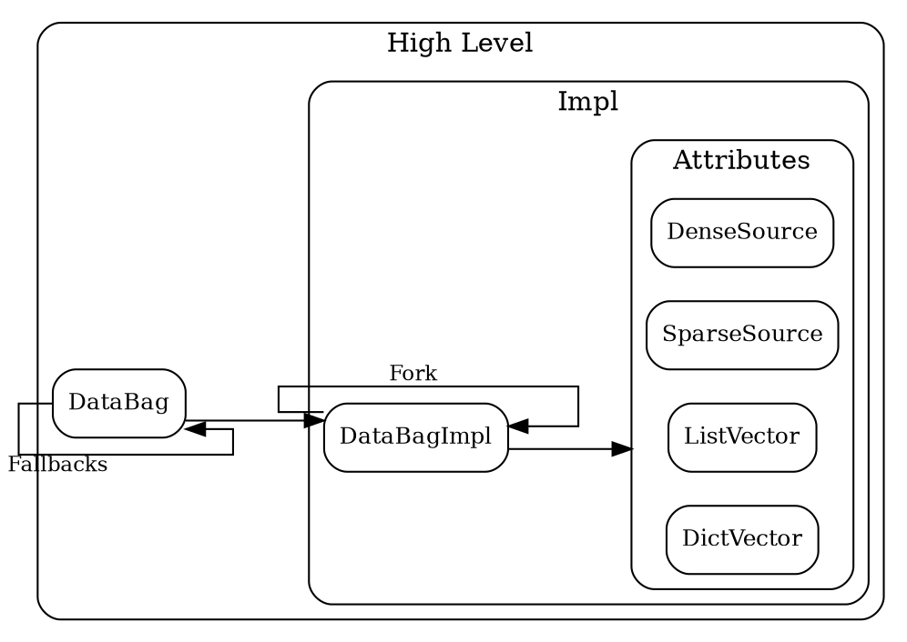
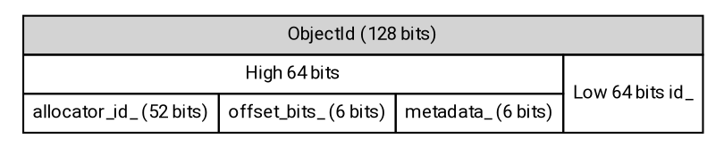

<!-- go/markdown-->

# Technical Deep Dive: DataBag

This guide offers a deep dive into `DataBag` and is part of a
[Koda Technical Deep Dive](overview.md) series.

* TOC
{:toc}

## DataBag

The **DataBag** is a cornerstone of Koda's data model, providing a flexible and
efficient structure for managing collections of data. It underpins Koda's
ability to handle complex, evolving, and heterogeneous datasets.

Conceptually, all structured data in Koda is stored as a collection of
`Entity.Attribute=>Value` mapping triples within DataBags. This
[Entity-Attribute-Value](https://en.wikipedia.org/wiki/Entity%E2%80%93attribute%E2%80%93value_model)
(EAV) like model offers significant flexibility. DataBags are the containers for
these triples.

The motivation and design of DataBags is driven by the need to:

*   **Enable Efficient Modifications**: Support efficient, often `O(1)`, updates
    and modifications, minimizing data duplication.
*   **Support Immutability**: Allow the creation of multiple data versions with
    minimal memory overhead, crucial for interactive "what-if" experiments and
    safe concurrent operations.
*   **Facilitate Composition**: Enable complex data manipulations by layering
    and combining DataBags. For example, we can use this to "join" the data of
    DataBags from multiple sources.

### Relation to DataSlices

A [DataSlice](data_slice.md) is a collection of items with a
[jagged shape](jagged_shape.md) and a [schema](schema.md). Whenever a DataSlice
contains items that are not primitives, it will by itself store only the ItemIds
of the items. An associated DataBag will then manage the information about the
items and their schemas. As such, a DataSlice of ItemIds acts as a view of the
DataBag by referencing relevant parts of the data. Most operations on such
DataSlices, such as attribute accesses and similar, are performed by operating
on the data in the associated DataBag that corresponds to the ItemIds the
DataSlice contains.

As an example (that we'll return to throughout the text), let's consider the
task of creating an Entity and subsequent attribute access:

```py
entity = kd.new(a=1)

entity.get_itemid()
# DataItem(Entity:$000YvjvpWRvwDc0G6mgFXn, schema: ITEMID)

entity.get_schema()
# DataItem(ENTITY(a=INT32), schema: SCHEMA)
entity.get_schema().get_itemid()
# DataItem(Schema:$7IsikvOHuOT4cICNBxM63e, schema: ITEMID)

entity.get_bag()
# DataBag $c22e:
#   1 Entities/Objects with 1 values in 1 attrs
#   0 non empty Lists with 0 items
#   0 non empty Dicts with 0 key/value entries
#   1 schemas with 1 values
#
# Top attrs:
#   a: 1 values

entity.get_bag().contents_repr()
# DataBag $c22e:
# $000YvjvpWRvwDc0G6mgFXn.a => 1
#
# SchemaBag:
# $7IsikvOHuOT4cICNBxM63e.a => INT32
```

In the call to [`kd.new`](/koladata/g3doc/api_reference.md#kd.new),
an ItemId is created to identify the Entity by *dynamically allocating* a unique
identifier. A second ItemId is created to identify the Schema in a similar
fashion. To help with organization and subsequent operations, the identifiers
are additionally marked as being an Entity ID and a Schema ID. Two EAV triples
are created:

*   `Entity:$000YvjvpWRvwDc0G6mgFXn.a => 1`: representing the data of the
    Entity.
*   `Schema:$7IsikvOHuOT4cICNBxM63e.a => INT32`: representing the schema of the
    Entity.

These are subsequently stored in a newly created DataBag. `kd.new` creates a
scalar DataSlice, known as a DataItem, holding the raw ItemId
`Entity:$000YvjvpWRvwDc0G6mgFXn` as value and `Schema:$7IsikvOHuOT4cICNBxM63e`
as its [schema](schema.md), and attaches the DataBag to the DataSlice, thereby
associating these IDs with the newly created data.

To compute the output of `entity.a`, we retrieve the value of the EAV triple
keyed by `$000YvjvpWRvwDc0G6mgFXn.a => 1` and the schema keyed by
`$7IsikvOHuOT4cICNBxM63e.a => INT32`. This forms the final result:

```py
entity.a
# DataItem(1, schema: INT32)
```

This example showcases the relation between DataSlices and DataBags in a
simplified manner. The following sections delves deeper into the DataBag
internals, where we later return to the attribute fetching example and showcase
what is happening in more detail.

### DataBag Internals

The implementation consists of a high-level DataBag and a low-level DataBagImpl.
The DataBag is the user-facing API, holding a reference to a DataBagImpl and a
list of "fallback" DataBags. The DataBagImpl is responsible for most of the
logic related to modifications, lookups and more, and internally consists of a
collection of data sources storing the actual data.



The diagram above showcases the internal structure. Below, we explain both high
level concepts, such as fallbacks, and low level concepts, such as DataBagImpl
and attribute sources.

#### High Level Concepts

##### Fallbacks

A DataBag may have a list of ordered references to other DataBags to be used as
"fallbacks" with supplementary data. The total content of a DataBag is, from a
user perspective, the union of the data stored in the DataBagImpl and the data
of all fallbacks. In case of conflicting EAV triples, the DataBagImpl has the
highest precedence, followed by the fallback DataBags in order.

The concept of fallbacks allows for efficient composition of data, which is
especially important when working with immutable DataBags. This is useful for
workflows where new data is added, data from different sources are combined, and
more.

#### Low Level Concepts

The low level concepts exist in Koda's internal code for data management, which
is implemented in C++.

##### ObjectIds

At the heart of Koda's internal data management are `ObjectId`s: the C++
structure representing ItemIds. `ObjectId`s are used to uniquely identify and
manage non-primitive items like Entities, Lists and Dicts. They can be
dynamically allocated, or created as UUIDs based on data. These IDs are used as
the "Entity" in the EAV model, and are themselves stored in DataSlices.

An `ObjectId` is a 128-bit identifier. It consists of an `AllocationId` and an
`Offset`. It's structured as follows to efficiently pack information:



*   **Bit Structure**:

    *   **`allocator_id_` (52 bits)**: For dynamically allocated ids, this is a
        machine/process-specific ID assigned randomly at process start.
    *   **`offset_bits_` (6 bits)**: Encodes the number of bits in the `id_`
        field used for the offset, which determines the allocation capacity
        (`2**offset_bits`, so the allocation capacity can be at most 64 bits).
    *   **`metadata_` (6 bits)**: Embedded flags for the object's type (List,
        Dict, Schema), whether it's a UUID, and schema characteristics
        (implicit/explicit).
    *   **`id_` (64 bits)**: For dynamically allocated ids, this contains a
        thread-specific ID and the object's offset within the allocation. For
        all ids, the lowest `offset_bits_` bits represent the offset of the
        actual value within the allocation.

The `AllocationId` consists of all bits except for the last `offset_bits_` bits
in the `ObjectId`. This allows objects created together to be identified and
grouped together under a common well-defined identifier. Conversely, the
`Offset` are the last `offset_bits_` bits of `id_`, specifying the exact
location within the allocation. This combination creates an identifier unique
across processes and machines. In the case of dynamically allocated ids, this
setup has a low probability of cross-machine collision and guaranteed no
collisions within a single process.

The `AllocationId`, which is embedded within the `ObjectId`, is used to identify
the data structure where the actual value is stored. The `ObjectId` design
allows operations like checking if an object belongs to an allocation
(`AllocationId::Contains(object_id)`) and retrieving an object by its offset
(`AllocationId::ObjectByOffset(offset)`) to be fast, with all information that
is required for such operations being contained within the ID itself.

To reduce the cost of dereferencing `ObjectId`s, commonly accessed metadata is
embedded directly within the `ObjectId` and `AllocationId`. This includes the
object's built-in type (List, Dict, Schema, etc.) and schema details (implicit,
explicit, etc.).

###### Example: Dynamically Allocating an ObjectId

We return to the `kd.new(a=1)` example to shed some light on the dynamic ItemId
creation step. To embed an EAV triple for the data in the DataBag, an `ObjectId`
is created to identify the Entity.

The `AllocationId` is created:

*   `allocator_id_`: this is static and computed at process start.
*   `offset_bits_`: the smallest possible value is used such that
    `required_capacity <= 2**offset_bits_`. In this case, a single Entity is
    created and the `required_capacity=1` meaning `offset_bits_=0`.
*   `metadata_`: information such as it being an Entity is embedded into the id.
*   `id_`: a dynamic thread-specific unique ID is obtained that is
    up to `64-offset_bits_` long.

The `Offset` is created:

*   The `Offset` has length `offset_bits_` containing the actual offset within
    the allocation. In this case, since `offset_bits_=0`, nothing is created
    (because there are zero offset bits).

In case several Entities were created as a group, they would share the
`AllocationId` and have unique `Offsets`.

These are combined to form the final `ObjectId`, uniquely identifying the Entity
within the DataBag.

###### Universally-Unique IDs (UUIDs)

Koda also supports deterministically created `ObjectId`s known as UUIDs. These
are generated from information provided by the user instead of being dynamically
allocated. A bit in the `metadata_` bits separates them from the allocated
`ObjectIds` which prevents collisions.

For the example `kd.new(a=1)`, consider instead `kd.uu(a=1)` which creates a
corresponding UU Entity:

1.  A 128-bit fingerprint is computed from the provided fields `a=1`. This
    fingerprint is assumed to have well distributed bits.
2.  The metadata bit specifying that the `ObjectId` is a UUID is set to 1.
3.  The `offset_bits_` is set to 0.

##### Storage Mechanisms

In practice, Koda is not implemented as `Entity.Attribute=>Value` triples, but
rather a nested `Attribute=>(Entity=>Value)` map with various performance
optimizations. To house the data, Koda employs a hybrid storage strategy within
DataBags to efficiently handle both dense and sparse data, primarily through
"DenseSources" and "SparseSources". These sources conceptually store the
`Entity=>Value` mapping for a single attribute.

*   **Dense Sources**: Used for large table-like data where many objects are
    created together and share an `AllocationId`. The `ObjectId`'s
    `AllocationId` part maps to an array space (each `DenseSource` being unique
    to this `AllocationId`), and the `Offset` part acts as a direct index into
    the arrays. The underlying implementation of a `DenseSource` varies
    depending on the demands of the data. For example, it can be implemented as
    a `TypedDenseSource`, optimized for single-type attributes, or a
    `MultitypeDenseSource`, handling mixed types within the attribute. The
    actual values within a `DenseSource` are conceptually an array of
    `DataItem`s, but are stored in optimized formats, often leveraging
    `DenseArray` or similar block-based representations.
*   **Sparse Sources**: Used for individual objects or very small groups.
    Internally, this is represented as an `absl::flat_hash_map` mapping
    `ObjectId` to `DataItem`. This representation is more memory-efficient for
    sparse and irregular data compared to `DenseSource`. `SparseSource` are used
    both in the case of specific `AllocationIds` (same as with `DenseSource`) or
    when the `IsSmallAlloc()` metadata bit of the `ObjectId` is true, for which
    there exists a DataBag-wide `SparseSource` to perform the lookup. In case of
    `IsSmallAlloc()`, the `SparseSource` is therefore *not* unique to a single
    `AllocationId`.

These sources are often used in a dual approach in the form of a
SourceCollection, where some data is stored in a `SparseSource` and the
remaining data is stored in a `DenseSource`. For example, a `DenseSource` can
represent the initial state of the data, and if it's not modifiable, then small
and targeted modifications can be represented in a `SparseSource` that has
precedence during lookups.

###### Lists and Dicts

Unlike regular attributes, List and Dict contents are not stored directly in a
`DenseSource` or a `SparseSource`. The data is instead stored in separate
`DataListVector`s and `DictVectors`, keyed by `AllocationId`. Operations like
`GetFromList` or `SetInDict` are dispatched to dedicated implementations that
manage these collections. Since information about an `ObjectId` representing a
List or Dict is embedded within the `ObjectId` itself, this doesn't require any
data lookup.

###### Removed Values

Both `DenseSource` and `SparseSource` distinguish between a value that was never
set and one that was explicitly removed. This distinction is crucial for
fallbacks. An explicitly removed value stops the lookup. A never set (missing)
value allows the lookup to continue to fallback DataBags.

*   In `SparseSource`, a removed value is represented by a present key with an
    empty `DataItem` as its value.
*   In `DenseSource`, this is implementation specific, but generally managed by
    a separate bitmap indicating the status of each index as present, removed or
    never set.

##### Forks

To support simulating modifications on immutable DataBags and to allow for
layered updates without affecting the original DataBag, Koda supports DataBag
forks. This effectively allows DataBags to be
[partially persistent](https://en.wikipedia.org/wiki/Persistent_data_structure)
with subsequent modifications to the fork not affecting the original bag and
without unnecessary copying of data.

This is implemented through "parent" DataBags, coupled with copy-on-write of
associated data sources. When a DataBag is forked, it creates a new empty bag
and sets the original bag as an immutable "parent" reference. Depending on the
data source, data may be copied from the parent to the child when modifications
take place. The overall contents of a DataBag is therefore the collection of
content from its own data sources together with the contents of its parent.
Since the parent may itself have a parent, this forms a chain of DataBags that
need to be considered.

#### Example: Attribute Lookup

With this information in mind, we return to the `entity = kd.new(a=1)` example,
this time focusing specifically on the attribute lookup `entity.a`. Here are the
required steps (in practice, there is a host of optimizations and special cases
to consider, so this is a simplification):

1.  **Retrieve the AllocationId**: The `AllocationId` embedded in the `ObjectId`
    of `entity` is retrieved. This determines subsequent actions.
2.  **For Small Allocations**: If the `AllocationId` is marked as a "small"
    allocation, the DataBag-wide `SparseSource` associated with the attribute
    `a` is retrieved.
    *   The `SparseSource` checks its internal `absl::flat_hash_map<ObjectId,
        DataItem>` for the object id.
    *   If found:
        *   If the value is an empty `DataItem`, the attribute is explicitly
            removed. Return "missing" and stop.
        *   Otherwise, return the `DataItem` value.
    *   If not found, continue with step 4.
3.  **For Large Allocations**: If the `AllocationId` is marked as a "large"
    allocation, the `SourceCollection` associated with the `<attribute,
    AllocationId>` is retrieved.
    *   The `SparseSource` (if one exists) is checked as above.
    *   If not found, the `DenseSource` is checked.
        *   Use the `Offset` to get the index into the `DenseSource`'s internal
            array storage.
        *   Check the presence/removed status for this Offset.
        *   If explicitly removed, return "missing" and stop.
        *   If present, return the value.
        *   If never set, continue with step 4.
4.  **Parent bags**: If the value is not yet found (or explicitly removed),
    steps 2 and 3 are repeated for the chain of parent bags (if one exists).
5.  **Fallback bags**: If the value is not yet found (or explicitly removed),
    steps 2-4 are repeated for the chain of fallbacks (if such exist).
6.  **Truly missing**: If not found in any bag, the attribute is truly missing
    for this `ObjectId`. Return `missing`.

For our `entity = kd.new(a=1)` example, the lookup `entity.a` would likely
involve doing only steps 1 and 2, because it will use a small allocation and the
attribute will be found immediately in the `SparseSource`.

### Manipulating DataBags

Updates to data within DataBags in an immutable workflow is typically done by
creating new bags containing only the changes, which are then combined through
fallbacks. API examples enabling of such modifications include:

*   [`kd.attrs(ds, **attributes)`](/koladata/g3doc/api_reference.md#kd.core.attrs):
    Creates a new DataBag representing the specified attribute updates for an
    object.
*   [`kd.updated(ds, *bags)`](/koladata/g3doc/api_reference.md#kd.core.updated):
    Returns a new DataSlice reflecting the application of one or more update
    bags to the original DataSlice's bag.
*   [`kd.with_attrs(ds, **attributes)`](/koladata/g3doc/api_reference.md#kd.core.with_attrs):
    A convenience method, equivalent to `kd.updated(ds, kd.attrs(ds,
    **attributes))`.
*   [`kd.with_merged_bag(ds)`](/koladata/g3doc/api_reference.md#kd.core.with_merged_bag):
    merges all fallbacks into a single DataBag. This can improve lookup
    performance which otherwise degrades with long fallback chains.

In mutable workflows, modifications can be done directly to the DataBag, or by
first forking an immutable DataBag. This is often times more efficient compared
to the layered updates that fallbacks offer. The downsides are that mutable code
cannot be [traced](/koladata/g3doc/deep_dive/functors.md#tracing),
and it can be more difficult to debug code that uses mutable data structures.
