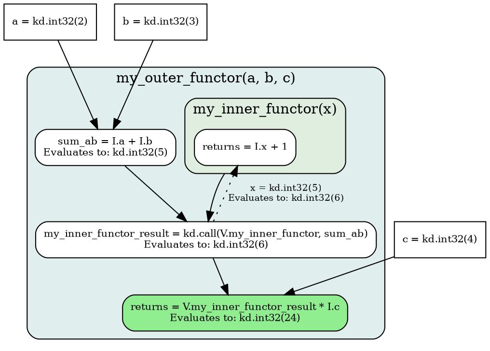

<!-- go/markdown-->

# Technical Deep Dive: Deferred Evaluation, Tracing, and Functors

This guide offers a deep dive into Deferred Evaluation, Tracing and Functors and
is part of a [Koda Technical Deep Dive](overview.md) series.

* TOC
{:toc}

## Deferred Evaluation, Tracing, and Functors

Koda supports both eager computation, where operations are performed
immediately, and deferred evaluation, where the definition of computations is
separated from their execution.

Eager computations evaluate Python code with real (materialized) inputs such as
DataSlices. Koda *operators* are immediately evaluated to produce real outputs
such as a DataSlice.

Deferred evaluation (or "lazy" evaluation as it is often referred to) is done
through the creation of computational graphs, called *Expressions*, that can be
stored and evaluated at a later point on real inputs. Deferred evaluation in
Koda is primarily realized through *tracing* Python code to produce *Functors*
that encapsulates one or more Expressions. This paradigm offers several
advantages, including the separation of computation logic from its evaluation
context, the potential for computation graph optimization, and facilitation of
parallel/distributed execution and production serving.

Typically, Koda operates in eager mode by default. Tracing is primarily done
when a Python function is passed to `kd.fn` for conversion into a Functor. The
following sections discuss these topics in detail, beginning with Expressions
and followed by Functors: creation and evaluation.

### Expressions and Operators

Koda's deferred evaluation mechanisms are implemented atop Arolla, a framework
designed for the creation, manipulation, and evaluation of Expressions, which
are directed and acyclic computation graphs.

#### Operators

A key part of Expressions are operators. Most Koda operators have two versions:
an eager version in `kd.eager.*` and a lazy version in `kd.lazy.*`.

Eager operators perform computations immediately upon invocation, returning a
concrete `DataSlice`, `DataBag` or similar. In contrast, lazy operators do not
execute immediately. Instead, they construct an Expression for deferred
execution.

Note: in most cases, an eager Koda operator is simply a convenience wrapper that
immediately triggers evaluation of a corresponding lazy operator.

You can explicitly refer to the eager/lazy version of an operator by spelling it
out, e.g. by using `kd.eager.flatten` or `kd.lazy.flatten` in your code. The
more common workflow is however to use the `kd.*` container, e.g. by using
`kd.flatten`, which dispatches to the eager or lazy versions depending on if
code is being traced or eagerly executed.

There are three main types of operators:

1.  *Backend operator*: An operator stub backed by a linked C++ implementation
    of the same name. Created through `kd.optools.as_backend_operator`.
1.  *Py-function operator*: Wraps a Python function that is invoked upon
    evaluation. Created through `kd.optools.as_py_function_operator`.
1.  *Lambda operator*: A high-level operator composed of a collection of other
    operators. Created through `kd.optools.as_lambda_operator`.

You can add an operator by name in a global registry by calling
`kd.optools.add_to_registry`.

See [Creating Koda Operators](/koladata/g3doc/creating_operators.md)
for a detailed guide on how to define operators.

#### QTypes and Koda Schemas

An Arolla QType is a static type identifier used by the Arolla framework. QTypes
play a crucial role in static type checking of expressions and in dispatching
operations to their correct C++ implementations. Each node in an Expression has
an associated output QType, which is determined by the operator at that node and
the QTypes of its inputs. This QType information is propagated through the
expression graph, enabling static analysis and ensuring type consistency before
evaluation.

A clear distinction must be made between Arolla's QTypes and Koda's Schemas:

*   *Arolla QTypes*: These are **static** types integral to the Arolla
    framework. They are employed for type checking during the construction and
    compilation of expressions and for dispatching operations to their
    appropriate C++ implementations during compilation. Examples include
    `arolla.INT32`, `arolla.FLOAT32`, as well as Koda-specific QTypes like
    `kd.types.qtypes.DATA_SLICE` and `koladata.types.qtypes.DATA_BAG`.
*   *Koda Schemas*: These describe the **runtime** structure and content type of
    a `DataSlice`. Examples include primitive schemas like `kd.INT32` or
    `kd.STRING`, special schemas like `kd.OBJECT`, or structured entity schemas
    defined via `kd.named_schema('MyEntity', ...)`. Koda Schemas govern
    attribute lookup, data validation, and type promotion rules during
    operations.

A fundamental aspect of Koda's architecture is that the specific Koda Schema of
a `DataSlice` (e.g. whether it holds `INT32` values, `STRING` values, or
represents an entity with particular attributes) is *not* encoded within its
QType. Instead, all `DataSlice` instances share the common
`kd.qtypes.DATA_SLICE` QType. Consequently, Koda Schemas and the actual data
encapsulated within `DataSlice` objects are runtime properties and are not
available during the tracing phase when the computational graph is being
constructed. In this phase, Koda operations manipulate symbolic placeholders
(e.g. `kd.I.smth`) that represent future `DataSlice`, `DataBag` and
`JaggedShape` inputs, and the Koda Schemas of these inputs are indeterminate.

An alternative design would have been to encode schema and (partial) shape
information in the `kd.qtypes.DATA_SLICE` QType. For example, knowing at tracing
time that the QType of `ds` is `DATA_SLICE[schema=Entity(x=INT32), rank=2]`
would allow tracing-time type checking and validation of the output. The
computation `kd.agg_sum(ds.x)` would be known to output
`DATA_SLICE[schema=INT32, rank=1]`, which in turn would allow us to convert many
current runtime-errors into tracing-time errors: `kd.agg_sum(ds.x) +
kd.slice('abc')` would fail during tracing. The downside of this approach is
that it removes the ability to treat schemas and shapes as *data*, which is a
core part of Koda's design and appeal. In this sense, Koda is closer to Python
than C++.

#### Expression Evaluation

During the preparation of an Expression for evaluation, which happens as a
pre-processing step right before evaluation, steps such as *literal folding* and
lambda operator *lowering* occurs. Literal folding involves replacing all nodes
whose output can be immediately computed (i.e. that do not involve deferred
inputs such as kd.I.smth) with literals that embody the output values. Lowering
involves transforming the expression by replacing higher-level lambda operators
with their underlying definitions. This is analogous to function inlining in
traditional compilers and is a key step in optimizing the computation graph for
efficient execution. The preparation process stops once there are no more
transformations to be made.

The evaluation of the prepared Expression follows a bottom-up model executed by
an evaluation backend, such as Arolla's dynamic evaluation engine:

1.  *Leaf Node Resolution*: The process commences by determining the values of
    the leaf nodes in the Expression. These leaves can be input placeholders,
    which receive their values from arguments supplied at the time of
    evaluation, or literal values embedded within the expression structure.
2.  *Progressive Operator Application*: Once the values of an operator's inputs
    (its child nodes in the Expression tree) have been resolved, the operator is
    applied to these computed values.

The evaluation proceeds upwards through the tree. The result generated by each
operator serves as an input to its parent operator, continuing until the root
node of the expression is evaluated. The value of the root node constitutes the
final result of the expression evaluation, which is often time a single
DataSlice.

**Example of Expression Evaluation:**

Consider an Expression representing the computation `(I.a + I.b) * I.c`:

```
    *
   / \
  +   I.c
 / \
I.a I.b
```

If this expression is evaluated with `a = kd.int32(2)`, `b = kd.int32(3)`, and
`c = kd.int32(4)`:

1.  The input nodes `I.a`, `I.b`, and `I.c` are resolved to their respective
    `DataItem` values: `2`, `3`, and `4`.
2.  The `+` operator (resolved to `kd.add`), with its inputs `I.a` and `I.b` now
    known, is evaluated: `kd.add(kd.int32(2), kd.int32(3))` yields
    `kd.int32(5)`.
3.  The `*` operator (resolved to `kd.multiply`) at the root has its inputs
    resolved to the result of `I.a + I.b` (which is `5`) and `I.c` (which is
    `4`). The multiplication is performed: `kd.multiply(kd.int32(5),
    kd.int32(4))` results in `kd.int32(20)`. This `kd.int32(20)` is the final
    result of the expression's evaluation.

### Functors

In Koda, a *Functor* is a specialized Koda item that encapsulates a computation
graph. Functors serve as the primary mechanism for achieving deferred evaluation
in Koda.

Functors are typically created in one of three ways:

1.  From an Expression (e.g.
    [`kd.functor.expr_fn`](/koladata/g3doc/api_reference.md#kd.functor.expr_fn)).
2.  From tracing a Python callable (e.g.
    [`kd.trace_py_fn`](/koladata/g3doc/api_reference.md#kd.functor.trace_py_fn)).
    The resulting Functor will internally use one or more Expressions to
    represent the function's logic.
3.  From wrapping a Python callable (e.g.
    [`kd.py_fn`](/koladata/g3doc/api_reference.md#kd.functor.py_fn)).
    The resulting Functor will store a reference to the Python callable without
    performing tracing.

The general utility to create Functors
[`kd.fn`](/koladata/g3doc/api_reference.md#kd.functor.fn) combines
them as follows:

*   If the input is an Expression, it dispatches to `kd.functor.expr_fn`.
*   Otherwise, the input must be a Python callable, and the behavior depends on
    the value of the `use_tracing` keyword argument:
    *   If `use_tracing=True` (the default), then `kd.fn` dispatches to
        `kd.trace_py_fn`.
    *   If `use_tracing=False`, it dispatches to `kd.py_fn`.

Functors, being Koda DataItems, can be managed like other Koda data: they can be
stored as attributes within Koda entities or objects, passed as arguments to
other functions or Functors, and generally manipulated as normal objects.

#### Tracing

The conversion of a Python function into a Koda Functor through `kd.trace_py_fn`
is termed *tracing*. This process involves:

1.  Inspecting the signature of the Python function. The signature determines
    the interface of the Functor, such as the number of input arguments and
    default arguments. It also controls the tracing behavior through its
    argument type annotations. For example, arguments annotated with
    `kd.types.DataBag` are traced as DataBag. The default type if an annotation
    is missing is `kd.types.DataSlice`.
2.  Executing the Python function a single time with symbolic placeholder inputs
    inferred from the Python function's signature (e.g. `I.x`, `I.y`). These
    placeholders represent the arguments that will be supplied when the Functor
    is eventually evaluated.
3.  Koda operations encountered within the function (e.g. `kd.add`) construct
    Expressions. The standard `kd.*` operators, when invoked within a tracing
    context, typically delegate to their `kd.lazy.*` counterparts, which are
    responsible for building these Expression nodes.
4.  Native Python control flow constructs such as `if` statements and `for` or
    `while` loops are executed during the tracing phase itself. The structure of
    the generated Expression may be determined by this control flow, but the
    Python control flow operations are not directly translated into dynamic
    control flow operators within the graph. For graph-level conditional
    execution or iteration, Koda provides specific operators like
    [`kd.if_`](/koladata/g3doc/api_reference.md#kd.functor.if_),
    [`kd.for_`](/koladata/g3doc/api_reference.md#kd.functor.for_),
    and
    [`kd.while_`](/koladata/g3doc/api_reference.md#kd.functor.while_).
5.  The Expression constructed through this process becomes the functional body
    of the resulting Functor, and is stored in its `returns` attribute.
6.  If a function being traced calls another function that is decorated with
    `@kd.trace_as_fn()`, then the decorated function is separately turned into a
    Functor and stored inside the outer Functor. The outer Functor's body will
    then contain a call to the stored inner Functor. The inner Functor can
    itself have inner Functors. This arrangement enhances modularity and allows
    more structured and reusable computation graphs.

**Example of Functor tracing:**

Consider the tracing of `my_outer_functor`:

```py
@kd.trace_as_fn()
def my_inner_functor(x):
  return x + 1

@kd.fn
def my_outer_functor(a, b, c):
  sum_ab = kd.with_name(a + b, 'sum_ab')
  inner_res = my_inner_functor(sum_ab)
  return inner_res * c
```

This yields a Functor with the following (simplified) structure:

```py
Obj(
  my_inner_functor = Obj(returns=I.x + 1),
  sum_ab = I.a + I.b,
  my_inner_functor_result = kd.call(V.my_inner_functor, V.sum_ab),
  returns = V.my_inner_functor_result * I.c,
)
```

##### Unavailable Information During Tracing

Tracing operates on symbolic representations of data rather than concrete
values. The only information available at the point of tracing is QTypes, e.g.
`DATA_SLICE`, `DATA_BAG`, `JAGGED_SHAPE`. As such, certain runtime
characteristics of Koda objects are not accessible during tracing:

*   *Actual Data Values*: The specific contents of `DataSlice` inputs (e.g. the
    numerical values, strings, or complex structures) are unknown. Tracing
    utilizes placeholders that stand in for these future inputs.
*   *Koda Schemas*: Since Koda Schemas are runtime properties that describe the
    content and structure of `DataSlice` instances, they are not defined at
    tracing time. Operations that depend on the specific Koda Schema of an input
    are represented by operators that perform these schema-dependent lookups
    during the subsequent evaluation phase.
*   *Data Shape*: The specific shape of a `DataSlice` is not available, since
    the QType of a `JaggedShape` is an opaque `JAGGED_SHAPE`. Information about
    rank, size and partitions is only available at runtime.
*   *Functor Behavior*: Since a Functor is a DataItem with an opaque
    `DATA_SLICE` QType, it is not possible to encode properties such as the
    output type of the Functor into the Functor itself and have this information
    be available at tracing time. Instead, the output is assumed to be a
    `DATA_SLICE`, unless otherwise is specified through the `return_type_as`
    parameter in `kd.call`. Furthermore, functors created by `kd.py_fn`
    encapsulate a Python callable without tracing it. The behavior of calls to
    such functors is not known at tracing time, since the wrapped Python
    callables can contain arbitrary Python code whose eventual runtime behavior
    on actual inputs cannot be known in advance.

This distinction between the graph construction phase (tracing) and the graph
execution phase (evaluation with concrete data) is crucial for understanding and
effectively utilizing Koda's deferred evaluation capabilities.

#### Functor Evaluation

The evaluation of a Koda Functor is initiated when the Functor is called and
involves one or more Expression evaluations, potentially in a nested or
recursive manner.

1.  *Input Resolution (Inputs in the `I` Namespace)*: Placeholder inputs are
    materialized with the provided inputs. For example `I.a` is resolved to
    `data_slice_a`.
2.  *Evaluation of the `returns` Attribute*: Invoking a Functor (through
    `kd.call` or `__call__`) triggers the evaluation process, starting with the
    Functor's `returns` attribute. This attribute holds the primary Expression
    that defines the Functor's output computation. The Expression evaluation is
    done as previously described, with extended handling of the variables in the
    `V` namespace that reference other attributes defined within the same
    functor. These internal `V` attributes are resolved before the evaluation
    resumes. Variables representing inner functors (e.g. `V.some_inner_functor`)
    are included in extended `kd.call` expressions which result in a recursive
    Functor evaluation.

**Example of Functor Evaluation:**

We return to the `my_outer_functor` example with the following (simplified)
structure:

```py
# my_outer_functor(a, b, c):
Obj(
  my_inner_functor = Obj(returns=I.x + 1),
  sum_ab = I.a + I.b,
  my_inner_functor_result = kd.call(V.my_inner_functor, V.sum_ab),
  returns = V.my_inner_functor_result * I.c,
)
```

When `my_outer_functor(a=kd.int32(2), b=kd.int32(3), c=kd.int32(4))` is invoked:



1.  Evaluation begins with `my_outer_functor.returns`, which is
    `V.my_inner_functor_result * I.c`.
2.  To evaluate this, the values for `V.my_inner_functor_result` and `I.c` are
    required.
    *   `I.c` is resolved to `kd.int32(4)`.
    *   `V.my_inner_functor_result` is defined by the expression
        `kd.call(V.my_inner_functor, V.sum_ab)`.
3.  The expression `kd.call(V.my_inner_functor, V.sum_ab)` is evaluated:
    *   `V.my_inner_functor` is the functor `Obj(returns=I.x + 1)`.
    *   `V.sum_ab` is the Expression `I.a + I.b`. This is evaluated:
        *   `I.a` becomes `kd.int32(2)`.
        *   `I.b` becomes `kd.int32(3)`.
        *   `I.a + I.b` yields `kd.int32(2) + kd.int32(3) = kd.int32(5)`.
        *   The value of `V.sum_ab` is therefore `kd.int32(5)`.
    *   `kd.call(V.my_inner_functor, V.sum_ab)` is evaluated with the resolved
        inputs, yielding `kd.int32(6)`.
    *   The value of `V.my_inner_functor_result` is therefore `kd.int32(6)`.
4.  The main `returns` expression `V.my_inner_functor_result * I.c` becomes
    `kd.int32(6) * kd.int32(4)`, which yields `kd.int32(24)`.

The final result is `kd.int32(24)`. This recursive evaluation, where one
Functor's expression may depend on the evaluation of its internal variables or
other Functors, is central to Koda's deferred execution model, and allows for
complex logic to be represented.

#### Working with Traced Functors

Functors created via `kd.fn` offer several capabilities:

*   *Execution*: Functors can be used directly as Python callables (e.g.
    `my_functor(arg1, arg2)`) or via `kd.call(my_functor, arg1, arg2)`. This
    triggers the evaluation of their underlying Expression with the supplied
    arguments.
*   *Argument Binding*: The
    [`kd.bind`](/koladata/g3doc/api_reference.md#kd.functor.bind)
    function allows for partial application, creating a new Functor with
    specified arguments pre-filled. Note that `kd.bind` has similar behavior to
    `functools.partial` in Python where arguments bound by `kd.bind` can be
    re-bound by callers.
*   *Introspection and Manipulation*: The primary Expression of a Functor is
    accessible through its `returns` attribute (e.g. `my_functor.returns`). If
    named expressions (e.g. `x = kd.with_name(I.a + 1, 'x')`) were used during
    tracing, these become accessible as attributes of the Functor (e.g.
    `my_functor.x`). The Expression can be modified using functions such as
    [`kd.expr.sub_by_name`](/koladata/g3doc/api_reference.md#kd.expr.sub_by_name)
    or
    [`kd.expr.sub`](/koladata/g3doc/api_reference.md#kd.expr.sub).
*   *Modularity via `@kd.trace_as_fn`*: Applying the `@kd.trace_as_fn()`
    decorator to a Python function alters its tracing behavior. When such a
    decorated function is called within another function being traced by
    `kd.fn`, it is converted into its own distinct Functor. This Functor is then
    embedded in an attribute of the outer Functor, and a call to the inner
    functor is used in the outer Functor's body, enhancing modularity.
    Specifying `@kd.trace_as_fn(functor_factory=kd.py_fn)` causes the decorated
    function to be wrapped as a `kd.py_fn` within the traced graph.

### Benefits and Limitations of Deferred Evaluation

**Benefits**:

*   *Performance*: Executing compiled Expressions can offer substantial
    performance gains over equivalent Python loops, particularly for complex
    vectorized operations on large `DataSlice` instances, due to C++-level
    execution and optimization.
*   *Optimization*: The Arolla framework can apply various optimizations to the
    expression graph prior to execution.
*   *Serialization and Serving*: Functors, as representations of Arolla graphs,
    can be serialized. This is useful for distributing computations and for
    deploying them to production serving environments.
*   *Parallelism*: Fragments of the computation graph can be evaluated in
    parallel.

**Limitations**:

*   *Debuggability*: Debugging traced code can be more complex than debugging
    standard eager Python. Errors may manifest during graph execution,
    potentially obscuring the originating Python logic. Using `kd.py_fn` or
    `kd.fn(..., use_tracing=False)`, or operators such as
    [`kd.core.with_print`](/koladata/g3doc/api_reference.md#kd.core.with_print)
    or
    [`kd.assertion.with_assertion`](/koladata/g3doc/api_reference.md#kd.assertion.with_assertion)
    can aid during the development and debugging phases.
*   *Traceable Operations*: Not all Python functions and constructs can be
    traced. The logic should primarily consist of Koda operators. For arbitrary
    Python code, `kd.py_fn` or
    [`kd.map_py`](/koladata/g3doc/api_reference.md#kd.py.map_py)
    serve as interfaces.
*   *Runtime Information Deficit*: The absence of concrete Koda Schema and data
    values during the tracing phase means that certain categories of errors
    (e.g. type mismatches based on Koda Schemas, or attempts to access
    attributes not present in a runtime schema) can only be detected at
    evaluation time, not during the tracing or graph compilation stages.

A thorough understanding of the distinction between the tracing phase (graph
construction) and the evaluation phase (graph execution with actual data) is
essential for leveraging Koda's deferred evaluation features effectively.
