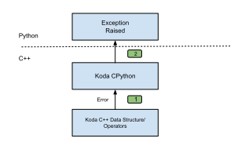

# Add user friendly error messages

<!--*
# Document freshness: For more information, see go/fresh-source.
freshness: { owner: 'wangzhan' reviewed: '2024-08-13' }
*-->

[TOC]

When Koda developers find a case where the error message is not readable,
contains a lot of internal implementation details or is not user oriented, this
document provides a way to improve it.

## Example error message

Here is an example of an improved error message.

```python
>>> obj = kd.obj(a=1)
>>> obj.with_db(kd.bag()).a
...

KodaError: object schema is missing for the DataItem whose item is: $000fd856bbfc03480000000000000001:0

  DataItem with the kd.OBJECT schema usually store its schema as an attribute or implicitly hold the type information when it's a primitive type. Perhaps, the OBJECT schema is set by mistake with
  foo.with_schema(kd.OBJECT) when 'foo' does not have stored schema attribute.
```

Because the `DataBag` is newly created and doesn't contain schema info,
accessing the attribute `a` will cause a missing schema error.

## How does it work

In Koda, most of the logic exists in C++. Python is a thin wrapper around the
C++.



When error happens,

1.  Koda C++ collects the necessary information, creates a specific error proto
    and attaches it to the `Status`. So the error can be propagated across all
    C++ call stacks. During the progatation, error message will be updated by
    `AssembleErrorMessage` when the additional context is available.

2.  In the topmost CPython layer, the
    `SetKodaPyErrFromStatus` C++
    function checks if the `Status` contains the specific error proto. If so, it
    passes the serialized proto to python side. The python counter part
    deserializes the proto, creates the `KodaError` python exception instance,
    stores the proto in the exception and returns the instance to C++. Finally
    the `SetKodaPyErrFromStatus` raises the
    `KodaError` exception in Python then
    finishes the process.

## Implementation Steps

### Check existing error categories

There's already a list of error categories in
`//koladata/internal/error.proto`

Check if the case to improve is already covered. If so, create the error proto
instance when error is happening and attaches to the `Status`.
example in `//koladata/data_slice.cc`

### Define the specific error proto type

If the error case is not listed, then create a new proto container, add the
necessary fields to the proto, create an error proto instance and attach it to
`Status`.

### Modify `AssembleErrorMessage`

Then
change `AssembleErrorMessag`, in `//koladata/repr_utils.cc`,
create a new branch to handle the category. In the `Status` propagation path,
call `AssmebleErrorMessage` to update the error message. The
`SupplementalData`
structure can be used to carry the additional context for assembling the
message.

### Add nested errors

`KodaError` also support nesting. Example:

```
>>> schema = kd.new_schema(a=schema_constants.INT32)
>>> kd.new(a='xyz', schema=schema)
...

KodaError: cannot create Item(s) with the provided schema: SCHEMA(a=INT32)

The cause is: the schema for attribute 'a' is incompatible.

Expected schema for 'a': INT32
Assigned schema for 'a': STRING

To fix this, explicitly override schema of 'a' in the original schema. For example,
schema.a = <desired_schema>
```

When updating the error message during the
`Status` propagation path, creates a new `KodaError` proto and moves the
original error proto to the `cause` field. The final `KodaError` python
exception instance will have the corresponding cause. See
`CreateItemCreationError` in `//koladata/repr_utils.cc`
and its call site.

## Current limitations and future improvement

*   The error categories in Koda v0 need to be reimplemented.

*   This error handling mechanism can only improve the error message on a case
    by case basis.

*   Errors that happen in Arolla cannot be handled.
