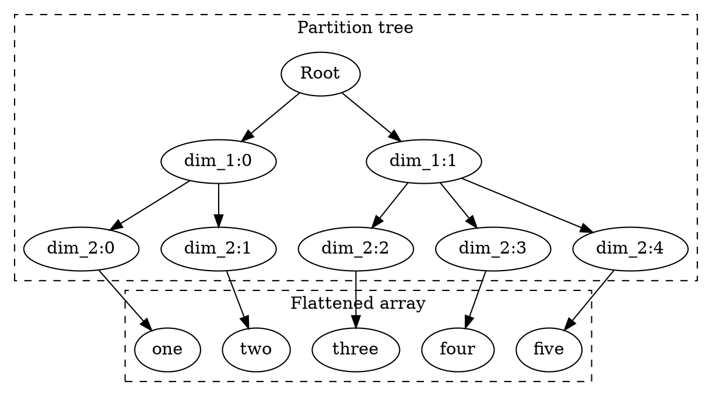

<!-- go/markdown -->

# Koda Fundamentals

go/koda-v1-fundamentals

This guide goes through fundemantals in Koda. It is highly recommended to read
through the guide in order for new users to use Koda effectively.

Also see [Koda Cheatsheet](cheatsheet.md) for quick references.

[TOC]

## Vectorization of Structured Data

Koda introduces new data structures and concepts which allow working with any
kind of structured data in a vectorized form. That is, it supports not only
working with tables, columns, tensors or arrays, but also with nested structs,
pytrees, protos and graphs.

### DataSlices

**DataSlices** are **arrays** with **partition trees** associated with them that
are stored and manipulated as **jagged arrays** (irregular multi-dimensional
arrays). Such partition trees are called **JaggedShape** and these two terms are
used interchangeably through this guide.

Elements of DataSlices are **items** which enable working with all types of data
through vectorized operations.

DataSlices are specialized to work with hierarchies (aggregation from outer to
inner layers), and **shouldn't** be compared to tensors, Numpy arrays or even
nested lists (different types of broadcasting, transformations etc.).

Primitive DataSlices contain elements of a primitive type (e.g.
ints/strings/floats). Note, in future we also plan to support DataSlices of
tensors, and tensors will be treated as primitives (i.e. similar to strings).

There can be also **DataSlices of lists**, **DataSlices of dicts** and
**DataSlices of objects** which will be discussed in the
[DataSlice of Structured Data](#structured_data) section later.

All the leaves (items) have the same depth, which is the same as the number of
dimensions of the jagged array.

For example, the following DataSlice has 2 dimensions and 5 items. The first
dimension has 2 items and the second dimension has 5 items partitioned as `[2,
3]`.

```py
kd.slice([["one", "two"], ["three", "four", "five"]]) # 2-dims
# kd.slice([1, [2, 3]]) would fail, as all the leaves must have the same depth
```

Conceptually, it can be thought as partition tree + flattened array as shown in
the graph below.



DataSlices have methods that allow working with them as with jagged arrays.

```py
# Root
# ├── dim_1:0
# │   ├── dim_2:0
# │   │   ├── dim_3:0 -> 1
# │   │   └── dim_3:1 -> 2
# │   └── dim_2:1
# │       ├── dim_3:0 -> 3
# │       ├── dim_3:1 -> 4
# │       └── dim_3:2 -> 5
# └── dim_1:1
#     ├── dim_2:0
#     │   └── dim_3:0 -> 6
#     ├── dim_2:1 (Empty)
#     └── dim_2:2
#         ├── dim_3:0 -> 7
#         ├── dim_3:1 -> 8
#         ├── dim_3:2 -> 9
#         └── dim_3:3 -> 10
ds = kd.slice([[[1, 2], [3, 4, 5]], [[6], [], [7, 8, 9, 10]]])

ds.get_size() # 10 - total array size: number of items (leaves)
ds.get_ndim() # 3
# JaggedShape: number of items (leaves) at each dimension (level)
ds.get_shape() # JaggedShape(2, [2, 3], [2, 3, 1, 0, 4])

# kd.index returns the index based on the last dimension
kd.index(ds)  # [[[0, 1], [0, 1, 2]], [[0], [], [0, 1, 2, 3]]]
# can specify which dimension to use to get index
kd.index(ds, dim=2)  # the same as above, as there are 3 dimensions
kd.index(ds, dim=0)  # [[[0, 0], [0, 0, 0]], [[1], [], [1, 1, 1, 1]]]

kd.agg_size(ds)  # [[2, 3], [1, 0, 4]] - last dimension sizes
```

DataSlices have their own set of operations to navigate them.

IMPORTANT: `ds[1][2][0]` means a very different thing for the DataSlices
compared to tensors or nested lists (it is used for working with **DataSlices of
lists** which are discussed in the
[DataSlice of Structured Data](#structured_data) section later). Use
`ds.L[1].L[2].L[0]` or `ds.S[1, 2, 0]` to achieve the same behavior.

```py
# It's possible to navigate DataSlices as "nested" lists using .L,
# which gives a "subtree", and makes DataSlices browseable as normal nested lists
ds = kd.slice([[[1, 2], [3, 4, 5]], [[6], [], [7, 8, 9, 10]]])
ds.L[1]  # [[6], [], [7, 8, 9, 10]]
ds.L[1].L[2].L[0]  # 7
len(ds.L)  # 2 - number of children/lists at the first dimension

ds = kd.slice([[1,2,3], [4,5]])
# Use .L to iterate through DataSlices as normal python nested lists
[int(y) + 1 for x in ds.L for y in x.L]  # [2, 3, 4, 5, 6]
[int(kd.sum(ds.L[i])) for i in range(len(ds.L))]  # [6, 9]

# Or use to_pylist to work with python lists of DataSlices
[int(y) + 1 for x in kd.to_pylist(ds) for y in kd.to_pylist(x)]
```

It's possible to subslice DataSlices across multiple dimensions directly using
`.S`.

```py
ds = kd.slice([[[1, 2], [3, 4, 5]], [[6], [], [7, 8, 9, 10]]])
ds.S[1, 2, 0]  # 7
kd.subslice(ds, 1, 2, 0)  # the same as above
ds.S[:, :, :]  # == ds
ds.S[1:, :, :2]  # [[[6], [], [7, 8]]]
kd.subslice(ds, slice(1, None), slice(None, None), slice(None, 2))  # the same as above
# keep only the first 2 items from the *last* dimension
ds.S[..., :2] # [[[1, 2], [3, 4]], [[6], [], [7, 8]]]
# for subslicing the last dimension can skip ...
ds.S[:2]  # the same as above
# Take the 0th item in the last dimension
ds.S[..., 0]  # [[1, 3], [6, None, 7]],
ds.S[0]  # the same as the above
ds.take(0)  # the same as the above
```

We can convert DataSlices back into Python nested lists.

```py
ds = kd.slice([[[1, 2], [3, 4, 5]], [[6], [], [7, 8, 9, 10]]])
ds.to_py()  # normal python list
kd.slice(ds.to_py())  # == ds
ds.to_py()[0][1][2]  # 5 - the same as ds.L[0].L[1].L[2].to_py()
```

### Vectorized Ops

One can manipulate DataSlice's jagged shape (i.e. partition tree) without
touching the actual array values.

```py
ds = kd.slice([[[1, 2], [3, 4, 5]], [[6], [], [7, 8, 9, 10]]])
ds.flatten()
ds.flatten(-2)  # the last two dimensions are flattened
ds.flatten(-2, 0)  # the same as above
ds.flatten(-1)  # no-op

# Use reshape_as to reshape to the shape of a DataSlice of the same size
ds1 = kd.slice([[10, 20, 30], [40, 50, 60], [70, 80, 90, 100]])
ds.reshape(ds1.get_shape())  # [[1, 2, 3], [4, 5, 6], [7, 8, 9, 10]]
ds.reshape_as(ds1)  # the same as above

# # Flatten and restore shape
ds1 = ds.flatten()
ds1.reshape_as(ds) # == ds
```

Also one can apply vectorized operations without changing the associated jagged
shape.

```py
ds = kd.slice([[[1, 2], [3, 4, 5]], [[6], [], [7, 8, 9, 10]]])
ds * 2
kd.val_like(ds, 5)  # [[[5,5], [5,5,5]], [[5]], [], [5,5,5,5]]]
kd.math.log10(ds)
kd.map_py(lambda x: x * 3, ds)
kd.sort(ds, descending=True)
kd.reverse(ds)
```

Aggregational operations reduce the number of dimensions in the partition tree.

```py
ds = kd.slice([[[1, 2], [3, 4, 5]], [[6], [], [7, 8, 9, 10]]])
kd.agg_size(ds)  # [[2, 3], [1, 0, 4]]
kd.agg_max(ds)  # [[2, 5], [6, None, 10]]
kd.agg_max(ds, ndim=2)  # [5, 10]

# can change number of dimensions to be passed into map_py
# min over the last two dimensions
kd.map_py(lambda x: min([b for a in x for b in a], default=None) if x else None,
          ds, ndim=2) # [1, 6]

# map_py can be used simply for debugging:
kd.map_py(lambda x: print(x) if x else None, ds, ndim=2)
```

**Collapse** is a convenient way to reduce the number of dimensions, and replace
them with the common value if all are the same or None.

```py
ds = kd.slice([[1, 1], [2, None, 2], [2, 3, 4]])
kd.collapse(ds)  # [1, 2, None]
kd.collapse(kd.val_like(ds, 10))  # [10, 10, 10]
kd.collapse(kd.val_like(ds, 10), ndim=2)  # 10
```

Some operations ignore the partition tree altogether.

```py
kd.min(ds)  # 1
kd.min(ds.flatten()) # the same as above
kd.agg_min(ds.flatten()) # the same as above, as flatten guarantees 1 dim slice
```

Some operations can actually add dimensions.

```py
kd.range(0, kd.slice([3, 2, 1]))  # [[0, 1, 2], [0, 1], [0]]
kd.item(1).repeat(3).repeat(4) # a simple recipe to create 3 x 4 "grid"
# can have different sizes when adding new dimensions
kd.slice([1, 2]).repeat(kd.slice([3, 2]))  # [[1, 1, 1], [2, 2]]

ds = kd.slice([[[1, 2], [3, 4, 5]], [[6], [], [7, 8, 9, 10]]])
kd.zip(ds,9)  # [[[[1, 9], [2, 9]], [[3, 9], ...
kd.zip(ds, ds * 10)  # [[[[1, 10], [2, 20]], [[3, 30], ...
kd.repeat(ds, 3)  # [[[[1, 1, 1], [2, 2, 2]], [[3, 3, 3], ...
kd.stack(ds, ds, ds)  # the same as above
kd.stack(ds, ds + 1)  # [[[[1, 2], [2, 3]], [[3, 4], ...
# can stack multiple inner dimensions at once
kd.stack(ds, ds, ndim=2)  # [[[[1, 2], [3, 4, 5]], [[1, 2], [3, 4, 5]]], ...
```

A few operations change the jagged shape without changing the number of
dimensions.

```py
ds1 = kd.slice([[1, 2], [3]])
ds2 = kd.slice([[4, 5, 6], [7, 8]])
kd.concat(ds1, ds2)  # [[1, 2, 4, 5, 6], [3, 7, 8]]
```

`kd.group_by` adds dimension after grouping items and unique keeps only unique
items. Both don't change the order, meaning unique == group_by + collapse

```py
ds = kd.slice([4, 3, 4, 2, 2, 1, 4, 1, 2])
# group
kd.group_by(ds)  # [[4, 4, 4], [3], [2, 2, 2], [1, 1]]
# group and collapse
kd.collapse(kd.group_by(ds))  # [4, 3, 2, 1]
kd.unique(ds)  # the same as above

# group by key (or keys)
ds1 = kd.slice([1, 2, 3, 4, 5, 6, 7, 8, 9])
ds2 = kd.slice([1, 2, 1, 3, 3, 4, 1, 4, 3])
kd.group_by(ds1, ds2) # [[1, 3, 7], [2], [4, 5, 9], [6, 8]]
```

`kd.translate` and `kd.translate_group` are powerful operators to map keys to
values using key=>value mapping.

```py
# TODO: more examples for kd.translate
a = kd.slice([[1, 2, 2, 1], [2, 3]])
b = kd.slice([1, 2, 3])
c = kd.slice([4, 5, 6])
kd.translate(a, b, c)  # [[4, 5, 5, 4], [5, 6]]
kd.dict(b, c)[a]  # the same as above

kd.translate(kd.slice([1, 2, 2, 1]), kd.slice([1, 3]), 1)  # [1, None, None, 1],
kd.dict(kd.slice([1, 3]), 1)[kd.slice([1, 2, 2, 1])]  # the same as above

# TODO: examples for translate_group
```

### Items

Elements of a DataSlice are **items**, where each item can be a primitive, an
entity/object with attributes, a list or a dict. To support vectorization, Koda
has native versions of primitives/entity/object/list/dict, which are made as
close to Python as possible.

Moreover, items can be seen as a special case of DataSlices (0-dim DataSlices),
and everything that accepts DataSlices works with items too.

NOTE: more types of data structures will be supported soon (tensors and sets in
particular).

Items are immutable (primitives, entities, objects, lists and dicts), but it's
possible to make them mutable for advanced workflows.

Primitive types include `kd.INT32`, `kd.INT64`, `kd.FLOAT32`, `kd.FLOAT64`,
`kd.STRING`, `kd.BYTES`, `kd.BOOLEAN` and `kd.MASK`. `kd.MASK` is a special type
representing presence which will be covered in the
[Sparsity and Logical Operators](#sparsity) section later.

There is also `kd.ITEMID` which will be covered in the
[ItemIds, UUIDs and Hashes](#itemid) section later too.

Use `kd.item`, `kd.from_py` or `kd.new` to create primitive items. `kd.item`
takes mostly primitives while `kd.new` and `kd.from_py` are more powerful but
also accept primitives.

```py
kd.item(123)  # kd.INT32
kd.int32(123) # the same as above
kd.new(123)  # the same as above
kd.item("hello world")  # kd.STRING
kd.str("hello world") # the same as above
kd.new("hello world")  # the same as above

kd.from_py("hello world")  # kd.STRING
kd.to_py(kd.item(123))  # python's int
kd.item(123).to_py()  # the same as above
int(kd.item(123))  # the same as above
str(kd.item("hello"))  # python's string
kd.present  # Koda's "True", or mask value indicating a 'present' item
kd.missing  # Koda's "False", or mask value indicating a 'missing' item
kd.item(5) > 3  # kd.present - Koda's True
~(kd.item(5) > 3)  # kd.missing - Koda's False
kd.item(None)  # missing item with none schema/dtype

kd.is_primitive(kd.item(123))  # yes
```

Items are also considered to be 0-dim DataSlices.

```py
kd.is_slice(kd.item(1))  # true
kd.is_item(kd.slice([1, 2, 3, 4]))  # false
kd.item(1).get_ndim()  # 0
kd.item(1).get_shape()  # empty shape

# .flatten() - universal convertor into 1-dim slices
kd.item(1).flatten()  # [1]

kd.stack(kd.item(1), kd.item(2), kd.item(3))  # [1, 2, 3]
kd.item(1).repeat(2).repeat(3)  # [[1, 1, 1], [1, 1, 1]]
kd.item(1).reshape_as(kd.slice([[[8]]]))  # [[[1]]]
```

Lists, similar to python, represent "lists" (not slices!) of items:

```py
# Create lists
a = kd.list([1, 2, 3, 4])  # List[1, 2, 3, 4]
a = kd.from_py([1, 2, 3, 4])  # the same as above
kd.is_primitive(a)  # no
kd.is_list(a)  # yes

# Create nested lists
kd.list([[1, 2, 3, 4], [5, 6, 7, 8]])  # List[[1, 2, 3, 4], [5, 6, 7, 8]]
kd.from_py([[1, 2, 3, 4], [5, 6, 7, 8]])  # the same as above

# Convert back to python
kd.list([1, 2, 3, 4]).to_py()  # back to python list

# Check with lists
a.list_size()
a.is_list() # works for non-list items too

# Access lists
a = kd.list([1, 2, 3, 4])
a[2]
kd.get_item(a, 2)  # the same as above
a = kd.list([[1, 2, 3, 4], [5, 6, 7, 8]])
a[1][2]

# Iterate in python (lists or nested lists)
a = kd.list([[1, 2, 3, 4], [5, 6, 7, 8]])
[int(t) for b in a for t in b]

# Convert the last dimension into a list
kd.implode(kd.slice([1, 2, 3, 4]))  # == kd.list([1, 2, 3, 4])
# For a DataSlice with multiple dimensions, need to apply kd.implode multiple times
a = ([[1, 2, 3, 4], [5, 6, 7, 8]])
kd.implode(kd.implode(kd.slice(a)))  # == kd.list(a)
# Or use kd.implode(a, ndim=-1)
kd.implode(kd.slice(a), ndim=-1)  # the same as above
```

IMPORTANT: slicing operators over lists (e.g. a[1:]) do not return lists, but
DataSlices with plus-one dimension (explosion operation which is discussed in
the [DataSlice of Structured Data](#structured_data) section later).

Lists can be also looked up with python lists or slices. Use kd.implode to
convert slices (their last dimension) back into lists.

```py
a = kd.list([1, 2, 3, 4])
a[:]  # 1-dim slice: kd.slice([1, 2, 3, 4])
a[1:]  # 1-dim slice: kd.slice([2, 3, 4])
a[[1, 3]]  # 1-dim slice: kd.slice([2, 4])
a[kd.slice([1, 3])]  # the same as above
a[kd.range(2)]  # the same as a[:2]
a.select_items(lambda x: x>=2)  # kd.slice([2, 3, 4])

kd.implode(a[:])  # == a
kd.implode(a[1:])  # == kd.list([2,3,4])
```

Lists are immutable by default, and need to be recreated to append/extend.

```py
x = kd.list([1, 2, 3, 4])
y = kd.list([5, 6, 7, 8])
kd.concat_lists(x, y)  # == kd.list([1, 2, 3, 4, 5, 6, 7, 8])
kd.implode(kd.concat(x[:], y[:]))  # the same as above

# append, by creating a new list with one item
z = 5
kd.concat_lists(x, kd.implode(kd.item(z).repeat(1)))
kd.implode(kd.concat(x[:], kd.item(z).repeat(1)))  # the same as above

x = kd.obj(y=kd.list([1, 2, 3, 4]), z=kd.list([5, 6, 7, 8]), u=4)
x = x.with_attrs(a=kd.concat_lists(x.y, x.z))
x = x.with_attrs(b=kd.concat_lists(x.y, kd.list([x.u])))  # append one value
# x = x.with_attrs(b=kd.appended_list(x.a, x.u))  # the same as above
```

Dicts can be created in a way similar to lists, and are immutable by default.

```py
# Multiple ways to achieve the same
d = kd.dict({'a':1, 'b':2, 'c':4})
d = kd.from_py({'a':1, 'b':2, 'c':4})
kd.is_primitive(d)  # no
kd.is_dict(d)  # yes

kd.dict(kd.slice(['a', 'b', 'c']), kd.slice([1, 2, 4]))
kd.dict({'a':1, 'b':2}).with_dict_update('c', 4)
kd.dict().with_dict_update(kd.dict({'a':1, 'b':2, 'c':4}))
kd.dict({'a':1}).with_dict_update(kd.slice(['b', 'c']), kd.slice([2, 4]))

# dict updates can be created separately and applied later
d = kd.dict({'a':1})
upd1 = kd.dict_update(d, 'b', 2)  # need to specify d
upd2 = kd.dict_update(d, 'c', 4)
d.updated(upd1, upd2)  # == kd.dict({'a':1, 'b':2, 'c':4})

upd = kd.dict_update(d, kd.dict({'b':2, 'c':4}))
d.updated(upd)
```

Dicts can be looked up and have `get_keys()` and corresponding `get_values()`,
with `my_dict[:]` a shortcut for `my_dict.get_values()`.

NOTE: the keys are not guaranteed to be sorted!

```py
d = kd.dict({'a':1, 'b':2, 'c':4})
kd.dict_size(d)  # 3
d['b']  # 2
kd.get_item(d, 'b')  # the same as above
d[['a', 'c']]  # 1-dim slice kd.slice([1,4])
d[kd.slice(['a' , 'c'])]  # the same as above
# get_keys() can be used to get the keys, but the order is non-deterministic
d.get_keys()  # 1-dim slice kd.slice(['a', 'c', 'b']) or other permutation
kd.sort(d.get_keys())  # kd.slice(['a', 'b', 'c'])
d.select_keys(lambda x: x>='b')  # ['b', 'c']
d.get_values()  # 1-dim slice kd.slice([1, 4, 2])
d[d.get_keys()]  # the same as above
d.select_values(lambda x: x<=2)  # [1, 2]
kd.dict(d.get_keys(), d.get_values())  # == d
# zip key, value in sorted order
# output: [['a', 1], ['b', 2], ['c', 4]]
kd.zip(kd.sort(d.get_keys()), kd.sort(d.get_values(), d.get_keys()))
kd.zip(keys:=kd.sort(d.get_keys()), d[keys]) # the same as above

# Check if item is a dict
d.is_dict()

# Iterate in python (need to convert get_keys slice into list)
[int(d[key]) for key in kd.implode(d.get_keys())]
# The same
[int(d[key]) for key in d.get_keys().L]
```

It's possible to create and work with structured objects called **entities**.
Entities have schemas, which can be distinguished by name, auto-allocated or
explicitly created. When creating or working with DataSlices of entities, all
entities must have the same schema.

```py
kd.new(x=1, y=2, schema='Point')  # Entity(x=1, y=2)
r = kd.new(x=1, y=2, z=kd.new(a=3, b=4, schema='Data'), schema='PointWithData')  # nested Entity
r.z.a  # 3

# kd.new can also auto-allocate schemas
kd.new(x=1, y=2, schema='Point') == kd.new(x=1, y=2, schema='Point')  # yes
kd.new(x=1, y=2).get_schema() == kd.new(x=1, y=2).get_schema()  # no

# Schemas can also be created explicitly.
# kd.named_schema('Point') creates exactly the same schemas as the one created
# by schema='Point'
my_schema = kd.named_schema('Point')
kd.new(x=1, y=2, schema=my_schema)  # set explicit schema
kd.new(x=1, y=2, schema='Point').get_schema() == kd.new(x=1, y=2, schema=my_schema).get_schema()  # yes

# kd.slice([kd.new(x=1, y=2), kd.new(x=2, y=3)]) # fails, as entities have different scheams
kd.slice([kd.new(x=1, y=2, schema=my_schema), kd.new(x=2, y=3, schema=my_schema)]) # works
kd.slice([kd.new(x=1, y=2, schema='Point'), kd.new(x=2, y=3, schema='Point')]) # works

a, b = kd.new(x=1, y=2), kd.new(x=2, y=3)
# kd.slice([a, b]) # fails, as entities have different scheams
kd.slice([a.with_schema(my_schema), b.with_schema(my_schema)])  # works
kd.slice([a, b.with_schema(a.get_schema())])  # works
kd.slice([kd.cast_to(a, my_schema), kd.cast_to(b, my_schema)])  # works
kd.slice([a, kd.cast_to(b, a.get_schema())])  # works
```

Entities are immutable, and have special APIs to modify attributes (including
deep ones).

NOTE: Entities created using `kd.new_xxx` methods are mutable now as we are
migrating from Koda v0 to v1. Once it is fully migrated, they will be switched
to immutable.

```py
r = kd.new(x=1, y=2, schema='Point')

# Use with_attrs to create a version with updated attributes
r.with_attrs(z=4, y=10)  # Entity(x=1, y=10, z=4)
# Alternatively, use updated + kd.attrs, which allows also mixing multiple updates
r.updated(kd.attrs(r, z=4, y=10)) # the same above
# Or can do multiple updates
r.updated(kd.attrs(r, z=4)).updated(kd.attrs(r, y=10))
r.updated(kd.attrs(r, z=4), kd.attrs(r, y=10))

# kd.attrs makes it possible to update attributes of nested entities.
r = kd.new(x=1, y=2, z=kd.new(a=3, b=4, schema='Data'), schema='PointWithData')
r.updated(kd.attrs(r.z, a=30, c=50))  # Entity(x=1, y=2, z=Entity(a=30, b=4, c=50))
r.with_attrs(z=r.z.with_attrs(a=30, c=50))  # the same as above, but less efficient

# In case your attribute names are arbitrary strings and not nice Python identifiers, you
# can use kd.attr/kd.with_attr instead.
r.with_attr('@!^', 7).get_attr('@!^')  # == 7
```

You need to clone or deep-clone entities in order to create copies with
different attributes (similar to working with python objects).

```py
# entities have ids ("pointers"), which stay the same
a = kd.new(x=1, y=2, schema='Point')
r = kd.new(u=a, v=a, schema='Pair')
r = r.updated(kd.attrs(r.u, x=10))  # both r.u.x == r.v.x == 10, as r.u == r.v
r = r.updated(kd.attrs(a, y=5))  # now r.u.x == r.v.y == 5, as r.u == r.v == a

# use clone to duplicate entities, but keep attributes
a = kd.new(x=1, y=2, schema='Point')
r = kd.new(u=a.clone(), v=a.clone(), schema='Pair')
r = r.updated(kd.attrs(r.u, x=10))  # r.u.x == 10, and r.v.x == 2 (not changed)
r = r.updated(kd.attrs(a, x=10))  # nothing would be updated, as a != r.u != r.v

# clone is not enough to go deep
a = kd.new(x=kd.obj(m=3, n=4), y=2, schema='ComplexPoint')
r = kd.new(u=a.clone(), v=a.clone(), schema='ComplexPair')
r = r.updated(kd.attrs(r.u.x, m=50))  # changes also r.v.x.m, as a.x wasn't cloned

# deep_clone clones entities recursively
a = kd.new(x=kd.obj(m=3, n=4), y=2, schema='ComplexPoint')
r = kd.new(u=a.deep_clone(), v=a.deep_clone(), schema='ComplexPair')
r = r.updated(kd.attrs(r.u.x, m=50))  # Now r.v.x.m is not changed
```

Entities can have lists and dicts as their attributes, which can be updated.

```py
r = kd.new(x=kd.list([1,2]), y=kd.dict({'a':1, 'b':2}), schema='Custom1')
r = r.updated(kd.attrs(r, x=kd.list([4,5])))
r = r.updated(kd.dict_update(r.y, 'c', 4))
```

**Objects**, similar to python objects, make it possible to mix items of
different types and/or entities with different schemas.

```py
# Create structured objects directly
kd.obj(x=1, y=2)  # Obj(x=1, y=2)
kd.obj(x=1, z=kd.obj(a=3, b=4))  # Obj(x=1, z=Obj(a=3, b=4))

# Convert primitives or entities into objects
kd.obj(1)  # 1, but kd.OBJECT
kd.obj(kd.new(x=1, y=2))  # similar to kd.obj(x=1, y=2), with some differences discussed later

# Convert python list of dicts of lists of dicts
# from_py returns an object by default when no schema is provided
x = kd.from_py([{'d': [{'a': 1, 'b': 2}, {'a': 3, 'b': 4}]}, {'d': [{'a': 5, 'b': 6}]}])
x[1]['d'][0]['a']  # 5
x[0]['d'][1].get_values()  # [3, 4]

# Convert python dicts into objects
x = kd.from_py([{'d': [{'a': 1, 'b': 2}, {'a': 3, 'b': 4}]}, {'d': [{'a': 5, 'b': 6}]}],
               dict_as_obj=True)
x[1].d[0].a  # 5
x[0].get_attr('e', default=4)  # get_attr with default
x[0].d[1].maybe('z')  # None if missing

# Convert python dicts into objects
x = kd.from_py([{'x': [1, {'a':1, 'b':2}, 2], 'y':4}, 10],
               dict_as_obj=True)
x # List[Obj(x=List[1, Obj(a=1, b=2), 2], y=4), 10]
x[0].x[1].a  # 1
x[1]  # 10

# Create a DataSlice mixing different objects (including primitives):
kd.slice([kd.obj(1), kd.obj("hello"), kd.obj(kd.new(x=1, y=2)),
          kd.obj(a=3)])

# Can create objects from dataclasses
from dataclasses import dataclass
@dataclass()
class A:
  x: int
  y: str

py_obj = A(x=1, y='a')
kd.from_py(py_obj)  # Obj(x=1, y='a')

# Can convert back to python
x = kd.from_py([{'d': [{'a': 1, 'b': 2}, {'a': 3, 'b': 4}]},
 {'d': [{'a': 5, 'b': 6}]}])
kd.to_py(x) # only one level is converted to pure python
kd.to_py(x, max_depth=-1) # completely converted
x.to_py(max_depth=-1) #  the same as above

# Convert python dicts as koda dicts
x = kd.from_py([{'d': [{'a': 1, 'b': 2}, {'a': 3, 'b': 4}]},
 {'d': [{'a': 5, 'b': 6}]}], dict_as_obj=True)
x.to_py(obj_as_dict=True, max_depth=-1)  # convert koda objs to python dicts
x.to_pytree(max_depth=-1) # the same as above
x.to_py(max_depth=-1) # python dicts got converted into python Objs
r = x.to_py(max_depth=-1)
r[0].d[0].a # 1 - r is pure python

# TODO: clarify better from/to py and pytree
```

Creation of entities, objects, dicts and lists allocates new **128-bit ids**
called **ItemIds** (similar to pointers in C++). It's possible also to create
**"universally unique"** entities, objects, dicts and list by using their `uu`
versions.

```py
kd.new(x=1, y=2).get_itemid() != kd.new(x=1, y=2).get_itemid()  # yes
kd.obj(x=1, y=2).get_itemid() != kd.obj(x=1, y=2).get_itemid()  # yes
kd.list([1,2]).get_itemid() != kd.list([1,2]).get_itemid()  # yes
kd.uu(x=1, y=2).get_itemid() == kd.uu(x=1, y=2).get_itemid()  # yes
kd.uuobj(x=1, y=2).get_itemid() == kd.uuobj(x=1, y=2).get_itemid()  # yes
```

uu versions of entities and objects can be used as named tuples.

```py
d = kd.dict({kd.uu(x=1, y=2): 'a'})
d = d.with_dict_update(kd.uu(x=3, y=4), 'b')
d[kd.uu(x=3, y=4)]  # 'b'
d[kd.uu(x=5, y=6)]  # None
# d[kd.new(x=3, y=4)]  # fail, as a key with different schema
```

### Containers

As a convenience option, it is possible to create mutable containers that hold
items and slices.

Containers can be converted into objects and back.

NOTE: We are still iterating on container APIs which are subject to change.

```py
x = kd.container()
x.a = 1
x.b = 2
x.a = 3
x.d = kd.container()
x.d.e = 4
x.d.f = kd.list([1, 2, 3])
x.d.g = kd.dict({'a': 1, 'b': 2})

# Convert containers to objects
o = x.freeze()

# Convert objects to containers
x1 = o.fork_db()
```

### Schemas

Primitive DataSlices have schemas which are also called dtypes.

```py
kd.slice([1, 2, 3]) # INT32 is chosen by default when converting from Python
kd.slice([1, 2, 3], schema=kd.INT32) # the same as above
kd.slice([1, 2, 3], schema=kd.INT64) # can specify INT64 schema
kd.int64([1, 2, 3])  # the same as above

kd.slice([1., 2., 3.], schema=kd.FLOAT64) # can specify FLOAT64 schema
kd.float64([1., 2., 3.])  # the same as above

kd.slice([1, 2, 3]).get_dtype()  # kd.INT32
kd.slice([1, 2, 3]).get_schema()  # kd.INT32
kd.slice([1., 2, 3]).get_dtype()  # kd.FLOAT32, because of 1., 2 and 3 are casted to floats
```

Primitives can be converted as expected.

```py
kd.to_float32(kd.item(1))
kd.to_str(kd.item(1))
kd.to_float32(kd.slice([1, 2, 3]))
kd.to_int64(kd.slice([1, 2, 3]))
kd.cast_to(kd.slice([1, 2, 3]), kd.INT64)  # the same as above
```

Structured items have schemas (but not dtype), and it's possible to browse them.

```py
kd.new(x=1, y=2).get_schema()  # SCHEMA(x=INT32, y=INT32)
kd.new(x=1, y=2).get_dtype() # None
kd.new(x=1, y=2).get_schema().x  # kd.INT32
kd.new(x=1, y=2).x.get_dtype()  # kd.INT32
```

Note, `kd.new` auto-allocates new schemas, and to make schemas to be the same,
we can pass a schema name as a string, create schemas explicitly, or use uu
items.

```py
a1 = kd.new(x=1, y=2)
a2 = kd.new(x=3, y=4)
a1.get_schema() != a2.get_schema()  # yes

a1 = kd.new(x=1, y=2, schema='Pair')
a2 = kd.new(x=3, y=4, schema='Pair')
a1.get_schema() == a2.get_schema()  # yes

a1 = kd.new(x=1, y=2, schema=kd.named_schema('Pair'))
a2 = kd.new(x=3, y=4, schema=kd.named_schema('Pair'))
a1.get_schema() == a2.get_schema()  # yes

my_schema = kd.new_schema(x=kd.INT32, y=kd.INT32)
a1 = kd.new(x=1, y=2, schema=my_schema)
a2 = kd.new(x=3, y=4, schema=my_schema)
a1.get_schema() == a2.get_schema()  # yes

a1 = kd.uu(x=1, y=2)
a2 = kd.uu(x=3, y=4)
a1.get_schema() == a2.get_schema()  # yes
```

To enable mixing different primitives or entities with different schemas in the
same DataSlices or as keys/values of dicts, Koda uses **objects**, which stores
their own schema **similarly to python objects** which stores their classes as
`__class__` attribute.

NOTE: primitives are considered to be objects although they cannot have
attributes because their schemas are embedded in the data.

A DataSlice with object items has `kd.OBJECT` schema. To get per-item schemas,
we can use `get_obj_schema()`.

```py
kd.obj('1').get_schema()  # OBJECT
kd.obj('1').get_obj_schema()  # STRING
kd.obj(x=1, y=2).get_schema()  # OBJECT
kd.obj(x=1, y=2).get_obj_schema()  # SCHEMA(x=INT32, y=INT32)
kd.obj(kd.new(x=1, y=2)).get_schema()  # OBJECT
kd.obj(kd.new(x=1, y=2)).get_obj_schema()  # SCHEMA(x=INT32, y=INT32)

d = kd.dict(key_schema=kd.OBJECT, value_schema=kd.OBJECT)
d = d.with_dict_update(1, kd.new(x=1, y=2))
d = d.with_dict_update(kd.obj(z=3), 'hello')  # anything can be key/value

kd.slice(['1', kd.obj(x=1, y=2)]).get_schema()  # OBJECT
kd.slice(['1', kd.obj(x=1, y=2)]).get_obj_schema()  # [STRING, SCHEMA(x=INT32, y=INT32)]
```

Schemas are used internally to raise on missing attributes or get their
schemas/dtypes, and there are several ways to go around that.

```py
kd.new(x=1, y=2).get_schema().has_attr('x')  # yes
# kd.obj(x=1, y=2).get_schema().has_attr('x') # raises, as kd.OBJECT doesn't have attributes
kd.obj(x=1, y=2).get_obj_schema().has_attr('x')  # yes

kd.obj(x=1, y=2).has_attr('x')  # yes
# kd.obj(x=1, y=2).z # fails
# kd.obj(x=1, y=2).get_attr('z') # the same as above
kd.obj(x=1, y=2).get_attr('z', None)  # use None as default value
kd.obj(x=1, y=2).maybe('z')  # the same as above
kd.obj(x=1, y=2).get_attr('z', default=-1)  # -1
kd.obj(x=1, y=2).maybe('z') | -1  # -1
```

It's possible to create universally-unique schemas (that have the same ItemIds
no matter when and where created). Universally-unique entities and objects have
universally-unique schemas by default.

```py
kd.new_schema(x=kd.INT32) != kd.new_schema(x=kd.INT32)  # yes
kd.uu_schema(x=kd.INT32) == kd.uu_schema(x=kd.INT32)  # yes
kd.uu(x=1).get_schema() == kd.uu_schema(x=kd.INT32)  # yes

# Seeds can be used to create different ids (say, to emulate namespaces/packages)
kd.uu_schema(seed='my_seed', x=kd.INT32) == kd.uu_schema(seed='my_seed', x=kd.INT32)  # yes
kd.uu_schema(seed='my_seed1', x=kd.INT32) != kd.uu_schema(seed='my_seed2', x=kd.INT32)  # yes
kd.uu(seed='my_seed', x=1).get_schema() == kd.uu_schema(seed='my_seed', x=kd.INT32)  # yes
```

Lists and dicts have schemas too which are uu schemas based on the contents'
schemas.

```py
kd.list([1, 2]).get_schema()  # LIST[INT32]
kd.list([1, 2]).get_schema() == kd.list([3, 4]).get_schema()  # yes
kd.list_schema(kd.INT32) # create a list schema directly
kd.list([1, 2]).get_schema() == kd.list_schema(kd.INT32) # yes

kd.dict({'1': 2}).get_schema()  # Dict{STRING, INT32}
kd.dict({'1': 2}).get_schema() == kd.dict({'3': 4}).get_schema()
kd.dict_schema(kd.STRING, kd.INT32) # create a dict schema directly
kd.dict_schema(kd.STRING, kd.INT32) == kd.dict({'1': 2}).get_schema()

list_s = kd.list_schema(kd.INT32)
list_s.get_item_schema() # INT32

dict_s = kd.dict_schema(kd.STRING, kd.INT32)
dict_s.get_key_schema() # STRING
dict_s.get_value_schema() # INT32
```

### DataSlices of Structured Data {#structured_data}

Each item of a DataSlice can be complex structured data: entities, objects,
dicts and lists.

```py
# Root
# ├── dim_1:0
# │   ├── dim_2:0 -> kd.obj(x=1, y=20)
# │   └── dim_2:1 -> kd.obj(x=2, y=30)
# └── dim_1:1
#     ├── dim_2:0 -> kd.obj(x=3, y=40)
#     ├── dim_2:1 -> kd.obj(x=4, y=50)
#     └── dim_2:2 -> kd.obj(x=5, y=60)
kd.slice([
    [kd.obj(x=1, y=20), kd.obj(x=2, y=30)],
    [kd.obj(x=3, y=40), kd.obj(x=4, y=50), kd.obj(x=5, y=60)]])

# Root
# ├── dim_1:0 -> kd.list([20, 30])
# └── dim_1:1 -> kd.list([40, 50, 60])
kd.slice([kd.list([20, 30]), kd.list([40,50, 60])])

# Root
# ├── dim_1:0
# │   ├── dim_2:0 -> kd.dict({'a':1,'b':2})
# │   └── dim_2:1 -> kd.dict({'b':3,'c':4})
# └── dim_1:1
#     └── dim_2:0 -> kd.dict({'a':5,'b':6,'c':7})
kd.slice([[kd.dict({'a':1,'b':2}), kd.dict({'b':3,'c':4})],
          [kd.dict({'a':5,'b':6,'c':7})]])
```

We can access object attributes, list items and dict values for each item of the
DataSlice ***simultaneously***. Meaning, every item in the slice is "replaced"
by `item.x` or `item[foo]`.

```py
# Root                                  Root
# ├── dim_1:0                               ├── dim_1:0
# │   ├── dim_2:0 -> kd.obj(x=1, y=20)      │   ├── dim_2:0 -> 20
# │   └── dim_2:1 -> kd.obj(x=2, y=30)      │   └── dim_2:1 -> 30
# └── dim_1:1                           =>  └── dim_1:1
#     ├── dim_2:0 -> kd.obj(x=3, y=40)          ├── dim_2:0 -> 40
#     ├── dim_2:1 -> kd.obj(x=4, y=50)          ├── dim_2:1 -> 50
#     └── dim_2:2 -> kd.obj(x=5, y=60)          └── dim_2:2 -> 60
ds = kd.slice([[kd.obj(x=1, y=20), kd.obj(x=2, y=30)],
               [kd.obj(x=3, y=40), kd.obj(x=4, y=50), kd.obj(x=5, y=60)]])
# replace every item in the DataSlice with item.y
ds.y  # kd.slice([[20,30], [40,50,60]])
ds.get_attr('y')  # the same as above

ds = kd.slice([[kd.obj(x=1,y=2), kd.obj(y=4)], [kd.obj(x=5)]])
ds.get_attr('x', None)  # [[1, None], [5]]
ds.maybe('x')  # the same as above

ds = kd.slice([[kd.list([10,20,30]), kd.list([40])], [kd.list([50,60,70,80])]])
# replace every slice item with item[index]
ds[1]  # [[20, None], [60]]

ds = kd.slice([[kd.dict({'a':1,'b':2}), kd.dict({'b':3,'c':4})],
               [kd.dict({'a':5,'b':6,'c':7})]])
# replace every slice item with item[key]
ds['a']  # [[1, None], [5]]
```

We can also 'explode' a DataSlice of lists, by accessing multiple list items at
the same time, and adding another dimension to the partition tree.

```py
# Root
# ├── dim_1:0 -> kd.list([20, 30])
# └── dim_1:1 -> kd.list([40, 50, 60])
# =>
# Root
# ├── dim_1:0
# │   ├── dim_2:0 -> 20
# │   └── dim_2:1 -> 30
# └── dim_1:1
#     ├── dim_2:0 -> 40
#     ├── dim_2:1 -> 50
#     └── dim_2:2 -> 60
ds = kd.slice([kd.list([20, 30]), kd.list([40, 50, 60])])

# replace every item with item[:], by adding extra dimension
ds[:]  # kd.slice([[20, 30], [40, 50, 60]])
kd.explode(ds)  # the same as above

# replace every item with item[:2], by adding extra dimension
ds[:2]   # kd.slice([[20, 30], [40, 50]])

# Explode twice a nested list
x = kd.list([[1, 2, 3],[4, 5, 6],[7, 8]])  # Nested list
x[:][:]  # kd.slice([[1, 2, 3],[4, 5, 6],[7, 8]])
kd.explode(kd.explode(x))  # The same as above
kd.explode(x, ndim=2)  # The same as above
# Explodes nested lists all the way
kd.explode(x, ndim=-1)  # The same as above (as 2 dim list)
x[1:][:2]  # kd.slice([[4, 5], [7, 8]])

# Taking items from each list separately
x = kd.slice([kd.list([5, 6, 7]), kd.list([9, 10, 11])])
y = kd.slice([[1, 0, 1, 0],[2, 0]])
# Take [1, 0, 1, 0] index items in [5, 6, 7] ([6, 5, 6, 5])
# and [2, 0] index items in [9, 10, 11] ([11, 9])
x[y]  # [[6, 5, 6, 5], [11, 9]]

# Take the first 2 in the first list, and 1 in the second
x[kd.range(0, kd.slice([2,1]))]  # [[5, 6], [9]]
```

We can do the opposite operation and 'implode' last dimension into lists with
`kd.implode`.

```py
ds = kd.slice([[[1, 2], [3, 4, 5]], [[6], [], [7, 8, 9, 10]]])
kd.implode(ds)  # kd.slice([[kd.list([1, 2]), kd.list([3, 4, 5])],
#                           [kd.list([6]), kd.list([]), kd.list([7, 8, 9, 10])]])
kd.implode(ds, ndim=2)  # kd.list([[[1, 2], [3, 4, 5]], [[6], [], [7, 8, 9, 10]]])
kd.implode(ds, ndim=ds.get_ndim())  # the same as above, as ndim == 2
kd.implode(ds, ndim=-1)  # the same as above

# implode the last 2 dimensions, then explode accessing only the first 2 items
kd.implode(ds, ndim=2)[:2][:2] # the same as ds.S[..., :2, :2]

# implode all the way into a nested list, then browse the nested list
kd.implode(ds, ndim=-1)[1][2][3]  # the same as x.S[1,2,3] or x.L[1].L[2].L[3]
```

Similarly, we can access multiple entries of dictionaries.

```py
# Root
# ├── dim_1:0
# │   ├── dim_2:0 -> kd.dict({'a':1,'b':2})
# │   └── dim_2:1 -> kd.dict({'b':3,'c':4})
# └── dim_1:1
#     ├── dim_2:0 -> kd.dict({'a':5,'b':6,'c':7})
# =>
# Root
# ├── dim_1:0
# │   ├── dim_2:0 -> 1
# │   └── dim_2:1 -> None
# └── dim_1:1
#     ├── dim_2:0 -> 5

ds = kd.slice([
    [kd.dict({'a':1,'b':2}), kd.dict({'b':3,'c':4})],
    [kd.dict({'a':5,'b':6,'c':7})]])
# replace every slice item with item['a']
ds['a']  # [[1, None], [5]]

# Lookup every dictionary with different keys,
# and replace item with [item[key] for each corresponding key]
# by adding extra dimension
keys = kd.slice([[['b', 'b'], ['a', 'b', 'c']],[['d', 'a']]])
ds[keys]  # kd.slice([[[2, 2], [None, 3, 4]], [[None, 5]]])

# Replace every item with item.get_keys(), by adding extra dimenstion
ds.get_keys()  # kd.slice([[['a', 'b'], ['b', 'c']], [['b', 'c', 'a']]])
# The same, but for values
ds.get_values()  # kd.slice([[[1, 2], [3, 4]], [[6, 5, 7]]])
ds[:]  # equivallent to the above
ds[ds.get_keys()]  # equivallent to the above
# only the first 2 keys are used
ds[ds.get_keys().S[:2]] # [[[1, 2], [3, 4]], [[6, 5]]]
```

`kd.dict` can also be used to "implode" the last dimensions of keys and values
DataSlices into individual dicts.

```py
keys = kd.slice([[['a', 'b'], ['b', 'c']], [['a', 'b', 'c']]])
values = kd.slice([[[1, 2], [3, 4]], [[5, 6, 7]]])

# The same as
# ds = kd.slice([
#   [kd.dict({'a':1,'b':2}), kd.dict({'b':3,'c':4})],
#   [kd.dict({'a':5,'b':6,'c':7})]])
ds = kd.dict(keys, values)
ds.get_keys()  # Note, the order of keys within dicts might change
kd.all(kd.sort(ds.get_keys()) == kd.sort(keys))  # yes

kd.dict(ds.get_keys(), ds.get_values())  # reconstruct
# create new dicts after filtering keys
kd.dict(keys:=ds.get_keys().select(lambda x: x <= 'a'), ds[keys])

# Can create dicts by using constant for values
keys = kd.slice([[['a', 'b'], ['b', 'c']], [['a', 'b', 'c']]])
ds = kd.dict(keys, 1)
ds['c']  # [[None, 1], [1]]
```

We can also create DataSlices of entities or objects by converting Python lists
or directly in fully vectorized ways using DataSlices of attributes.

```py
# slice of entities from list of entities with *the same* schema
s = kd.new_schema(a=kd.INT32, b=kd.INT32)
ds = kd.slice([kd.new(a=1, b=6, schema=s), kd.new(a=2, b=7, schema=s),
               kd.new(a=3, b=8, schema=s), kd.new(a=4, b=9, schema=s)])

# The same as above, but more concise
ds = kd.new(a=kd.slice([1, 2, 3, 4]), b=kd.slice([6, 7, 8, 9]), schema=s)
ds.a  # kd.slice([1, 2, 3, 4])

# Objects don't have to have the same schemas
ds = kd.slice([kd.obj(a=1, b=6), kd.obj(a=2, b=7), kd.obj(a=3, b=8), kd.obj(a=4, b=9)])
ds = kd.obj(a=kd.slice([1, 2, 3, 4]), b=kd.slice([6, 7, 8, 9]))  # the same as above
ds.a  # kd.slice([1, 2, 3, 4])
```

The differences between `kd.obj` and `kd.new` in vectorized workflows is that
`kd.new` creates "shared" schema by default (similar to protos / structs), while
`kd.obj` allocates individual schemas (similar to python slots).

```py
r = kd.new(x=kd.slice([1, 2]), y=kd.slice([3, 4]))
# assigns 'z' attribute to the first element only, but updates the shared schema
r = r.updated(kd.attrs(r.S[0], z=20))
r.z  # [20, None]
r.get_schema().z  # INT32
r.S[1].get_schema().z  # INT32 - as shares schema with r.S[0]
r.S[0].get_schema() == r.S[1].get_schema()  # yes - shared schemas

r = kd.obj(x=kd.slice([1, 2]), y=kd.slice([3, 4]))
r = r.updated(kd.attrs(r.S[0], z=20))  # assigns 'z' attribute to the first element only
# r.z wouldn't work, as r.S[1] schema wasn't updated
r.maybe('z') # [20, None]
r.get_obj_schema().maybe('z')  # [INT32, None]
r.S[1].get_obj_schema().maybe('z')  # None
r.S[0].get_obj_schema() != r.S[1].get_obj_schema()  # yes - individual
```

IMPORTANT: There is additional performance cost of using objects during
vectorized operations. As each object can have its own schema in this case, and
different objects might have different sets of attributes. Thus instead of
looking up a single shared schema for entities, we need to check all object
schemas. For large data, using entities with explicit schemas is recommended.

It's possible to convert entities into objects, but converted objects will have
shared underlying obj_schema's.

```py
# Can convert entities into objects with shared schemas
# Now, updating attributes in one object will update the other one's schema
# And to access actual schemas, need to use get_obj_schema
r = kd.obj(kd.new(x=kd.slice([1,2]), y=kd.slice([3,4])))
r = r.updated(kd.attrs(r.S[0], z=20))  # Updates the shared schema
r.z  # [20, None]
r.get_obj_schema().z  # [INT32, INT32]
r.S[1].get_obj_schema().z  # INT32
r.S[0].get_obj_schema() == r.S[1].get_obj_schema()  # yes - shared
```

### Broadcasting and Aligning

DataSlices are **compatible**, if they have compatible partition trees
(JaggedShapes): when partition trees are the same or one is a sub-tree of
another. Compatible DataSlices make possible (auto-)broadcasting and more.

If partition trees are compatible, it's possible to broadcast: expand the items
from the smaller tree into the deeper one.

```py
# Root
# ├── i:0 -> 100
# └── i:1 -> 200
x = kd.slice([100, 200])

# Root
# ├── i:0
# │   ├── j:0 -> 100
# │   └── j:1 -> 100
# └── i:1
#     ├── j:0 -> 200
#     ├── j:1 -> 200
#     └── j:2 -> 200
y = kd.slice([[1,2,3], [4,5]])

kd.is_expandable_to(x, y)  # yes
kd.is_expandable_to(y, x)  # no
x.expand_to(y)  # kd.slice([[100, 100, 100], [200, 200]])
kd.is_shape_compatible(x, y)  # yes - one can be expanded to the other
x, y = kd.align(x, y)  # works for compatible shapes, and expands to the deeper one

kd.item(100).expand_to(y)  # kd.slice([[100, 100, 100], [100, 100]])
kd.item(100).expand_to(x)  # the same as above, as x and y were aligned
```

Compatible DataSlices can be used in vectorized operations and broadcasting is
applied automatically when necessary.

```py
kd.slice([[1, 2, 3], [4, 5]]) + kd.slice([[10, 20, 30], [40, 50]])  # [[11, 22, 33], [44, 55]]
kd.slice([[1, 2, 3], [4, 5]]) + kd.slice(100)  # [[101, 102, 103], [104, 105]]
kd.slice([[1, 2, 3], [4, 5]]) + 100 # the same as above
kd.slice([100, 200]) + kd.slice([[1, 2, 3], [4, 5]])  # [[101, 102, 103], [204, 205]]
```

DataSlices produced by aggregational operations are compatible with original
input DataSlice(s).

```py
s = kd.slice([[1, 3],[3, 6, 9]])
kd.agg_max(s).expand_to(s)  # [[3, 3], [9, 9, 9]]
s - kd.agg_min(s)  # [[0, 2], [0, 3, 6]]
kd.zip(s, kd.math.agg_median(s))  # [[[1, 1], [3, 1]], [[3, 6], [6, 6], [9, 6]]]
```

`expand_to` also takes a `ndim` argument, which can "push" the last few
dimensions, and helps to do cross-joins or ops like Numpy's outer. In that case,
the DataSlice after being imploded by `ndim` dimensions should be compatible
with the target.

```py
x = kd.slice([1, 2, 3])
y = kd.slice([5, 6])

# y.expand_to(x)  # would fail, as x and y shapes are incomptabile
y.expand_to(x, ndim=1)  # [[5, 6], [5, 6], [5, 6]]
kd.implode(y, ndim=1).expand_to(x)[:]  # the same as above: implode and explode

# the same as np.outer(np.array([1, 2, 3]), np.array([5, 6]))
x * y.expand_to(x, ndim=1) # [[5, 6], [10, 12], [15, 18]]
x * kd.implode(y).expand_to(x)[:]  # the same as above
```

Broadcasting and aligning are applicable to DataSlices of complex objects too.

```py
# list of objs of lists of objs
x = kd.from_py([{'d': [{'a': 1, 'b': 2}, {'a': 3, 'b': 4}]},
                {'d': [{'a': 5, 'b': 6}]}],
               dict_as_obj=True)
x[:].d[:].a  # [[1, 3], [5]]
x[:].d[:].a - kd.agg_min(x[:].d[:].a)  # [[0, 2], [0]]

# lists of lists
x = kd.list([[1,7], [4,6,9]])
x[:][:]  # kd.slice([[1, 7], [4, 6, 9]])
x[:][:] - kd.agg_min(x[:][:])  # [[0, 6], [0, 2, 5]]
x[:][:] - kd.agg_min(x[:][:], ndim=2)  # [[0, 6], [3, 5, 8]]
x[:][:] - kd.min(x[:][:])  # the same as above
```

Input DataSlices used for object creation are auto-aligned.

```py
objs = kd.obj(x=kd.slice([1, 2, 3, 4]), y=1)
# Object creation auto-aligns inputs:
ds.x  # [1, 2, 3, 4]
ds.y  # [1, 1, 1, 1]

# Note, list attributes can be also 'items' that would be auto-aligned
objs = kd.obj(x=kd.slice([1, 2, 3, 4]), y=kd.list([5, 6]))
objs.y  # [kd.list([5, 6]), kd.list([5, 6]), ...]
objs.y[0]  # [5, 5, 5, 5]

# Auto-aligning works for with_attrs, and makes it easy to auto-propagate
# aggregational results
a = kd.obj(x=kd.slice([1, 2, 3, 4]), y=1)
a.with_attrs(z=kd.agg_sum(a.x - a.y)).z  # [6, 6, 6, 6]
```

Instead of auto-aligning, it's possible to specify the shape/sparsity for result
DataSlice using corresponding `xxx_shaped_as`, `xxx_shape` or `xxx_like`
operators.

```py
a = kd.slice([[1, 2, 3], [4, 5]])
r = kd.obj_like(a)  # 2-dim DataSlice of objects
r.with_attrs(z=3).z  # [[3, 3, 3], [3, 3]]
kd.obj_shaped_as(a).with_attrs(z=3).z  # the same as above, as a is dense

# Note, _shaped_as and _like work the same for dense data, but not for sparse
# data, which is discussed later
a = kd.slice([[None, 2, 3], [4, None]])
kd.obj_like(a).with_attrs(z=3).z  # [[None, 3, 3], [3, None]]
kd.obj_shaped_as(a).with_attrs(z=3).z  # [[3, 3, 3], [3, 3]]

x = kd.slice([[5, 6], [1, 2], [3, 4, 7]])
# list_like will craete only two lists
kd.list_like(kd.agg_sum(x) > 3, x)[:]  # [[5, 6], [], [3, 4, 7]]
```

We can also use expand_to to push lists/objects/dicts, which enables cross-joins
or other similar operations:

```py
x = kd.list([[1, 7], [4, 6, 9]])
x[:].expand_to(x[:][:])  # 2-dim DataSlice of lists

# cross of the last two dimensions
x[:].expand_to(x[:][:])[:]  # [[[1, 7], [1, 7]], [[4, 6, 9], [4, 6, 9], [4, 6, 9]]]
x[:][:].expand_to(x[:][:], ndim=1)  # the same as above

x.expand_to(x[:][:])  # 2-dim DataSlice of *nested* lists
# 4-dim slice: cross of the last two dimensions
x.expand_to(x[:][:])[:][:]  # [[[[1, 7], [4, 6, 9]], [[1, 7], [4, 6, 9]]] ...
x[:][:].expand_to(x[:][:], ndim=2)  # the same as above

# This works for objects too
x = kd.from_py([{'d': [{'a': 1, 'b': 2}, {'a': 3, 'b': 4}]},
                {'d': [{'a': 5, 'b': 6}]}],
               dict_as_obj=True)
x[:].d.expand_to(x[:].d[:])[:].a  # [[[1, 3], [1, 3]], [[5]]]

# Using this trick, it's easy to create various types of pairs
a = kd.slice([[kd.obj(x=1), kd.obj(x=2)],
              [kd.obj(x=3), kd.obj(x=4), kd.obj(x=5)]])
a.x  # [[1, 2], [3, 4, 5]]
a.expand_to(a, ndim=1).x  # [[[1, 2], [1, 2]], [[3, 4, 5], [3, 4, 5], [3, 4, 5]]]
kd.implode(a).expand_to(a)[:].x  # the same as above

# It's possible to create pair objects:
a = kd.slice([[kd.obj(x=1), kd.obj(x=2)],
              [kd.obj(x=3), kd.obj(x=4), kd.obj(x=5)]])
a1 = a
a2 = a.expand_to(a, ndim=1) # or a2 = kd.implode(a).expand_to(a)[:]
# 3-dim slice objects, where we have crosses of objects in the last dimension
aa = kd.obj(a1=a1, a2=a2)
# cross-join
aa.a1.x  # [[[1, 1], [2, 2]], [[3, 3, 3], [4, 4, 4], [5, 5, 5]]]
aa.a2.x  # [[[1, 2], [1, 2]], [[3, 4, 5], [3, 4, 5], [3, 4, 5]]]

# alternatively to above, can zip pairs of objects
a1 = a
a2 = a.expand_to(a, ndim=1)
kd.zip(a1, a2).flatten(-3, -1).x  # [[[1, 1], [1, 2], [2, 1], [2, 2]], [[3, 3]] ....
```

`kd.collapse` is useful to get the "parent" shape.

```py
x = kd.slice([[[1], [2, 3]], [[3, 4], [5]]])
kd.collapse(x)
kd.collapse(x, ndim=2)

kd.sum(x).expand_to(kd.collapse(x))  # [[18, 18], [18, 18]]
kd.val_shaped_as(kd.collapse(x, ndim=2), 10)  # [10, 10]
kd.val_shaped_as(kd.agg_has(x, ndim=2), 10)  # the same as above
kd.val_shaped(x.get_shape()[:-2], 10)  # the same as above

# take 0,1,4 inex items inside the last dimension
a = kd.slice([[4, 3], [5, 7, 6, 8]])
b = kd.slice([0, 3, 0])
a.take(b.expand_to(kd.collapse(a), ndim=1))  # [[4, None, 4], [5, 8, 5]]
```

### Sparsity and Logical Operators

Sparsity in Koda is the first class citizen, and each item in a DataSlice can be
present or missing. `kd.has(x)` returns masks (`kd.MASK`), which is a special
primitive type which can be either `kd.present` or `kd.missing`.

```py
ds = kd.slice([None, 2, None, 4, None, 6])  # sparse DataSlice
kd.has(ds)  # [missing, present, missing, present, missing, present]
kd.has_not(ds)  # [present, missing, present, missing, present, missing]
ds.get_present_count()  # 3
kd.count(ds)  # the same as bove
kd.sum(ds)  # 12 - ignore missing

ds = kd.slice([[None, 2, None], [None], [4, None, 6]])
kd.agg_has(ds)  # [present, None, present]
kd.agg_count(ds)  # [1, 0, 2]
kd.agg_sum(ds)  # [2, 0, 10]

ds = kd.slice([[kd.present, kd.missing], [], [kd.missing], [kd.present]])
kd.agg_any(ds)  # [present, None, None, present]

kd.slice([[None, 2],[None, 4]]).is_empty()  # no
kd.slice([[None, None],[None, None]]).is_empty()  # yes

# Create a DataSlice with all missing items
# Use explicit dtype, when it might not be possible to auto-derive it
kd.slice([None, None, None], schema=kd.STRING)
```

Almost all pointwise operators in Koda follow the general sparsity rule: the
item in the result DataSlice is missing whenever the corresponding item(s) are
missing in input DataSlices.

```py
x = kd.slice([[None, 2], [None, 4, None, 6]])
y = kd.slice([[10, 20], [None, None, 50, 60]])

x + y # [[None, 22], [None, None, None, 66]]
kd.math.pow(x, 2) # [[None, 4.0], [None, 16.0, None, 36.0]]
```

Aggregational operators in Koda ignore the missing items during aggregation.

```py
x = kd.slice([[None, 2], [None, 4, None, 6]])

kd.agg_sum(x) # [2, 10]
kd.agg_count(x) # [1, 2]
kd.index(x) # [[None, 1], [None, 1, None, 3]]
```

Masks can be created directly with `kd.present`/`kd.missing`, or using `==` or
`!=` operator.

```py
kd.present # 'present' item
kd.missing # 'missing' item
# Create [present, present, missing, present] mask
kd.slice([kd.present, kd.present, kd.missing, kd.present])
kd.slice([1, 1, 0, 1]) == 1 # the same as above
kd.slice([1, 1, None, 1]) == 1 # the same as above
kd.slice([True, True, False, True]) == True # the same as above
kd.slice([1, 1, 0, 1]) != 1  # [missing, missing, present, missing]
```

Use `~` to invert masks.

```py
x = kd.slice([kd.present, kd.present, kd.missing, kd.present])
~x  # [missing, missing, present, missing]
# the same as kd.slice([1, 1, 0, 1]) != 1
~(kd.slice([1, 1, 0, 1]) == 1)
```

Comparison operators (`<`, `==`, `!=`, `>`) return masks, not booleans.

```py
x = kd.slice([1, 2, 3, 4])
x >= 3  # [missing, missing, present, present]
(x <= 1) | (x >= 3)  # [present, missing, present, present]
~(x <= 1) & ~(x >= 3)  # [missing, present, missing, missing]

x = kd.slice([[1, 20], [3, 4, 5], [60, 70]])
kd.agg_any(x >= 10)  # [present, missing, present]

# can also have corresponding logical operations
a = kd.slice([1, 2, 3, 4])
b = kd.slice([4, 2, 1, 3])
kd.greater(a, b) # a > b
kd.less_equal(a, b) # a <= b
kd.equal(a, b) # a==b
```

Compatible DataSlices can be coalesced (fill in the missing values of the left
DataSlice with the values from the right DataSlice) with `kd.coalesce` or using
`|` shortcut.

```py
x = kd.slice([None, 2, None, 4, None, 6])
y = kd.slice([10, 20, None, None, 50, 60])
kd.coalesce(x, y)  # [10, 2, None, 4, 50, 6]
x | y  # the same as above

# Replace None with 100
kd.coalesce(x, 100) # [100, 2, 100, 4, 100, 6]
x | 100  # the same as aboe
x | y | 100  # [10, 2, 100, 4, 50, 6]
```

Masks can be used to set items in a DataSlice to missing, which is useful to
filter out items without changing the DataSlice's shape. Use `&` as shortcut for
`apply_mask` (works only when the right side is mask).

`kd.cond(m, x)` is equivalent to `kd.apply_mask(x, m)`, but can also be used for
yes/no values: `kd.cond(m, x, y)`.

```py
x = kd.slice([1, 2, 3, 4])
m = kd.slice([kd.present, kd.missing, kd.present, kd.missing])
kd.apply_mask(x, m)  # [1, None, 3, None]
x & m # the same as above
kd.cond(m, x)  # the same as above
# "x if m else 0"
x & m | 10  # [1, 10, 3, 10]
kd.cond(m, x, 10)  # the same as above
kd.cond(x >= 3, x) # [None, None, 3, 4]
x & (x >= 3)  # the same as above
x & ((x >= 4) | (x <= 1))  # [1, None, None, 4]
```

As `&` and `|` are shortcuts for `apply_mask` and `coalesce` and work for
non-mask DataSlices, we also have special `mask_and` and `mask_or` operators
which work the same as `&` and `|` but require inputs to be masks.

```py
a = kd.slice([1, 2, 3, 4])
b = kd.slice([4, 2, 1, 3])

kd.logical.mask_and(a > b, a < b + 2)  # same as (a>b) & (a<b+2)
kd.logical.mask_or(a > b, b == 2)  # same as (a>b) | (b==2)
```

We cannot compare equality of masks using `==` or `!=` to which the general
sparsity rule applies. Instead, Koda provides special operators `mask_equal` and
`mask_not_equal` to compare masks.

IMPORTANT: Masks are not booleans! Don't use `==` or `!=` on them and use
`mask_equal` and `mask_not_equal` instead.

```py
kd.missing == kd.missing # kd.missing
kd.present != kd.missing # kd.missing

kd.logical.mask_equal(kd.missing, kd.missing) # present
kd.logical.mask_not_equal(kd.present, kd.missing) # present
```

As we have seen, `apply_mask` sets corresponding items to missing without
changing the shape. `kd.select` and `kd.select_present` can be used to filter
out missing items and change the DataSlice shape.

```py
ds = kd.slice([1, 2, 3, 4])
kd.select(ds, ds >= 3)  # [3, 4]
ds.select(ds >= 3)  # the same as above
(ds & (ds >= 3)).select_present()  # the same as above
ds.select(lambda x: x >= 3)  # the same as above
```

`inverse_select` can be used to put the items into the same positions before
select. Of course, the removed items will be still missing.

NOTE: `inverse_select(select(x, f), f)` is a lossy operation, unless `f` is
full. At the same time `inverse_select(select(x, f), f) |
inverse_select(select(x, ~f), ~f) == x`.

```py
# inverse_select can be used to put items on the same position as pre-select
x = kd.slice([[1, 2, 3, 4,5], [6,7,8]])
m = x % 2 == 0
x1 = kd.select(x, m)  # [[2, 4], [6, 8]]
# of course, removed during select items will be still missing
x2 = kd.inverse_select(x1, m)  # [[None, 2, None, 4, None], [6, None, 8]]

kd.inverse_select(kd.select(x, m), m) | kd.inverse_select(kd.select(x, ~m), ~m)  # == x

# inverse_select can be used to apply different ops on different items
x1 = kd.inverse_select(kd.select(x, m) * 10, m)
x2 = kd.inverse_select(kd.select(x, ~m) // 2, ~m)
x1 | x2  # [[0, 20, 1, 40, 2], [60, 3, 80]]
```

Masks are used for the logical operations and not booleans (True/False) to
support the case when certain values (e.g. proto fields) can be True, False or
missing, and to avoid working with 3-boolean logic.

```py
bool(kd.item(5) > 3)  # python True
bool(kd.all(kd.slice([1, 2, 3]) >= 2))  # python False, converted from kd.missing
# bool(kd.slice([1,2,3]) >= 2) # fails, as only mask items (0-dim slices) can be converted

x = kd.slice([1, 2, 3, 4])
# mask => boolean (present=>True, missing=>False)
True & (x >= 3) | False  # [False, False, True, True]
kd.cond(x >=3, True, False) # same as above
# boolean => mask (True => present, False => missing, missing => missing)
kd.slice([True, False, True, False]) == True  # [present, missing, present, missing]

# Using booleans as flags (not recommended as it can cause confusion)
x = kd.obj(a=kd.slice([True, False, True]), b=kd.slice([1, 2, 3]))
x.b & (x.a == True)  # [1, None, 3]
```

It is recommended to use 1/0 for "flags" instead of booleans (more concise, as
efficient and avoids confusion)

```py
a = kd.obj(x=kd.slice([1, 2, 3]))
a = a.with_attrs(y=1 & (a.x >= 2) | 0)
a = a.with_attrs(y=kd.cond(a.x >= 2, 1, 0)) # the same as above
a.x & (a.y == 1)  #  [None, 2, 3]
```

`xxx_like` operators follow sparsity, and `xxx_shaped` and `xxx_shaped_as`
operators follow just shape.

```py
x = kd.slice([[1, None], [None, 3, 4]])
kd.val_like(x, 9)  # [[9, None], [None, 9, 9]]
9 & kd.has(x)  # The same as above
kd.present_shaped_as(x)  # [[present, present], [present, present, present]]
kd.val_shaped_as(x, 9)  # [[9, 9], [9, 9, 9]]
9 & kd.present_shaped_as(x)  # the same as above
```

`agg_any`, `agg_all` and `agg_has` are good alternatives for collapsing to the
parent shape, and tracking if everything / anything is missing.

```py
x = kd.slice([[[1], [None, 3]], [[3, 4], [None]]])
kd.val_like(kd.agg_any(kd.has(x)), 10)  # [[10, 10], [10, None]]
kd.val_like(kd.agg_has(x), 10)  # the same as above
kd.val_like(kd.agg_all(kd.has(x)), 10)  # [[10, None], [10, None]]
```

`add_dim_to_present` add a dimension, but skips missing items.

```py
x = kd.slice([kd.obj(a=1), None, kd.obj(a=2)])
kd.add_dim(x, 1).a  # [[1], [None], [2]]
kd.add_dim_to_present(x, 1).a  # [[1], [], [2]]
```

Use `empty_shaped_as` to create an empty DataSlice of masks, objects or other
types.

```py
x = kd.slice([[1, 2, 3],[4, 5]])
kd.empty_shaped_as(x)  # MASK: [[missing, missing, missing], [missing, missing]]
kd.empty_shaped_as(x, schema=kd.OBJECT)  # OBJECT: [[None, None, None], [None, None]]
kd.empty_shaped_as(x, schema=kd.STRING)  # STRING: [[None, None, None], [None, None]]
'' & kd.empty_shaped_as(x) # The same as above
```

Individual items can also be missing.

```py
kd.item(None, schema=kd.INT32)  # INT32: None
kd.int32(None)  # the same as above
1 & kd.missing  # the same as above
kd.str(None)  # STRING: None

kd.str(None).is_empty()  # yes
~kd.str('hello').is_empty()  # yes

kd.obj(None)  # Empty object
kd.obj(None).is_empty()  # yes

my_schema = kd.new_schema(x=kd.INT32, y=kd.INT32)
kd.new(None, schema=my_schema)  # missing with some schema
```

Use `map_py_on_present` to apply python functions to potentially sparse
DataSlices.

```py
s = kd.slice(["Hello", None, "World"])
# Returns: ['HELLO', None, 'WORLD']
kd.map_py_on_present(lambda x: x.upper(), s, schema=kd.STRING, max_threads=4)

# Schema is passed to handle empty inputs (otherwise cannot derive the schema)
ds = kd.slice([None, None, None], schema=kd.STRING)
kd.map_py_on_present(lambda x: x.upper(), ds, max_threads=4)  # None return schema
kd.map_py_on_present(lambda x: x.upper(), ds, schema=kd.STRING, max_threads=4)  # None return schema
kd.str(kd.map_py_on_present(lambda x: x.upper(), ds, max_threads=4))  # The same as above
```

Sparsity can be also used to manipulate subsets of objects/entities.

```py
a = kd.new(x=kd.slice([1,2,3]), y=kd.slice([4,5,6]))
a.updated(kd.attrs(a & (a.y >=5), z=kd.slice([7,8,9]))).z  # [None, 8 ,9]
```

### ItemIds, UUIDs and Hashes

Each non-primitive item has an uniquely allocated 128-bit ItemId associated with
them. For efficiency, ItemIds of DataSlices can are consecutively allocated.
It's possible to directly allocate ItemIds and set them to entities or objects
(during creation or while cloning).

```py
x = kd.obj(x=1, y=2)
x.get_itemid()  # itemid
kd.encode_itemid(x)  # itemid converted into base-62 number (as string)
'id:' + kd.encode_itemid(x)  # encode_itemid returns a string
kd.decode_itemid(kd.encode_itemid(x)) == x.get_itemid()  # yes

# Each item in a DataSlice gets allocated a consecutive id
x = kd.obj_like(kd.slice([1,2,3,4]))
kd.encode_itemid(x)  # consecutive base-62 numbers (as strings)

# New itemids can be explicitly allocated
id = kd.new_itemid_like(kd.slice([1, 2, 3, 4]))
# and set during entity creation
kd.new_like(id, a=3, itemid=id)
# or during cloning
kd.new(a=kd.slice([5, 6, 7, 8])).clone(itemid=id)
```

Alternatively to allocating ItemIds, we can compute **universally-uniquely**
computed ids from the attribute values, so they could be deterministically
generated and be the same in different processes/machines across times.

```py
kd.uuid(x=1, y=2) == kd.uuid(x=1, y=2)  # yes
# allocate DataSlice of uuid's
kd.uuid(x=kd.slice([1, 2, 3]), y=kd.slice([4, 5, 6]))  # 3 uuid's
# can use seeds to
kd.uuid(seed='my_seed', x=1, y=2) == kd.uuid(seed='my_seed', x=1, y=2)  # yes
kd.uuid(seed='my_seed1', x=1, y=2) == kd.uuid(seed='my_seed2', x=1, y=2)  # no

id = kd.uuid(x=kd.slice([1,2,3]), y=kd.slice([4,5,6]))
# use uuid's to create entities or objects
kd.obj_like(s, itemid=id).with_attrs(z=kd.slice([7,8,9]))

# Aggregational operations can be used to compute uuids of multiple items
kd.agg_uuid(kd.slice([[1,2,3], [4,5,6]]))  # slice of 2 uuid's
```

As shortcut, `uu` and `uuobj` creates entities and objects with
deterministically computed ids, and set their attributes.

```py
kd.uu(x=1, y=2)
kd.new(itemid=kd.uuid(x=1, y=2), x=1, y=2)  # the same as above
kd.uu(x=1, y=2).get_itemid() == kd.uuid(x=1, y=2)  # yes
# nested uuobj
a = kd.uuobj(x=1, y=2, z=kd.uuobj(a=3, b=4))
a.z == kd.uuobj(a=3, b=4)  # yes
```

IMPORTANT: using entities and objects with the same ItemId's but different
attributes can lead to conflicts when mixed together.

```py
# works, as each kd.obj has different id
kd.obj().with_attrs(a=kd.obj(a=3).with_attrs(x=1),
                    b=kd.obj(a=3).with_attrs(x=2))  # works

# works, as uuobj has same id, and same attributes
kd.obj().with_attrs(a=kd.uuobj(a=3).with_attrs(x=1),
                    b=kd.uuobj(a=3).with_attrs(x=1))

# fails, as uuobj have same ids, but different attributes
# kd.obj().with_attrs(a=kd.uuobj(a=3).with_attrs(x=1),
#                     b=kd.uuobj(a=3).with_attrs(x=2))
```

Note, uuid computation is shallow by default (takes the passed values),
including using ItemId's of objects and entities as input. Use `deep_uuid`
doesn't use id's, but traverse objects/entities and uses only the attribute
values (including deep ones).

```py
# kd.obj allocates new ItemId's, and so b is different in both cases
kd.uuid(a=1, b=kd.obj(y=2)) != kd.uuid(a=1, b=kd.obj(y=2))  # yes

# To traverse attributes of objects and entities instead of using their ItemId, use deep_uuid
kd.uuid(a=1, b=kd.deep_uuid(kd.obj(y=2))) == kd.uuid(a=1, b=kd.deep_uuid(kd.obj(y=2)))  # yes
kd.deep_uuid(kd.obj(a=1, b=kd.obj(y=2))) # guaranteed to be the same in different processes
kd.deep_uuid(kd.obj(a=1, b=kd.obj(y=2))) == kd.deep_uuid(kd.obj(a=1, b=kd.obj(y=2)))  # yes
kd.deep_uuid(kd.from_py({'h': 'hello', 'u': {'a': 'world', 'b': 'hello'}}, dict_as_obj=True))
```

ItemId's can be used for fingerprinting / hashing.

```py
kd.hash_itemid(kd.uuid(a=1, b=2))
kd.hash_itemid(kd.deep_uuid(kd.obj(a=1, b=2, seed='my_seed')))
kd.hash_itemid(kd.new_itemid())
```

### Strings & Bytes

`kd.strings.*` module and `kd.fstr` provide convenient ways to work with
strings.

```py
ds = kd.slice([['aa', 'bb'], ['cc', 'dd']])

# fstr needs type ':s' specification and can use f-strings format
kd.fstr(f'${ds:s}')  # [['$aa', '$bb'], ['$cc', '$dd']]
kd.strings.fstr(f'${ds:s}')  # the same as above
kd.fstr(f'{kd.index(ds):d}-{ds:s}')  # [['0-aa', '1-bb'], ['0-cc', '1-dd']]

# printf and format other ways to format strings
kd.strings.printf("%d-%s", kd.index(ds), ds)  # [['0-aa', '1-bb'], ['0-cc', '1-dd']]
kd.strings.format("{index}-{val}", index=kd.index(ds), val=ds)  # the same as above

# split would create +1 dim slice:
kd.strings.split(kd.slice(["a b", "c d e"]))  # [['a', 'b'], ['c', 'd', 'e']]
kd.strings.split(kd.slice(["a,b", "c,d,e"]), ',')  # [['a', 'b'], ['c', 'd', 'e']]

# # agg_join helps to aggregate lower dimensions
ds = kd.slice([['aa', 'bb'], ['cc', 'dd']])
kd.strings.agg_join(ds, '-')  # ['aa-bb', 'cc-dd']
kd.strings.agg_join(ds, '-', ndim=2)  # ['aa-bb-cc-dd']

# can split then join
ds = kd.slice(["a,b", "c,d,e"])
kd.strings.agg_join(kd.strings.split(ds, ','), '-')  # ['a-b', 'c-d-e']

# regex_match and regex_extract allows using regexps:
ds = kd.slice([['ab', 'ba'], ['cd', 'ad']])
kd.strings.regex_match(ds, '^a')  # [[present, None], [None, present]]

ds = kd.slice(['ab:cd', 'ef:gh'])
kd.strings.regex_extract(ds, '^(.*):')  # ['ab', 'ef']

# a traditional set of string operations
ds = kd.slice([['ab', 'bcb'], ['cdc', 'de']])
kd.strings.contains(ds, 'c')  # [[None, present], [present, None]]
kd.strings.count(ds, 'c')  # [[0, 1], [2, 0]]
kd.strings.find(ds, 'c')  # [[None, 1], [0, None]]
kd.strings.rfind(ds, 'c')  # [[None, 1], [2, None]]
kd.strings.join(ds, ds)  # [['abab', 'bcbbcb'], ['cdccdc', 'dede']]
kd.strings.length(ds)  # [[2, 3], [3, 2]]
kd.strings.lower(ds)  # [['ab', 'bcb'], ['cdc', 'de']]
kd.strings.upper(ds)  # [['AB', 'BCB'], ['CDC', 'DE']]
kd.strings.lstrip(ds, 'ac')  # [['b', 'bcb'], ['dc', 'de']]
kd.strings.rstrip(ds, 'ac')  # [['ab', 'bcb'], ['cd', 'de']]
kd.strings.replace(ds, 'b', 'z')  # [['az', 'zcz'], ['cdc', 'de']]
kd.strings.strip(ds, 'c')  # [['ab', 'bcb'], ['d', 'de']]
kd.strings.substr(ds, 1, 3)  # [['b', 'cb'], ['dc', 'e']]
```

NOTE: most of these operators work for bytes as well.

```py
kd.strings.split(kd.slice([b"a,b", b"c,d,e"]), b',')  # [[b'a', b'b'], [b'c', b'd', b'e']]

ds = kd.slice([[b'ab', b'bcb'], [b'cdc', b'de']])
kd.strings.contains(ds, b'c')  # [[None, present], [present, None]]
kd.strings.count(ds, b'c')  # [[0, 1], [2, 0]]
kd.strings.find(ds, b'c')  # [[None, 1], [0, None]]
kd.strings.rfind(ds, b'c')  # [[None, 1], [2, None]]
kd.strings.join(ds, ds)  # [[b'abab', b'bcbbcb'], [b'cdccdc', b'dede']]
kd.strings.length(ds)  # [[2, 3], [3, 2]]
```

Strings and bytes can be converted using UTF-8.

```py
# Decodes x as STRING using UTF-8 decoding.
kd.strings.decode(kd.slice([b'abc', b'def']))
# Encodes x as BYTES using UTF-8 encoding.
kd.strings.encode(kd.slice(['abc', 'def']))
```

Strings and bytes can be converted using base64 encoding. base64 encoding is
useful to representing bytes in a pure string format (e.g. using JSON format).

```py
# Encodes x as STRING using base64 decoding.
kd.strings.encode_base64(kd.slice([b'abc', b'def'])) # ['YWJj', 'ZGVm']
# Decodes x as BYTES using base64 encoding.
kd.strings.decode_base64(kd.slice([['YWJj', 'ZGVm']])) # [b'abc', b'def']
```

### Math and Ranking

Koda has a traditional set of math operators.

```py
x = kd.slice([[3., -1., 2.], [0.5, -0.7]])
y = kd.slice([[1., 2., 0.5], [0.9, 0.3]])

# math has most math ops
kd.math.abs(x)  # [[3.,1.,2.], [0.5,0.7]]
kd.math.agg_max(x)  # [3.,0.5]
kd.math.agg_mean(x)  # [1.33, -0.1]
kd.math.agg_median(x)  # [2, -0.7]
kd.math.agg_min(x)
kd.math.agg_std(x)
kd.math.agg_sum(x)
kd.math.agg_var(x)
kd.math.ceil(x)
kd.math.cum_max(x)
kd.math.cum_min(x)
kd.math.cum_sum(x)
kd.math.divide(x,y)
kd.math.exp(x)
kd.math.floor(x)
kd.math.floordiv(x,y)
kd.math.log(x)
kd.math.log10(x)
kd.math.max(x)
kd.math.maximum(x,y)
kd.math.mean(x)
kd.math.median(x)
kd.math.min(x)
kd.math.mod(x,y)
kd.math.multiply(x,y)
kd.math.pow(x,y)
kd.math.round(x)
kd.math.subtract(x,y)
kd.math.sum(x)

kd.math.cdf(x)

# some ops have shortcuts
kd.sum(x)
kd.max(x)  # max among all the items
kd.min(x)  # min among all the items
kd.maximum(x, y)  # item-wise max
kd.minimum(x, y)  # item-wise min
```

Use `ordinal_rank` and `dense_rank` to compute the ranks of items sorted by
their value.

```py
x = kd.slice([[5., 4., 6., 4., 5.], [8., None, 2.]])

# ordinal_rank ignores missing values, resolves ties by index
kd.ordinal_rank(x)  # [[2, 0, 4, 1, 3], [1, None, 0]]
# can use a different tie-breaker:
kd.ordinal_rank(x, tie_breaker=-kd.index(x))
# inverse ranking (higher values first)
kd.ordinal_rank(x, descending=True)  # [[1, 3, 0, 4, 2], [0, None, 1]]
# compute rank across multiple dimensions
kd.ordinal_rank(x, ndim=2)  # [[3, 1, 5, 2, 4], [6, None, 0]]

# the same values get the same rank
kd.dense_rank(x)  # [[1, 0, 2, 0, 1], [1, None, 0]]
```

Use random numbers and sampling.

```py
x = kd.slice([[1., 2., 3.], [4., 5.]])

# Generate random integers
kd.randint_like(x)
kd.randint_like(x, seed=123)  # fix seed
# random int between 0 and 10
kd.randint_like(x, 10, seed=123)
# random int between -5 and 200
kd.randint_like(x, -5, 200, seed=123)

x = kd.slice([[1., None, 3., 5], [None, 5., 6.]])
# Can use randint + take to sample with replacement (including missing)
x.take(kd.randint_shaped_as(kd.collapse(x).repeat(5), seed=123) % kd.agg_size(x))
# Can keep only present items
x = x.select_present()
x.take(kd.randint_shaped_as(kd.collapse(x).repeat(5), seed=123) % kd.agg_size(x))

x = kd.slice([[1., 2., 3., 5., 6.], [7., 8., 9.]])
# Sample without replacement from the last dimension.
kd.sample(x, ratio=0.7, seed=42)
# Can also use key to make individual item selection robust (f(seed, key) < 0.7)
kd.sample(x, ratio=0.7, seed=42, key=kd.index(x))
# Select n items from last dimension.
kd.sample_n(x, n=2, seed=342)
```

### Applying Python functions

`kd.apply_py`, `kd.apply_py_on_selected` and `kd.apply_py_cond` can be used to
apply python functions to DataSlices directly. Note, DataSlices can potentially
sparse.

```py
a = kd.slice([1, 2, 3, 4])
b = kd.slice([3, 4, 5, 6])
# the same as (lambda x,y: x+y)(a, b)
kd.apply_py(lambda x, y: x + y, a, b)  # [4,5,8,10]
# the same as (lambda x,y: x+y)(a & (a>=2), b & (b >= 2))
kd.apply_py_on_selected(lambda x, y: x + y, a >= 2, a, b)  # [None,6,8,10]
# the same as (lambda x,y: x+y)(a & (a>=2), b & (b >= 2)) | (lambda x,y: x-y)(a & ~(a>=2), b & ~(b >= 2))
kd.apply_py_on_cond(lambda x, y: x + y, lambda x, y: x - y, a >= 2, a, b)  # [-2,6,8,10]
```

Alternatively, can use `map_py` and its variants to use python functions that
would be applied to individual items (or lists of items).

```py
ds = kd.slice([[[1,2],[3,4,5]],[[6],[],[7,8,9,10]]])

# can change number of dimensions to be passed into map_py
# min over the last two dimensions
kd.map_py(lambda x: min([b for a in x for b in a], default=None) if x else None,
          ds, ndim=2) # [1, 6]

# map_py can be used simply for debugging:
kd.map_py(lambda x: print(x) if x else None, ds, ndim=2)
```

### Serialization, protos

It's possible to serialize DataSlices into bytes.

```py
a = kd.obj(x=kd.slice([1,2,3]), y=kd.slice([4,5,6]))
foo = kd.dumps(a) # bytes - can be stored on disk or anywhere
a1 = kd.loads(foo)
a1.x  # [1, 2, 3]
```

Note that we serialize the bag of attributes together with the DataSlice, and
create a new bag from the data after deserialization. In case you have very
large bags of data, this might require some care to avoid loading the data
twice. The concept of bag will be covered in the
[Bags of Attributes](#bags_of_attributes) section later.

```py
a = kd.obj(x=kd.slice([1, 2, 3]), y=kd.slice([4, 5, 6]))
a.x.get_bag().fingerprint == a.y.get_bag().fingerprint  # True
x1 = kd.loads(kd.dumps(a.x))
y1 = kd.loads(kd.dumps(a.y))
x1.get_bag().fingerprint == y1.get_bag().fingerprint  # False
```

The serialized format is complex but readable by standard Google tools if you
need to debug outside of Koda:

```py
import tempfile
import subprocess
a = kd.obj(x=kd.slice([1,2,3]), y=kd.slice([4,5,6]))
with tempfile.NamedTemporaryFile() as f:
  f.write(kd.dumps(a))
  f.flush()
  decoded_proto = subprocess.check_output(f'gqui from {f.name}'.split(), stderr=subprocess.STDOUT).decode()
  # print(decoded_proto)
```

You can also convert structured data to and from protos. For demonstration
purposes, we create a proto on the fly.

```proto
message MessageA {
  optional string text = 1;
  optional MessageB b = 2;
  repeated MessageB b_list = 3;
}

message MessageB {
  optional int32 int = 1;
}
```

```py
p1 = MessageA(text='txt1', b_list=[MessageB(int=1), MessageB(int=2)])
p2 = MessageA(ext='txt2', b=MessageB(int=3))

ds1 = kd.from_proto(p1) # Entity(text='txt1', b_list=List[Entity(int=1), Entity(int=2)])
ds2 = kd.from_proto([p1, None, p2])
# [
#   Entity(text='txt1', b_list=List[Entity(int=1), Entity(int=2)]),
#   missing,
#   Entity(text='txt1', b=Entity(int=3)),
# ]

p = kd.to_proto(ds1, MessageA)
p_list = kd.to_proto(ds2, MessageA)
```

### Multi-threading

Processing items in parallel.

```py
import time
def expensive_fn(x):
  print('Start', x)
  time.sleep(0.1)
  print('Done', x)
  return x + 1
kd.map_py_on_present(expensive_fn, kd.slice([1,None,3]), schema=kd.INT32, max_threads=16)
```

Processing batches in parallel.

```py
import time
def expensive_fn(x):
  x = x[:][:]
  print('Start', x)
  time.sleep(0.1)
  print('Done', x)
  return kd.implode(x + 1, ndim=2)

data = kd.slice([[1, 2], [3, 4, 5], [6, 7, 8, 9], [10, 11], [12]])
imploded_data = kd.implode(data)
batched_data = kd.group_by(imploded_data, kd.index(imploded_data) // 2)
batches = kd.implode(batched_data)
res = kd.map_py_on_present(expensive_fn, batches, schema=kd.list_schema(kd.list_schema(kd.INT32)), max_threads=16)
res[:][:].flatten(0, 2)
```

## Data as Collections of Attributes

Koda internal data structures allow working with data as collections of
attributes (**entity-attribute=>value** mapping triples), which **don't** have
to be stored or merged together. That is, the data can be split into separate
collections: **bags**.

This approach enables:

*   Interactive immutable workflows, where we can have slightly different
    versions of the same data (e.g. two versions of large datasets, which would
    be different only by few values stored in a different small bag)
    *   This is especially useful for what-if experiments involving large data
        and small updates
*   Creating various "views" on the data (focusing on a subset of examples),
    while having access to all of the data (e.g. example attributes) without
    need of copying the data.
*   Parallelizing various small data updates (e.g. proto updates), and then
    merging them together.
    *   On-demand and lazy loading only the data required for the moment (e.g.
        only certain attributes or more complex chunks of data)
*   Serializing only data updates instead of the whole data
*   Changing not only data itself, but the schemas; adding meta annotations,
    tracking/controlling data changes and updates

This can be compared to working with tables (e.g. computing new tables or rows;
handle splits, joins, filters, data views), but can be also applied to the data
with more complex structure (e.g. nested protos and graphs).

### Bags of Attributes

In Koda, all the data is represented as collections of
**entity-attribute=>value** mapping triples: **bags**, where each entity has a
**globally unique 128-bit id**, and each entity-attribute pair is **unique**
(meaning, there can be one value for each entity-attribute pair).

Every entity or object can be represented as a bag of attributes, which can be
obtained through x.get_bag().

Schemas are also stored as triples, where triple values are schemas.

In addition, each 'object' has an extra triple which associates the object with
its schema (this is the main difference between `kd.new` and `kd.obj`).

```python
# TODO: Make it consistent with Quick Overview.
x = kd.new(a=1, b=kd.new(c=2, d='hello'))   # auto-allocated schemas
db = x.get_bag()  # bag of attributes containing all the triples of x

# Can see all the triples in the bag:
# entity0.a => 1
# entity0.b => entity1
# entity1.c => 2
# entity1.d => 'hello'
# db.data_triples_repr()  # 4 triples above

# Or schema triples:
# entity0.a => INT32
# entity0.b => schema1
# schema1.c => INT32
# schema1.d => STRING
# db.schema_triples_repr()  # 4 schema triples

# Quickly check the size of the bag in triples.
db.get_approx_size()  # 8 (normal and schema triples)

# Objects also have additional attributes, which link them to their schemas.
x = kd.obj(a=1, b=kd.obj(c=2))
db = x.get_bag()

# obj0.a => 1
# obj0.b => obj1
# obj0.__schema__ => obj0_schema
# obj1.c => 2
# obj1.__schema__ => obj1_schema
# db.data_triples_repr()  # 4 triples above

# obj0_schema.a => INT32
# obj0_schema.b => obj1_schema
# obj1_schema.c => INT32
# db.schema_triples_repr()  # 4 schema triples
```

`kd.bag` and `kd.attrs` or `x.attrs` are used to create bags.

```python
kd.bag()  # empty bag

# Create a bag of attributes for 'x'.
x = kd.new()
kd.attrs(x, a=1, b=2)  # bag with 2 triples (and 2 schema triples)
kd.attr(x, '@!&alb', 4)  # triple with non-python identifier
```

Multiple bags can be **virtually merged for O(1)** by using **update** or
**enrich** operations. **Update** returns a new bag where values for the same
entity-attribute pair are overwritten by the values from the other bag, while
**enrich** keeps the values of the original bag. Because everything is triples,
`kd.updated_bag(a, b)` == `kd.enriched_bag(b, a)`.

`<<` and `>>` are shortcuts for `updated_bag` and `enriched_bag`.

Note: internally, instead of creating a new merged bag, individual bags are
still tracked separately by having bags with **fallbacks**. That is, when
looking up attribute values we first check the main bag, and then its fallbacks.

When necessary (e.g. too many fallbacks accumulated), it's possible to merge
everything into one bag without fallbacks.

```python
x = kd.new()
# the same as kd.attrs(x, a=1, b=3), but through merging two bags
kd.updated_bag(kd.attrs(x, a=1), kd.attrs(x, b=3))
kd.attrs(x, a=1) << kd.attrs(x, b=3)  # the same as above

# Update overwrites attributes of the first bag.
# x.a => **2**, x.b => 3
kd.updated_bag(kd.attrs(x, a=1), kd.attrs(x, a=2, b=3))
kd.attrs(x, a=1) << kd.attrs(x, a=2, b=3)  # the same as above

# Enrich keeps attributes of the first bag.
# x.a => **1**, x.b => 3
kd.enriched_bag(kd.attrs(x, a=1), kd.attrs(x, a=2, b=3))
kd.attrs(x, a=1) >> kd.attrs(x, a=2, b=3)  # the same as above

# Can merge various entities and their attributes together.
x = kd.new()
y = kd.new()
db1 = kd.attrs(x, v=1, y=y)  # entity0.v => 1, entity0.y => entity1
db2 = kd.attrs(y, v=2, x=x)  # entity1.v => 2, entity1.x => entity0
kd.attrs(x, v=1, y=y) << kd.attrs(y, v=2, x=x)  # 4 triples

# Can chain bag merges.
a = kd.new()
attr_bag = kd.bag()
attr_bag <<= kd.attrs(a, x=1)
attr_bag <<= kd.attrs(a, y=2)
attr_bag <<= kd.attrs(a, x=10, z=3)  # 4 attributes

# Merge everything into one single bag (if needed for performance).
attr_bag.merge_fallbacks()
```

As all the attributes of entities and objects (or slices of entities and
objects) are stored inside bags, the attributes of entities and objects can be
also updated with `.updated` and `.enriched` for **O(1)**.

Again, `updated` overwrites the values, while `enriched` keeps the values for
the same entity-attribute pairs.

Note: `with_attrs` is implemented through `updated`.

```python
x = kd.obj(a=1)
upd = kd.attrs(x, a=10, b=20)
x.updated(upd)  # Obj(a=10, b=20)
x.updated(upd).get_bag()  # the same as x.get_bag() << upd
x.enriched(upd)  # Obj(a=1, b=20) - don't change `a`
x.enriched(upd).get_bag()  # the same as x.get_bag() >> upd

# All below are equivallent
x.with_attrs(a=10, b=20)
x.updated(kd.attrs(x, a=10, b=20))
x.updated(kd.attrs(x, a=10)).updated(kd.attrs(x, b=20))
x.updated(kd.attrs(x, a=10), kd.attrs(x, b=20))
x.updated(kd.attrs(x, a=10) >> kd.attrs(x, b=20))
```

Lists and dicts are used when entity-attribute pair can have multiple values.

Individual list values cannot be changed, while individual dict values can be
updated. That is, dicts can be updated or enriched, but lists can be only
changed as whole.

```python
x = kd.new()
kd.attrs(x, a=kd.list([1,2,3]))  # x.a[:] => [1, 2, 3]
# x.d['a'] => 1, x.d['b'] => 2, ...
kd.attrs(x, d=kd.dict({'a': 1, 'b': 2, 'c': 3}))
# x.d.get_keys() => ['b', 'c, 'a'] - unordered
kd.attrs(x, d=kd.dict({'a': 1, 'b': 1, 'c': 1}))

# Overwrite list attribute.
# x.a[:] => [4,5]
kd.attrs(x, a=kd.list([1,2,3])) << kd.attrs(x, a=kd.list([4,5]))

# Overwrite dict attribute.
db1 = kd.attrs(x, d=kd.dict({'a': 1, 'b': 2, 'c': 3}))
db2 = kd.attrs(x, d=kd.dict({'d': 4, 'e': 5}))
db1 << db2  # x.d['d'] => 4, x.d['e'] => 5

# Create updates or update dicts similar to entities / objects.
d = kd.dict({'a': 1, 'b': 2, 'c': 3})
kd.dict_update(d, 'a', 10)  # a bag with dict value: d['a'] => 10
d.dict_update('a', 10)
# x.d['a'] => 10, x.d['b'] => 2, x.d['c'] => 3
d.updated(kd.dict_update(d, 'a', 10))
d.with_dict_update('a', 10)

# Can create an update for a dict using keys/values from another dict.
d1 = kd.dict({'a': 1, 'b': 2, 'c': 3})
d2 = kd.dict({'c': 4, 'd': 5})
kd.dict_update(d1, d2.get_keys(), d2.get_values())  # update for d1
kd.dict_update(d1, d2)  # the same as above
d1.dict_update(d2)  # the same as above
d1.updated(kd.dict_update(d1, d2))  # Dict{'c'=4, 'd'=5, 'a'=1, 'b'=2}
d1.with_dict_update(d2)  # the same as above
```

`x.extract()` returns a copy of x with a bag that contains only the attributes
(including deep ones) accessible from x.

The complexity of this operation is O(resulting bag size).

```python
a = kd.new(x=kd.new(y=1, z=kd.new(u=2)), v=3)
# All attributes are linked to the same bag.
# a.x.z.get_bag() == a.get_bag()
a.x.z.get_bag()  # 5 attributes triples, 5 schema triples
a.x.z.get_bag().get_approx_size()  # 10
# extract only triples accessible from a.x.z
a.x.z.extract().get_bag()  # 1 attribute triple, 1 schema triple
a.x.z.extract().get_bag().get_approx_size()  # 2
```

`x.stub()` returns a copy of an item (entity, object or dict) with the same
itemid, but with a bag that doesn't contain attributes (or dict values).

That is, `stub` helps to create a minimum-size copy that can be updated with
attributes and later merged with original data.

To work with min-version of cloned item, use `shallow_clone` instead of `stub`.

```python
a = kd.new(x=kd.new(y=1, z=kd.new(u=2)), v=3)
a.get_bag()  # 5 attrs
a1 = a.stub()
# a1.get_itemid() == a.get_itemid()  # yes
a1.get_bag()  # 0 attrs
a1.with_attrs(c=2).get_bag()  # 1 attr
# a1.v would fail

# kd.attrs creates the same bag whether we use a or a1.
kd.attrs(a1, c=2)  # the same kd.attrs(a, c=2)

# Can enrich with the attributes from the original.
a1.enriched(a.get_bag())  # equivallent to just a
a1.enriched(a.get_bag()).v  # 3 - the same as a.v
a1.with_attrs(c=2).enriched(a.get_bag())  # the same as a.with_attrs(c=2)

# Can create multiple versions of the same objects/entities that have
# different attributes, which can be later merged together.
a = kd.new(z=4)
a1 = a.stub().with_attrs(x=1)
a2 = a.stub().with_attrs(y=2)
a3 = a.stub().with_attrs(x=3)

# a3.x will overwrite a1.x
a.updated(a1.get_bag(), a2.get_bag(), a3.get_bag())  # Entity(x=3, y=2, z=4)
a.updated(a1.get_bag() << a2.get_bag() << a3.get_bag())  # the same as above
# Can switch the priority of merges.
a.updated(a1.get_bag() >> a2.get_bag() >> a3.get_bag())

# Shallow clone allocates new itemid, but keeps attributes
# (but only immediate attributes).
a = kd.new(u=kd.new(v=1), x=kd.new(y=2))
a.get_bag()  # 4 attributes
a1 = a.shallow_clone()
# a1.get_itemid() != a.get_itemid()  # yes
# a1.u.get_itemid() == a.u.get_itemid()  # yes
a1.get_bag()  # 2 attributes - u an x
# a1.u.v - would fail
a1.enriched(a.get_bag()).u.v  # 1 - a1.u == a.u
```

Note: `kd.attrs`, `x.with_attrs` and similar ops use (auto-)`extract` to get
only the necessary data. Therefore, the complexity of `kd.attrs()` is
O(resulting bag size).

In some situations, it is beneficial to use `x.stub` or `x.shallow_clone` to
avoid unnecessary copying.

```python
x = kd.new(a=kd.list([1,2,3]), b=kd.new(t=4, u=5))
y = kd.new()
kd.attrs(y, x=x)  # 6 attrs, and proportional running time
kd.attrs(y, x=x.extract())  # the same as above

# When some update doesn't require containing all the data (e.g. it will be
# merged later with the original), can just use item stubs.
a = kd.new(x=kd.new(y=1, z=kd.new(u=2)), v=3)

b = kd.new(x=a.x)
b.get_bag()  # 4 attributes
b.x.z.u  # 2

b = kd.new(x=a.x.stub())
b.get_bag()  # 1 attribute
# b.x.z.u  # would fail
b.enriched(a.get_bag()).x.z.u  # 2

# shallow_clone is a similar recipe, when we want to clone our entity/object.
b = kd.new(x=a.x.shallow_clone())
b.get_bag()  # 3 attributes
# b.x.get_itemid() != a.x.get_itemid()  # yes
# b.x.z.u  # would fail
b.enriched(a.get_bag()).x.z.u  # 2
```

### Immutable Workflows

By default, Koda data structures are immutable, but its APIs make it easy to
work with mutable data as well, with comparable performance characteristics.

```python
# TODO: Make it consistent with Quick Overview.
# Mutliple ways to edit objects and its attributes (or deep attributes).
t = kd.obj(x=1)
t = t.with_attrs(y=2)
t = t.updated(kd.attrs(t, z=3)) # alternative to the above
t = t.updated(kd.attrs(x, y=20), kd.attrs(t, z=30)) # multiple updates
t = t.with_attrs(a=kd.obj(u=5))
t = t.updated(kd.attrs(t.a, v=7)) # editing deep attributes
t = t.updated(kd.attrs(t.a, w=70), kd.attrs(x, x=10)) # mixing
t = t.with_attrs(u=kd.list([1,2,3]))
t = t.with_attrs(v=kd.list([4,5,6]))
t = t.with_attrs(u=kd.concat_lists(t.u, t.v))  # t.u[:] => [1,2,3,4,5,6]
t = t.with_attrs(d=kd.dict({'a': 1, 'b': 2}))  # add dict attribute
t = t.updated(t.d.dict_update('c', 3))  # update the dict with c=>3
# update the dict with c=>4, d=>5
t = t.updated(kd.dict_update(t.d, kd.dict({'c': 4, 'd': 5})))

# Can work with dicts separately, as if they were objects/entities.
t = kd.dict({'a': 1, 'b': 2})
t = t.updated(kd.dict_update(t, 'c', 3))
t = t.with_dict_update('d', 4)
t = t.updated(d.dict_update('e', 5))

# Alternatively can accumulate updates (which can be stored separately).
t = kd.obj(x=1)
upd = kd.bag()
upd <<= kd.attrs(t, y=2)
upd <<= kd.attrs(t, z=3)
upd <<= kd.attrs(x, y=20) << kd.attrs(t, z=30)
upd <<= kd.attrs(t, a=kd.obj(u=5))
# fails, as t itself is not updated, and doesn't have t.a yet
# upd <<= kd.attrs(t.a, v=7)
# t.updated(upd) does have the needed attribute
upd <<= kd.attrs(t.updated(upd).a, v=7)
upd <<= kd.attrs(t.updated(upd).a, w=70) << kd.attrs(x, x=10)
upd <<= kd.attrs(t, u=kd.list([1,2,3]))
t.updated(upd)  # fully updated version

# Remember that foo.updated(bar) is O(1), which allows tracking the updates
# separately while also having both original and updated versions.
def foo1(x): return kd.attrs(x, c=x.a+x.b)
def foo2(x): return kd.attrs(x, d=x.c*x.a)
def foo3(x): return kd.attrs(x, d=x.d+x.b)

def foo(x):
  upd = kd.bag()
  upd <<= foo1(x.updated(upd))
  upd <<= foo2(x.updated(upd))
  upd <<= foo3(x.updated(upd))
  return upd

t = kd.obj(a=3, b=4)
upd = foo(t)
t.updated(upd)  # Obj(a=3, b=4, c=7, d=25)
```

The same APIs work for slices of objects/entities.

```python
# TODO: Expand this section

# All of the above works with slices.
a = kd.new(x=kd.slice([1,2,3]), y=kd.slice([4,5,6]))
a.with_attrs(z=kd.slice([7,8,9]))  # add z attribute to 3 entities
a.updated(kd.attrs(a, x=kd.slice([10,11,12])))  # update attribute

# Can set only to a subset of entities utilizing sparsity.
a.updated(kd.attrs(a & (a.y >=5), z=kd.slice([7,8,9]))).z  # [None, 8 ,9]
```

It's possible to have multiple versions of the same object, which would have
different attributes.

Note: if merged together (explicitly or when assigned to another object), the
values will be overwritten (as those objects still have the same id).

Use `clone` or `deep_clone`, when truly different entities/objects are needed.

But remember, the complexity of `clone` is O(resulting bag size).

```python
x = kd.obj(a=1, b=2)
x1 = x.with_attrs(c=3)
x2 = x.with_attrs(c=4)
x1.a + x1.c  # 4
x2.a + x2.c  # 5
x1.c + x2.c  # 7
# x1.get_itemid() == x2.get_itemid()  # yes

x1.enriched(x2.get_bag()).c  # 3 - keep x1.c
x1.updated(x2.get_bag()).c  # 4 - overwrite with x2.c

# y = kd.obj(x1=x1, x2=x2) # x2.c overwrites x1.c
# y.x.get_itemid() == y.x.get_itemid()  # yes
# y.x1.c  # 4 was overwritten
# y.x2.c  # 4

# Use clone to create a different copy that can be modified.
x = kd.obj(a=1, b=2)
x1 = x.clone(c=3)
x2 = x.clone(c=4)
y = kd.obj(x1=x1, x2=x2)
# y.x.get_itemid() != y.x.get_itemid()  # yes
y.x1.c  # 3
y.x2.c  # 4

# Note, clone is not recursive:
# z = kd.obj(x1a=y.clone().x1.with_attrs(c=6),
#            x1b=y.clone().x1.with_attrs(c=7))
# z.x1a.c  # 7 - overwritten
# z.x1b.c  # 7

# Use deep_clone to clone everything recursively.

z = kd.obj(x1a=y.deep_clone().x1.with_attrs(c=6),
           x1b=y.deep_clone().x1.with_attrs(c=7))
z.x1a.c  # 6
z.x1b.c  # 7
```

Note: the data is not eagerly merged, which means that it's possible to have
multiple versions of the same expensive data simultaneously without duplicating
it in memory.

```python
t = kd.obj(x=kd.slice(list(range(1000))))
kd.size(t)  # 1000
t1 = t.updated(kd.attrs(t.S[99], x=0)) # O(1)
t2 = t.updated(kd.attrs(t.S[199], x=0)) # O(1)
t3 = t.updated(kd.attrs(t.S[300:399], x=0)) # O(t.S[300:399])
print(kd.sum(t.x), kd.sum(t1.x), kd.sum(t2.x), kd.sum(t3.x))
```

Note: it's possible to make data updates smaller and more efficient by using
`stub` or `shallow_clone` which would avoid copying all the data.

```python
x = kd.obj(a=kd.obj(u=3, v=4), b=kd.obj(u=5, v=6))
upd1 = kd.attrs(x, a=x.b, b=x.a)  # contains x.a and x.b attributes
upd2 = kd.attrs(x, a=x.b.stub(), b=x.a.stub())
 # yes, as upd1 contains also the attributes of x.a and x.b
upd1.get_approx_size() > upd2.get_approx_size()
# but when merged back with x, the results are the same
x.updated(upd1)
x.updated(upd2) # the same as above, but faster

# if we need to duplicate x
y = kd.obj()
upd1 = kd.attrs(y, x1=x.clone(), x2=x.clone())
upd2 = kd.attrs(y, x1=x.shallow_clone(), x2=x.shallow_clone())
# yes, as upd1 contains deep attributes
upd1.get_approx_size() > upd2.get_approx_size()
# but when merge back with x bag, the results are the same
y.updated(upd1)
y.updated(upd2).enriched(x.get_bag()) # the same as above, but faster
```

### Serialization

It's possible to serialize slices and bags into bytes.

```python
# Serialize slices.
a = kd.obj(x=kd.slice([1,2,3]), y=kd.slice([4,5,6]))
foo = kd.dumps(a) # bytes
a1 = kd.loads(foo)
a1.x  # [1, 2, 3]

# Store separately original data, just the ids and extra data.
a = kd.obj(x=kd.slice([1,2,3]), y=kd.slice([4,5,6]))
foo1 = kd.dumps(a.get_bag())  # dump original bag
foo2 = kd.dumps(a.stub())  # dump slice as stub
# dump a new attribute separately
foo3 = kd.dumps(kd.attrs(a, z=kd.slice([7,8,9])))
a1 = kd.loads(foo2).enriched(kd.loads(foo1)).updated(kd.loads(foo3))
a1.x  # [1, 2, 3]
a1.y  # [4, 5, 6]
a1.z  # [7, 8, 9]
```

## Lazy Evaluation

### Tracing and Functors

`Fn` and `PyFn` can be used to convert python functions into Koda objects that
can be used for evaluation or can be stored together with data.

`Fn` applies tracing: generates a computational graph, which can be separately
manipulated or served in production.

`PyFn` just wraps python function as-is (meaning, it can be used only in the
interactive environment, and cannot be edited).

```python
# Functors: Koda objects that can be executed.
Fn(lambda x: x + 1)  # "functor" with tracing
Fn(lambda x: x + 1, use_tracing=False)  # no tracing
PyFn(lambda x: x + 1)  # the same as above

# Functors can be executed.
fn = Fn(lambda x: x + 1)  # "functor"
fn(x=2)  # 3
fn(2) # the same as above

# Functors are also "items".
kd.is_fn(Fn(lambda x: x + 1))  # yes
kd.is_fn(kd.obj(x=2))  # no

# Can use functors as attributes (stored with data).
a = kd.obj(fn1=Fn(lambda x: x + 1), fn2=Fn(lambda x: x + 2))
b = kd.slice([1,2,3])
a.fn1(b) + a.fn2(b)  # [5, 7, 9]

# It's possible to store some argument values as part of the functor.
fn = Fn(lambda x, y: x + y, y=2)
fn(x=3)  # 5 - y value is stored
fn(x=3, y=10)  # 13 can overwrite the value during evaluation
fn.y  # the value itself stored in the functor
fn1 = fn.with_attrs(y=10)  # can edit as normal Koda objects
fn1(x=3)  # 13

# Fn can also take functors as input, which is convenient
# to convert python functions or keep functors.
py_fn = lambda x, y: x + y
fn = Fn(py_fn)
Fn(fn)  # == fn - no-op
```

By default, `Fn` uses tracing.

However, not everything can be traced. E.g., control ops (if/while) or utilities
like `print()` cannot be natively traced (they will be simply executed).

Use `use_tracing=False` or `PyFn` in those cases, especially when there is no
need for serving.

```python
# Normally, tracing is enough.
fn = Fn(lambda x: x - kd.agg_min(x))
a = kd.slice([[1,2,3], [4,5,6]])
fn(a)  # [[0, 1, 2], [0, 1, 2]]

# Turn off tracing for debugging, when serving or if performance is less critical.
Fn(lambda x: (print(x), x)[1])(x=3)  # print would happen once, during tracing
PyFn(lambda x: (print(x), x+1)[1])(x=3)  # print would happen every time we call the functor
Fn(lambda x: (print(x), x+1)[1], use_tracing=False)(x=3)  # the same as above

# Control ops cannot be traced properly if they rely on the actual values.
# # Fn(lambda x: x if x > 0 else -x)(x=4)  # cannot be traced
PyFn(lambda x: x if x > 0 else -x)(x=4)  # workss correctly, but cannot be served
Fn(lambda x: x & (x > 0) | -x)(x=4)  # servable version
```

During tracing, recursive python calls are inlined.

However, it is possible to use decorator `trace_as_fn` which will wrap those
functions into functors themselves, which will make possible to iterate with
them separately.

If using `py_fn=True`, entire python functions will be wrapped as whole (no
tracing is used), which is especially useful for debugging or quick
experimentation.

```python
@kd.trace_as_fn()  # traced versiong
def mult_xy(x, y):
  return x * y

@kd.trace_as_fn(py_fn=True)  # don't use tracing inside
def sum_xy(x, y):
  print(x, y)  # prints every time sum_xy is executed
  return x + y

# full_xy will be inlined,
# while mult_xy and sum_xy will be wrapped into functors.
def full_xy(x, y):
  return sum_xy(mult_xy(x, y), x)

full_xy(4, 5)  # 24
fn = Fn(full_xy)  # functor version
fn(4, 5)  # 24 - fully executed
fn.mult_xy(6, 8)  # can access internal functors

# Can edit the functor and replace internal one.
fn1 = fn.with_attrs(mult_xy=fn.sum_xy)
fn1(4, 5)  # 13 = (4 + 5) + 4
```

```python
# TODO: add section about with_name, tracing and variables
# TODO: containers and auto-naming
```

This allows mixing eager and lazy modes:

```python
x = kd.obj(q=kd.slice([[0.3, 0.4, 0.5], [0.6, 0.7, 0.8]]),
           t=kd.slice([[0.7, 0.8, 0.9], [0.8, 0.9, 1.0]]))

def my_score(x):
  print(x.q)  # Can print some debug information, during development
  # x.z + x.d  # would fail at this line, if eagerly executed
  a = (x.q - kd.agg_min(x.q)) / (kd.agg_max(x.q) - kd.agg_min(x.q)) | 1.
  return kd.math.agg_mean(a * x.t)

# Use eagerly.
my_score(x) # [0.4333333, 0.48333326]
# Use with functors (which can be stored with data)
fn = PyFn(my_score)
fn(x)

# When ready, convert into traceable/servable version.
def my_score(x):
  # print(x.q) comment out debug messages
  a = (x.q - kd.agg_min(x.q)) / (kd.agg_max(x.q) - kd.agg_min(x.q)) | 1.
  return kd.math.agg_mean(a * x.t)
fn = Fn(my_score)
fn(x)  # [0.4333333, 0.48333326]

# Use functors as part of data.
score_fns = kd.obj(fn1=Fn(my_score),
                   fn2=Fn(lambda x: my_score(kd.obj(q=x.q*0.5, t=x.t*0.3))))
score_fns.fn1(x), score_fns.fn2(x)
```

Converting python functions into functors allows avoiding python overhead for
complex operations.

```python
a = list(range(100))

# Pure python.
def pure_py_fn(x):
  for i in range(10000):
    m = max(x)
    x = [a+m for a in x]
  return x

# Koda version.
def my_fn(x):
  for i in range(10000): x = x + kd.agg_max(x)
  return x

fn_fn = Fn(my_fn)
py_fn = PyFn(my_fn)
ds_a = kd.slice(a)

# Just a Python function.
%timeit r = pure_py_fn(a)  # very slow
# Eager execution of Koda ops.
%timeit r = my_fn(ds_a)
# Functor, but without tracing.
%timeit r = py_fn(ds_a)  # same runtime as above
# Functor, with tracing.
%timeit r = fn_fn(ds_a)  # a few times faster
```

It's possible to execute different functors on different objects:

```python
def _kd_map(fn, obj):
  return kd.map_py_on_present(lambda fn, obj: fn(obj), fn, obj)
kd.map = _kd_map

fn1 = Fn(lambda x: x+1)
fn2 = Fn(lambda x: x-1)
x = kd.slice([1,2,3,4])
kd.map(fn1 & (x >= 3) | fn2, x)  # [0, 1, 4, 5]

factorial_rec = Fn(lambda c: kd.map(c.factorial_rec & (c.n > 0),
                   c.with_attrs(n=c.n-1)) * c.n | 1)
factorial = Fn(lambda n: kd.map(factorial_rec,
                                kd.obj(n=n, factorial_rec=factorial_rec)))
factorial(kd.slice([5,3,4]))  # [120, 6, 24]
```

```python
# TODO: cover with_name and functor editing (functors of functors or edit variables)
# TODO: add kd.bind() and remove with_attrs examples
```
