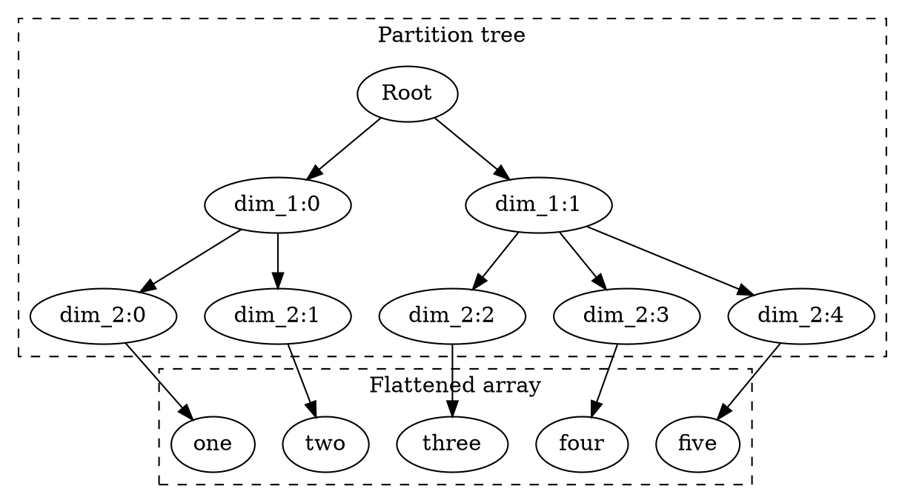

<!-- go/markdown -->

# Koda Fundamentals

go/koda-v1-fundamentals

This guide goes through fundemantals in Koda. It is highly recommended to read
through the guide in order for new users to use Koda effectively.

Also see [Koda Cheatsheet](cheatsheet.md) for quick references.

[TOC]

## Vectorization of Structured Data

Koda introduces new data structures and concepts which allow working with any
kind of structured data in a vectorized form. That is, it supports not only
working with tables, columns, tensors or arrays, but also with nested structs,
pytrees, protos and graphs.

### DataSlices

**DataSlices** are **arrays** with **partition trees** associated with them that
are stored and manipulated as **jagged arrays** (irregular multi-dimensional
arrays). Such partition trees are called **JaggedShape** and these two terms are
used interchangeably through this guide.

Elements of DataSlices are **items** which enable working with all types of data
through vectorized operations.

DataSlices are specialized to work with hierarchies (aggregation from outer to
inner layers), and **shouldn't** be compared to tensors, Numpy arrays or even
nested lists (different types of broadcasting, transformations etc.).

Primitive DataSlices contain elements of a primitive type (e.g.
ints/strings/floats). Note, in future we also plan to support DataSlices of
tensors, and tensors will be treated as primitives (i.e. similar to strings).

There can be also **DataSlices of lists**, **DataSlices of dicts** and
**DataSlices of objects** which will be discussed in the
[DataSlice of Structured Data](#structured_data) section later.

All the leaves (items) have the same depth, which is the same as the number of
dimensions of the jagged array.

For example, the following DataSlice has 2 dimensions and 5 items. The first
dimension has 2 items and the second dimension has 5 items partitioned as `[2,
3]`.

```py
kd.slice([["one", "two"], ["three", "four", "five"]]) # 2-dims
# kd.slice([1, [2, 3]]) would fail, as all the leaves must have the same depth
```

Conceptually, it can be thought as partition tree + flattened array as shown in
the graph below.



DataSlices have methods that allow working with them as with jagged arrays.

```py
# Root
# ├── dim_1:0
# │   ├── dim_2:0
# │   │   ├── dim_3:0 -> 1
# │   │   └── dim_3:1 -> 2
# │   └── dim_2:1
# │       ├── dim_3:0 -> 3
# │       ├── dim_3:1 -> 4
# │       └── dim_3:2 -> 5
# └── dim_1:1
#     ├── dim_2:0
#     │   └── dim_3:0 -> 6
#     ├── dim_2:1 (Empty)
#     └── dim_2:2
#         ├── dim_3:0 -> 7
#         ├── dim_3:1 -> 8
#         ├── dim_3:2 -> 9
#         └── dim_3:3 -> 10
ds = kd.slice([[[1, 2], [3, 4, 5]], [[6], [], [7, 8, 9, 10]]])

ds.get_size() # 10 - total array size: number of items (leaves)
ds.get_ndim() # 3
# JaggedShape: number of items (leaves) at each dimension (level)
ds.get_shape() # JaggedShape(2, [2, 3], [2, 3, 1, 0, 4])

# kd.index returns the index based on the last dimension
kd.index(ds)  # [[[0, 1], [0, 1, 2]], [[0], [], [0, 1, 2, 3]]]
# can specify which dimension to use to get index
kd.index(ds, dim=2)  # the same as above, as there are 3 dimensions
kd.index(ds, dim=0)  # [[[0, 0], [0, 0, 0]], [[1], [], [1, 1, 1, 1]]]

kd.agg_size(ds)  # [[2, 3], [1, 0, 4]] - last dimension sizes
```

DataSlices have their own set of operations to navigate them.

IMPORTANT: `ds[1][2][0]` means a very different thing for the DataSlices
compared to tensors or nested lists (it is used for working with **DataSlices of
lists** which are discussed in the
[DataSlice of Structured Data](#structured_data) section later). Use
`ds.L[1].L[2].L[0]` or `ds.S[1, 2, 0]` to achieve the same behavior.

```py
# It's possible to navigate DataSlices as "nested" lists using .L,
# which gives a "subtree", and makes DataSlices browseable as normal nested lists
ds = kd.slice([[[1, 2], [3, 4, 5]], [[6], [], [7, 8, 9, 10]]])
ds.L[1]  # [[6], [], [7, 8, 9, 10]]
ds.L[1].L[2].L[0]  # 7
len(ds.L)  # 2 - number of children/lists at the first dimension

ds = kd.slice([[1,2,3], [4,5]])
# Use .L to iterate through DataSlices as normal python nested lists
[int(y) + 1 for x in ds.L for y in x.L]  # [2, 3, 4, 5, 6]
[int(kd.sum(ds.L[i])) for i in range(len(ds.L))]  # [6, 9]

# Or use to_pylist to work with python lists of DataSlices
[int(y) + 1 for x in kd.to_pylist(ds) for y in kd.to_pylist(x)]
```

It's possible to subslice DataSlices across multiple dimensions directly using
`.S`.

```py
ds = kd.slice([[[1, 2], [3, 4, 5]], [[6], [], [7, 8, 9, 10]]])
ds.S[1, 2, 0]  # 7
kd.subslice(ds, 1, 2, 0)  # the same as above
ds.S[:, :, :]  # == ds
ds.S[1:, :, :2]  # [[[6], [], [7, 8]]]
kd.subslice(ds, slice(1, None), slice(None, None), slice(None, 2))  # the same as above
# keep only the first 2 items from the *last* dimension
ds.S[..., :2] # [[[1, 2], [3, 4]], [[6], [], [7, 8]]]
# for subslicing the last dimension can skip ...
ds.S[:2]  # the same as above
# Take the 0th item in the last dimension
ds.S[..., 0]  # [[1, 3], [6, None, 7]],
ds.S[0]  # the same as the above
ds.take(0)  # the same as the above
```

We can convert DataSlices back into Python nested lists.

```py
ds = kd.slice([[[1, 2], [3, 4, 5]], [[6], [], [7, 8, 9, 10]]])
ds.to_py()  # normal python list
kd.slice(ds.to_py())  # == ds
ds.to_py()[0][1][2]  # 5 - the same as ds.L[0].L[1].L[2].to_py()
```

### Vectorized Ops

One can manipulate DataSlice's jagged shape (i.e. partition tree) without
touching the actual array values.

```py
ds = kd.slice([[[1, 2], [3, 4, 5]], [[6], [], [7, 8, 9, 10]]])
ds.flatten()
ds.flatten(-2)  # the last two dimensions are flattened
ds.flatten(-2, 0)  # the same as above
ds.flatten(-1)  # no-op

# Use reshape_as to reshape to the shape of a DataSlice of the same size
ds1 = kd.slice([[10, 20, 30], [40, 50, 60], [70, 80, 90, 100]])
ds.reshape(ds1.get_shape())  # [[1, 2, 3], [4, 5, 6], [7, 8, 9, 10]]
ds.reshape_as(ds1)  # the same as above

# # Flatten and restore shape
ds1 = ds.flatten()
ds1.reshape_as(ds) # == ds
```

Also one can apply vectorized operations without changing the associated jagged
shape.

```py
ds = kd.slice([[[1, 2], [3, 4, 5]], [[6], [], [7, 8, 9, 10]]])
ds * 2
kd.val_like(ds, 5)  # [[[5,5], [5,5,5]], [[5]], [], [5,5,5,5]]]
kd.math.log10(ds)
kd.map_py(lambda x: x * 3, ds)
kd.sort(ds, descending=True)
kd.reverse(ds)
```

Aggregational operations reduce the number of dimensions in the partition tree.

```py
ds = kd.slice([[[1, 2], [3, 4, 5]], [[6], [], [7, 8, 9, 10]]])
kd.agg_size(ds)  # [[2, 3], [1, 0, 4]]
kd.agg_max(ds)  # [[2, 5], [6, None, 10]]
kd.agg_max(ds, ndim=2)  # [5, 10]

# can change number of dimensions to be passed into map_py
# min over the last two dimensions
kd.map_py(lambda x: min([b for a in x for b in a], default=None) if x else None,
          ds, ndim=2) # [1, 6]

# map_py can be used simply for debugging:
kd.map_py(lambda x: print(x) if x else None, ds, ndim=2)
```

**Collapse** is a convenient way to reduce the number of dimensions, and replace
them with the common value if all are the same or None.

```py
ds = kd.slice([[1, 1], [2, None, 2], [2, 3, 4]])
kd.collapse(ds)  # [1, 2, None]
kd.collapse(kd.val_like(ds, 10))  # [10, 10, 10]
kd.collapse(kd.val_like(ds, 10), ndim=2)  # 10
```

Some operations ignore the partition tree altogether.

```py
kd.min(ds)  # 1
kd.min(ds.flatten()) # the same as above
kd.agg_min(ds.flatten()) # the same as above, as flatten guarantees 1 dim slice
```

Some operations can actually add dimensions.

```py
kd.range(0, kd.slice([3, 2, 1]))  # [[0, 1, 2], [0, 1], [0]]
kd.item(1).repeat(3).repeat(4) # a simple recipe to create 3 x 4 "grid"
kd.item(1).add_dim(3).add_dim(4) # the same as above
# can have different sizes when adding new dimensions
kd.slice([1, 2]).add_dim(kd.slice([3, 2]))  # [[1, 1, 1], [2, 2]]

ds = kd.slice([[[1, 2], [3, 4, 5]], [[6], [], [7, 8, 9, 10]]])
kd.zip(ds,9)  # [[[[1, 9], [2, 9]], [[3, 9], ...
kd.zip(ds, ds * 10)  # [[[[1, 10], [2, 20]], [[3, 30], ...
kd.repeat(ds, 3)  # [[[[1, 1, 1], [2, 2, 2]], [[3, 3, 3], ...
kd.stack(ds, ds, ds)  # the same as above
kd.stack(ds, ds + 1)  # [[[[1, 2], [2, 3]], [[3, 4], ...
# can stack multiple inner dimensions at once
kd.stack(ds, ds, ndim=2)  # [[[[1, 2], [3, 4, 5]], [[1, 2], [3, 4, 5]]], ...
```

A few operations change the jagged shape without changing the number of
dimensions.

```py
ds1 = kd.slice([[1, 2], [3]])
ds2 = kd.slice([[4, 5, 6], [7, 8]])
kd.concat(ds1, ds2)  # [[1, 2, 4, 5, 6], [3, 7, 8]]
```

`kd.group_by` adds dimension after grouping items and unique keeps only unique
items. Both don't change the order, meaning unique == group_by + collapse

```py
ds = kd.slice([4,3,4,2,2,1,4,1,2])
# group
kd.group_by(ds)  # [[4, 4, 4], [3], [2, 2, 2], [1, 1]]
# group and collapse
kd.collapse(kd.group_by(ds))  # [4, 3, 2, 1]
kd.unique(ds)  # the same as above

# group by key (or keys)
ds1 = kd.slice([1,2,3,4,5,6,7,8,9])
ds2 = kd.slice([1,2,1,3,3,4,1,4,3])
kd.group_by(ds1, ds2) # [[1, 3, 7], [2], [4, 5, 9], [6, 8]]
```

`kd.translate` and `kd.translate_group` are powerful operators to map keys to
values using key=>value mapping.

```py
# TODO: more examples for kd.translate
a = kd.slice([[1, 2, 2, 1], [2, 3]])
b = kd.slice([1, 2, 3])
c = kd.slice([4, 5, 6])
kd.translate(a, b, c)  # [[4, 5, 5, 4], [5, 6]]
kd.dict(b, c)[a]  # the same as above

kd.translate(kd.slice([1, 2, 2, 1]), kd.slice([1, 3]), 1)  # [1, None, None, 1],
kd.dict(kd.slice([1, 3]), 1)[kd.slice([1, 2, 2, 1])]  # the same as above

# TODO: examples for translate_group
```

### Items

Elements of a DataSlice are **items**, where each item can be a primitive, an
entity/object with attributes, a list or a dict. To support vectorization, Koda
has native versions of primitives/entity/object/list/dict, which are made as
close to Python as possible.

Moreover, items can be seen as a special case of DataSlices (0-dim DataSlices),
and everything that accepts DataSlices works with items too.

NOTE: more types of data structures will be supported soon (tensors and sets in
particular).

Items are immutable (primitives, entities, objects, lists and dicts), but it's
possible to make them mutable for advanced workflows.

Primitive types include `kd.INT32`, `kd.INT64`, `kd.FLOAT32`, `kd.FLOAT64`,
`kd.STRING`, `kd.BYTES`, `kd.BOOLEAN` and `kd.MASK`. `kd.MASK` is a special type
representing presence which will be covered in the
[Sparsity and Logical Operators](#sparsity) section later.

There is also `kd.ITEMID` which will be covered in the
[ItemIds, UUIDs and Hashes](#itemid) section later too.

Use `kd.item`, `kd.from_py` or `kd.new` to create primitive items. `kd.item`
takes mostly primitives while `kd.new` and `kd.from_py` are more powerful but
also accept primitives.

```py
kd.item(123)  # kd.INT32
kd.int32(123) # the same as above
kd.new(123)  # the same as above
kd.item("hello world")  # kd.STRING
kd.str("hello world") # the same as above
kd.new("hello world")  # the same as above

kd.from_py("hello world")  # kd.STRING
kd.to_py(kd.item(123))  # python's int
kd.item(123).to_py()  # the same as above
int(kd.item(123))  # the same as above
str(kd.item("hello"))  # python's string
kd.present  # Koda's "True", or mask value indicating a 'present' item
kd.missing  # Koda's "False", or mask value indicating a 'missing' item
kd.item(5) > 3  # kd.present - Koda's True
~(kd.item(5) > 3)  # kd.missing - Koda's False
kd.item(None)  # missing item with none schema/dtype

kd.is_primitive(kd.item(123))  # yes
```

Items are also considered to be 0-dim DataSlices.

```py
kd.is_slice(kd.item(1))  # true
kd.is_item(kd.slice([1, 2, 3, 4]))  # false
kd.item(1).get_ndim()  # 0
kd.item(1).get_shape()  # empty shape

# .flatten() - universal convertor into 1-dim slices
kd.item(1).flatten()  # [1]

kd.stack(kd.item(1), kd.item(2), kd.item(3))  # [1, 2, 3]
kd.item(1).repeat(2).repeat(3)  # [[1, 1, 1], [1, 1, 1]]
kd.item(1).reshape_as(kd.slice([[[8]]]))  # [[[1]]]
```

Lists, similar to python, represent "lists" (not slices!) of items:

```py
# Create lists
a = kd.list([1, 2, 3, 4])  # List[1, 2, 3, 4]
a = kd.from_py([1,2,3,4])  # the same as above
kd.is_primitive(a)  # no
kd.is_list(a)  # yes

# Create nested lists
kd.list([[1, 2, 3, 4], [5, 6, 7, 8]])  # List[[1, 2, 3, 4], [5, 6, 7, 8]]
kd.from_py([[1, 2, 3, 4], [5, 6, 7, 8]])  # the same as above

# Convert back to python
kd.list([1, 2, 3, 4]).to_py()  # back to python list

# Check with lists
a.list_size()
a.is_list() # works for non-list items too

# Access lists
a = kd.list([1, 2, 3, 4])
a[2]
kd.get_item(a, 2)  # the same as above
a = kd.list([[1, 2, 3, 4], [5, 6, 7, 8]])
a[1][2]

# Iterate in python (lists or nested lists)
a = kd.list([[1, 2, 3, 4], [5, 6, 7, 8]])
[int(t) for b in a for t in b]

# Convert the last dimension into a list
kd.implode(kd.slice([1, 2, 3, 4]))  # == kd.list([1, 2, 3, 4])
# For a DataSlice with multiple dimensions, need to apply kd.implode multiple times
a = ([[1, 2, 3, 4], [5, 6, 7, 8]])
kd.implode(kd.implode(kd.slice(a)))  # == kd.list(a)
# Or use kd.implode(a, ndim=-1)
kd.implode(kd.slice(a), ndim=-1)  # the same as above
```

IMPORTANT: slicing operators over lists (e.g. a[1:]) do not return lists, but
DataSlices with plus-one dimension (explosion operation which is discussed in
the [DataSlice of Structured Data](#structured_data) section later).

Lists can be also looked up with python lists or slices. Use kd.implode to
convert slices (their last dimension) back into lists.

```py
a = kd.list([1, 2, 3, 4])
a[:]  # 1-dim slice: kd.slice([1, 2, 3, 4])
a[1:]  # 1-dim slice: kd.slice([2, 3, 4])
a[[1, 3]]  # 1-dim slice: kd.slice([2, 4])
a[kd.slice([1, 3])]  # the same as above
a[kd.range(2)]  # the same as a[:2]
a.select_items(lambda x: x>=2)  # kd.slice([2, 3, 4])

kd.implode(a[:])  # == a
kd.implode(a[1:])  # == kd.list([2,3,4])
```

Lists are immutable by default, and need to be recreated to append/extend.

```py
x = kd.list([1, 2, 3, 4])
y = kd.list([5, 6, 7, 8])
kd.concat_lists(x, y)  # == kd.list([1, 2, 3, 4, 5, 6, 7, 8])
kd.implode(kd.concat(x[:], y[:]))  # the same as above

# append, by creating a new list with one item
z = 5
kd.concat_lists(x, kd.implode(kd.item(z).add_dim(1)))
kd.implode(kd.concat(x[:], kd.item(z).add_dim(1)))  # the same as above

x = kd.obj(y=kd.list([1, 2, 3, 4]), z=kd.list([5, 6, 7, 8]), u=4)
x = x.with_attrs(a=kd.concat_lists(x.y, x.z))
x = x.with_attrs(b=kd.concat_lists(x.y, kd.list([x.u])))  # append one value
# x = x.with_attrs(b=kd.appended_list(x.a, x.u))  # the same as above
```

Dicts can be created in a way similar to lists, and are immutable by default.

```py
# Multiple ways to achieve the same
d = kd.dict({'a':1, 'b':2, 'c':4})
d = kd.from_py({'a':1, 'b':2, 'c':4})
kd.is_primitive(d)  # no
kd.is_dict(d)  # yes

kd.dict(kd.slice(['a', 'b', 'c']), kd.slice([1, 2, 4]))
kd.dict({'a':1, 'b':2}).with_dict_update('c', 4)
kd.dict().with_dict_update(kd.dict({'a':1, 'b':2, 'c':4}))
kd.dict({'a':1}).with_dict_update(kd.slice(['b', 'c']), kd.slice([2, 4]))

# dict updates can be created separately and applied later
d = kd.dict({'a':1})
upd1 = kd.dict_update(d, 'b', 2)  # need to specify d
upd2 = kd.dict_update(d, 'c', 4)
d.updated(upd1, upd2)  # == kd.dict({'a':1, 'b':2, 'c':4})

upd = kd.dict_update(d, kd.dict({'b':2, 'c':4}))
d.updated(upd)
```

Dicts can be looked up and have `get_keys()` and corresponding `get_values()`,
with `my_dict[:]` a shortcut for `my_dict.get_values()`.

NOTE: the keys are not guaranteed to be sorted!

```py
d = kd.dict({'a':1, 'b':2, 'c':4})
kd.dict_size(d)  # 3
d['b']  # 2
kd.get_item(d, 'b')  # the same as above
d[['a', 'c']]  # 1-dim slice kd.slice([1,4])
d[kd.slice(['a' , 'c'])]  # the same as above
# get_keys() can be used to get the keys, but the order is non-deterministic
d.get_keys()  # 1-dim slice kd.slice(['a', 'c', 'b']) or other permutation
kd.sort(d.get_keys())  # kd.slice(['a', 'b', 'c'])
d.select_keys(lambda x: x>='b')  # ['b', 'c']
d.get_values()  # 1-dim slice kd.slice([1, 4, 2])
d[d.get_keys()]  # the same as above
d.select_values(lambda x: x<=2)  # [1, 2]
kd.dict(d.get_keys(), d.get_values())  # == d
# zip key, value in sorted order
# output: [['a', 1], ['b', 2], ['c', 4]]
kd.zip(kd.sort(d.get_keys()), kd.sort(d.get_values(), d.get_keys()))
kd.zip(keys:=kd.sort(d.get_keys()), d[keys]) # the same as above

# Check if item is a dict
d.is_dict()

# Iterate in python (need to convert get_keys slice into list)
[int(d[key]) for key in kd.implode(d.get_keys())]
# The same
[int(d[key]) for key in d.get_keys().L]
```

It's possible to create and work with structured objects called **entities**.
Entities have schemas, which can be distinguished by name, auto-allocated or
explicitly created. When creating or working with DataSlices of entities, all
entities must have the same schema.

```py
kd.new(x=1, y=2, schema='Point')  # Entity(x=1, y=2)
r = kd.new(x=1, y=2, z=kd.new(a=3, b=4, schema='Data'), schema='PointWithData')  # nested Entity
r.z.a  # 3

# kd.new can also auto-allocate schemas
kd.new(x=1, y=2, schema='Point') == kd.new(x=1, y=2, schema='Point')  # yes
kd.new(x=1, y=2).get_schema() == kd.new(x=1, y=2).get_schema()  # no

# Schemas can also be created explicitly.
# kd.named_schema('Point') creates exactly the same schemas as the one created
# by schema='Point'
my_schema = kd.named_schema('Point')
kd.new(x=1, y=2, schema=my_schema)  # set explicit schema
kd.new(x=1, y=2, schema='Point').get_schema() == kd.new(x=1, y=2, schema=my_schema).get_schema()  # yes

# kd.slice([kd.new(x=1, y=2), kd.new(x=2, y=3)]) # fails, as entities have different scheams
kd.slice([kd.new(x=1, y=2, schema=my_schema), kd.new(x=2, y=3, schema=my_schema)]) # works
kd.slice([kd.new(x=1, y=2, schema='Point'), kd.new(x=2, y=3, schema='Point')]) # works

a, b = kd.new(x=1, y=2), kd.new(x=2, y=3)
# kd.slice([a, b]) # fails, as entities have different scheams
kd.slice([a.with_schema(my_schema), b.with_schema(my_schema)])  # works
kd.slice([a, b.with_schema(a.get_schema())])  # works
kd.slice([kd.cast_to(a, my_schema), kd.cast_to(b, my_schema)])  # works
kd.slice([a, kd.cast_to(b, a.get_schema())])  # works
```

Entities are immutable, and have special APIs to modify attributes (including
deep ones).

NOTE: Entities created using `kd.new_xxx` methods are mutable now as we are
migrating from Koda v0 to v1. Once it is fully migrated, they will be switched
to immutable.

```py
r = kd.new(x=1, y=2, schema='Point')

# Use with_attrs to create a version with updated attributes
r.with_attrs(z=4, y=10)  # Entity(x=1, y=10, z=4)
# Alternatively, use updated + kd.attrs, which allows also mixing multiple updates
r.updated(kd.attrs(r, z=4, y=10)) # the same above
# Or can do multiple updates
r.updated(kd.attrs(r, z=4)).updated(kd.attrs(r, y=10))
r.updated(kd.attrs(r, z=4), kd.attrs(r, y=10))

# kd.attrs makes it possible to update attributes of nested entities.
r = kd.new(x=1, y=2, z=kd.new(a=3, b=4, schema='Data'), schema='PointWithData')
r.updated(kd.attrs(r.z, a=30, c=50))  # Entity(x=1, y=2, z=Entity(a=30, b=4, c=50))
r.with_attrs(z=r.z.with_attrs(a=30, c=50))  # the same as above, but less efficient

# In case your attribute names are arbitrary strings and not nice Python identifiers, you
# can use kd.attr/kd.with_attr instead.
r.with_attr('@!^', 7).get_attr('@!^')  # == 7
```

You need to clone or deep-clone entities in order to create copies with
different attributes (similar to working with python objects).

```py
# entities have ids ("pointers"), which stay the same
a = kd.new(x=1, y=2, schema='Point')
r = kd.new(u=a, v=a, schema='Pair')
r = r.updated(kd.attrs(r.u, x=10))  # both r.u.x == r.v.x == 10, as r.u == r.v
r = r.updated(kd.attrs(a, y=5))  # now r.u.x == r.v.y == 5, as r.u == r.v == a

# use clone to duplicate entities, but keep attributes
a = kd.new(x=1, y=2, schema='Point')
r = kd.new(u=a.clone(), v=a.clone(), schema='Pair')
r = r.updated(kd.attrs(r.u, x=10))  # r.u.x == 10, and r.v.x == 2 (not changed)
r = r.updated(kd.attrs(a, x=10))  # nothing would be updated, as a != r.u != r.v

# clone is not enough to go deep
a = kd.new(x=kd.obj(m=3, n=4), y=2, schema='ComplexPoint')
r = kd.new(u=a.clone(), v=a.clone(), schema='ComplexPair')
r = r.updated(kd.attrs(r.u.x, m=50))  # changes also r.v.x.m, as a.x wasn't cloned

# deep_clone clones entities recursively
a = kd.new(x=kd.obj(m=3, n=4), y=2, schema='ComplexPoint')
r = kd.new(u=a.deep_clone(), v=a.deep_clone(), schema='ComplexPair')
r = r.updated(kd.attrs(r.u.x, m=50))  # Now r.v.x.m is not changed
```

Entities can have lists and dicts as their attributes, which can be updated.

```py
r = kd.new(x=kd.list([1,2]), y=kd.dict({'a':1, 'b':2}), schema='Custom1')
r = r.updated(kd.attrs(r, x=kd.list([4,5])))
r = r.updated(kd.dict_update(r.y, 'c', 4))
```

**Objects**, similar to python objects, make it possible to mix items of
different types and/or entities with different schemas.

```py
# Create structured objects directly
kd.obj(x=1, y=2)  # Obj(x=1, y=2)
kd.obj(x=1, z=kd.obj(a=3, b=4))  # Obj(x=1, z=Obj(a=3, b=4))

# Convert primitives or entities into objects
kd.obj(1)  # 1, but kd.OBJECT
kd.obj(kd.new(x=1, y=2))  # similar to kd.obj(x=1, y=2), with some differences discussed later

# Convert python list of dicts of lists of dicts
# from_py returns an object by default when no schema is provided
x = kd.from_py([{'d': [{'a': 1, 'b': 2}, {'a': 3, 'b': 4}]}, {'d': [{'a': 5, 'b': 6}]}])
x[1]['d'][0]['a']  # 5
x[0]['d'][1].get_values()  # [3, 4]

# Convert python dicts into objects
x = kd.from_py([{'d': [{'a': 1, 'b': 2}, {'a': 3, 'b': 4}]}, {'d': [{'a': 5, 'b': 6}]}],
               dict_as_obj=True)
x[1].d[0].a  # 5
x[0].get_attr('e', default=4)  # get_attr with default
x[0].d[1].maybe('z')  # None if missing

# Convert python dicts into objects
x = kd.from_py([{'x': [1, {'a':1, 'b':2}, 2], 'y':4}, 10],
               dict_as_obj=True)
x # List[Obj(x=List[1, Obj(a=1, b=2), 2], y=4), 10]
x[0].x[1].a  # 1
x[1]  # 10

# Create a DataSlice mixing different objects (including primitives):
kd.slice([kd.obj(1), kd.obj("hello"), kd.obj(kd.new(x=1, y=2)),
          kd.obj(a=3)])

# Can create objects from dataclasses
from dataclasses import dataclass
@dataclass()
class A:
  x: int
  y: str

py_obj = A(x=1, y='a')
kd.from_py(py_obj)  # Obj(x=1, y='a')

# Can convert back to python
x = kd.from_py([{'d': [{'a': 1, 'b': 2}, {'a': 3, 'b': 4}]},
 {'d': [{'a': 5, 'b': 6}]}])
kd.to_py(x) # only one level is converted to pure python
kd.to_py(x, max_depth=-1) # completely converted
x.to_py(max_depth=-1) #  the same as above

# Convert python dicts as koda dicts
x = kd.from_py([{'d': [{'a': 1, 'b': 2}, {'a': 3, 'b': 4}]},
 {'d': [{'a': 5, 'b': 6}]}], dict_as_obj=True)
x.to_py(obj_as_dict=True, max_depth=-1)  # convert koda objs to python dicts
x.to_pytree(max_depth=-1) # the same as above
x.to_py(max_depth=-1) # python dicts got converted into python Objs
r = x.to_py(max_depth=-1)
r[0].d[0].a # 1 - r is pure python

# TODO: clarify better from/to py and pytree
```

Creation of entities, objects, dicts and lists allocates new **128-bit ids**
called **ItemIds** (similar to pointers in C++). It's possible also to create
**"universally unique"** entities, objects, dicts and list by using their `uu`
versions.

```py
kd.new(x=1, y=2).get_itemid() != kd.new(x=1, y=2).get_itemid()  # yes
kd.obj(x=1, y=2).get_itemid() != kd.obj(x=1, y=2).get_itemid()  # yes
kd.list([1,2]).get_itemid() != kd.list([1,2]).get_itemid()  # yes
kd.uu(x=1, y=2).get_itemid() == kd.uu(x=1, y=2).get_itemid()  # yes
kd.uuobj(x=1, y=2).get_itemid() == kd.uuobj(x=1, y=2).get_itemid()  # yes
```

uu versions of entities and objects can be used as named tuples.

```py
d = kd.dict({kd.uu(x=1, y=2): 'a'})
d = d.with_dict_update(kd.uu(x=3, y=4), 'b')
d[kd.uu(x=3, y=4)]  # 'b'
d[kd.uu(x=5, y=6)]  # None
# d[kd.new(x=3, y=4)]  # fail, as a key with different schema
```

### Containers

As a convenience option, it is possible to create mutable containers that hold
items and slices.

Containers can be converted into objects and back.

NOTE: We are still iterating on container APIs which are subject to change.

```py
x = kd.container()
x.a = 1
x.b = 2
x.a = 3
x.d = kd.container()
x.d.e = 4
x.d.f = kd.list([1, 2, 3])
x.d.g = kd.dict({'a': 1, 'b': 2})

# Convert containers to objects
o = x.freeze()

# Convert objects to containers
x1 = o.fork_db()
```

### Schemas

Primitive DataSlices have schemas which are also called dtypes.

```py
kd.slice([1, 2, 3]) # INT32 is chosen by default when converting from Python
kd.slice([1, 2, 3], schema=kd.INT32) # the same as above
kd.slice([1, 2, 3], schema=kd.INT64) # can specify INT64 schema
kd.int64([1, 2, 3])  # the same as above

kd.slice([1., 2., 3.], schema=kd.FLOAT64) # can specify FLOAT64 schema
kd.float64([1., 2., 3.])  # the same as above

kd.slice([1, 2, 3]).get_dtype()  # kd.INT32
kd.slice([1, 2, 3]).get_schema()  # kd.INT32
kd.slice([1., 2, 3]).get_dtype()  # kd.FLOAT32, because of 1., 2 and 3 are casted to floats
```

Primitives can be converted as expected.

```py
kd.to_float32(kd.item(1))
kd.to_str(kd.item(1))
kd.to_float32(kd.slice([1, 2, 3]))
kd.to_int64(kd.slice([1, 2, 3]))
kd.cast_to(kd.slice([1, 2, 3]), kd.INT64)  # the same as above
```

Structured items have schemas (but not dtype), and it's possible to browse them.

```py
kd.new(x=1, y=2).get_schema()  # SCHEMA(x=INT32, y=INT32)
kd.new(x=1, y=2).get_dtype() # None
kd.new(x=1, y=2).get_schema().x  # kd.INT32
kd.new(x=1, y=2).x.get_dtype()  # kd.INT32
```

Note, `kd.new` auto-allocates new schemas, and to make schemas to be the same,
we can pass a schema name as a string, create schemas explicitly, or use uu
items.

```py
a1 = kd.new(x=1, y=2)
a2 = kd.new(x=3, y=4)
a1.get_schema() != a2.get_schema()  # yes

a1 = kd.new(x=1, y=2, schema='Pair')
a2 = kd.new(x=3, y=4, schema='Pair')
a1.get_schema() == a2.get_schema()  # yes

a1 = kd.new(x=1, y=2, schema=kd.named_schema('Pair'))
a2 = kd.new(x=3, y=4, schema=kd.named_schema('Pair'))
a1.get_schema() == a2.get_schema()  # yes

my_schema = kd.new_schema(x=kd.INT32, y=kd.INT32)
a1 = kd.new(x=1, y=2, schema=my_schema)
a2 = kd.new(x=3, y=4, schema=my_schema)
a1.get_schema() == a2.get_schema()  # yes

a1 = kd.uu(x=1, y=2)
a2 = kd.uu(x=3, y=4)
a1.get_schema() == a2.get_schema()  # yes
```

To enable mixing different primitives or entities with different schemas in the
same DataSlices or as keys/values of dicts, Koda uses **objects**, which stores
their own schema **similarly to python objects** which stores their classes as
`__class__` attribute.

NOTE: primitives are considered to be objects although they cannot have
attributes because their schemas are embedded in the data.

A DataSlice with object items has `kd.OBJECT` schema. To get per-item schemas,
we can use `get_obj_schema()`.

```py
kd.obj('1').get_schema()  # OBJECT
kd.obj('1').get_obj_schema()  # STRING
kd.obj(x=1, y=2).get_schema()  # OBJECT
kd.obj(x=1, y=2).get_obj_schema()  # SCHEMA(x=INT32, y=INT32)
kd.obj(kd.new(x=1, y=2)).get_schema()  # OBJECT
kd.obj(kd.new(x=1, y=2)).get_obj_schema()  # SCHEMA(x=INT32, y=INT32)

d = kd.dict(key_schema=kd.OBJECT, value_schema=kd.OBJECT)
d = d.with_dict_update(1, kd.new(x=1, y=2))
d = d.with_dict_update(kd.obj(z=3), 'hello')  # anything can be key/value

kd.slice(['1', kd.obj(x=1, y=2)]).get_schema()  # OBJECT
kd.slice(['1', kd.obj(x=1, y=2)]).get_obj_schema()  # [STRING, SCHEMA(x=INT32, y=INT32)]
```

Schemas are used internally to raise on missing attributes or get their
schemas/dtypes, and there are several ways to go around that.

```py
kd.new(x=1, y=2).get_schema().has_attr('x')  # yes
# kd.obj(x=1, y=2).get_schema().has_attr('x') # raises, as kd.OBJECT doesn't have attributes
kd.obj(x=1, y=2).get_obj_schema().has_attr('x')  # yes

kd.obj(x=1, y=2).has_attr('x')  # yes
# kd.obj(x=1, y=2).z # fails
# kd.obj(x=1, y=2).get_attr('z') # the same as above
kd.obj(x=1, y=2).get_attr('z', None)  # use None as default value
kd.obj(x=1, y=2).maybe('z')  # the same as above
kd.obj(x=1, y=2).get_attr('z', default=-1)  # -1
kd.obj(x=1, y=2).maybe('z') | -1  # -1
```

It's possible to create universally-unique schemas (that have the same ItemIds
no matter when and where created). Universally-unique entities and objects have
universally-unique schemas by default.

```py
kd.new_schema(x=kd.INT32) != kd.new_schema(x=kd.INT32)  # yes
kd.uu_schema(x=kd.INT32) == kd.uu_schema(x=kd.INT32)  # yes
kd.uu(x=1).get_schema() == kd.uu_schema(x=kd.INT32)  # yes

# Seeds can be used to create different ids (say, to emulate namespaces/packages)
kd.uu_schema(seed='my_seed', x=kd.INT32) == kd.uu_schema(seed='my_seed', x=kd.INT32)  # yes
kd.uu_schema(seed='my_seed1', x=kd.INT32) != kd.uu_schema(seed='my_seed2', x=kd.INT32)  # yes
kd.uu(seed='my_seed', x=1).get_schema() == kd.uu_schema(seed='my_seed', x=kd.INT32)  # yes
```

Lists and dicts have schemas too which are uu schemas based on the contents'
schemas.

```py
kd.list([1, 2]).get_schema()  # LIST[INT32]
kd.list([1, 2]).get_schema() == kd.list([3, 4]).get_schema()  # yes
kd.list_schema(kd.INT32) # create a list schema directly
kd.list([1, 2]).get_schema() == kd.list_schema(kd.INT32) # yes

kd.dict({'1': 2}).get_schema()  # Dict{STRING, INT32}
kd.dict({'1': 2}).get_schema() == kd.dict({'3': 4}).get_schema()
kd.dict_schema(kd.STRING, kd.INT32) # create a dict schema directly
kd.dict_schema(kd.STRING, kd.INT32) == kd.dict({'1': 2}).get_schema()

list_s = kd.list_schema(kd.INT32)
list_s.get_item_schema() # INT32

dict_s = kd.dict_schema(kd.STRING, kd.INT32)
dict_s.get_key_schema() # STRING
dict_s.get_value_schema() # INT32
```

### DataSlices of Structured Data {#structured_data}

Each item of a DataSlice can be complex structured data: entities, objects,
dicts and lists.

```py
# Root
# ├── dim_1:0
# │   ├── dim_2:0 -> kd.obj(x=1, y=20)
# │   └── dim_2:1 -> kd.obj(x=2, y=30)
# └── dim_1:1
#     ├── dim_2:0 -> kd.obj(x=3, y=40)
#     ├── dim_2:1 -> kd.obj(x=4, y=50)
#     └── dim_2:2 -> kd.obj(x=5, y=60)
kd.slice([
    [kd.obj(x=1, y=20), kd.obj(x=2, y=30)],
    [kd.obj(x=3, y=40), kd.obj(x=4, y=50), kd.obj(x=5, y=60)]])

# Root
# ├── dim_1:0 -> kd.list([20, 30])
# └── dim_1:1 -> kd.list([40, 50, 60])
kd.slice([kd.list([20, 30]), kd.list([40,50, 60])])

# Root
# ├── dim_1:0
# │   ├── dim_2:0 -> kd.dict({'a':1,'b':2})
# │   └── dim_2:1 -> kd.dict({'b':3,'c':4})
# └── dim_1:1
#     └── dim_2:0 -> kd.dict({'a':5,'b':6,'c':7})
kd.slice([[kd.dict({'a':1,'b':2}), kd.dict({'b':3,'c':4})],
          [kd.dict({'a':5,'b':6,'c':7})]])
```

We can access object attributes, list items and dict values for each item of the
DataSlice ***simultaneously***. Meaning, every item in the slice is "replaced"
by `item.x` or `item[foo]`.

```py
# Root                                  Root
# ├── dim_1:0                               ├── dim_1:0
# │   ├── dim_2:0 -> kd.obj(x=1, y=20)      │   ├── dim_2:0 -> 20
# │   └── dim_2:1 -> kd.obj(x=2, y=30)      │   └── dim_2:1 -> 30
# └── dim_1:1                           =>  └── dim_1:1
#     ├── dim_2:0 -> kd.obj(x=3, y=40)          ├── dim_2:0 -> 40
#     ├── dim_2:1 -> kd.obj(x=4, y=50)          ├── dim_2:1 -> 50
#     └── dim_2:2 -> kd.obj(x=5, y=60)          └── dim_2:2 -> 60
ds = kd.slice([[kd.obj(x=1, y=20), kd.obj(x=2, y=30)],
               [kd.obj(x=3, y=40), kd.obj(x=4, y=50), kd.obj(x=5, y=60)]])
# replace every item in the DataSlice with item.y
ds.y  # kd.slice([[20,30], [40,50,60]])
ds.get_attr('y')  # the same as above

ds = kd.slice([[kd.obj(x=1,y=2), kd.obj(y=4)], [kd.obj(x=5)]])
ds.get_attr('x', None)  # [[1, None], [5]]
ds.maybe('x')  # the same as above

ds = kd.slice([[kd.list([10,20,30]), kd.list([40])], [kd.list([50,60,70,80])]])
# replace every slice item with item[index]
ds[1]  # [[20, None], [60]]

ds = kd.slice([[kd.dict({'a':1,'b':2}), kd.dict({'b':3,'c':4})],
               [kd.dict({'a':5,'b':6,'c':7})]])
# replace every slice item with item[key]
ds['a']  # [[1, None], [5]]
```

We can also 'explode' a DataSlice of lists, by accessing multiple list items at
the same time, and adding another dimension to the partition tree.

```py
# Root
# ├── dim_1:0 -> kd.list([20, 30])
# └── dim_1:1 -> kd.list([40, 50, 60])
# =>
# Root
# ├── dim_1:0
# │   ├── dim_2:0 -> 20
# │   └── dim_2:1 -> 30
# └── dim_1:1
#     ├── dim_2:0 -> 40
#     ├── dim_2:1 -> 50
#     └── dim_2:2 -> 60
ds = kd.slice([kd.list([20, 30]), kd.list([40, 50, 60])])

# replace every item with item[:], by adding extra dimension
ds[:]  # kd.slice([[20, 30], [40, 50, 60]])
kd.explode(ds)  # the same as above

# replace every item with item[:2], by adding extra dimension
ds[:2]   # kd.slice([[20, 30], [40, 50]])

# Explode twice a nested list
x = kd.list([[1, 2, 3],[4, 5, 6],[7, 8]])  # Nested list
x[:][:]  # kd.slice([[1, 2, 3],[4, 5, 6],[7, 8]])
kd.explode(kd.explode(x))  # The same as above
kd.explode(x, ndim=2)  # The same as above
# Explodes nested lists all the way
kd.explode(x, ndim=-1)  # The same as above (as 2 dim list)
x[1:][:2]  # kd.slice([[4, 5], [7, 8]])

# Taking items from each list separately
x = kd.slice([kd.list([5, 6, 7]), kd.list([9, 10, 11])])
y = kd.slice([[1, 0, 1, 0],[2, 0]])
# Take [1, 0, 1, 0] index items in [5, 6, 7] ([6, 5, 6, 5])
# and [2, 0] index items in [9, 10, 11] ([11, 9])
x[y]  # [[6, 5, 6, 5], [11, 9]]

# Take the first 2 in the first list, and 1 in the second
x[kd.range(0, kd.slice([2,1]))]  # [[5, 6], [9]]
```

We can do the opposite operation and 'implode' last dimension into lists with
`kd.implode`.

```py
ds = kd.slice([[[1, 2], [3, 4, 5]], [[6], [], [7, 8, 9, 10]]])
kd.implode(ds)  # kd.slice([[kd.list([1, 2]), kd.list([3, 4, 5])],
#                           [kd.list([6]), kd.list([]), kd.list([7, 8, 9, 10])]])
kd.implode(ds, ndim=2)  # kd.list([[[1, 2], [3, 4, 5]], [[6], [], [7, 8, 9, 10]]])
kd.implode(ds, ndim=ds.get_ndim())  # the same as above, as ndim == 2
kd.implode(ds, ndim=-1)  # the same as above

# implode the last 2 dimensions, then explode accessing only the first 2 items
kd.implode(ds, ndim=2)[:2][:2] # the same as ds.S[..., :2, :2]

# implode all the way into a nested list, then browse the nested list
kd.implode(ds, ndim=-1)[1][2][3]  # the same as x.S[1,2,3] or x.L[1].L[2].L[3]
```

Similarly, we can access multiple entries of dictionaries.

```py
# Root
# ├── dim_1:0
# │   ├── dim_2:0 -> kd.dict({'a':1,'b':2})
# │   └── dim_2:1 -> kd.dict({'b':3,'c':4})
# └── dim_1:1
#     ├── dim_2:0 -> kd.dict({'a':5,'b':6,'c':7})
# =>
# Root
# ├── dim_1:0
# │   ├── dim_2:0 -> 1
# │   └── dim_2:1 -> None
# └── dim_1:1
#     ├── dim_2:0 -> 5

ds = kd.slice([
    [kd.dict({'a':1,'b':2}), kd.dict({'b':3,'c':4})],
    [kd.dict({'a':5,'b':6,'c':7})]])
# replace every slice item with item['a']
ds['a']  # [[1, None], [5]]

# Lookup every dictionary with different keys,
# and replace item with [item[key] for each corresponding key]
# by adding extra dimension
keys = kd.slice([[['b', 'b'], ['a', 'b', 'c']],[['d', 'a']]])
ds[keys]  # kd.slice([[[2, 2], [None, 3, 4]], [[None, 5]]])

# Replace every item with item.get_keys(), by adding extra dimenstion
ds.get_keys()  # kd.slice([[['a', 'b'], ['b', 'c']], [['b', 'c', 'a']]])
# The same, but for values
ds.get_values()  # kd.slice([[[1, 2], [3, 4]], [[6, 5, 7]]])
ds[:]  # equivallent to the above
ds[ds.get_keys()]  # equivallent to the above
# only the first 2 keys are used
ds[ds.get_keys().S[:2]] # [[[1, 2], [3, 4]], [[6, 5]]]
```

`kd.dict` can also be used to "implode" the last dimensions of keys and values
DataSlices into individual dicts.

```py
keys = kd.slice([[['a', 'b'], ['b', 'c']], [['a', 'b', 'c']]])
values = kd.slice([[[1, 2], [3, 4]], [[5, 6, 7]]])

# The same as
# ds = kd.slice([
#   [kd.dict({'a':1,'b':2}), kd.dict({'b':3,'c':4})],
#   [kd.dict({'a':5,'b':6,'c':7})]])
ds = kd.dict(keys, values)
ds.get_keys()  # Note, the order of keys within dicts might change
kd.all(kd.sort(ds.get_keys()) == kd.sort(keys))  # yes

kd.dict(ds.get_keys(), ds.get_values())  # reconstruct
# create new dicts after filtering keys
kd.dict(keys:=ds.get_keys().select(lambda x: x <= 'a'), ds[keys])

# Can create dicts by using constant for values
keys = kd.slice([[['a', 'b'], ['b', 'c']], [['a', 'b', 'c']]])
ds = kd.dict(keys, 1)
ds['c']  # [[None, 1], [1]]
```

We can also create DataSlices of entities or objects by converting Python lists
or directly in fully vectorized ways using DataSlices of attributes.

```py
# slice of entities from list of entities with *the same* schema
s = kd.new_schema(a=kd.INT32, b=kd.INT32)
ds = kd.slice([kd.new(a=1, b=6, schema=s), kd.new(a=2, b=7, schema=s),
               kd.new(a=3, b=8, schema=s), kd.new(a=4, b=9, schema=s)])

# The same as above, but more concise
ds = kd.new(a=kd.slice([1, 2, 3, 4]), b=kd.slice([6, 7, 8, 9]), schema=s)
ds.a  # kd.slice([1, 2, 3, 4])

# Objects don't have to have the same schemas
ds = kd.slice([kd.obj(a=1, b=6), kd.obj(a=2, b=7), kd.obj(a=3, b=8), kd.obj(a=4, b=9)])
ds = kd.obj(a=kd.slice([1, 2, 3, 4]), b=kd.slice([6, 7, 8, 9]))  # the same as above
ds.a  # kd.slice([1, 2, 3, 4])
```

The differences between `kd.obj` and `kd.new` in vectorized workflows is that
`kd.new` creates "shared" schema by default (similar to protos / structs), while
`kd.obj` allocates individual schemas (similar to python slots).

```py
r = kd.new(x=kd.slice([1, 2]), y=kd.slice([3, 4]))
# assigns 'z' attribute to the first element only, but updates the shared schema
r = r.updated(kd.attrs(r.S[0], z=20))
r.z  # [20, None]
r.get_schema().z  # INT32
r.S[1].get_schema().z  # INT32 - as shares schema with r.S[0]
r.S[0].get_schema() == r.S[1].get_schema()  # yes - shared schemas

r = kd.obj(x=kd.slice([1, 2]), y=kd.slice([3, 4]))
r = r.updated(kd.attrs(r.S[0], z=20))  # assigns 'z' attribute to the first element only
# r.z wouldn't work, as r.S[1] schema wasn't updated
r.maybe('z') # [20, None]
r.get_obj_schema().maybe('z')  # [INT32, None]
r.S[1].get_obj_schema().maybe('z')  # None
r.S[0].get_obj_schema() != r.S[1].get_obj_schema()  # yes - individual
```

IMPORTANT: There is additional performance cost of using objects during
vectorized operations. As each object can have its own schema in this case, and
different objects might have different sets of attributes. Thus instead of
looking up a single shared schema for entities, we need to check all object
schemas. For large data, using entities with explicit schemas is recommended.

It's possible to convert entities into objects, but converted objects will have
shared underlying obj_schema's.

```py
# Can convert entities into objects with shared schemas
# Now, updating attributes in one object will update the other one's schema
# And to access actual schemas, need to use get_obj_schema
r = kd.obj(kd.new(x=kd.slice([1,2]), y=kd.slice([3,4])))
r = r.updated(kd.attrs(r.S[0], z=20))  # Updates the shared schema
r.z  # [20, None]
r.get_obj_schema().z  # [INT32, INT32]
r.S[1].get_obj_schema().z  # INT32
r.S[0].get_obj_schema() == r.S[1].get_obj_schema()  # yes - shared
```
