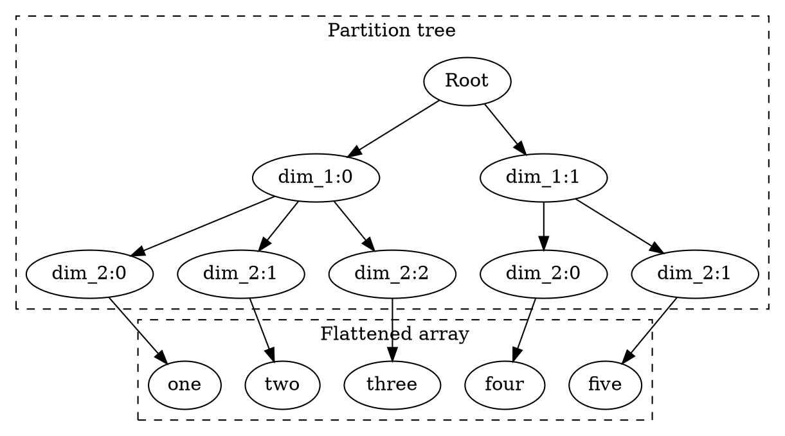

<!-- go/markdown -->

# Koda Fundamentals

This guide goes through fundamentals in Koda. It is highly recommended to read
through the guide in order for new users to use Koda effectively.

Also see [Koda Cheatsheet](cheatsheet.md) for quick references and
[Koda Common Pitfalls and Gotchas](common_pitfalls.md) for common pitfalls and
frequent misunderstandings.

* TOC
{:toc}

## Vectorization of Structured Data

Koda introduces new data structures and concepts which allow working with any
kind of structured data in a vectorized form. That is, it supports not only
working with tables, columns, tensors or arrays, but also with nested structs,
pytrees, protos and graphs.

### DataSlices

**DataSlices** are **arrays** with **partition trees** associated with them that
are stored and manipulated as **jagged arrays** (irregular multi-dimensional
arrays). Such partition trees are called **JaggedShape** and these two terms are
used interchangeably through this guide.

Elements of DataSlices are **items** which enable working with all types of data
through vectorized operations.

DataSlices are specialized to work with hierarchies (aggregation from outer to
inner layers), and **shouldn't** be compared to tensors, Numpy arrays or even
nested lists (different types of broadcasting, transformations etc.).

Primitive DataSlices contain elements of a primitive type (e.g.
ints/strings/floats). Note, in future we also plan to support DataSlices of
tensors, and tensors will be treated as primitives (i.e. similar to strings).

There can be also **DataSlices of lists**, **DataSlices of dicts** and
**DataSlices of entities with attributes** which will be discussed in the
[DataSlice of Structured Data](#structured_data) section later.

All the leaves (items) have the same depth, which is the same as the number of
dimensions of the jagged array.

For example, the following DataSlice has 2 dimensions and 5 items. The first
dimension has 2 items and the second dimension has 5 items partitioned as `[3,
2]`.

```py
>>> from koladata import kd

>>> kd.slice([["one", "two", "three"], ["four", "five"]]) # 2-dims
DataSlice([['one', 'two', 'three'], ['four', 'five']], schema: STRING, present: 5/5)

# fails, as all the leaves must have the same depth
>>> kd.slice([1, [2, 3]])
Traceback (most recent call last):
  ...
ValueError: input has to be a valid nested list. non-lists and lists cannot be mixed in a level
```

Conceptually, it can be thought of as a partition tree + a flattened array as
shown in the graph below.


```dot
digraph {
  Root -> "dim_1:0"
  Root -> "dim_1:1"
  "dim_1:0" -> "dim_2:0"
  "dim_1:0" -> "dim_2:1"
  "dim_1:0" -> "dim_2:2"
  "dim_2:0 bis" [label = "dim_2:0"]
  "dim_2:1 bis" [label = "dim_2:1"]
  "dim_1:1" -> "dim_2:0 bis"
  "dim_1:1" -> "dim_2:1 bis"
  "dim_2:0" -> one
  "dim_2:1" -> two
  "dim_2:2" -> three
  "dim_2:0 bis" -> four
  "dim_2:1 bis" -> five

  subgraph cluster_x {
    graph [style="dashed", label="Partition tree"]
    Root;"dim_1:0";"dim_1:1";"dim_2:0";"dim_2:1";"dim_2:2";"dim_2:0 bis";"dim_2:1 bis";
  }

  subgraph cluster_y {
    graph [style="dashed", label="Flattened array"]
    one;two;three;four;five
  }
}
```

DataSlices have methods that allow working with them as with jagged arrays.

```py
# Root
# ├── dim_1:0
# │   ├── dim_2:0
# │   │   ├── dim_3:0 -> 1
# │   │   └── dim_3:1 -> 2
# │   └── dim_2:1
# │       ├── dim_3:0 -> 3
# │       ├── dim_3:1 -> 4
# │       └── dim_3:2 -> 5
# └── dim_1:1
#     ├── dim_2:0
#     │   └── dim_3:0 -> 6
#     ├── dim_2:1 (Empty)
#     └── dim_2:2
#         ├── dim_3:0 -> 7
#         ├── dim_3:1 -> 8
#         ├── dim_3:2 -> 9
#         └── dim_3:3 -> 10
>>> ds = kd.slice([[[1, 2], [3, 4, 5]], [[6], [], [7, 8, 9, 10]]])

>>> ds.get_size() # total array size: number of items (leaves)
DataItem(10, schema: INT64)
>>> ds.get_ndim()
DataItem(3, schema: INT64)

# JaggedShape: number of items (leaves) at each dimension (level)
>>> ds.get_shape()
JaggedShape(2, [2, 3], [2, 3, 1, 0, 4])

# kd.index returns the index based on the last dimension
>>> kd.index(ds)
DataSlice([[[0, 1], [0, 1, 2]], [[0], [], [0, 1, 2, 3]]], schema: INT64, present: 10/10)

# can specify which dimension to use to get index
>>> kd.index(ds, dim=2)  # the same as above, as there are 3 dimensions
DataSlice([[[0, 1], [0, 1, 2]], [[0], [], [0, 1, 2, 3]]], schema: INT64, present: 10/10)
>>> kd.index(ds, dim=0)
DataSlice([[[0, 0], [0, 0, 0]], [[1], [], [1, 1, 1, 1]]], schema: INT64, present: 10/10)

>>> kd.agg_size(ds)  # - last dimension sizes
DataSlice([[2, 3], [1, 0, 4]], schema: INT64, present: 5/5)
```

DataSlices have their own set of operations to navigate them.

IMPORTANT: `ds[1][2][0]` means a very different thing for the DataSlices
compared to tensors or nested lists (it is used for working with **DataSlices of
lists** which are discussed in the
[DataSlice of Structured Data](#structured_data) section later). Use
`ds.L[1].L[2].L[0]` or `ds.S[1, 2, 0]` to achieve the same behavior.

```py
# It's possible to navigate DataSlices as "nested" lists using .L,
# which gives a "subtree", and makes DataSlices browseable as normal nested lists
>>> ds = kd.slice([[[1, 2], [3, 4, 5]], [[6], [], [7, 8, 9, 10]]])
>>> ds.L[1]
DataSlice([[6], [], [7, 8, 9, 10]], schema: INT32, present: 5/5)
>>> ds.L[1].L[2].L[0]
DataItem(7, schema: INT32)
>>> len(ds.L)  # 2 - number of children/lists at the first dimension
2

>>> ds = kd.slice([[1,2,3], [4,5]])

# Use .L to iterate through DataSlices as normal python nested lists
>>> [int(y) + 1 for x in ds.L for y in x.L]
[2, 3, 4, 5, 6]
>>> [int(kd.sum(ds.L[i])) for i in range(len(ds.L))]
[6, 9]

# Or use to_pylist to work with python lists of DataSlices
>>> [int(y) + 1 for x in kd.to_pylist(ds) for y in kd.to_pylist(x)]
[2, 3, 4, 5, 6]
```

It's possible to subslice DataSlices across multiple dimensions directly using
`.S`.

```py
>>> ds = kd.slice([[[1, 2], [3, 4, 5]], [[6], [], [7, 8, 9, 10]]])
>>> ds.S[1, 2, 0]
DataItem(7, schema: INT32)
>>> kd.subslice(ds, 1, 2, 0)  # the same as above
DataItem(7, schema: INT32)
>>> kd.testing.assert_equivalent(ds.S[:, :, :], ds)
>>> ds.S[1:, :, :2]
DataSlice([[[6], [], [7, 8]]], schema: INT32, present: 3/3)
>>> kd.subslice(ds, slice(1, None), slice(None, None), slice(None, 2))  # the same as above
DataSlice([[[6], [], [7, 8]]], schema: INT32, present: 3/3)
>>> # keep only the first 2 items from the *last* dimension
>>> ds.S[..., :2]
DataSlice([[[1, 2], [3, 4]], [[6], [], [7, 8]]], schema: INT32, present: 7/7)
>>> # for subslicing the last dimension can skip ...
>>> ds.S[:2]  # the same as above
DataSlice([[[1, 2], [3, 4]], [[6], [], [7, 8]]], schema: INT32, present: 7/7)
>>> # Take the 0th item in the last dimension
>>> ds.S[..., 0]
DataSlice([[1, 3], [6, None, 7]], schema: INT32, present: 4/5)
>>> ds.S[0]  # the same as the above
DataSlice([[1, 3], [6, None, 7]], schema: INT32, present: 4/5)
>>> ds.take(0)  # the same as the above
DataSlice([[1, 3], [6, None, 7]], schema: INT32, present: 4/5)
```

We can convert DataSlices back into Python nested lists.

```py
>>> ds = kd.slice([[[1, 2], [3, 4, 5]], [[6], [], [7, 8, 9, 10]]])
>>> ds.to_py()  # normal python list
[[[1, 2], [3, 4, 5]], [[6], [], [7, 8, 9, 10]]]
>>> kd.testing.assert_equivalent(kd.slice(ds.to_py()), ds)
>>> ds.to_py()[0][1][2]  # the same as ds.L[0].L[1].L[2].to_py()
5
```

### Vectorized Operators

One can manipulate DataSlice's jagged shape (i.e. partition tree) without
touching the actual array values.

```py
>>> ds = kd.slice([[[1, 2], [3, 4, 5]], [[6], [], [7, 8, 9, 10]]])
>>> ds.flatten()
DataSlice([1, 2, 3, 4, 5, 6, 7, 8, 9, 10], schema: INT32, present: 10/10)
>>> ds.flatten(-2)  # the last two dimensions are flattened
DataSlice([[1, 2, 3, 4, 5], [6, 7, 8, 9, 10]], schema: INT32, present: 10/10)
>>> ds.flatten(-2, 0)  # the same as above
DataSlice([[[[1, 2], [3, 4, 5]]], [[[6], [], [7, 8, 9, 10]]]], schema: INT32, present: 10/10)
>>> kd.testing.assert_equivalent(ds.flatten(-1), ds)  # no-op

# Use reshape_as to reshape to the shape of a DataSlice of the same size
>>> ds1 = kd.slice([[10, 20, 30], [40, 50, 60], [70, 80, 90, 100]])
>>> ds.reshape(ds1.get_shape())
DataSlice([[1, 2, 3], [4, 5, 6], [7, 8, 9, 10]], schema: INT32, present: 10/10)
>>> ds.reshape_as(ds1)  # the same as above
DataSlice([[1, 2, 3], [4, 5, 6], [7, 8, 9, 10]], schema: INT32, present: 10/10)

# Flatten and restore shape
>>> ds1 = ds.flatten()
>>> kd.testing.assert_equivalent(ds1.reshape_as(ds), ds)
```

Also one can apply vectorized operations without changing the associated jagged
shape.

```py
>>> ds = kd.slice([[[1, 2], [3, 4, 5]], [[6], [], [7, 8, 9, 10]]])
>>> ds * 2
DataSlice([[[2, 4], [6, 8, 10]], [[12], [], [14, 16, 18, 20]]], schema: INT32, present: 10/10)
>>> kd.val_like(ds, 5)
DataSlice([[[5, 5], [5, 5, 5]], [[5], [], [5, 5, 5, 5]]], schema: INT32, present: 10/10)
>>> kd.math.log10(ds)
DataSlice([
  [[0.0, 0.30...], [0.47..., 0.60..., 0.69...]],
  [[0.77...], [], [0.84..., 0.90..., 0.95..., 1.0]],
], schema: FLOAT32, present: 10/10)
>>> kd.map_py(lambda x: x * 3, ds)
DataSlice([[[3, 6], [9, 12, 15]], [[18], [], [21, 24, 27, 30]]], schema: INT32, present: 10/10)
>>> kd.sort(ds, descending=True)
DataSlice([[[2, 1], [5, 4, 3]], [[6], [], [10, 9, 8, 7]]], schema: INT32, present: 10/10)
>>> kd.reverse(ds)
DataSlice([[[2, 1], [5, 4, 3]], [[6], [], [10, 9, 8, 7]]], schema: INT32, present: 10/10)
```

**Aggregational operations** reduce the number of dimensions in the partition
tree.

```py
>>> ds = kd.slice([[[1, 2], [3, 4, 5]], [[6], [], [7, 8, 9, 10]]])
>>> kd.agg_size(ds)
DataSlice([[2, 3], [1, 0, 4]], schema: INT64, present: 5/5)
>>> kd.agg_max(ds)
DataSlice([[2, 5], [6, None, 10]], schema: INT32, present: 4/5)
>>> kd.agg_max(ds, ndim=2)
DataSlice([5, 10], schema: INT32, present: 2/2)

# can change number of dimensions to be passed into map_py
# min over the last two dimensions
>>> kd.map_py(lambda x: min([b for a in x for b in a], default=None), ds, ndim=2)
DataSlice([1, 6], schema: INT32, present: 2/2)

# map_py can be used simply for debugging:
>>> kd.map_py(lambda x: print(x), ds, ndim=2)
[[1, 2], [3, 4, 5]]
[[6], [], [7, 8, 9, 10]]
DataSlice([None, None], schema: NONE, present: 0/2)
```

**Collapse** is a convenient way to reduce the number of dimensions, and replace
them with the common value if all are the same or None.

```py
>>> ds = kd.slice([[1, 1], [2, None, 2], [2, 3, 4]])
>>> kd.collapse(ds)
DataSlice([1, 2, None], schema: INT32, present: 2/3)
>>> kd.collapse(kd.val_like(ds, 10))
DataSlice([10, 10, 10], schema: INT32, present: 3/3)
>>> kd.collapse(kd.val_like(ds, 10), ndim=2)
DataItem(10, schema: INT32)
```

Some operations ignore the partition tree altogether.

```py
>>> kd.min(ds)
DataItem(1, schema: INT32)
>>> kd.min(ds.flatten()) # the same as above
DataItem(1, schema: INT32)
>>> kd.agg_min(ds.flatten()) # the same as above, as flatten guarantees 1-dim DataSlice
DataItem(1, schema: INT32)
```

Some operations can actually add dimensions.

```py
>>> kd.range(0, kd.slice([3, 2, 1]))
DataSlice([[0, 1, 2], [0, 1], [0]], schema: INT64, present: 6/6)
>>> kd.item(1).repeat(3).repeat(4)
DataSlice([[1, 1, 1, 1], [1, 1, 1, 1], [1, 1, 1, 1]], schema: INT32, present: 12/12)
>>> # can have different sizes when adding new dimensions
>>> kd.slice([1, 2]).repeat(kd.slice([3, 2]))
DataSlice([[1, 1, 1], [2, 2]], schema: INT32, present: 5/5)

>>> ds = kd.slice([[[1, 2], [3, 4, 5]], [[6], [], [7, 8, 9, 10]]])
>>> kd.zip(ds,9)
DataSlice([
  [[[1, 9], [2, 9]], [[3, 9], [4, 9], [5, 9]]],
  [[[6, 9]], [], [[7, 9], [8, 9], [9, 9], [10, 9]]],
], schema: INT32, present: 20/20)
>>> kd.zip(ds, ds * 10)
DataSlice([
  [[[1, 10], [2, 20]], [[3, 30], [4, 40], [5, 50]]],
  [[[6, 60]], [], [[7, 70], [8, 80], [9, 90], [10, 100]]],
], schema: INT32, present: 20/20)
>>> kd.repeat(ds, 3)
DataSlice([
  [[[1, 1, 1], [2, 2, 2]], [[3, 3, 3], [4, 4, 4], [5, 5, 5]]],
  [[[6, 6, 6]], [], [[7, 7, ...], [...], [...], [...]]],
], schema: INT32, present: 30/30)
>>> kd.stack(ds, ds, ds)
DataSlice([
  [[[1, 1, 1], [2, 2, 2]], [[3, 3, 3], [4, 4, 4], [5, 5, 5]]],
  [[[6, 6, 6]], [], [[7, 7, ...], [...], [...], [...]]],
], schema: INT32, present: 30/30)
>>> kd.stack(ds, ds + 1)
DataSlice([
  [[[1, 2], [2, 3]], [[3, 4], [4, 5], [5, 6]]],
  [[[6, 7]], [], [[7, 8], [8, 9], [9, 10], [10, 11]]],
], schema: INT32, present: 20/20)

# can stack multiple inner dimensions at once
>>> kd.stack(ds, ds, ndim=2)
DataSlice([
  [[[1, 2], [3, 4, 5]], [[1, 2], [3, 4, 5]]],
  [[[6], [], [7, 8, 9, 10]], [[6], [], [7, 8, 9, 10]]],
], schema: INT32, present: 20/20)
```

A few operations change the jagged shape without changing the number of
dimensions.

```py
>>> ds1 = kd.slice([[1, 2], [3]])
>>> ds2 = kd.slice([[4, 5, 6], [7, 8]])
>>> kd.concat(ds1, ds2)
DataSlice([[1, 2, 4, 5, 6], [3, 7, 8]], schema: INT32, present: 8/8)
```

`kd.group_by` creates a new dimension containing the grouped items and
`kd.unique` keeps only unique items. Both don't change the order, meaning
`kd.unique` is the same as `kd.group_by` + `kd.collapse`.

```py
>>> ds = kd.slice([4, 3, 4, 2, 2, 1, 4, 1, 2])
>>> # group
>>> kd.group_by(ds)
DataSlice([[4, 4, 4], [3], [2, 2, 2], [1, 1]], schema: INT32, present: 9/9)
>>> # group and collapse
>>> kd.collapse(kd.group_by(ds))
DataSlice([4, 3, 2, 1], schema: INT32, present: 4/4)
>>> kd.unique(ds)
DataSlice([4, 3, 2, 1], schema: INT32, present: 4/4)

# group by key (or keys)
>>> ds1 = kd.slice([1, 2, 3, 4, 5, 6, 7, 8, 9])
>>> ds2 = kd.slice([1, 2, 1, 3, 3, 4, 1, 4, 3])
>>> kd.group_by(ds1, ds2)
DataSlice([[1, 3, 7], [2], [4, 5, 9], [6, 8]], schema: INT32, present: 9/9)
```

`kd.translate` and `kd.translate_group` are powerful operators to map keys to
values using key=>value mapping.

```py
>>> a = kd.slice([[1, 2, 2, 1], [2, 3]])
>>> b = kd.slice([1, 2, 3])
>>> c = kd.slice([4, 5, 6])
>>> kd.translate(a, b, c)
DataSlice([[4, 5, 5, 4], [5, 6]], schema: INT32, present: 6/6)
>>> kd.dict(b, c)[a]
DataSlice([[4, 5, 5, 4], [5, 6]], schema: INT32, present: 6/6, bag_id:...)

>>> kd.translate(kd.slice([1, 2, 2, 1]), kd.slice([1, 3]), 1)
DataSlice([1, None, None, 1], schema: INT32, present: 2/4)
>>> kd.dict(kd.slice([1, 3]), 1)[kd.slice([1, 2, 2, 1])]
DataSlice([1, None, None, 1], schema: INT32, present: 2/4, bag_id:...)

# kd.translate can be used to translate values into objects/entities
# and can be used to "join" tables
>>> a1 = kd.obj(x=kd.slice([1, 2, 3]), y=kd.slice([10, 20, 30]))
>>> a2 = kd.obj(x=kd.slice([1, 2, 1, 1, 3, 3, 3]), z=kd.slice([1, 2, 3, 4, 5, 6, 7]))
>>> a2 = a2.with_attrs(a1=kd.translate(a2.x, a1.x, a1))  # a1 is a 'column' in a2
>>> a2.a1.y
DataSlice([10, 20, 10, 10, 30, 30, 30], schema: INT32, present: 7/7, bag_id: ...)

# when keys in keys_from can be repeated, use translate_group which would pre-group
# and adds a dimension (without involving implode/explode)
>>> a = kd.slice(['a', 'c', None, 'a'])
>>> b = kd.slice(['a', 'c', 'b', 'c', 'a', 'e'])
>>> c = kd.slice([1, 2, 3, 4, 5, 6])
>>> kd.translate_group(a, b, c)
DataSlice([[1, 5], [2, 4], [], [1, 5]], schema: INT32, present: 6/6)
>>> # the same as above, but slower and more verbose
>>> kd.translate(a, kd.unique(b), kd.implode(kd.group_by(c, b)))[:]
DataSlice([[1, 5], [2, 4], [], [1, 5]], schema: INT32, present: 6/6, bag_id: ...)
```

### Items

Elements of a DataSlice are **items**, where each item can be a primitive, an
entity with attributes, a list or a dict. To support vectorization, Koda has
native versions of primitives/entity/list/dict, which are made as close to
Python as possible.

Moreover, items can be seen as a special case of DataSlices (0-dim DataSlices),
and everything that accepts DataSlices works with items too.

NOTE: more types of data structures will be supported soon (tensors and sets in
particular).

Items are immutable (primitives, entities, lists and dicts), but it's possible
to make them mutable for advanced workflows.

Primitive types include `kd.INT32`, `kd.INT64`, `kd.FLOAT32`, `kd.FLOAT64`,
`kd.STRING`, `kd.BYTES`, `kd.BOOLEAN` and `kd.MASK`. `kd.MASK` is a special type
representing presence which will be covered in the
[Sparsity and Logical Operators](#sparsity) section later.

There is also `kd.ITEMID` which will be covered in the
[ItemIds, UUIDs and Hashes](#itemid) section later too.

Use `kd.item`, `kd.from_py` or `kd.new` to create primitive items. `kd.item`
takes mostly primitives while `kd.new` and `kd.from_py` are more powerful but
also accept primitives.

```py
>>> kd.item(123)
DataItem(123, schema: INT32)
>>> kd.int32(123) # the same as above
DataItem(123, schema: INT32)
>>> kd.item("hello world")
DataItem('hello world', schema: STRING)
>>> kd.str("hello world") # the same as above
DataItem('hello world', schema: STRING)

>>> kd.from_py("hello world")
DataItem('hello world', schema: OBJECT)
>>> kd.to_py(kd.item(123))  # python's int
123
>>> kd.item(123).to_py()  # the same as above
123
>>> int(kd.item(123))  # the same as above
123
>>> str(kd.item("hello"))  # python's string
'hello'
>>> kd.present  # Koda's "True", or mask value indicating a 'present' item
DataItem(present, schema: MASK)
>>> kd.missing  # Koda's "False", or mask value indicating a 'missing' item
DataItem(missing, schema: MASK)
>>> kd.item(5) > 3  # kd.present - Koda's True
DataItem(present, schema: MASK)
>>> ~(kd.item(5) > 3)  # kd.missing - Koda's False
DataItem(missing, schema: MASK)
>>> kd.item(None)  # missing item with none schema/dtype
DataItem(None, schema: NONE)

>>> assert kd.is_primitive(kd.item(123))
```

Items are also considered to be 0-dim DataSlices.

```py
>>> kd.is_slice(kd.item(1))
DataItem(present, schema: MASK)
>>> kd.is_item(kd.slice([1, 2, 3, 4]))
DataItem(missing, schema: MASK)
>>> kd.item(1).get_ndim()
DataItem(0, schema: INT64)
>>> kd.item(1).get_shape()
JaggedShape()

# flatten() - universal convertor into 1-dim DataSlices
>>> kd.item(1).flatten()
DataSlice([1], schema: INT32, present: 1/1)

>>> kd.stack(kd.item(1), kd.item(2), kd.item(3))
DataSlice([1, 2, 3], schema: INT32, present: 3/3)
>>> kd.item(1).repeat(2).repeat(3)
DataSlice([[1, 1, 1], [1, 1, 1]], schema: INT32, present: 6/6)
>>> kd.item(1).reshape_as(kd.slice([[[8]]]))
DataSlice([[[1]]], schema: INT32, present: 1/1)
```

**Lists**, similar to python, represent "lists" (not DataSlices!) of items:

```py
# Create lists
>>> a = kd.list([1, 2, 3, 4]); a
DataItem(List[1, 2, 3, 4], schema: LIST[INT32], bag_id: ...)

>>> a = kd.from_py([1, 2, 3, 4])  # the same as above

>>> assert not kd.is_primitive(a)
>>> assert kd.is_list(a)

# Create nested lists
>>> l1 = kd.list([[1, 2, 3, 4], [5, 6, 7, 8]]); l1
DataItem(List[List[1, 2, 3, 4], List[5, 6, 7, 8]], schema: LIST[LIST[INT32]], bag_id: ...)

>>> l2 = kd.from_py([[1, 2, 3, 4], [5, 6, 7, 8]]); l2   # the same as above, but with OBJECT schema
DataItem(List[List[1, 2, 3, 4], List[5, 6, 7, 8]], schema: OBJECT, bag_id: ...)

# Convert back to python
>>> kd.list([1, 2, 3, 4]).to_py()  # back to python list
[1, 2, 3, 4]

# Check with lists
>>> a.list_size()
DataItem(4, schema: INT64)

>>> assert a.is_list() # works for non-list items too

# Access lists
>>> a = kd.list([1, 2, 3, 4])
>>> a[2]
DataItem(3, schema: INT32, bag_id: ...)

>>> kd.get_item(a, 2)  # the same as above
DataItem(3, schema: INT32, bag_id: ...)

>>> a = kd.list([[1, 2, 3, 4], [5, 6, 7, 8]])
>>> a[1][2]
DataItem(7, schema: INT32, bag_id: ...)

# Iterate in python (lists or nested lists)
>>> a = kd.list([[1, 2, 3, 4], [5, 6, 7, 8]])
>>> [int(t) for b in a for t in b]
[1, 2, 3, 4, 5, 6, 7, 8]

# Convert the last dimension into a list
>>> kd.implode(kd.slice([1, 2, 3, 4]))
DataItem(List[1, 2, 3, 4], schema: LIST[INT32], bag_id: ...)

# For a DataSlice with multiple dimensions, need to apply kd.implode multiple times
>>> a = ([[1, 2, 3, 4], [5, 6, 7, 8]])
>>> res_list = kd.implode(kd.implode(kd.slice(a)))
>>> kd.testing.assert_equivalent(res_list, kd.list(a))
>>> res_list
DataItem(List[List[1, 2, 3, 4], List[5, 6, 7, 8]], schema: LIST[LIST[INT32]], bag_id: ...)

# Or use kd.implode(a, ndim=-1)
>>> kd.testing.assert_equivalent(kd.implode(kd.slice(a), ndim=-1), res_list)
```

IMPORTANT: slicing operators over lists (e.g. `a[1:]`) do not return lists, but
DataSlices with plus-one dimension (explosion operation which is discussed in
the [DataSlice of Structured Data](#structured_data) section later).

Lists can be also looked up with DataSlices. Use `kd.implode` to convert
DataSlices (their last dimension) back into lists.

```py
>>> a = kd.list([1, 2, 3, 4])
>>> a[:]  # 1-dim slice
DataSlice([1, 2, 3, 4], schema: INT32, present: 4/4, bag_id: ...)

>>> a[1:]
DataSlice([2, 3, 4], schema: INT32, present: 3/3, bag_id: ...)

>>> a[kd.slice([1, 3])]
 DataSlice([2, 4], schema: INT32, present: 2/2, bag_id: ...)

>>> a[kd.range(2)]  # the same as a[:2]
DataSlice([1, 2], schema: INT32, present: 2/2, bag_id: ...)

>>> a.select_items(lambda x: x>=2)
DataSlice([2, 3, 4], schema: INT32, present: 3/3, bag_id: ...)

>>> kd.testing.assert_equivalent(kd.implode(a[:]), a)

>>> kd.implode(a[1:])
DataItem(List[2, 3, 4], schema: LIST[INT32], bag_id: ...)
```

Lists are immutable by default. But we can easily create new a list by
concatenating lists or appending elements to the original list. These new lists
have different ItemIds rather than the same ItemId as the original lists.

```py
>>> x = kd.list([1, 2, 3, 4])
>>> y = kd.list([5, 6, 7, 8])
>>> l1 = kd.concat_lists(x, y); l1
DataItem(List[1, 2, 3, 4, 5, 6, 7, 8], schema: LIST[INT32], bag_id: ...)
>>> kd.testing.assert_equivalent(l1, kd.implode(kd.concat(x[:], y[:])))

# Append a single item
>>> kd.appended_list(x, 5)
DataItem(List[1, 2, 3, 4, 5], schema: LIST[INT32], bag_id: ...)

# Append multiple items
>>> kd.appended_list(x, kd.slice([7, 8]))
DataItem(List[1, 2, 3, 4, 7, 8], schema: LIST[INT32], bag_id: ...)

>>> x = kd.obj(y=kd.list([1, 2, 3, 4]), z=kd.list([5, 6, 7, 8]), u=4)
>>> x = x.with_attrs(a=kd.concat_lists(x.y, x.z))
>>> x = x.with_attrs(b=kd.appended_list(x.y, x.u))  # append one value
```

Alternatively, lists can be updated. Updated lists share the same ItemId with
the original lists. Using list updates can be tricky and see the
[Immutable Workflows](#immutable-workflows) section for details.

```py
>>> l = kd.list([1, 2, 3])
>>> l1 = l.with_list_append_update(4); l1
DataItem(List[1, 2, 3, 4], schema: LIST[INT32], bag_id: ...)

>>> l2 = l.with_list_append_update(kd.slice([5, 6])); l2
DataItem(List[1, 2, 3, 5, 6], schema: LIST[INT32], bag_id: ...)

# l stays the same as it is immutable
>>> l
DataItem(List[1, 2, 3], schema: LIST[INT32], bag_id: ...)
```

**Dicts** can be created in a way similar to lists, and are immutable by
default.

```py
# Multiple ways to achieve the same
>>> d = kd.dict({'a': 1, 'b': 2, 'c': 4})
>>> d = kd.from_py({'a': 1, 'b': 2, 'c': 4})
>>> assert not kd.is_primitive(d)
>>> assert kd.is_dict(d)

>>> d1 = kd.dict(kd.slice(['a', 'b']), kd.slice([1, 2]))
>>> d2 = d1.with_dict_update('c', 4)
>>> d3 = d1.with_dict_update(kd.dict({'c': 4, 'd': 6}))
>>> d4 = d1.with_dict_update(kd.slice(['c', 'd']), kd.slice([4, 6]))

# d1 stays the same as it is immutable
>>> kd.testing.assert_equivalent(d1, kd.dict(kd.slice(['a', 'b']), kd.slice([1, 2])))

# dict updates can be created separately and applied later
>>> d = kd.dict({'a': 1})
>>> upd1 = kd.dict_update(d, 'b', 2)  # need to specify d
>>> upd2 = kd.dict_update(d, 'c', 4)
>>> kd.testing.assert_equivalent(d.updated(upd1, upd2), kd.dict({'a':1, 'b':2, 'c':4}))

>>> upd = kd.dict_update(d, kd.dict({'b': 2, 'c': 4}))
>>> kd.testing.assert_equivalent(d.updated(upd), kd.dict({'a': 1, 'b': 2, 'c': 4}))

>>> d = kd.dict({'a':1, 'b':2, 'c':4})
>>> d.with_dict_update('a', None) # rather than Dict{'b'=2, 'c'=4}
DataItem(Dict{...'a'=None...}, schema: DICT{STRING, INT32}, bag_id: ...)
```

Dicts can be looked up and have `get_keys()` and corresponding `get_values()`,
with `my_dict[:]` a shortcut for `my_dict.get_values()`.

NOTE: the keys are not guaranteed to be sorted!

```py
>>> d = kd.dict({'a':7, 'g':2, 'c':4})
>>> kd.dict_size(d)
DataItem(3, schema: INT64)
>>> d['g']
DataItem(2, schema: INT32, bag_id: ...)
>>> kd.get_item(d, 'g')  # the same as above
DataItem(2, schema: INT32, bag_id: ...)
>>> d[kd.slice(['a' , 'c'])]
DataSlice([7, 4], schema: INT32, present: 2/2, bag_id: ...)

# get_keys() can be used to get the keys, but the order is non-deterministic
>>> _ = d.get_keys()  # 1-dim slice kd.slice(['a', 'c', 'b']) or other permutation
>>> kd.sort(d.get_keys())
DataSlice(['a', 'c', 'g'], schema: STRING, present: 3/3, bag_id: ...)

>>> keys = d.select_keys(lambda x: x>='b'); kd.sort(keys)
DataSlice(['c', 'g'], schema: STRING, present: 2/2, bag_id: ...)
>>> values = d.get_values(); kd.sort(values)  # 1-dim slice
DataSlice([2, 4, 7], schema: INT32, present: 3/3, bag_id: ...)
>>> kd.testing.assert_equivalent(d[d.get_keys()], d.get_values())  # the same as above
>>> values = d.select_values(lambda x: x<=2); kd.sort(values)
DataSlice([2], schema: INT32, present: 1/1, bag_id: ...)
>>> kd.testing.assert_equivalent(kd.dict(d.get_keys(), d.get_values()), d)

# zip key, value in sorted order
>>> zipped = kd.zip(kd.sort(d.get_keys()), kd.sort(d.get_values(), d.get_keys())); zipped
DataSlice([['a', 7], ['c', 4], ['g', 2]], schema: OBJECT, present: 6/6, bag_id: ...)
>>> zipped2 = kd.zip(keys:=kd.sort(d.get_keys()), d[keys]) # the same as above
>>> kd.testing.assert_equivalent(zipped, zipped2)

# Check if item is a dict
>>> assert d.is_dict()

# Iterate in python (need to convert get_keys DataSlice into list)
>>> values = [int(d[key]) for key in kd.implode(d.get_keys())]; sorted(values)
[2, 4, 7]

# The same
>>> values2 = [int(d[key]) for key in d.get_keys().L]
>>> assert sorted(values) == sorted(values2)
```

It's possible to create and work with structured objects called **entities**.
Entities have schemas, which can be distinguished by name, auto-allocated or
explicitly created. When creating or working with DataSlices of entities, all
entities must have the same schema.

```py
>>> kd.new(x=1, y=2, schema='Point')
DataItem(Entity(x=1, y=2), schema: Point(x=INT32, y=INT32), bag_id:...)
>>> r = kd.new(x=1, y=2, z=kd.new(a=3, b=4, schema='Data'), schema='PointWithData')  # nested Entity
>>> r.z.a
DataItem(3, schema: INT32, bag_id:...)

# kd.new can also auto-allocate schemas
>>> kd.testing.assert_equivalent(kd.new(x=1, y=2, schema='Point') , kd.new(x=1, y=2, schema='Point'))
>>> kd.testing.assert_not_equal(kd.new(x=1, y=2).get_schema(), kd.new(x=1, y=2).get_schema())  # they get different schemas.

# Schemas can also be created explicitly.
# kd.named_schema('Point') creates exactly the same schemas as the one created
# by schema='Point'
>>> my_schema = kd.named_schema('Point')
>>> kd.new(x=1, y=2, schema=my_schema)  # set explicit schema
DataItem(Entity(x=1, y=2), schema: Point(x=INT32, y=INT32), bag_id:...)
>>> assert kd.new(x=1, y=2, schema='Point').get_schema() == kd.new(x=1, y=2, schema=my_schema).get_schema()

>>> kd.slice([kd.new(x=1, y=2), kd.new(x=2, y=3)]) # fails, as entities have different scheams
Traceback (most recent call last):
  ...
ValueError: cannot find a common schema
  ...

>>> kd.slice([kd.new(x=1, y=2, schema=my_schema), kd.new(x=2, y=3, schema=my_schema)]) # works
DataSlice([Entity(x=1, y=2), Entity(x=2, y=3)], schema: Point(x=INT32, y=INT32), present: 2/2, bag_id:...)
>>> kd.slice([kd.new(x=1, y=2, schema='Point'), kd.new(x=2, y=3, schema='Point')]) # works
DataSlice([Entity(x=1, y=2), Entity(x=2, y=3)], schema: Point(x=INT32, y=INT32), present: 2/2, bag_id:...)

>>> a, b = kd.new(x=1, y=2), kd.new(x=2, y=3)
>>> kd.slice([a.with_schema(my_schema), b.with_schema(my_schema)])  # works
DataSlice([Entity():$..., Entity():$...], schema: Point(), present: 2/2, bag_id: ...
>>> kd.slice([a, b.with_schema(a.get_schema())])  # works
DataSlice([Entity(x=1, y=2), Entity(x=2, y=3)], schema: ENTITY(x=INT32, y=INT32), present: 2/2, bag_id:...)
```

Entities are immutable, and have special APIs to modify attributes (including
deep ones).

```py
>>> r = kd.new(x=1, y=2, schema='Point')

# Use with_attrs to create a version with updated attributes
>>> updated1 = r.with_attrs(z=4, y=10); updated1
DataItem(Entity(x=1, y=10, z=4), schema: Point(x=INT32, y=INT32, z=INT32), bag_id:...)

# Alternatively, use updated + kd.attrs, which allows also mixing multiple updates
>>> updated2 = r.updated(kd.attrs(r, z=4, y=10)) # the same above
>>> kd.testing.assert_equivalent(updated1, updated2)

# Or can do multiple updates
>>> r.updated(kd.attrs(r, z=4)).updated(kd.attrs(r, y=10))
DataItem(Entity(x=1, y=10, z=4), schema: Point(x=INT32, y=INT32, z=INT32), bag_id:...)
>>> r.updated(kd.attrs(r, z=4), kd.attrs(r, y=10))
DataItem(Entity(x=1, y=10, z=4), schema: Point(x=INT32, y=INT32, z=INT32), bag_id:...)

# Use attr=None to remove attributes
>>> r.with_attrs(x=None)
DataItem(Entity(y=2), schema: Point(x=INT32, y=INT32), bag_id:...)

# kd.attrs makes it possible to update attributes of nested entities.
>>> r = kd.new(x=1, y=2, z=kd.new(a=3, b=4, schema='Data'), schema='PointWithData')
>>> r.updated(kd.attrs(r.z, a=30, c=50))
DataItem(Entity(x=1, y=2, z=Entity(a=30, b=4, c=50)), schema: PointWithData(x=INT32, y=INT32, z=Data(a=INT32, b=INT32, c=INT32)), bag_id:...)
>>> r.with_attrs(z=r.z.with_attrs(a=30, c=50))  # the same as above, but less efficient
DataItem(Entity(x=1, y=2, z=Entity(a=30, b=4, c=50)), schema: PointWithData(x=INT32, y=INT32, z=Data(a=INT32, b=INT32, c=INT32)), bag_id:...)

# In case your attribute names are arbitrary strings and not nice Python identifiers, you
# can use kd.attr/kd.with_attr instead.
>>> r.with_attr('@!^', 7).get_attr('@!^')
DataItem(7, schema: INT32, bag_id:...)

# Note, if some values already exist, newly assigned values must have the same
# schema.
# Use overwrite_schema if need to overwrite schema
>>> r = kd.new(x=1, y=2)

>>> r.with_attrs(y='hello')
Traceback (most recent call last):
  ...
ValueError: the schema for attribute 'y' is incompatible.
 ...

>>> r.with_attrs(y='hello', overwrite_schema=True)  # works
DataItem(Entity(x=1, y='hello'), schema: ENTITY(x=INT32, y=STRING), bag_id:...)

>>> r.updated(kd.attrs(r, y='hello'))
Traceback (most recent call last):
  ...
ValueError: the schema for attribute 'y' is incompatible.
 ...

>>> r.updated(kd.attrs(r, y='hello', overwrite_schema=True))  # works
DataItem(Entity(x=1, y='hello'), schema: ENTITY(x=INT32, y=STRING), bag_id:...)
```

You need to clone or deep-clone entities in order to create copies with
different attributes (similar to working with python objects).

```py
# entities have ItemIds ("pointers"), which stay the same
>>> a = kd.new(x=1, y=2, schema='Point')
>>> r = kd.new(u=a, v=a, schema='Pair')
>>> r = r.updated(kd.attrs(r.u, x=10))  # both r.u.x == r.v.x == 10, as r.u == r.v
>>> r.v.x
DataItem(10, schema: INT32, bag_id: ...)

>>> r = r.updated(kd.attrs(a, y=5))  # now r.u.x == r.v.y == 5, as r.u == r.v == a
>>> r.v.x
DataItem(10, schema: INT32, bag_id: ...)

# use clone to duplicate entities, but keep attributes
>>> a = kd.new(x=1, y=2, schema='Point')
>>> r = kd.new(u=a.clone(), v=a.clone(), schema='Pair')
>>> r = r.updated(kd.attrs(r.u, x=10))  # r.u.x == 10, and r.v.x == 1 (not changed)
>>> r.v.x
DataItem(1, schema: INT32, bag_id: ...)

>>> r = r.updated(kd.attrs(a, x=50))  # nothing would be updated, as a != r.u != r.v
>>> r.u.x
DataItem(10, schema: INT32, bag_id: ...)

# clone is not enough to go deep
>>> a = kd.new(x=kd.obj(m=3, n=4), y=2, schema='ComplexPoint')
>>> r = kd.new(u=a.clone(), v=a.clone(), schema='ComplexPair')
>>> r = r.updated(kd.attrs(r.u.x, m=50))  # changes also r.v.x.m, as a.x wasn't cloned
>>> r.v.x.m
DataItem(50, schema: INT32, bag_id: ...)

# deep_clone clones entities recursively
>>> a = kd.new(x=kd.obj(m=3, n=4), y=2, schema='ComplexPoint')
>>> r = kd.new(u=a.deep_clone(), v=a.deep_clone(), schema='ComplexPair')
>>> r = r.updated(kd.attrs(r.u.x, m=50))  # Now r.v.x.m is not changed
>>> r.v.x.m
DataItem(3, schema: INT32, bag_id: ...)

```

Entities can have lists and dicts as their attributes, which can be updated.

```py
>>> r = kd.new(x=kd.list([1,2]), y=kd.dict({'a':1, 'b':2}), schema='Custom1')
>>> r = r.updated(kd.attrs(r, x=kd.list([4,5])))
>>> r = r.updated(kd.dict_update(r.y, 'c', 4))
```

**Objects**, similar to python objects, make it possible to mix primitives of
different types and/or entities/lists/dicts with different schemas. Objects are
special items which store their own schema as data. Primitives are considered as
objects as their schemas can be inferred from the data. Entities/lists/dicts
store their schemas as a special `__schema__` attribute.

Note: As the most commonly used object type is entity, "objects" often refer to
"entities with embedded schemas" if no other context is provided.

```py
# Create structured objects directly
>>> kd.obj(x=1, y=2)
DataItem(Obj(x=1, y=2), schema: OBJECT, bag_id:...)

>>> kd.obj(x=1, z=kd.obj(a=3, b=4))
DataItem(Obj(x=1, z=Obj(a=3, b=4)), schema: OBJECT, bag_id: ...)

# Convert primitives or entities into objects
>>> kd.obj(1)
DataItem(1, schema: OBJECT, bag_id: ...)
>>> kd.obj(kd.new(x=1, y=2))  # similar to kd.obj(x=1, y=2), with some differences discussed later
DataItem(Obj(x=1, y=2), schema: OBJECT, bag_id: ...)

# Convert python list of dicts of lists of dicts
# from_py returns an object by default when no schema is provided
>>> x = kd.from_py([{'d': [{'a': 1, 'b': 2}, {'a': 3, 'b': 4}]}, {'d': [{'a': 5, 'b': 6}]}])
>>> x[1]['d'][0]['a']
DataItem(5, schema: OBJECT, bag_id: ...)
>>> res = x[0]['d'][1].get_values(); kd.sort(res)
DataSlice([3, 4], schema: OBJECT, present: 2/2, bag_id:...)

# Convert python dicts into objects
>>> x = kd.from_py([{'d': [{'a': 1, 'b': 2}, {'a': 3, 'b': 4}]}, {'d': [{'a': 5, 'b': 6}]}],
...                dict_as_obj=True)
>>> x[1].d[0].a
DataItem(5, schema: OBJECT, bag_id: ...)
>>> x[0].get_attr('e', default=4)  # get_attr with default
DataItem(4, schema: INT32, bag_id: ...)
>>> x[0].d[1].maybe('z')  # None if missing
DataItem(None, schema: NONE, bag_id: ...)

# Convert python dicts into objects
>>> x = kd.from_py([{'x': [1, {'a':1, 'b':2}, 2], 'y':4}, 10],
...                dict_as_obj=True); x
DataItem(List[Obj(x=List[1, Obj(a=1, b=2), 2], y=4), 10], schema: OBJECT, bag_id: ...)
>>> x[0].x[1].a
DataItem(1, schema: OBJECT, bag_id: ...)
>>> x[1]
DataItem(10, schema: OBJECT, bag_id: ...)

# Create a DataSlice mixing different objects (including primitives):
>>> kd.slice([kd.obj(1), kd.obj("hello"), kd.obj(kd.new(x=1, y=2)),
...           kd.obj(a=3)])
DataSlice([1, 'hello', Obj(x=1, y=2), Obj(a=3)], schema: OBJECT, present: 4/4, bag_id: ...)

# Can create objects from dataclasses
>>> from dataclasses import dataclass
>>> @dataclass()
... class A:
...   x: int
...   y: str
>>> py_obj = A(x=1, y='a')
>>> kd.from_py(py_obj)
DataItem(Obj(x=1, y='a'), schema: OBJECT, bag_id: ...)

# Can convert back to python
>>> x = kd.from_py([{'d': [{'a': 1, 'b': 2}, {'a': 3, 'b': 4}]},
...  {'d': [{'a': 5, 'b': 6}]}])
>>> kd.to_py(x) # only one level is converted to pure python
[{'d': DataItem(List[Dict{...'a'=1...}, Dict{...'a'=3...}], schema: OBJECT, bag_id: ...)}, {'d': DataItem(List[Dict{...'a'=5...}], schema: OBJECT, bag_id: ...)}]
>>> kd.to_py(x, max_depth=-1) # completely converted
[{'d': [{...}, {...}]}, {'d': [{...}]}]
>>> x.to_py(max_depth=-1) #  the same as above
[{'d': [{...}, {...}]}, {'d': [{...}]}]

# Convert python dicts as koda dicts
>>> input_dict = {'x':1, 'y':'a'}
>>> x = kd.from_py(input_dict)
>>> x.to_py(max_depth=-1) # convert koda dicts to python dicts; please note: Koda dicts don't preserve the order.
{...'x': 1...}

# Use `output_class` to specify the output type explicitly

>>> assert isinstance(kd.from_py(py_obj).to_py(output_class=A), A)

# from_py/to_py are more general versions of to/from py conversions,
# while from_pytree/to_pytree specialize to work with nested dicts/lists
>>> kd.obj(x=1,y=2).to_py()
Obj(x=1, y=2)
>>> kd.obj(x=1,y=2).to_py().x
1
>>> kd.obj(x=1,y=2).to_pytree()
{'x': 1, 'y': 2}
>>> kd.obj(x=1,y=2).to_pytree()['x']
1
>>> kd.obj(x=1,y=2).to_py(obj_as_dict=True)
{'x': 1, 'y': 2}
```

Objects can be edited similar to entities, but restrictions are relaxed as with
python objects.

```py
>>> a = kd.obj(x=1, y=kd.obj(u=2, v=3)); a
DataItem(Obj(x=1, y=Obj(u=2, v=3)), schema: OBJECT, bag_id: ...)

>>> a = a.with_attrs(x=None, z=4); a
DataItem(Obj(x=None, y=Obj(u=2, v=3), z=4), schema: OBJECT, bag_id: ...)

>>> a = a.updated(kd.attrs(a.y, v=None, w=5)); a
DataItem(Obj(x=None, y=Obj(u=2, v=None, w=5), z=4), schema: OBJECT, bag_id: ...)

# Note no need to set overwrite_schema=True
>>> a.with_attrs(x='hello')
DataItem(Obj(x='hello', y=Obj(u=2, v=None, w=5), z=4), schema: OBJECT, bag_id: ...)
```

Similar to entities, lists and dicts can be objects too.

```py
>>> l1 = kd.list([1, 2])
>>> l2 = kd.list(['3', '4'])
>>> kd.slice([l1, l2])  # fails, as l1 and l2 have different schemas
Traceback (most recent call last):
  ...
ValueError: cannot find a common schema
  ...

>>> l_objs = kd.slice([kd.obj(l1), kd.obj(l2)])
>>> l_objs[:]
DataSlice([[1, 2], ['3', '4']], schema: OBJECT, present: 4/4, bag_id: ...)

>>> d1 = kd.dict({'a': 1})
>>> d2 = kd.dict({2: True})
>>> kd.slice([d1, d2])
Traceback (most recent call last):
  ...
ValueError: cannot find a common schema
  ...

>>> d_objs = kd.slice([kd.obj(d1), kd.obj(d2)])
>>> d_objs[:]
DataSlice([[1], [True]], schema: OBJECT, present: 2/2, bag_id: ...)
```

Creation of entities, dicts, lists and objects allocates new **128-bit ids**
called **ItemIds** (similar to pointers in C++). It's possible also to create
**universally unique** entities, dicts, list and objects by using their `uu`
versions.

```py
>>> assert kd.new(x=1, y=2).get_itemid() != kd.new(x=1, y=2).get_itemid()
>>> assert kd.obj(x=1, y=2).get_itemid() != kd.obj(x=1, y=2).get_itemid()
>>> assert kd.list([1,2]).get_itemid() != kd.list([1,2]).get_itemid()
>>> assert kd.uu(x=1, y=2).get_itemid() == kd.uu(x=1, y=2).get_itemid()
>>> assert kd.uuobj(x=1, y=2).get_itemid() == kd.uuobj(x=1, y=2).get_itemid()
```

`uu` versions of entities and objects can be used as named tuples.

```py
>>> d = kd.dict({kd.uu(x=1, y=2): 'a'})
>>> d = d.with_dict_update(kd.uu(x=3, y=4), 'b')
>>> d[kd.uu(x=3, y=4)]
DataItem('b', schema: STRING, bag_id: ...)
>>> d[kd.uu(x=5, y=6)]
DataItem(None, schema: STRING, bag_id: ...)
>>> d[kd.new(x=3, y=4)]  # fail, as a key with different schema
Traceback (most recent call last):
  ...
ValueError: the schema for keys is incompatible.
  ...
```

### Schemas

Primitive DataSlices have schemas which are also called dtypes.

```py
>>> kd.slice([1, 2, 3])
DataSlice([1, 2, 3], schema: INT32, present: 3/3)
>>> kd.slice([1, 2, 3], schema=kd.INT32)
DataSlice([1, 2, 3], schema: INT32, present: 3/3)
>>> kd.slice([1, 2, 3], schema=kd.INT64)
DataSlice([1, 2, 3], schema: INT64, present: 3/3)
>>> kd.int64([1, 2, 3])
DataSlice([1, 2, 3], schema: INT64, present: 3/3)

>>> kd.slice([1., 2., 3.], schema=kd.FLOAT64)
DataSlice([1.0, 2.0, 3.0], schema: FLOAT64, present: 3/3)
>>> kd.float64([1., 2., 3.])
DataSlice([1.0, 2.0, 3.0], schema: FLOAT64, present: 3/3)

>>> kd.slice([1, 2, 3]).get_dtype()
DataItem(INT32, schema: SCHEMA)
>>> kd.slice([1, 2, 3]).get_schema()
DataItem(INT32, schema: SCHEMA)
>>> kd.slice([1., 2, 3]).get_dtype()
DataItem(FLOAT32, schema: SCHEMA)
```

Primitives can be converted as expected.

```py
>>> kd.float32(kd.item(1))
DataItem(1.0, schema: FLOAT32)
>>> kd.str(kd.item(1))
DataItem('1', schema: STRING)
>>> kd.float32(kd.slice([1, 2, 3]))
DataSlice([1.0, 2.0, 3.0], schema: FLOAT32, present: 3/3)
>>> kd.int64(kd.slice([1, 2, 3]))
DataSlice([1, 2, 3], schema: INT64, present: 3/3)
>>> kd.cast_to(kd.slice([1, 2, 3]), kd.INT64)
DataSlice([1, 2, 3], schema: INT64, present: 3/3)
```

Structured items have schemas (but not dtype), and it's possible to browse them.

```py
>>> kd.new(x=1, y=2).get_schema()
DataItem(ENTITY(x=INT32, y=INT32), schema: SCHEMA, bag_id: ...)
>>> kd.new(x=1, y=2).get_dtype()
DataItem(None, schema: SCHEMA)
>>> kd.new(x=1, y=2).get_schema().x
DataItem(INT32, schema: SCHEMA, bag_id: ...)
>>> kd.new(x=1, y=2).x.get_dtype()
DataItem(INT32, schema: SCHEMA)
```

Note, `kd.new` auto-allocates new schemas, and to make schemas to be the same,
we can pass a schema name as a string, create schemas explicitly, or use uu
items.
```py

>>> a1 = kd.new(x=1, y=2)
>>> a2 = kd.new(x=3, y=4)
>>> kd.testing.assert_not_equal(a1.get_schema(), a2.get_schema())

>>> a1 = kd.new(x=1, y=2, schema='Pair')
>>> a2 = kd.new(x=3, y=4, schema='Pair')
>>> assert a1.get_schema() == a2.get_schema()

# The same as above
>>> a1 = kd.new(x=1, y=2, schema=kd.named_schema('Pair'))
>>> a2 = kd.new(x=3, y=4, schema=kd.named_schema('Pair'))
>>> assert a1.get_schema() == a2.get_schema()

>>> my_schema = kd.schema.new_schema(x=kd.INT32, y=kd.INT32)
>>> a1 = kd.new(x=1, y=2, schema=my_schema)
>>> a2 = kd.new(x=3, y=4, schema=my_schema)
>>> assert a1.get_schema() == a2.get_schema()

>>> a1 = kd.uu(x=1, y=2)
>>> a2 = kd.uu(x=3, y=4)
>>> assert a1.get_schema() == a2.get_schema()
```

To enable mixing different primitives or entities with different schemas in the
same DataSlices or as keys/values of dicts, Koda uses **objects**, which stores
their own schema **similarly to python objects** which stores their classes as
`__class__` attribute.

A DataSlice with object items has `kd.OBJECT` schema. To get per-item schemas,
we can use `get_obj_schema()`.

```py
>>> kd.obj('1').get_schema()
DataItem(OBJECT, schema: SCHEMA, bag_id: ...)
>>> kd.obj('1').get_obj_schema()
DataItem(STRING, schema: SCHEMA, bag_id: ...)
>>> kd.obj(x=1, y=2).get_schema()
DataItem(OBJECT, schema: SCHEMA, bag_id: ...)
>>> kd.obj(x=1, y=2).get_obj_schema()
DataItem(IMPLICIT_ENTITY(x=INT32, y=INT32), schema: SCHEMA, bag_id: ...)
>>> kd.obj(kd.new(x=1, y=2)).get_schema()
DataItem(OBJECT, schema: SCHEMA, bag_id: ...)
>>> kd.obj(kd.new(x=1, y=2)).get_obj_schema()
DataItem(ENTITY(x=INT32, y=INT32), schema: SCHEMA, bag_id: ...)

>>> d = kd.dict(key_schema=kd.OBJECT, value_schema=kd.OBJECT)
>>> d = d.with_dict_update(1, kd.new(x=1, y=2))
>>> d = d.with_dict_update(kd.obj(z=3), 'hello')

# anything can be key/value

>>> kd.slice(['1', kd.obj(x=1, y=2)]).get_schema()
DataItem(OBJECT, schema: SCHEMA, bag_id: ...)
>>> kd.slice(['1', kd.obj(x=1, y=2)]).get_obj_schema()
DataSlice([STRING, IMPLICIT_ENTITY(x=INT32, y=INT32)], schema: SCHEMA, present: 2/2, bag_id: ...)
```

Schemas are used internally to raise on missing attributes or get their
schemas/dtypes, and there are several ways to go around that.

```py
>>> assert kd.new(x=1, y=2).get_schema().has_attr('x')

>>> kd.obj(x=1, y=2).get_schema().has_attr('x') # kd.OBJECT doesn't have attributes
Traceback (most recent call last):
  ...
ValueError: kd.core.has_attr: failed to check attribute
  ...
>>> assert kd.obj(x=1, y=2).get_obj_schema().has_attr('x')

>>> assert kd.obj(x=1, y=2).has_attr('x')
>>> kd.obj(x=1, y=2).z
Traceback (most recent call last):
  ...
AttributeError: failed to get attribute 'z'...
  ...

>>> kd.obj(x=1, y=2).get_attr('z')
Traceback (most recent call last):
  ...
ValueError: failed to get attribute 'z'...
  ...

>>> kd.obj(x=1, y=2).get_attr('z', None)  # use None as default value
DataItem(None, schema: NONE, bag_id: ...)
>>> kd.obj(x=1, y=2).maybe('z')  # the same as above
DataItem(None, schema: NONE, bag_id: ...)
>>> kd.obj(x=1, y=2).get_attr('z', default=-1)
DataItem(-1, schema: INT32, bag_id: ...)
>>> kd.obj(x=1, y=2).maybe('z') | -1
DataItem(-1, schema: INT32, bag_id: ...)
```

It's possible to create universally-unique schemas (that have the same ItemIds
no matter when and where created). Universally-unique entities and objects have
universally-unique schemas by default.

```py
>>> assert kd.schema.new_schema(x=kd.INT32) != kd.schema.new_schema(x=kd.INT32)
>>> assert kd.uu_schema(x=kd.INT32) == kd.uu_schema(x=kd.INT32)
>>> assert kd.uu(x=1).get_schema() == kd.uu_schema(x=kd.INT32)

# Seeds can be used to create different ids (say, to emulate namespaces/packages)
>>> assert kd.uu_schema(seed='my_seed', x=kd.INT32) == kd.uu_schema(seed='my_seed', x=kd.INT32)
>>> assert kd.uu_schema(seed='my_seed1', x=kd.INT32) != kd.uu_schema(seed='my_seed2', x=kd.INT32)
>>> assert kd.uu(seed='my_seed', x=1).get_schema() == kd.uu_schema(seed='my_seed', x=kd.INT32)
```

Lists and dicts have schemas too which are uu schemas based on the contents'
schemas.

```py
>>> kd.list([1, 2]).get_schema()
DataItem(LIST[INT32], schema: SCHEMA, bag_id: ...)
>>> assert kd.list([1, 2]).get_schema() == kd.list([3, 4]).get_schema()
>>> kd.list_schema(kd.INT32) # create a list schema directly
DataItem(LIST[INT32], schema: SCHEMA, bag_id: ...)
>>> assert kd.list([1, 2]).get_schema() == kd.list_schema(kd.INT32)

>>> kd.dict({'1': 2}).get_schema()
DataItem(DICT{STRING, INT32}, schema: SCHEMA, bag_id: ...)
>>> kd.dict({'1': 2}).get_schema() == kd.dict({'3': 4}).get_schema()
DataItem(present, schema: MASK)
>>> kd.dict_schema(kd.STRING, kd.INT32) # create a dict schema directly
DataItem(DICT{STRING, INT32}, schema: SCHEMA, bag_id: ...)
>>> kd.dict_schema(kd.STRING, kd.INT32) == kd.dict({'1': 2}).get_schema()
DataItem(present, schema: MASK)

>>> list_s = kd.list_schema(kd.INT32)
>>> list_s.get_item_schema()
DataItem(INT32, schema: SCHEMA, bag_id: ...)

>>> dict_s = kd.dict_schema(kd.STRING, kd.INT32)
>>> dict_s.get_key_schema()
DataItem(STRING, schema: SCHEMA, bag_id: ...)
>>> dict_s.get_value_schema()
DataItem(INT32, schema: SCHEMA, bag_id: ...)
```

`with_schema` allows *reinterpreting* entities and objects through different
schemas.

```py
>>> a = kd.new(x=1, y=2)
>>> b = kd.new(x=3, y=4)
>>> kd.slice([a, b]) # fails, as a and b have different schemas
Traceback (most recent call last):
  ...
ValueError: cannot find a common schema
  ...

>>> kd.slice([a, b.with_schema(a.get_schema())])  # works
DataSlice([Entity(x=1, y=2), Entity(x=3, y=4)], schema: ENTITY(x=INT32, y=INT32), present: 2/2, bag_id: ...)

>>> s = kd.named_schema('Pair', x=kd.INT32, y=kd.INT32)
>>> kd.slice([a.with_schema(s), b.with_schema(s)])  # works
DataSlice([Entity(x=1, y=2), Entity(x=3, y=4)], schema: Pair(x=INT32, y=INT32), present: 2/2, bag_id: ...)

# Can recast to a schema with different attributes set
>>> s = kd.named_schema('NotPair', x=kd.INT32, z=kd.STRING)
>>> t = kd.slice([a.with_schema(s), b.with_schema(s)])
>>> t.x
DataSlice([1, 3], schema: INT32, present: 2/2, bag_id: ...)
>>> t.y  # would fail, as 'y' is missing in s schema
Traceback (most recent call last):
  ...
AttributeError: failed to get attribute 'y'...
  ...

>>> t.z  # works, but a and b don't have that attribute
DataSlice([None, None], schema: STRING, present: 0/2, bag_id: ...)

# with_schema can be used to convert objects to schemas
>>> s = kd.schema.new_schema(x=kd.INT32)
>>> a = kd.obj(x=kd.slice([1, 2, 3, 4])).with_schema(s)  # Entity now

>>> a = kd.obj(x=1, y=2)
>>> b = kd.obj(x=3, z='hello')
>>> s = kd.named_schema('NotPair', x=kd.INT32, z=kd.STRING)
>>> t = kd.slice([a.with_schema(s), b.with_schema(s)])
>>> t.x
DataSlice([1, 3], schema: INT32, present: 2/2, bag_id:...)
>>> t.z
DataSlice([None, 'hello'], schema: STRING, present: 1/2, bag_id: ...)
```

### DataSlices of Structured Data {#structured_data}

Each item of a DataSlice can be complex structured data: entities, dicts, lists
or objects.

```py
# Root
# ├── dim_1:0
# │   ├── dim_2:0 -> kd.obj(x=1, y=20)
# │   └── dim_2:1 -> kd.obj(x=2, y=30)
# └── dim_1:1
#     ├── dim_2:0 -> kd.obj(x=3, y=40)
#     ├── dim_2:1 -> kd.obj(x=4, y=50)
#     └── dim_2:2 -> kd.obj(x=5, y=60)
>>> kd.slice([
...     [kd.obj(x=1, y=20), kd.obj(x=2, y=30)],
...     [kd.obj(x=3, y=40), kd.obj(x=4, y=50), kd.obj(x=5, y=60)]])
DataSlice([[Obj(x=1, y=20), Obj(x=2, y=30)], [Obj(x=3, y=40), Obj(x=4, y=50), Obj(x=5, y=60)]], schema: OBJECT, present: 5/5, bag_id: ...)

# Root
# ├── dim_1:0 -> kd.list([20, 30])
# └── dim_1:1 -> kd.list([40, 50, 60])
>>> kd.slice([kd.list([20, 30]), kd.list([40,50, 60])])
DataSlice([List[20, 30], List[40, 50, 60]], schema: LIST[INT32], present: 2/2, bag_id: ...)

# Root
# ├── dim_1:0
# │   ├── dim_2:0 -> kd.dict({'a':1,'b':2})
# │   └── dim_2:1 -> kd.dict({'b':3,'c':4})
# └── dim_1:1
#     └── dim_2:0 -> kd.dict({'a':5,'b':6,'c':7})
>>> kd.slice([[kd.dict({'a':1,'b':2}), kd.dict({'b':3,'c':4})],
...           [kd.dict({'a':5,'b':6,'c':7})]])
DataSlice([[Dict{...'a'=1...}, Dict{...'b'=3...}], [Dict{...'c'=7...}]], schema: DICT{STRING, INT32}, present: 3/3, bag_id: ...)
```

We can access object attributes, list items and dict values for each item of the
DataSlice ***simultaneously***. Meaning, every item in the slice is "replaced"
by `item.x` or `item[foo]`.

```py
# Root                                  Root
# ├── dim_1:0                               ├── dim_1:0
# │   ├── dim_2:0 -> kd.obj(x=1, y=20)      │   ├── dim_2:0 -> 20
# │   └── dim_2:1 -> kd.obj(x=2, y=30)      │   └── dim_2:1 -> 30
# └── dim_1:1                           =>  └── dim_1:1
#     ├── dim_2:0 -> kd.obj(x=3, y=40)          ├── dim_2:0 -> 40
#     ├── dim_2:1 -> kd.obj(x=4, y=50)          ├── dim_2:1 -> 50
#     └── dim_2:2 -> kd.obj(x=5, y=60)          └── dim_2:2 -> 60
>>> ds = kd.slice([[kd.obj(x=1, y=20), kd.obj(x=2, y=30)],
...                [kd.obj(x=3, y=40), kd.obj(x=4, y=50), kd.obj(x=5, y=60)]])

# replace every item attribute in the DataSlice with item.y
>>> ds.y
DataSlice([[20, 30], [40, 50, 60]], schema: INT32, present: 5/5, bag_id: ...)
>>> kd.testing.assert_equivalent(ds.get_attr('y'), ds.y)

>>> ds = kd.slice([[kd.obj(x=1,y=2), kd.obj(y=4)], [kd.obj(x=5)]])
>>> ds_attr = ds.get_attr('x', None); ds_attr
DataSlice([[1, None], [5]], schema: INT32, present: 2/3, bag_id: ...)
>>> kd.testing.assert_equivalent(ds.maybe('x'), ds_attr)

>>> ds = kd.slice([[kd.list([10, 20, 30]), kd.list([40])], [kd.list([50, 60, 70, 80])]])

# replace every slice item with item[index]
>>> ds[1]
DataSlice([[20, None], [60]], schema: INT32, present: 2/3, bag_id: ...)

>>> ds = kd.slice([[kd.dict({'a':1,'b':2}), kd.dict({'b':3,'c':4})],
...                [kd.dict({'a':5,'b':6,'c':7})]])
>>> # replace every slice item with item[key]
>>> ds['a']
DataSlice([[1, None], [5]], schema: INT32, present: 2/3, bag_id: ...)
```

We can also 'explode' a DataSlice of lists, by accessing multiple list items at
the same time, and adding another dimension to the partition tree.

```py
# Root
# ├── dim_1:0 -> kd.list([20, 30])
# └── dim_1:1 -> kd.list([40, 50, 60])
# =>
# Root
# ├── dim_1:0
# │   ├── dim_2:0 -> 20
# │   └── dim_2:1 -> 30
# └── dim_1:1
#     ├── dim_2:0 -> 40
#     ├── dim_2:1 -> 50
#     └── dim_2:2 -> 60
>>> ds = kd.slice([kd.list([20, 30]), kd.list([40, 50, 60])])

# get every item with item[:], by adding extra dimension
>>> ds[:]
DataSlice([[20, 30], [40, 50, 60]], schema: INT32, present: 5/5, bag_id:...)
>>> kd.explode(ds)  # the same as above
DataSlice([[20, 30], [40, 50, 60]], schema: INT32, present: 5/5, bag_id:...)

# get every item with item[:2], by adding extra dimension
>>> ds[:2]
DataSlice([[20, 30], [40, 50]], schema: INT32, present: 4/4, bag_id:...)

# Explode twice a nested list
>>> x = kd.list([[1, 2, 3], [4, 5, 6], [7, 8]])  # Nested list
>>> ds1 = x[:][:]; ds1
DataSlice([[1, 2, 3], [4, 5, 6], [7, 8]], schema: INT32, present: 8/8, bag_id: ...)
>>> kd.testing.assert_equivalent(kd.explode(kd.explode(x)), ds1)
>>> kd.testing.assert_equivalent(kd.explode(x, ndim=2), ds1)
>>> # Explodes nested lists all the way
>>> kd.testing.assert_equivalent(kd.explode(x, ndim=-1), ds1)
>>> x[1:][:2]
DataSlice([[4, 5], [7, 8]], schema: INT32, present: 4/4, bag_id: ...)

# Taking items from each list separately
>>> x = kd.slice([kd.list([5, 6, 7]), kd.list([9, 10, 11])])
>>> y = kd.slice([[1, 0, 1, 0],[2, 0]])
>>> # Take [1, 0, 1, 0] index items in [5, 6, 7] ([6, 5, 6, 5])
>>> # and [2, 0] index items in [9, 10, 11] ([11, 9])
>>> x[y]
DataSlice([[6, 5, 6, 5], [11, 9]], schema: INT32, present: 6/6, bag_id: ...)

# Take the first 2 in the first list, and 1 in the second
>>> x[kd.range(0, kd.slice([2,1]))]
DataSlice([[5, 6], [9]], schema: INT32, present: 3/3, bag_id: ...)
```

We can do the opposite operation and 'implode' last dimension into lists with
`kd.implode`.

```py
>>> ds = kd.slice([[[1, 2], [3, 4, 5]], [[6], [], [7, 8, 9, 10]]])
>>> kd.implode(ds)
DataSlice([[List[1, 2], List[3, 4, 5]], [List[6], List[], List[7, 8, 9, 10]]], schema: LIST[INT32], present: 5/5, bag_id:...)
>>> l1 = kd.implode(ds, ndim=3); l1
DataItem(List[List[List[1, 2], List[3, 4, 5]], List[List[6], List[], List[7, 8, 9, 10]]], schema: LIST[LIST[LIST[INT32]]], bag_id:...)
>>> l2 = kd.implode(ds, ndim=ds.get_ndim())  # the same as above, as ndim == 3
>>> kd.testing.assert_equivalent(l1, l2)
>>> l3 = kd.implode(ds, ndim=-1)  # the same as above
>>> kd.testing.assert_equivalent(l1, l3)

# implode the last 2 dimensions, then explode accessing only the first 2 items
>>> kd.implode(ds, ndim=2)[:2][:2] # the same as ds.S[..., :2, :2]
DataSlice([[[1, 2], [3, 4]], [[6], []]], schema: INT32, present: 5/5, bag_id: ...)

# implode all the way into a nested list, then browse the nested list
>>> kd.implode(ds, ndim=-1)[1][2][3]  # the same as x.S[1,2,3] or x.L[1].L[2].L[3]
DataItem(10, schema: INT32, bag_id:...)
```

Similarly, we can access multiple entries of dictionaries.

```py
# Root
# ├── dim_1:0
# │   ├── dim_2:0 -> kd.dict({'a':1,'b':2})
# │   └── dim_2:1 -> kd.dict({'b':3,'c':4})
# └── dim_1:1
#     ├── dim_2:0 -> kd.dict({'a':5,'b':6,'c':7})
# =>
# Root
# ├── dim_1:0
# │   ├── dim_2:0 -> 1
# │   └── dim_2:1 -> None
# └── dim_1:1
#     ├── dim_2:0 -> 5

>>> ds = kd.slice([
...     [kd.dict({'a':1,'b':2}), kd.dict({'b':3,'c':4})],
...     [kd.dict({'a':5,'b':6,'c':7})]])

# replace every DataSlice item with item['a']
>>> ds['a']
DataSlice([[1, None], [5]], schema: INT32, present: 2/3, bag_id: ...)

# Lookup every dictionary with different keys,
# and replace item with [item[key] for each corresponding key]
# by adding extra dimension
>>> keys = kd.slice([[['b', 'b'], ['a', 'b', 'c']],[['d', 'a']]])
>>> kd.testing.assert_unordered_equal(ds[keys], kd.slice([[[2, 2], [None, 3, 4]], [[None, 5]]]).with_bag(ds.get_bag()))

# Replace every item with item.get_keys(), by adding extra dimenstion
>>> kd.testing.assert_unordered_equal(ds.get_keys(), kd.slice([[['a', 'b'], ['b', 'c']], [['b', 'c', 'a']]]).with_bag(ds.get_bag()))

# The same, but for values
>>> v = ds.get_values()
>>> kd.testing.assert_unordered_equal(v, kd.slice([[[1, 2], [3, 4]], [[6, 5, 7]]]).with_bag(ds.get_bag()))

>>> kd.testing.assert_unordered_equal(ds[:], v)  # equivalent to the above

>>> kd.testing.assert_unordered_equal(ds[ds.get_keys()], v)   # equivalent to the above

# only the first 2 keys are used
>>> ds[kd.sort(ds.get_keys()).S[:2]]
DataSlice([[[1, 2], [3, 4]], [[5, 6]]], schema: INT32, present: 6/6, bag_id: ...)

```

`kd.dict` can also be used to "implode" the last dimensions of keys and values
DataSlices into individual dicts.

```py
# The same can be done with
>>> keys = kd.slice([[['a', 'b'], ['b', 'c']], [['a', 'b', 'c']]])
>>> values = kd.slice([[[1, 2], [3, 4]], [[5, 6, 7]]])
>>> dict2 = kd.dict(keys, values)

>>> kd.testing.assert_equivalent(dict2, ds)
>>> kd.sort(ds.get_keys())  # Note, the order of keys within dicts might change
DataSlice([[['a', 'b'], ['b', 'c']], [['a', 'b', 'c']]], schema: STRING, present: 7/7, bag_id:...)

>>> _ = kd.dict(ds.get_keys(), ds.get_values())  # reconstruct
>>> # create new dicts after filtering keys
>>> kd.dict(keys:=ds.get_keys().select(lambda x: x <= 'a'), ds[keys])
DataSlice([[Dict{'a'=1}, Dict{}], [Dict{'a'=5}]], schema: DICT{STRING, INT32}, present: 3/3, bag_id:...)

# Can create dicts by using constant for values
>>> keys = kd.slice([[['a', 'b'], ['b', 'c']], [['a', 'b', 'c']]])
>>> ds = kd.dict(keys, 1)
>>> ds['c']
DataSlice([[None, 1], [1]], schema: INT32, present: 2/3, bag_id:...)
```

We can also create DataSlices of entities or objects by converting Python lists
or directly in fully vectorized ways using DataSlices of attributes.

```py
# DataSlice of entities from list of entities with *the same* schema
>>> s = kd.schema.new_schema(a=kd.INT32, b=kd.INT32)
>>> ds = kd.slice([kd.new(a=1, b=6, schema=s), kd.new(a=2, b=7, schema=s),
...                kd.new(a=3, b=8, schema=s), kd.new(a=4, b=9, schema=s)])

# The same as above, but more concise
>>> ds = kd.new(a=kd.slice([1, 2, 3, 4]), b=kd.slice([6, 7, 8, 9]), schema=s)
>>> ds.a
DataSlice([1, 2, 3, 4], schema: INT32, present: 4/4, bag_id:...)

# Objects don't have to have the same schemas
>>> ds = kd.slice([kd.obj(a=1, b=6), kd.obj(a=2, b=7), kd.obj(a=3, b=8), kd.obj(a=4, b=9)])
>>> ds = kd.obj(a=kd.slice([1, 2, 3, 4]), b=kd.slice([6, 7, 8, 9]))  # the same as above
>>> ds.a
DataSlice([1, 2, 3, 4], schema: INT32, present: 4/4, bag_id:...)
```

The differences between `kd.obj` and `kd.new` in vectorized workflows is that
`kd.new` creates "shared" schema by default (similar to protos / structs), while
`kd.obj` allocates individual schemas (similar to python slots).

```py
>>> r = kd.new(x=kd.slice([1, 2]), y=kd.slice([3, 4]))
>>> # assigns 'z' attribute to the first element only, but updates the shared schema
>>> r = r.updated(kd.attrs(r.S[0], z=20))
>>> r.z
DataSlice([20, None], schema: INT32, present: 1/2, bag_id:...)
>>> r.get_schema().z
DataItem(INT32, schema: SCHEMA, bag_id:...)
>>> r.S[1].get_schema().z # shares schema with r.S[0]
DataItem(INT32, schema: SCHEMA, bag_id:...)
>>> assert r.S[0].get_schema() == r.S[1].get_schema()  # shared schemas

>>> r = kd.obj(x=kd.slice([1, 2]), y=kd.slice([3, 4]))
>>> r = r.updated(kd.attrs(r.S[0], z=20))  # assigns 'z' attribute to the first element only
>>> r.z # wouldn't work, as r.S[1] schema wasn't updated
Traceback (most recent call last):
  ...
AttributeError: failed to get attribute 'z'...
 ...

>>> r.maybe('z')
DataSlice([20, None], schema: INT32, present: 1/2, bag_id:...)
>>> r.get_obj_schema().maybe('z')
DataSlice([INT32, None], schema: SCHEMA, present: 1/2, bag_id:...)
>>> r.S[1].get_obj_schema().maybe('z')  # None
DataItem(None, schema: SCHEMA, bag_id:...)
>>> assert r.S[0].get_obj_schema() != r.S[1].get_obj_schema()  # schemas are individual
```

NOTE: There is additional performance cost of using objects during vectorized
operations. As each object can have its own schema in this case, and different
objects might have different sets of attributes. Thus instead of looking up a
single shared schema for entities, we need to check all object schemas. For
large data, using entities with explicit schemas is recommended.

It's possible to convert entities/lists/dicts into objects, but converted
objects will have shared underlying obj_schema's.

```py
# Can convert entities into objects with shared schemas
# Now, updating attributes in one object will update the other one's schema
# And to access actual schemas, need to use get_obj_schema
>>> r = kd.obj(kd.new(x=kd.slice([1,2]), y=kd.slice([3,4])))
>>> r = r.updated(kd.attrs(r.S[0], z=20))  # Updates the shared schema
>>> r.z
DataSlice([20, None], schema: INT32, present: 1/2, bag_id:...)
>>> r.get_obj_schema().z
DataSlice([INT32, INT32], schema: SCHEMA, present: 2/2, bag_id:...)
>>> r.S[1].get_obj_schema().z
DataItem(INT32, schema: SCHEMA, bag_id:...)
>>> assert r.S[0].get_obj_schema() == r.S[1].get_obj_schema()  # schemas are shared
```

Another way to define custom structured data types in Koda is by using
[Extension Types](/koladata/g3doc/extension_types.md). These allow
you to create user-defined data structures which look like Python dataclasses
but integrate deeply with Koda's advanced features.

```py
>>> @kd.extension_type()
... class Point1:
...   x: kd.FLOAT32
...   y: kd.FLOAT32
...
...   def norm(self):
...       return (self.x**2 + self.y**2)**0.5
...
>>> p = Point1(x=3.0, y=4.0)
>>> p.norm()
DataItem(5.0, schema: FLOAT32)
```

### Broadcasting and Aligning

DataSlices are **compatible**, if they have compatible partition trees
(JaggedShapes): when partition trees are the same or one is a sub-tree of
another. Compatible DataSlices make possible (auto-)broadcasting and more.

If partition trees are compatible, it's possible to broadcast: expand the items
from the smaller tree into the deeper one.

```py
# Root
# ├── i:0 -> 100
# └── i:1 -> 200
>>> x = kd.slice([100, 200])

# Root
# ├── i:0
# │   ├── j:0 -> 1
# │   └── j:1 -> 2
# │   └── j:2 -> 3
# └── i:1
#     ├── j:0 -> 4
#     ├── j:1 -> 5
>>> y = kd.slice([[1,2,3], [4,5]])

>>> assert kd.is_expandable_to(x, y)
>>> assert not kd.is_expandable_to(y, x)
>>> x.expand_to(y)
DataSlice([[100, 100, 100], [200, 200]], schema: INT32, present: 5/5)
>>> assert kd.is_shape_compatible(x, y)  # one can be expanded to the other
>>> x, y = kd.align(x, y)  # works for compatible shapes, and expands to the deeper one

>>> kd.item(100).expand_to(y)
DataSlice([[100, 100, 100], [100, 100]], schema: INT32, present: 5/5)
>>> kd.item(100).expand_to(x)  # the same as above, as x and y were aligned
DataSlice([[100, 100, 100], [100, 100]], schema: INT32, present: 5/5)
```

Compatible DataSlices can be used in vectorized operations and broadcasting is
applied automatically when necessary.

```py
>>> kd.slice([[1, 2, 3], [4, 5]]) + kd.slice([[10, 20, 30], [40, 50]])
DataSlice([[11, 22, 33], [44, 55]], schema: INT32, present: 5/5)
>>> kd.slice([[1, 2, 3], [4, 5]]) + kd.slice(100)
DataSlice([[101, 102, 103], [104, 105]], schema: INT32, present: 5/5)
>>> kd.slice([[1, 2, 3], [4, 5]]) + 100 # the same as above
DataSlice([[101, 102, 103], [104, 105]], schema: INT32, present: 5/5)
>>> kd.slice([100, 200]) + kd.slice([[1, 2, 3], [4, 5]])
DataSlice([[101, 102, 103], [204, 205]], schema: INT32, present: 5/5)
```

DataSlices produced by aggregational operations are compatible with original
input DataSlice(s).

```py
>>> s = kd.slice([[1, 3],[3, 6, 9]])
>>> kd.agg_max(s).expand_to(s)
DataSlice([[3, 3], [9, 9, 9]], schema: INT32, present: 5/5)
>>> s - kd.agg_min(s)
DataSlice([[0, 2], [0, 3, 6]], schema: INT32, present: 5/5)
>>> kd.zip(s, kd.math.agg_median(s))
DataSlice([[[1, 1], [3, 1]], [[3, 6], [6, 6], [9, 6]]], schema: INT32, present: 10/10)
```

`expand_to` also takes a `ndim` argument, which can "push" the last few
dimensions, and helps to do cross-joins or ops like Numpy's outer. In that case,
the DataSlice after being imploded by `ndim` dimensions should be compatible
with the target.

```py
>>> x = kd.slice([1, 2, 3])
>>> y = kd.slice([5, 6])

>>> y.expand_to(x)  # would fail, as x and y shapes are incompatible
Traceback (most recent call last):
  ...
ValueError: kd.shapes.expand_to_shape: DataSlice with shape=JaggedShape(2) cannot be expanded to shape=JaggedShape(3)
 ...

>>> y.expand_to(x, ndim=1)
DataSlice([[5, 6], [5, 6], [5, 6]], schema: INT32, present: 6/6)
>>> kd.implode(y, ndim=1).expand_to(x)[:]  # the same as above: implode and explode
DataSlice([[5, 6], [5, 6], [5, 6]], schema: INT32, present: 6/6, bag_id:...)

# the same as np.outer(np.array([1, 2, 3]), np.array([5, 6]))
>>> x * y.expand_to(x, ndim=1)
DataSlice([[5, 6], [10, 12], [15, 18]], schema: INT32, present: 6/6)
>>> x * kd.implode(y).expand_to(x)[:]  # the same as above
DataSlice([[5, 6], [10, 12], [15, 18]], schema: INT32, present: 6/6)
```

Broadcasting and aligning are applicable to DataSlices of complex objects too.

```py
# list of objs of lists of objs
>>> x = kd.from_py([{'d': [{'a': 1, 'b': 2}, {'a': 3, 'b': 4}]},
...                 {'d': [{'a': 5, 'b': 6}]}],
...                dict_as_obj=True)
>>> x[:].d[:].a
DataSlice([[1, 3], [5]], schema: OBJECT, present: 3/3, bag_id:...)
>>> x[:].d[:].a - kd.agg_min(x[:].d[:].a)
DataSlice([[0, 2], [0]], schema: OBJECT, present: 3/3)

# lists of lists
>>> x = kd.list([[1,7], [4,6,9]])
>>> x[:][:]
DataSlice([[1, 7], [4, 6, 9]], schema: INT32, present: 5/5, bag_id:...)
>>> x[:][:] - kd.agg_min(x[:][:])
DataSlice([[0, 6], [0, 2, 5]], schema: INT32, present: 5/5)
>>> x[:][:] - kd.agg_min(x[:][:], ndim=2)
DataSlice([[0, 6], [3, 5, 8]], schema: INT32, present: 5/5)
>>> x[:][:] - kd.min(x[:][:])  # the same as above
DataSlice([[0, 6], [3, 5, 8]], schema: INT32, present: 5/5)
```

Input DataSlices used for object creation are auto-aligned.

```py
>>> objs = kd.obj(x=kd.slice([1, 2, 3, 4]), y=1)

# Object creation auto-aligns inputs:
>>> objs.x
DataSlice([1, 2, 3, 4], schema: INT32, present: 4/4, bag_id:...)
>>> objs.y
DataSlice([1, 1, 1, 1], schema: INT32, present: 4/4, bag_id: ...)

# Note, list attributes can be also 'items' that would be auto-aligned
>>> objs = kd.obj(x=kd.slice([1, 2, 3, 4]), y=kd.list([5, 6]))
>>> objs.y
DataSlice([List[5, 6], List[5, 6], List[5, 6], List[5, 6]], schema: LIST[INT32], present: 4/4, bag_id: ...)
>>> objs.y[0]
DataSlice([5, 5, 5, 5], schema: INT32, present: 4/4, bag_id: ...)

# Auto-aligning works for with_attrs, and makes it easy to auto-propagate
# aggregational results
>>> a = kd.obj(x=kd.slice([1, 2, 3, 4]), y=1)
>>> a.with_attrs(z=kd.agg_sum(a.x - a.y)).z
DataSlice([6, 6, 6, 6], schema: INT32, present: 4/4, bag_id: ...)
```

Instead of auto-aligning, it's possible to specify the shape/sparsity for result
DataSlice using corresponding `xxx_shaped_as`, `xxx_shape` or `xxx_like`
operators.

```py
>>> a = kd.slice([[1, 2, 3], [4, 5]])
>>> r = kd.obj_like(a)  # 2-dim DataSlice of objects
>>> r.with_attrs(z=3).z
DataSlice([[3, 3, 3], [3, 3]], schema: INT32, present: 5/5, bag_id: ...)
>>> kd.obj_shaped_as(a).with_attrs(z=3).z  # the same as above, as a is dense
DataSlice([[3, 3, 3], [3, 3]], schema: INT32, present: 5/5, bag_id: ...)

# Note, _shaped_as and _like work the same for dense data, but not for sparse
# data, which is discussed later
>>> a = kd.slice([[None, 2, 3], [4, None]])
>>> kd.obj_like(a).with_attrs(z=3).z
DataSlice([[None, 3, 3], [3, None]], schema: INT32, present: 3/5, bag_id: ...)
>>> kd.obj_shaped_as(a).with_attrs(z=3).z
DataSlice([[3, 3, 3], [3, 3]], schema: INT32, present: 5/5, bag_id: ...)

>>> x = kd.slice([[5, 6], [1, 2], [3, 4, 7]])
>>> # list_like will craete only two lists
>>> kd.list_like(kd.agg_sum(x) > 3, x)[:]
DataSlice([[5, 6], [], [3, 4, 7]], schema: INT32, present: 5/5, bag_id: ...)
```

We can also use expand_to to push lists/entities/dicts/objects, which enables
cross-joins or other similar operations:

```py
>>> x = kd.list([[1, 7], [4, 6, 9]])
>>> x[:].expand_to(x[:][:])  # 2-dim DataSlice of lists
DataSlice([[List[1, 7], List[1, 7]], [List[4, 6, 9], List[4, 6, 9], List[4, 6, 9]]], schema: LIST[INT32], present: 5/5, bag_id: ...)

# cross of the last two dimensions
>>> x[:].expand_to(x[:][:])[:]
DataSlice([[[1, 7], [1, 7]], [[4, 6, 9], [4, 6, 9], [4, 6, 9]]], schema: INT32, present: 13/13, bag_id: ...)
>>> x[:][:].expand_to(x[:][:], ndim=1)  # the same as above
DataSlice([[[1, 7], [1, 7]], [[4, 6, 9], [4, 6, 9], [4, 6, 9]]], schema: INT32, present: 13/13, bag_id: ...)

>>> x.expand_to(x[:][:])  # 2-dim DataSlice of *nested* lists
DataSlice([
  [List[List[1, 7], List[4, 6, 9]], List[List[1, 7], List[4, 6, 9]]],
  [
    List[List[1, 7], List[4, 6, 9]],
    List[List[1, 7], List[4, 6, 9]],
    List[List[1, 7], List[4, 6, 9]],
  ],
], schema: LIST[LIST[INT32]], present: 5/5, bag_id:...)
>>> # 4-dim slice: cross of the last two dimensions
>>> x.expand_to(x[:][:])[:][:]
DataSlice([
  [[[1, 7], [4, 6, 9]], [[1, 7], [4, 6, 9]]],
  [[[1, 7], [4, 6, 9]], [[1, 7], [4, 6, 9]], [[...], [...]]],
], schema: INT32, present: 25/25, bag_id: ...)
>>> x[:][:].expand_to(x[:][:], ndim=2)  # the same as above
DataSlice([
  [[[1, 7], [4, 6, 9]], [[1, 7], [4, 6, 9]]],
  [[[1, 7], [4, 6, 9]], [[1, 7], [4, 6, 9]], [[...], [...]]],
], schema: INT32, present: 25/25, bag_id: ...)

# This works for objects too
>>> x = kd.from_py([{'d': [{'a': 1, 'b': 2}, {'a': 3, 'b': 4}]},
...                 {'d': [{'a': 5, 'b': 6}]}],
...                dict_as_obj=True)
>>> x[:].d.expand_to(x[:].d[:])[:].a
DataSlice([[[1, 3], [1, 3]], [[5]]], schema: OBJECT, present: 5/5, bag_id: ...)

# Using this trick, it's easy to create various types of pairs
>>> a = kd.slice([[kd.obj(x=1), kd.obj(x=2)],
...               [kd.obj(x=3), kd.obj(x=4), kd.obj(x=5)]])
>>> a.x
DataSlice([[1, 2], [3, 4, 5]], schema: INT32, present: 5/5, bag_id: ...)
>>> a.expand_to(a, ndim=1).x
DataSlice([[[1, 2], [1, 2]], [[3, 4, 5], [3, 4, 5], [3, 4, 5]]], schema: INT32, present: 13/13, bag_id: ...)
>>> kd.implode(a).expand_to(a)[:].x  # the same as above
DataSlice([[[1, 2], [1, 2]], [[3, 4, 5], [3, 4, 5], [3, 4, 5]]], schema: INT32, present: 13/13, bag_id: ...)

# It's possible to create pair objects:
>>> a = kd.slice([[kd.obj(x=1), kd.obj(x=2)],
...               [kd.obj(x=3), kd.obj(x=4), kd.obj(x=5)]])
>>> a1 = a
>>> a2 = a.expand_to(a, ndim=1) # or a2 = kd.implode(a).expand_to(a)[:]
>>> # 3-dim DataSlice of objects, where we have crosses of objects in the last dimension
>>> aa = kd.obj(a1=a1, a2=a2)
>>> # cross-join
>>> aa.a1.x
DataSlice([[[1, 1], [2, 2]], [[3, 3, 3], [4, 4, 4], [5, 5, 5]]], schema: INT32, present: 13/13, bag_id: ...)
>>> aa.a2.x
DataSlice([[[1, 2], [1, 2]], [[3, 4, 5], [3, 4, 5], [3, 4, 5]]], schema: INT32, present: 13/13, bag_id: ...)

# alternatively to above, can zip pairs of objects
>>> a1 = a
>>> a2 = a.expand_to(a, ndim=1)
>>> kd.zip(a1, a2).flatten(-3, -1).x
DataSlice([[[1, 1], [1, 2], [2, 1], [2, 2]], [[3, 3], [3, 4], [3, 5], [4, 3], [4, 4], ...]], schema: INT32, present: 26/26, bag_id:...)
```

`kd.collapse` is useful to get the "parent" shape.

```py
>>> x = kd.slice([[[1], [2, 3]], [[3, 4], [5]]])
>>> kd.collapse(x)
DataSlice([[1, None], [None, 5]], schema: INT32, present: 2/4)
>>> kd.collapse(x, ndim=2)
DataSlice([None, None], schema: INT32, present: 0/2)

>>> kd.sum(x).expand_to(kd.collapse(x))
DataSlice([[18, 18], [18, 18]], schema: INT32, present: 4/4)
>>> kd.val_shaped_as(kd.collapse(x, ndim=2), 10)
DataSlice([10, 10], schema: INT32, present: 2/2)
>>> kd.val_shaped_as(kd.agg_has(x, ndim=2), 10)  # the same as above
DataSlice([10, 10], schema: INT32, present: 2/2)
>>> kd.val_shaped(x.get_shape()[:-2], 10)  # the same as above
DataSlice([10, 10], schema: INT32, present: 2/2)

# take 0,1,4 index items inside the last dimension
>>> a = kd.slice([[4, 3], [5, 7, 6, 8]])
>>> b = kd.slice([0, 3, 0])
>>> a.take(b.expand_to(kd.collapse(a), ndim=1))
DataSlice([[4, None, 4], [5, 8, 5]], schema: INT32, present: 5/6)
```

### Sparsity and Logical Operators

Sparsity in Koda is the first class citizen, and each item in a DataSlice can be
present or missing. `kd.has(x)` returns masks (`kd.MASK`), which is a special
primitive type which can be either `kd.present` or `kd.missing`.

```py
>>> ds = kd.slice([None, 2, None, 4, None, 6])  # sparse DataSlice
>>> kd.has(ds)
DataSlice([missing, present, missing, present, missing, present], schema: MASK, present: 3/6)
>>> kd.has_not(ds)
DataSlice([present, missing, present, missing, present, missing], schema: MASK, present: 3/6)
>>> ds.get_present_count()
DataItem(3, schema: INT64)
>>> kd.count(ds)  # the same as above
DataItem(3, schema: INT64)
>>> kd.sum(ds)  # 12 - ignore missing
DataItem(12, schema: INT32)

>>> ds = kd.slice([[None, 2, None], [None], [4, None, 6]])
>>> kd.agg_has(ds)
DataSlice([present, missing, present], schema: MASK, present: 2/3)
>>> kd.agg_count(ds)
DataSlice([1, 0, 2], schema: INT64, present: 3/3)
>>> kd.agg_sum(ds)
DataSlice([2, 0, 10], schema: INT32, present: 3/3)

>>> ds = kd.slice([[kd.present, kd.missing], [], [kd.missing], [kd.present]])
>>> kd.agg_any(ds)
DataSlice([present, missing, missing, present], schema: MASK, present: 2/4)

>>> assert not kd.slice([[None, 2],[None, 4]]).is_empty()
>>> assert kd.slice([[None, None],[None, None]]).is_empty()

# Create a DataSlice with all missing items
# Use explicit dtype, when it might not be possible to auto-derive it
>>> kd.slice([None, None, None], schema=kd.STRING)
DataSlice([None, None, None], schema: STRING, present: 0/3)
```

Almost all pointwise operators in Koda follow the general sparsity rule: the
item in the result DataSlice is missing whenever the corresponding item(s) are
missing in input DataSlices.

```py
>>> x = kd.slice([[None, 2], [None, 4, None, 6]])
>>> y = kd.slice([[10, 20], [None, None, 50, 60]])

>>> x + y
DataSlice([[None, 22], [None, None, None, 66]], schema: INT32, present: 2/6)
>>> kd.math.pow(x, 2)
DataSlice([[None, 4.0], [None, 16.0, None, 36.0]], schema: FLOAT32, present: 3/6)
```

Aggregational operators in Koda ignore the missing items during aggregation.

```py
>>> x = kd.slice([[None, 2], [None, 4, None, 6]])

>>> kd.agg_sum(x)
DataSlice([2, 10], schema: INT32, present: 2/2)
>>> kd.agg_count(x)
DataSlice([1, 2], schema: INT64, present: 2/2)
>>> kd.index(x)
DataSlice([[None, 1], [None, 1, None, 3]], schema: INT64, present: 3/6)
```

Masks can be created directly with `kd.present`/`kd.missing`, or using `==` or
`!=` operator.

```py
>>> kd.present # 'present' item
DataItem(present, schema: MASK)
>>> kd.missing # 'missing' item
DataItem(missing, schema: MASK)
>>> # Create [present, present, missing, present] mask
>>> kd.slice([kd.present, kd.present, kd.missing, kd.present])
DataSlice([present, present, missing, present], schema: MASK, present: 3/4)
>>> kd.slice([1, 1, 0, 1]) == 1 # the same as above
DataSlice([present, present, missing, present], schema: MASK, present: 3/4)
>>> kd.slice([1, 1, None, 1]) == 1 # the same as above
DataSlice([present, present, missing, present], schema: MASK, present: 3/4)
>>> kd.slice([True, True, False, True]) == True # the same as above
DataSlice([present, present, missing, present], schema: MASK, present: 3/4)
>>> kd.slice([1, 1, 0, 1]) != 1
DataSlice([missing, missing, present, missing], schema: MASK, present: 1/4)
```

Use `~` to invert masks.

```py
>>> x = kd.slice([kd.present, kd.present, kd.missing, kd.present])
>>> ~x
DataSlice([missing, missing, present, missing], schema: MASK, present: 1/4)
>>> # the same as kd.slice([1, 1, 0, 1]) != 1
>>> ~(kd.slice([1, 1, 0, 1]) == 1)
DataSlice([missing, missing, present, missing], schema: MASK, present: 1/4)
```

Comparison operators (`<`, `==`, `!=`, `>`) return masks, not booleans.

```py
>>> x = kd.slice([1, 2, 3, 4])
>>> x >= 3
DataSlice([missing, missing, present, present], schema: MASK, present: 2/4)
>>> (x <= 1) | (x >= 3)
DataSlice([present, missing, present, present], schema: MASK, present: 3/4)
>>> ~(x <= 1) & ~(x >= 3)
DataSlice([missing, present, missing, missing], schema: MASK, present: 1/4)

>>> x = kd.slice([[1, 20], [3, 4, 5], [60, 70]])
>>> kd.agg_any(x >= 10)
DataSlice([present, missing, present], schema: MASK, present: 2/3)

# They can also be called by name: kd.less, kd.less_equal, kd.greater, etc.
>>> kd.testing.assert_equivalent(kd.greater(x, 3), x > 3)
```

Compatible DataSlices can be coalesced (fill in the missing values of the left
DataSlice with the values from the right DataSlice) with `kd.coalesce` or using
`|` shortcut.

```py
>>> x = kd.slice([None, 2, None, 4, None, 6])
>>> y = kd.slice([10, 20, None, None, 50, 60])
>>> kd.coalesce(x, y)
DataSlice([10, 2, None, 4, 50, 6], schema: INT32, present: 5/6)
>>> x | y  # the same as above
DataSlice([10, 2, None, 4, 50, 6], schema: INT32, present: 5/6)

# Replace None with 100
>>> kd.coalesce(x, 100)
DataSlice([100, 2, 100, 4, 100, 6], schema: INT32, present: 6/6)
>>> x | 100  # the same as above
DataSlice([100, 2, 100, 4, 100, 6], schema: INT32, present: 6/6)
>>> x | y | 100
DataSlice([10, 2, 100, 4, 50, 6], schema: INT32, present: 6/6)
```

Masks can be used to set items in a DataSlice to missing, which is useful to
filter out items without changing the DataSlice's shape. Use `&` as shortcut for
`apply_mask` (works only when the right side is mask).

`kd.cond(m, x)` is equivalent to `kd.apply_mask(x, m)`, but can also be used for
yes/no values: `kd.cond(m, x, y)`.

```py
>>> x = kd.slice([1, 2, 3, 4])
>>> m = kd.slice([kd.present, kd.missing, kd.present, kd.missing])
>>> kd.apply_mask(x, m)
DataSlice([1, None, 3, None], schema: INT32, present: 2/4)
>>> x & m # the same as above
DataSlice([1, None, 3, None], schema: INT32, present: 2/4)
>>> kd.cond(m, x)  # the same as above
DataSlice([1, None, 3, None], schema: INT32, present: 2/4)
>>> # "x if m else 0"
>>> x & m | 10
DataSlice([1, 10, 3, 10], schema: INT32, present: 4/4)
>>> kd.cond(m, x, 10)  # the same as above
DataSlice([1, 10, 3, 10], schema: INT32, present: 4/4)
>>> kd.cond(x >= 3, x)
DataSlice([None, None, 3, 4], schema: INT32, present: 2/4)
>>> x & (x >= 3)  # the same as above
DataSlice([None, None, 3, 4], schema: INT32, present: 2/4)
>>> x & ((x >= 4) | (x <= 1))
DataSlice([1, None, None, 4], schema: INT32, present: 2/4)
```

As `&` and `|` are shortcuts for `apply_mask` and `coalesce` and work for
non-mask DataSlices, we also have special `mask_and` and `mask_or` operators
which work the same as `&` and `|` but require inputs to be masks.

```py
>>> a = kd.slice([1, 2, 3, 4])
>>> b = kd.slice([4, 2, 1, 3])

>>> kd.masking.mask_and(a > b, a < b + 2)  # same as (a>b) & (a<b+2)
DataSlice([missing, missing, missing, present], schema: MASK, present: 1/4)
>>> kd.masking.mask_or(a > b, b == 2)  # same as (a>b) | (b==2)
DataSlice([missing, present, present, present], schema: MASK, present: 3/4)
```

We cannot compare equality of masks using `==` or `!=` to which the general
sparsity rule applies. Instead, Koda provides special operators `mask_equal` and
`mask_not_equal` to compare masks.

IMPORTANT: Masks are not booleans! Don't use `==` or `!=` on them and use
`mask_equal` and `mask_not_equal` instead.

```py
>>> kd.missing == kd.missing
DataItem(missing, schema: MASK)
>>> kd.present != kd.missing
DataItem(missing, schema: MASK)

>>> kd.masking.mask_equal(kd.missing, kd.missing)
DataItem(present, schema: MASK)
>>> kd.masking.mask_not_equal(kd.present, kd.missing)
DataItem(present, schema: MASK)
```

As we have seen, `apply_mask` sets corresponding items to missing without
changing the shape. `kd.select` and `kd.select_present` can be used to filter
out missing items and change the DataSlice shape.

```py
>>> ds = kd.slice([1, 2, 3, 4])
>>> kd.select(ds, ds >= 3)
DataSlice([3, 4], schema: INT32, present: 2/2)
>>> ds.select(ds >= 3)  # the same as above
DataSlice([3, 4], schema: INT32, present: 2/2)
>>> (ds & (ds >= 3)).select_present()  # the same as above
DataSlice([3, 4], schema: INT32, present: 2/2)
>>> ds.select(lambda x: x >= 3)  # the same as above
DataSlice([3, 4], schema: INT32, present: 2/2)

# By default select auto-broadcasts the filter, meaning items can be
# filtered out and leave some inner dimensions empty
>>> ds = kd.slice([[1, 2, 3], [4, 5], [6, 7, 8, 9]])
>>> ds.select(kd.agg_sum(ds) != 9)
DataSlice([[1, 2, 3], [], [6, 7, 8, 9]], schema: INT32, present: 7/7)
>>> # To stop auto-expanding and filter out on outer dimensions level,
>>> # use expand_filter=False
>>> ds.select(kd.agg_sum(ds) != 9, expand_filter=False)
DataSlice([[1, 2, 3], [6, 7, 8, 9]], schema: INT32, present: 7/7)

# expand_filter=False is useful to filter out empty dimensions
>>> ds = kd.slice([[1, 2, 3], [4, 5], [6, 7, 8, 9]])
>>> ds = ds.select(lambda x: (x <= 2) | (x >= 8)); ds
DataSlice([[1, 2], [], [8, 9]], schema: INT32, present: 4/4)

>>> ds.select(lambda x: kd.agg_has(x), expand_filter=False)
DataSlice([[1, 2], [8, 9]], schema: INT32, present: 4/4)
```

`inverse_select` can be used to put the items into the same positions before
select. Of course, the removed items will be still missing.

NOTE: `inverse_select(select(x, f), f)` is a lossy operation, unless `f` is
full. At the same time `inverse_select(select(x, f), f) |
inverse_select(select(x, ~f), ~f) == x`.

```py
# inverse_select can be used to put items on the same position as pre-select
>>> x = kd.slice([[1, 2, 3, 4,5], [6,7,8]])
>>> m = x % 2 == 0
>>> x1 = kd.select(x, m); x1
DataSlice([[2, 4], [6, 8]], schema: INT32, present: 4/4)
>>> # of course, removed during select items will be still missing
>>> kd.inverse_select(x1, m)
DataSlice([[None, 2, None, 4, None], [6, None, 8]], schema: INT32, present: 4/8)

>>> kd.inverse_select(kd.select(x, m), m) | kd.inverse_select(kd.select(x, ~m), ~m)  # == x
DataSlice([[1, 2, 3, 4, 5], [6, 7, 8]], schema: INT32, present: 8/8)

# inverse_select can be used to apply different ops on different items
>>> x1 = kd.inverse_select(kd.select(x, m) * 10, m)
>>> x2 = kd.inverse_select(kd.select(x, ~m) // 2, ~m)
>>> x1 | x2
DataSlice([[0, 20, 1, 40, 2], [60, 3, 80]], schema: INT32, present: 8/8)
```

Masks are used for the logical operations and not booleans (True/False) to
support the case when certain values (e.g. proto fields) can be True, False or
missing, and to avoid working with 3-boolean logic.

```py
>>> bool(kd.item(5) > 3)  # python True
True
>>> bool(kd.all(kd.slice([1, 2, 3]) >= 2))  # python False, converted from kd.missing
False
>>> bool(kd.slice([1,2,3]) >= 2) # fails, as only mask items (0-dim DataSlices) can be converted
Traceback (most recent call last):
  ...
TypeError: __bool__ disabled for koladata.types.data_slice.DataSlice...

>>> x = kd.slice([1, 2, 3, 4])
>>> # mask => boolean (present=>True, missing=>False)
>>> True & (x >= 3) | False
DataSlice([False, False, True, True], schema: BOOLEAN, present: 4/4)
>>> kd.cond(x >=3, True, False) # same as above
DataSlice([False, False, True, True], schema: BOOLEAN, present: 4/4)
>>> # boolean => mask (True => present, False => missing, missing => missing)
>>> kd.mask(kd.slice([True, False, True, False]))
DataSlice([present, missing, present, missing], schema: MASK, present: 2/4)

# Using booleans as flags (not recommended as it can cause confusion)
>>> x = kd.obj(a=kd.slice([True, False, True]), b=kd.slice([1, 2, 3]))
>>> x.b & (x.a == True)
DataSlice([1, None, 3], schema: INT32, present: 2/3, bag_id:...)
```

It is recommended to use 1/0 for "flags" instead of booleans (more concise, as
efficient and avoids confusion)

```py
>>> a = kd.obj(x=kd.slice([1, 2, 3]))
>>> a = a.with_attrs(y=1 & (a.x >= 2) | 0)
>>> a = a.with_attrs(y=kd.cond(a.x >= 2, 1, 0)) # the same as above
>>> a.x & (a.y == 1)
DataSlice([None, 2, 3], schema: INT32, present: 2/3, bag_id:...)
```

`xxx_like` operators follow sparsity, and `xxx_shaped` and `xxx_shaped_as`
operators follow just shape.

```py
>>> x = kd.slice([[1, None], [None, 3, 4]])
>>> kd.val_like(x, 9)
DataSlice([[9, None], [None, 9, 9]], schema: INT32, present: 3/5)
>>> 9 & kd.has(x)  # The same as above
DataSlice([[9, None], [None, 9, 9]], schema: INT32, present: 3/5)
>>> kd.present_shaped_as(x)
DataSlice([[present, present], [present, present, present]], schema: MASK, present: 5/5)
>>> kd.val_shaped_as(x, 9)
DataSlice([[9, 9], [9, 9, 9]], schema: INT32, present: 5/5)
>>> 9 & kd.present_shaped_as(x)  # the same as above
DataSlice([[9, 9], [9, 9, 9]], schema: INT32, present: 5/5)
```

`agg_any`, `agg_all` and `agg_has` are good alternatives for collapsing to the
parent shape, and tracking if everything / anything is missing.

```py
>>> x = kd.slice([[[1], [None, 3]], [[3, 4], [None]]])
>>> kd.val_like(kd.agg_any(kd.has(x)), 10)
DataSlice([[10, 10], [10, None]], schema: INT32, present: 3/4)
>>> kd.val_like(kd.agg_has(x), 10)  # the same as above
DataSlice([[10, 10], [10, None]], schema: INT32, present: 3/4)
>>> kd.val_like(kd.agg_all(kd.has(x)), 10)
DataSlice([[10, None], [10, None]], schema: INT32, present: 2/4)
```

`repeat_present` add a dimension, but skips missing items.

```py
>>> x = kd.slice([kd.obj(a=1), None, kd.obj(a=2)])
>>> kd.repeat(x, 1).a
DataSlice([[1], [None], [2]], schema: INT32, present: 2/3, bag_id:...)
>>> kd.repeat_present(x, 1).a
DataSlice([[1], [], [2]], schema: INT32, present: 2/2, bag_id:...)
```

Use `empty_shaped_as` to create an empty DataSlice of masks, objects or other
types.

```py
>>> x = kd.slice([[1, 2, 3],[4, 5]])
>>> kd.empty_shaped_as(x)
DataSlice([[missing, missing, missing], [missing, missing]], schema: MASK, present: 0/5)
>>> kd.empty_shaped_as(x, schema=kd.OBJECT)
DataSlice([[None, None, None], [None, None]], schema: OBJECT, present: 0/5)
>>> kd.empty_shaped_as(x, schema=kd.STRING)
DataSlice([[None, None, None], [None, None]], schema: STRING, present: 0/5)
>>> '' & kd.empty_shaped_as(x) # The same as above
DataSlice([[None, None, None], [None, None]], schema: STRING, present: 0/5)
```

Individual items can also be missing.

```py
>>> kd.item(None, schema=kd.INT32)
DataItem(None, schema: INT32)
>>> kd.int32(None)  # the same as above
DataItem(None, schema: INT32)
>>> 1 & kd.missing  # the same as above
DataItem(None, schema: INT32)
>>> kd.str(None)  # STRING: None
DataItem(None, schema: STRING)

>>> assert kd.str(None).is_empty()
>>> assert ~kd.str('hello').is_empty()

>>> kd.obj(None)  # Empty object
DataItem(None, schema: OBJECT, bag_id:...)
>>> assert kd.obj(None).is_empty()

>>> my_schema = kd.schema.new_schema(x=kd.INT32, y=kd.INT32)
>>> kd.item(None, schema=my_schema)  # missing with some schema
DataItem(None, schema:..., bag_id:...)
```

Use `map_py` to apply python functions to potentially sparse DataSlices.

```py
>>> s = kd.slice(["Hello", None, "World"])
>>> kd.map_py(lambda x: x.upper(), s, schema=kd.STRING, max_threads=4)
DataSlice(['HELLO', None, 'WORLD'], schema: STRING, present: 2/3)

# Schema is passed to handle empty inputs (otherwise cannot derive the schema)
>>> ds = kd.slice([None, None, None], schema=kd.STRING)
>>> kd.map_py(lambda x: x.upper(), ds, max_threads=4)  # None return schema
DataSlice([None, None, None], schema: NONE, present: 0/3)
>>> kd.map_py(lambda x: x.upper(), ds, schema=kd.STRING, max_threads=4)  # None return schema
DataSlice([None, None, None], schema: STRING, present: 0/3)
>>> kd.str(kd.map_py(lambda x: x.upper(), ds, max_threads=4))  # The same as above
DataSlice([None, None, None], schema: STRING, present: 0/3)
```

Sparsity can be also used to manipulate subsets of entities.

```py
>>> a = kd.new(x=kd.slice([1, 2, 3]), y=kd.slice([4, 5, 6]))
>>> a.updated(kd.attrs(a & (a.y >=5), z=kd.slice([7, 8, 9]))).z
DataSlice([None, 8, 9], schema: INT32, present: 2/3, bag_id:...)
```

### ItemIds, UUIDs and Hashes

Each non-primitive item (i.e. entity, list, dict and object) has an uniquely
allocated 128-bit ItemId associated with them. For efficiency, ItemIds of
DataSlices can are consecutively allocated. It's possible to directly allocate
ItemIds and use them to create non-primitive items (during creation or while
cloning). ItemIds can be converted into base-62 numbers (as strings) and back.

```py
>>> x = kd.obj(x=1, y=2)
>>> x.get_itemid()  # itemid
DataItem(Entity:$..., schema: ITEMID, bag_id:...)
>>> kd.encode_itemid(x)  # itemid converted into base-62 number (as kd.STRING)
DataItem('...', schema: STRING)
>>> 'id:' + kd.encode_itemid(x)  # encode_itemid returns a string
DataItem('id:...', schema: STRING)
>>> assert kd.decode_itemid(kd.encode_itemid(x)) == x.get_itemid()

# Each item in a DataSlice gets allocated a consecutive id
>>> x = kd.obj_like(kd.slice([1, 2, 3, 4]))
>>> kd.encode_itemid(x)  # consecutive base-62 numbers (as strings)
DataSlice([
  '...',
  '...',
  '...',
  '...',
], schema: STRING, present: 4/4)

# New itemids can be explicitly allocated
>>> id = kd.new_itemid_like(kd.slice([1, 2, 3, 4]))
>>> # and set during entity creation
>>> kd.new_like(id, a=3, itemid=id)
DataSlice([Entity(a=3), Entity(a=3), Entity(a=3), Entity(a=3)], schema: ENTITY(a=INT32), present: 4/4, bag_id:...)
>>> # or during cloning
>>> kd.new(a=kd.slice([5, 6, 7, 8])).clone(itemid=id)
DataSlice([Entity(a=5), Entity(a=6), Entity(a=7), Entity(a=8)], schema: ENTITY(a=INT32), present: 4/4, bag_id:...)
```

Alternatively to allocating ItemIds, we can compute **universally-uniquely**
computed ids from the attribute values, so they could be deterministically
generated and be the same in different processes/machines across times.

```py
>>> assert kd.uuid(x=1, y=2) == kd.uuid(x=1, y=2)
>>> # allocate DataSlice of uuid's
>>> kd.uuid(x=kd.slice([1, 2, 3]), y=kd.slice([4, 5, 6]))  # 3 uuid's
DataSlice([
  Entity:#...,
  Entity:#...,
  Entity:#...,
], schema: ITEMID, present: 3/3)
>>> # can use seeds to
>>> assert kd.uuid(seed='my_seed', x=1, y=2) == kd.uuid(seed='my_seed', x=1, y=2)
>>> assert not kd.uuid(seed='my_seed1', x=1, y=2) == kd.uuid(seed='my_seed2', x=1, y=2)

>>> id = kd.uuid(x=kd.slice([1, 2, 3]), y=kd.slice([4, 5, 6]))
>>> # use uuid's to create entities or objects
>>> kd.obj_like(s, itemid=id).with_attrs(z=kd.slice([7, 8, 9]))
DataSlice([Obj(z=7), None, Obj(z=9)], schema: OBJECT, present: 2/3, bag_id:...)

# Aggregational operations can be used to compute uuids of multiple items
>>> kd.agg_uuid(kd.slice([[1, 2, 3], [4, 5, 6]]))  # DataSlice of 2 uuid's
DataSlice([Entity:#..., Entity:#...], schema: ITEMID, present: 2/2)
```

As shortcut, `uu` and `uuobj` creates entities and objects with
deterministically computed ids, and set their attributes.

```py
>>> kd.uu(x=1, y=2)
DataItem(Entity(x=1, y=2), schema: ENTITY(x=INT32, y=INT32), bag_id:...)
>>> kd.new(itemid=kd.uuid(x=1, y=2), x=1, y=2)  # the same as above
DataItem(Entity(x=1, y=2), schema: ENTITY(x=INT32, y=INT32), bag_id:...)
>>> assert kd.uu(x=1, y=2).get_itemid() == kd.uuid(x=1, y=2)
>>> # nested uuobj
>>> a = kd.uuobj(x=1, y=2, z=kd.uuobj(a=3, b=4))
>>> assert a.z == kd.uuobj(a=3, b=4)
```

IMPORTANT: using entities and objects with the same ItemId's but different
attributes can lead to conflicts when mixed together.

```py
# works, as each kd.obj has different id
>>> kd.obj().with_attrs(a=kd.obj(a=3).with_attrs(x=1),
...                     b=kd.obj(a=3).with_attrs(x=2))  # works
DataItem(Obj(a=Obj(a=3, x=1), b=Obj(a=3, x=2)), schema: OBJECT, bag_id:...)

# works, as uuobj has same id, and same attributes
>>> kd.obj().with_attrs(a=kd.uuobj(a=3).with_attrs(x=1),
...                     b=kd.uuobj(a=3).with_attrs(x=1))
DataItem(Obj(a=Obj(a=3, x=1), b=Obj(a=3, x=1)), schema: OBJECT, bag_id:...)

# fails, as uuobj have same ids, but different attributes
>>> kd.obj().with_attrs(a=kd.uuobj(a=3).with_attrs(x=1),
...                     b=kd.uuobj(a=3).with_attrs(x=2))
Traceback (most recent call last):
  ...
ValueError: [FAILED_PRECONDITION] cannot merge DataBags...
 ...
```

Note, uuid computation is shallow by default (takes the passed values),
including using ItemId's of objects and entities as input. Use `deep_uuid`
doesn't use id's, but traverse objects/entities and uses only the attribute
values (including deep ones).

```py
# kd.obj allocates new ItemId's, and so b is different in both cases
>>> assert kd.uuid(a=1, b=kd.obj(y=2)) != kd.uuid(a=1, b=kd.obj(y=2))

# To traverse attributes of objects and entities instead of using their ItemId, use deep_uuid
>>> assert  kd.uuid(a=1, b=kd.deep_uuid(kd.obj(y=2))) == kd.uuid(a=1, b=kd.deep_uuid(kd.obj(y=2)))
>>> kd.deep_uuid(kd.obj(a=1, b=kd.obj(y=2))) # guaranteed to be the same in different processes
DataItem(Entity:..., schema: ITEMID)

>>> assert kd.deep_uuid(kd.obj(a=1, b=kd.obj(y=2))) == kd.deep_uuid(kd.obj(a=1, b=kd.obj(y=2)))
>>> kd.deep_uuid(kd.from_py({'h': 'hello', 'u': {'a': 'world', 'b': 'hello'}}, dict_as_obj=True))
DataItem(Entity:#..., schema: ITEMID)
```

To convert ItemIds to integers (i.e. INT64), we can use `kd.hash_itemid`.

```py
>>> kd.hash_itemid(kd.uuid(a=1, b=2))  # Stable, but depends on the hasher
DataItem(..., schema: INT64)
>>> kd.uuid(a=1, b=2) % 98190831 # itemid's are not integers
Traceback (most recent call last):
  ...
ValueError: kd.math.mod: argument `x` must be a slice of numeric values...
>>> kd.int32(kd.hash_itemid(kd.uuid(a=1, b=2)) % 98190831)
DataItem(..., schema: INT32)
>>> kd.hash_itemid(kd.deep_uuid(kd.obj(a=1, b=2, seed='my_seed')))
DataItem(..., schema: INT64)
>>> kd.hash_itemid(kd.new_itemid()) % 31  # Can be used as pseudo-random
DataItem(..., schema: INT64)
```

ItemIds don't have attributes. To convert them back to entities/objects, we can
create entities/objects with those ids and later join them with the original
data (i.e. 'enrich' them). Alternatively, `kd.reify` is a shortcut if there are
original entities/objects around.

```py
>>> a = kd.obj(x=kd.slice([1, 2, 3, 4]), y=kd.slice([5, 6, 7, 8]))
>>> aid = a.get_itemid()  # ITEMID's
>>> aid1 = aid.select(a.x >= 3)  # select the last 2 itemid's
>>> aid1.x
Traceback (most recent call last):
  ...
AttributeError: failed to get attribute 'x'...
 ...
>>> kd.obj(itemid=aid1)  # Empty version of the object with those ids
DataSlice([Obj():$..., Obj():$...], schema: OBJECT, present: 2/2, bag_id:...)
>>> kd.obj(itemid=aid1).x # would also fail, as the object doesn't have attributes
Traceback (most recent call last):
  ...
AttributeError: failed to get attribute 'x'...
 ...
>>> # Can enrich by with the original data ("join")
>>> kd.obj(itemid=aid1).enriched(a.get_bag()).x
DataSlice([3, 4], schema: INT32, present: 2/2, bag_id: ...)
>>> kd.reify(aid1, a).x  # shortcut for the same as above
DataSlice([3, 4], schema: INT32, present: 2/2, bag_id: ...)

# The same can work with entities and after converting ids to strings
>>> a = kd.new(x=kd.slice([1, 2, 3, 4]), y=kd.slice([5, 6, 7, 8]))
>>> s = kd.encode_itemid(a)
>>> s = s.S[1:3]
>>> kd.reify(kd.decode_itemid(s), a).x
DataSlice([2, 3], schema: INT32, present: 2/2, bag_id: ...)
```

### Strings & Bytes

`kd.strings.*` module and `kd.fstr` provide convenient ways to work with
strings.

```py
>>> ds = kd.slice([['aa', 'bb'], ['cc', 'dd']])

# fstr needs type ':s' specification and can use f-strings format
>>> kd.fstr(f'${ds:s}')
DataSlice([['$aa', '$bb'], ['$cc', '$dd']], schema: STRING, present: 4/4)
>>> kd.strings.fstr(f'${ds:s}')  # the same as above
DataSlice([['$aa', '$bb'], ['$cc', '$dd']], schema: STRING, present: 4/4)
>>> kd.fstr(f'{kd.index(ds):d}-{ds:s}')
DataSlice([['0-aa', '1-bb'], ['0-cc', '1-dd']], schema: STRING, present: 4/4)

# printf and format other ways to format strings
>>> kd.strings.printf("%d-%s", kd.index(ds), ds)
DataSlice([['0-aa', '1-bb'], ['0-cc', '1-dd']], schema: STRING, present: 4/4)
>>> kd.strings.format("{index}-{val}", index=kd.index(ds), val=ds)  # the same as above
DataSlice([['0-aa', '1-bb'], ['0-cc', '1-dd']], schema: STRING, present: 4/4)

# split would create +1 dim DataSlice:
>>> kd.strings.split(kd.slice(["a b", "c d e"]))
DataSlice([['a', 'b'], ['c', 'd', 'e']], schema: STRING, present: 5/5)
>>> kd.strings.split(kd.slice(["a,b", "c,d,e"]), ',')
DataSlice([['a', 'b'], ['c', 'd', 'e']], schema: STRING, present: 5/5)

# # agg_join helps to aggregate lower dimensions
>>> ds = kd.slice([['aa', 'bb'], ['cc', 'dd']])
>>> kd.strings.agg_join(ds, '-')
DataSlice(['aa-bb', 'cc-dd'], schema: STRING, present: 2/2)
>>> kd.strings.agg_join(ds, '-', ndim=2)
DataItem('aa-bb-cc-dd', schema: STRING)

# can split then join
>>> ds = kd.slice(["a,b", "c,d,e"])
>>> kd.strings.agg_join(kd.strings.split(ds, ','), '-')
DataSlice(['a-b', 'c-d-e'], schema: STRING, present: 2/2)

# regex_match and regex_extract allows using regexps:
>>> ds = kd.slice([['ab', 'ba'], ['cd', 'ad']])
>>> kd.strings.regex_match(ds, '^a')
DataSlice([[present, missing], [missing, present]], schema: MASK, present: 2/4)

>>> ds = kd.slice(['ab:cd', 'ef:gh'])
>>> kd.strings.regex_extract(ds, '^(.*):')
DataSlice(['ab', 'ef'], schema: STRING, present: 2/2)

# a traditional set of string operations
>>> ds = kd.slice([['ab', 'bcb'], ['cdc', 'de']])
>>> kd.strings.contains(ds, 'c')
DataSlice([[missing, present], [present, missing]], schema: MASK, present: 2/4)
>>> kd.strings.count(ds, 'c')
DataSlice([[0, 1], [2, 0]], schema: INT64, present: 4/4)
>>> kd.strings.find(ds, 'c')
DataSlice([[None, 1], [0, None]], schema: INT64, present: 2/4)
>>> kd.strings.rfind(ds, 'c')
DataSlice([[None, 1], [2, None]], schema: INT64, present: 2/4)
>>> kd.strings.join(ds, ds)
DataSlice([['abab', 'bcbbcb'], ['cdccdc', 'dede']], schema: STRING, present: 4/4)
>>> kd.strings.length(ds)
DataSlice([[2, 3], [3, 2]], schema: INT64, present: 4/4)
>>> kd.strings.lower(ds)
DataSlice([['ab', 'bcb'], ['cdc', 'de']], schema: STRING, present: 4/4)
>>> kd.strings.upper(ds)
DataSlice([['AB', 'BCB'], ['CDC', 'DE']], schema: STRING, present: 4/4)
>>> kd.strings.lstrip(ds, 'ac')
DataSlice([['b', 'bcb'], ['dc', 'de']], schema: STRING, present: 4/4)
>>> kd.strings.rstrip(ds, 'ac')
DataSlice([['ab', 'bcb'], ['cd', 'de']], schema: STRING, present: 4/4)
>>> kd.strings.replace(ds, 'b', 'z')
DataSlice([['az', 'zcz'], ['cdc', 'de']], schema: STRING, present: 4/4)
>>> kd.strings.strip(ds, 'c')
DataSlice([['ab', 'bcb'], ['d', 'de']], schema: STRING, present: 4/4)
>>> kd.strings.substr(ds, 1, 3)
DataSlice([['b', 'cb'], ['dc', 'e']], schema: STRING, present: 4/4)

```

NOTE: most of these operators work for bytes as well.

```py
>>> kd.strings.split(kd.slice([b"a,b", b"c,d,e"]), b',')
DataSlice([[b'a', b'b'], [b'c', b'd', b'e']], schema: BYTES, present: 5/5)

>>> ds = kd.slice([[b'ab', b'bcb'], [b'cdc', b'de']])
>>> kd.strings.contains(ds, b'c')
DataSlice([[missing, present], [present, missing]], schema: MASK, present: 2/4)
>>> kd.strings.count(ds, b'c')
DataSlice([[0, 1], [2, 0]], schema: INT64, present: 4/4)
>>> kd.strings.find(ds, b'c')
DataSlice([[None, 1], [0, None]], schema: INT64, present: 2/4)
>>> kd.strings.rfind(ds, b'c')
DataSlice([[None, 1], [2, None]], schema: INT64, present: 2/4)
>>> kd.strings.join(ds, ds)
DataSlice([[b'abab', b'bcbbcb'], [b'cdccdc', b'dede']], schema: BYTES, present: 4/4)
>>> kd.strings.length(ds)
DataSlice([[2, 3], [3, 2]], schema: INT64, present: 4/4)
```

Strings and bytes can be converted using UTF-8.

```py
# Decodes x as STRING using UTF-8 decoding.
>>> kd.strings.decode(kd.slice([b'abc', b'def']))
DataSlice(['abc', 'def'], schema: STRING, present: 2/2)
>>> # Encodes x as BYTES using UTF-8 encoding.
>>> kd.strings.encode(kd.slice(['abc', 'def']))
DataSlice([b'abc', b'def'], schema: BYTES, present: 2/2)
```

Strings and bytes can be converted using base64 encoding. base64 encoding is
useful to representing bytes in a pure string format (e.g. using JSON format).

```py
# Encodes x as STRING using base64 decoding.
>>> kd.strings.encode_base64(kd.slice([b'abc', b'def']))
DataSlice(['YWJj', 'ZGVm'], schema: STRING, present: 2/2)

# Decodes x as BYTES using base64 encoding.
>>> kd.strings.decode_base64(kd.slice([['YWJj', 'ZGVm']]))
DataSlice([[b'abc', b'def']], schema: BYTES, present: 2/2)
```

### Math and Ranking

Koda has a traditional set of math operators.

```py
>>> x = kd.slice([[3., -1., 2.], [0.5, -0.7]])
>>> y = kd.slice([[1., 2., 0.5], [0.9, 0.3]])

# math has most math ops
>>> _ =kd.math.abs(x)
>>> _ = kd.math.agg_max(x)
>>> _ = kd.math.agg_mean(x)
>>> _ = kd.math.agg_median(x)
>>> _ = kd.math.agg_min(x)
>>> _ = kd.math.agg_std(x)
>>> _ = kd.math.agg_sum(x)
>>> _ = kd.math.agg_var(x)
>>> _ = kd.math.ceil(x)
>>> _ = kd.math.cum_max(x)
>>> _ = kd.math.cum_min(x)
>>> _ = kd.math.cum_sum(x)
>>> _ = kd.math.divide(x,y)
>>> _ = kd.math.exp(x)
>>> _ = kd.math.floor(x)
>>> _ = kd.math.floordiv(x,y)
>>> _ = kd.math.log(x)
>>> _ = kd.math.log10(x)
>>> _ = kd.math.max(x)
>>> _ = kd.math.maximum(x,y)
>>> _ = kd.math.mean(x)
>>> _ = kd.math.median(x)
>>> _ = kd.math.min(x)
>>> _ = kd.math.mod(x,y)
>>> _ = kd.math.multiply(x,y)
>>> _ = kd.math.pow(x,y)
>>> _ = kd.math.round(x)
>>> _ = kd.math.subtract(x,y)
>>> _ = kd.math.sum(x)

>>> _ = kd.math.cdf(x)

# some ops have shortcuts
>>> _ = kd.sum(x)
>>> _ =  kd.max(x)  # max among all the items
>>> _ = kd.min(x)  # min among all the items
>>> _ = kd.maximum(x, y)  # item-wise max
>>> _ = kd.minimum(x, y)  # item-wise min
```

Use `ordinal_rank` and `dense_rank` to compute the ranks of items sorted by
their value.

```py
>>> x = kd.slice([[5., 4., 6., 4., 5.], [8., None, 2.]])

# ordinal_rank ignores missing values, resolves ties by index
>>> kd.ordinal_rank(x)
DataSlice([[2, 0, 4, 1, 3], [1, None, 0]], schema: INT64, present: 7/8)

# can use a different tie-breaker:
>>> kd.ordinal_rank(x, tie_breaker=-kd.index(x))
DataSlice([[3, 1, 4, 0, 2], [1, None, 0]], schema: INT64, present: 7/8)

# inverse ranking (higher values first)
>>> kd.ordinal_rank(x, descending=True)
DataSlice([[1, 3, 0, 4, 2], [0, None, 1]], schema: INT64, present: 7/8)

# compute rank across multiple dimensions
>>> kd.ordinal_rank(x, ndim=2)
DataSlice([[3, 1, 5, 2, 4], [6, None, 0]], schema: INT64, present: 7/8)

# the same values get the same rank
>>> kd.dense_rank(x)
DataSlice([[1, 0, 2, 0, 1], [1, None, 0]], schema: INT64, present: 7/8)
```

Use random numbers and sampling.

```py
>>> x = kd.slice([[1., 2., 3.], [4., 5.]])

# Generate random integers
>>> _ = kd.randint_like(x)
>>> _ = kd.randint_like(x, seed=123)  # fix seed

# random int between 0 and 10
>>> _ = kd.randint_like(x, 10, seed=123)

# random int between -5 and 200
>>> _ = kd.randint_like(x, -5, 200, seed=123)

>>> x = kd.slice([[1., None, 3., 5], [None, 5., 6.]])

# Can use randint + take to sample with replacement (including missing)
>>> _ = x.take(kd.randint_shaped_as(kd.collapse(x).repeat(5), seed=123) % kd.agg_size(x))
>>> # Can keep only present items
>>> x = x.select_present()
>>> _ = x.take(kd.randint_shaped_as(kd.collapse(x).repeat(5), seed=123) % kd.agg_size(x))

>>> x = kd.slice([[1., 2., 3., 5., 6.], [7., 8., 9.]])

# Sample without replacement from the last dimension.
>>> _ = kd.sample(x, ratio=0.7, seed=42)

# Can also use key to make individual item selection robust (f(seed, key) < 0.7)
>>> sample_key = kd.slice([['a', 'b', 'c', 'd', 'e'], ['f', 'g', 'h']])
>>> _ = kd.sample(x, ratio=0.7, seed=42, key=sample_key)

# Select n items from last dimension.
>>> _ = kd.sample_n(x, n=2, seed=342)
```

### Applying Python functions

The operator `kd.apply_py` executes a python function with the provided
arguments. A call `kd.apply_py(fn, a, y=b)` is equivalent to calling `fn(a,
y=b)` in python directly. The function `fn` can return a DataSlice or, for
primitive types, return a python value directly.

```py
>>> a = kd.slice([1, 2, 3, 4])
>>> b = kd.slice([3, 4, 5, 6])

>>> kd.apply_py(lambda x, y: x + y, a, b)
DataSlice([4, 6, 8, 10], schema: INT32, present: 4/4)
```

The operators `map_py` and `map_py_on_cond` can be used to apply python
functions to individual items.

```py
>>> ds = kd.slice([[[1, 2], [3, 4, 5]], [[6], [], [], [7, 8, 9, 10]]])

# map_py applies a function to individual items
>>> kd.map_py(lambda x: x + 1, ds)
DataSlice([[[2, 3], [4, 5, 6]], [[7], [], [], [8, 9, 10, 11]]], schema: INT32, present: 10/10)

# map_py_on_cond allows you to apply different functions depending on
# a condition
>>> kd.map_py_on_cond(
...     lambda x: x + 1,
...     lambda x: x - 1,
...     ds >= 3,
...     ds
... )
DataSlice([[[0, 1], [4, 5, 6]], [[7], [], [], [8, 9, 10, 11]]], schema: INT32, present: 10/10)

# by default, map_py applies the function only to present items
>>> kd.map_py(lambda x: x + 1, kd.slice([1, None, 2]))
DataSlice([2, None, 3], schema: INT32, present: 2/3)

# however, you can specify `include_missing=True` to apply the function to
# missing items too
>>> kd.map_py(lambda x: -1 if x is None else x + 1,
...           kd.slice([1, None, 2]),
...           include_missing=True)
DataSlice([2, -1, 3], schema: INT32, present: 3/3)

# both map_py and map_py_on_cond can also be used with multiple inputs
>>> kd.map_py(lambda x, y: x + y,
...           x = kd.slice([1, None, 2]),
...           y = kd.slice([3, 4, None]))  # [4, None, None]
DataSlice([4, None, None], schema: INT32, present: 1/3)

# as a note, sometimes it is convenient to simply use `print(...)` within
# the function for debugging
>>> kd.map_py(lambda x: print(x), ds)
1
2
3
4
5
6
7
8
9
10
DataSlice([[[None, None], [None, None, None]], [[None], [], [], [None, None, None, None]]], schema: NONE, present: 0/10)
```

Additionally, with `map_py`, you can specify the number of dimensions to apply
the function to.

```py
>>> ds = kd.slice([[[1, 2], [3, 4, 5]], [[6], [], [], [7, 8, 9, 10]]])
>>> kd.map_py(lambda x: len(x), ds, ndim=1).to_py()
[[2, 3], [1, 0, 0, 4]]
>>> kd.map_py(lambda x: len(x), ds, ndim=2).to_py()
[2, 4]
```

### Serialization, protos

It's possible to serialize DataSlices into bytes.

```py
>>> a = kd.obj(x=kd.slice([1, 2, 3]), y=kd.slice([4, 5, 6]))
>>> foo = kd.dumps(a) # bytes - can be stored on disk or anywhere
>>> a1 = kd.loads(foo)
>>> a1.x.to_py()
[1, 2, 3]
```

### Multi-threading

Processing items in parallel.

```py
>>> import time
>>> def expensive_fn(x):
...   time.sleep(0.01 * x)
...   print('Start', x)
...   time.sleep(0.5)
...   print('Done', x)
...   return x + 1
>>> kd.map_py(expensive_fn, kd.range(16), schema=kd.INT32, max_threads=16)
Start 0
Start 1
Start 2
...
Done 0
Done 1
Done 2
...
DataSlice([1, 2, 3, 4, 5, 6, 7, 8, 9, 10, 11, 12, 13, 14, 15, 16], schema: INT32, present: 16/16)
```

Processing batches in parallel.

```py
>>> import time
>>> def expensive_fn(x):
...   x = x[:][:]
...   time.sleep(0.01*float(kd.math.mean(x)))
...   print('Start', x)
...   time.sleep(0.5)
...   print('Done', x)
...   return kd.implode(x + 1, ndim=2)
...
>>> data = kd.slice([[1, 2], [3, 4, 5], [6, 7, 8, 9], [10, 11], [12]])
>>> imploded_data = kd.implode(data)
>>> batched_data = kd.group_by(imploded_data, kd.index(imploded_data) // 2)
>>> batches = kd.implode(batched_data)
>>> res = kd.map_py(expensive_fn, batches, schema=kd.list_schema(kd.list_schema(kd.INT32)), max_threads=16)
Start [[1, 2], [3, 4, 5]]
Start [[6, 7, 8, 9], [10, 11]]
Start [[12]]
Done [[1, 2], [3, 4, 5]]
Done [[6, 7, 8, 9], [10, 11]]
Done [[12]]
>>> res[:][:].flatten(0, 2)
DataSlice([[2, 3], [4, 5, 6], [7, 8, 9, 10], [11, 12], [13]], schema: INT32, present: 12/12, bag_id: ...)
```

## Data as Collections of Attributes

Koda internal data structures allow working with data as collections of
attributes (**(itemid,attribute)=>value** mapping triples), which **don't** have
to be stored or merged together. That is, the data can be split into multiple
(and potentially overlapping) collections of attributes: **bags**.

This enables:

*   Interactive immutable workflows, when we can have slightly different
    versions of the same data (e.g. two versions of large datasets, which would
    be different by few values only stored in a different small bag)
    *   This is especially useful for what-if experiments involving large data
        and small updates
*   Creating various "views" on the data (focusing on a subset of examples),
    while having access to all the data (e.g. example attributes) without need
    of copying the data.
*   Parallelizing various small data updates (e.g. proto updates), and then
    merging them together.
    *   On-demand and lazy loading only the data required for the moment (e.g.
        only certain attributes or more complex chunks of data)
*   Serializing only data updates instead of the whole data
*   Changing not only data itself, but the schemas; adding meta annotations,
    tracking/controlling data changes and updates.

This can be compared to working with tables (e.g. computing new tables or rows;
handle splits, joins, filters, data views), but can be also applied to the data
with more complex structure (e.g. nested protos and graphs).

To summarize the benefits of this data model:

*   **Flexibility and Expressiveness**
    *   Adaptable Structure: Mapping triples easily represent complex,
        schema-less data relationships, ideal for unstructured data, or it is
        possible to change schemas on-the-fly.
*   **Immutable Data Handling**
    *   Predictable and Safe: Immutability avoids unintended side effects,
        easing debugging and testing.
    *   Concurrency-Friendly: Enables safe, lock-free data access in
        multi-threaded environments.
*   **Efficient Data Updates**
    *   Overlay System: Updates apply as overlays, saving resources by avoiding
        full data copying.
    *   Data Snapshots: Supports multiple views of data without duplicating the
        full dataset.
*   **Modularity and Reusability**
    *   Composable Overlays: Facilitates modular updates for different aspects
        of the data.
    *   Reusable Updates: Overlays can be reused across contexts, promoting
        efficiency.

### Bags of Attributes

In Koda, all the data is represented as collections of **(itemid, attribute) ->
value** mapping triples: **bags**, where itemid is **globally unique 128-bit
id**. Note, there can be **one value** for each itemid-attribute pair.

Every entity, list, dict or object has associated itemid, and can be represented
as a bag of attributes, which can be obtained through `x.get_bag()`.

Schemas also stored as mapping triples, just values are schemas.

In addition, each object has an extra mapping triple which associate the object
with its schema (the main difference between `kd.new` and `kd.obj`).

```py
>>> x = kd.new(a=1, b=kd.new(c=2, d='hello'))   # auto-allocated schemas
>>> db = x.get_bag()  # bag of attributes containing all the triples of x

# Can see all the triples in the bag:
# entity0.a => 1
# entity0.b => entity1
# entity1.c => 2
# entity1.d => 'hello'
>>> _ = db.data_triples_repr() # 4 triples above

# Or schema triples:
# entity0.a => INT32
# entity0.b => schema1
# schema1.c => INT32
# schema1.d => STRING
>>> _ = db.schema_triples_repr()  # 4 schema triples

# Quickly check the size of the bag in triples
>>> db.get_approx_size() # (normal and schema triples)
8

# Objects also have additional attributes, which link them to their schemas
>>> x = kd.obj(a=1, b=kd.obj(c=2))
>>> db = x.get_bag()

# obj0.a => 1
# obj0.b => obj1
# obj0.__schema__ => obj0_schema
# obj1.c => 2
# obj1.__schema__ => obj1_schema
>>> _ = db.data_triples_repr()  # 5 triples above

# obj0_schema.a => INT32
# obj0_schema.b => obj1_schema
# obj1_schema.c => INT32
>>> _ = db.schema_triples_repr() # 3 schema triples
```

`kd.bag` and `kd.attrs` are used to create bags.

```py
>>> _ = kd.bag()  # empty bag

# Create a bag of attributes for 'x'.
>>> x = kd.new()
>>> _ = kd.attrs(x, a=1, b=2)  # bag with 2 triples (and 2 schema triples)
>>> _ = kd.attr(x, '@!&alb', 4)  # triple with non-python identifier
```

Multiple bags can be **virtually merged for O(1)** by using **update** or
**enrich** operations. **Update** returns a new bag where values for the same
itemid-attribute pair are overwritten by the values from the other bag, while
**enrich** keeps the values of the original bag. Because everything is triples,
`kd.updated_bag(a, b)` == `kd.enriched_bag(b, a)`. `<<` and `>>` are shortcuts
for `updated_bag` and `enriched_bag`.

Note: Internally, instead of creating a new merged bag, individual bags are
still tracked separately by having bags with **fallbacks**. That is, when
looking up attribute values, we first check the main bag, and then its
fallbacks.

When necessary (e.g. too many fallbacks accumulated), it's possible to merge
everything into one bag without fallbacks.

```py
>>> x = kd.new()
>>> # the same as kd.attrs(x, a=1, b=3), but through merging two bags
>>> _ = kd.updated_bag(kd.attrs(x, a=1), kd.attrs(x, b=3))
>>> _ = kd.attrs(x, a=1) << kd.attrs(x, b=3)  # the same as above

# Update overwrites attributes of the first bag.
# x.a => **2**, x.b => 3
>>> _ = kd.updated_bag(kd.attrs(x, a=1), kd.attrs(x, a=2, b=3))
>>> x <<= kd.attrs(x, a=1) << kd.attrs(x, a=2, b=3)  # the same as above
>>> assert x.a == 2

# Enrich keeps attributes of the first bag.
# x.a => 1, x.b => 3
>>> x <<= kd.enriched_bag(kd.attrs(x, a=1), kd.attrs(x, a=2, b=3))
>>> assert x.a == 1
>>> assert x.b == 3
>>> _ = kd.attrs(x, a=1) >> kd.attrs(x, a=2, b=3)  # the same as above

# Can merge various entities and their attributes together.
>>> x = kd.new()
>>> y = kd.new()
>>> db1 = kd.attrs(x, v=1, y=y)  # entity0.v => 1, entity0.y => entity1
>>> db2 = kd.attrs(y, v=2, x=x)  # entity1.v => 2, entity1.x => entity0
>>> _ = kd.attrs(x, v=1, y=y) << kd.attrs(y, v=2, x=x)  # 4 triples

# Can chain bag merges.
>>> a = kd.new()
>>> attr_bag = kd.bag()
>>> attr_bag <<= kd.attrs(a, x=1)
>>> attr_bag <<= kd.attrs(a, y=2)
>>> attr_bag <<= kd.attrs(a, x=10, z=3)  # 4 attributes

# Merge everything into one single bag (if needed for performance).
>>> attr_bag = attr_bag.merge_fallbacks()
```

<section class='zippy'>

Optional: Understand how updates are achieved via fallback bags internally and
how too many fallback bags affect performance.

`kd.updated_bag(db1, db2)` creates a new empty bag with `db1` and `db2` as
fallbacks.

```py
>>> a = kd.new()
>>> attr_bag1 = kd.bag()
>>> upd1 = kd.attrs(a, x=1)
>>> attr_bag2 = attr_bag1 << upd1


>>> upd2 = kd.attrs(a, y=2)
>>> attr_bag3 = attr_bag2 << upd2
>>> upd3 = kd.attrs(a, x=10, z=3)
>>> attr_bag4 = attr_bag3 << upd3

# The fallback chain is:
# attr_bag4
#   upd3
#   attr_bag3
#     upd2
#     attr_bag2
#       upd1
#       attr_bag1

# When looking up 'x', it goes through the chain and finds it in upd1.
>>> a.updated(attr_bag4).x
DataItem(10, schema: INT32, bag_id: ...)

# Merge all fallbacks into a single bag.
>>> attr_bag5 = attr_bag4.merge_fallbacks()

# Find the value at attr_bag5.
>>> a.updated(attr_bag5).x
DataItem(10, schema: INT32, bag_id: ...)
```

</section>

As attributes of entities and objects (or DataSlices of entities and objects)
are stored inside bags, the attributes of entities and objects can be also
updated with `.updated` and `.enriched` for the cost of **O(1)**.

Again, `updated` overwrites the values, while `enriched` keeps the values for
the same itemid-attribute pairs.

Note: `with_attrs` is implemented through `updated`.

```py
>>> x = kd.obj(a=1)
>>> upd = kd.attrs(x, a=10, b=20)
>>> _ = x.updated(upd)
>>> _ = x.updated(upd).get_bag()
>>> _ = x.enriched(upd)
>>> _ = x.enriched(upd).get_bag()

# All below are equivalent
>>> _ = x.with_attrs(a=10, b=20)
>>> _ = x.updated(kd.attrs(x, a=10, b=20))
>>> _ = x.updated(kd.attrs(x, a=10)).updated(kd.attrs(x, b=20))
>>> _ = x.updated(kd.attrs(x, a=10), kd.attrs(x, b=20))
>>> _ = x.updated(kd.attrs(x, a=10) >> kd.attrs(x, b=20))

# Don't forget about overwrite_schema when making explicit schema changes
>>> x = kd.obj(a=1)
>>> upd = kd.attrs(x, a='hello', b='world')  # works - x is object
>>> x = kd.new(a=1)
>>> upd = kd.attrs(x, a='hello', b='world')  # fails - x is entity
Traceback (most recent call last):
  ...
ValueError: the schema for attribute 'a' is incompatible.
 ...

>>> upd = kd.attrs(x, a='hello', b='world', overwrite_schema=True)
```

Besides adding new attributes or modifying existing attributes, it is also
possible to remove attributes.

```py
>>> x = kd.new(a=1, b=2); x
DataItem(Entity(a=1, b=2), schema: ENTITY(a=INT32, b=INT32), bag_id: ...)
>>> x = x.with_attrs(a=None); x
DataItem(Entity(b=2), schema: ENTITY(a=INT32, b=INT32), bag_id: ...)
>>> x = x.with_attrs(a=10, b=None); x
DataItem(Entity(a=10), schema: ENTITY(a=INT32, b=INT32), bag_id: ...)

# Note a removed attribute is different from an attribute which never exists
# x is equivalent to x2 rather than x1, but the schema is different.
>>> x1 = kd.new(a=10)
>>> x2 = kd.new(a=10, b=None)
>>> # We use kd.deep_uuid to compare entities by contents
>>> assert kd.deep_uuid(x) != kd.deep_uuid(x1)
>>> assert kd.deep_uuid(x) == kd.deep_uuid(x2)
```

It's also possible to directly change the bag of attributes associated with a
DataSlice.

```py
>>> x = kd.obj(a=1)
>>> upd = kd.attrs(x, a=3, b=4)
>>> x1 = x.updated(upd); x1
 DataItem(Obj(a=3, b=4), schema: OBJECT, bag_id: ...)
>>> x2 = x.with_bag(x.get_bag() << upd)
>>> kd.testing.assert_equivalent(x1, x2)
>>> x3 = x.enriched(upd); x3
DataItem(Obj(a=1, b=4), schema: OBJECT, bag_id: ...)
>>> x4 = x.with_bag(x.get_bag() >> upd)
>>> kd.testing.assert_equivalent(x3, x4)
```

Lists and dicts are used when itemid-attribute pair can have multiple values.
Individual list elements cannot be changed, but lists can be only changed as
whole. Individual dict key/value pairs can be updated.

```py
>>> x = kd.new()
>>> _ = kd.attrs(x, a=kd.list([1,2,3])) # x.a[:] => [1, 2, 3]
>>> # x.d['a'] => 1, x.d['b'] => 2, ...
>>> _ = kd.attrs(x, d=kd.dict({'a': 1, 'b': 2, 'c': 3}))
>>> # x.d.get_keys() => ['b', 'c, 'a'] - unordered
>>> _ = kd.attrs(x, d=kd.dict({'a': 1, 'b': 1, 'c': 1}))

# Overwrite list attribute.
# x.a[:] => [4,5]
>>> _ = kd.attrs(x, a=kd.list([1,2,3])) << kd.attrs(x, a=kd.list([4,5]))

# Overwrite dict attribute.
>>> db1 = kd.attrs(x, d=kd.dict({'a': 1, 'b': 2, 'c': 3}))
>>> db2 = kd.attrs(x, d=kd.dict({'d': 4, 'e': 5}))
>>> _ = db1 << db2  # x.d['d'] => 4, x.d['e'] => 5

# Create updates or update dicts similar to entities / objects.
>>> d = kd.dict({'a': 1, 'b': 2, 'c': 3})
>>> _ = kd.dict_update(d, 'a', 10)  # a bag with dict value: d['a'] => 10
>>> _ = d.with_dict_update('a', 10)
>>> # x.d['a'] => 10, x.d['b'] => 2, x.d['c'] => 3
>>> _ = d.updated(kd.dict_update(d, 'a', 10))
>>> _ = d.with_dict_update('a', 10)

# Can create an update for a dict using keys/values from another dict.
>>> d1 = kd.dict({'a': 1, 'b': 2, 'c': 3})
>>> d2 = kd.dict({'c': 4, 'd': 5})
>>> _ = kd.dict_update(d1, d2.get_keys(), d2.get_values())
>>> _ = kd.dict_update(d1, d2)
>>> _ = d1.updated(kd.dict_update(d1, d2))
>>> _ = d1.with_dict_update(d2)
```

`x.extract()` returns a copy of x with a bag that contains only the attributes
(including deep ones) accessible from x.

The complexity of this operation is O(resulting bag size).

```py
>>> a = kd.new(x=kd.new(y=1, z=kd.new(u=2)), v=3)
>>> # All attributes are linked to the same bag.
>> kd.testing.assert_equal(a.x.z.get_bag(), a.get_bag())
>>> _ = a.x.z.get_bag()  # 5 attributes triples, 5 schema triples
>>> a.x.z.get_bag().get_approx_size()
10
>>> # extract only triples accessible from a.x.z
>>> _ = a.x.z.extract().get_bag()  # 1 attribute triple, 1 schema triple
>>> a.x.z.extract().get_bag().get_approx_size()
2
```

To avoid following certain attributes during extraction, use `kd.nofollow` to
mark them.

```py
>>> a = kd.new(x=kd.implode(kd.new(v=kd.slice([[1, 2], [3, 4]]))),
...            y=kd.slice([5, 6]))
>>> a.x[:].v.to_py()
[[1, 2], [3, 4]]
>>> a.y.to_py()
[5, 6]
>>> a.extract_update().get_approx_size()
16
>>> a.x[:].extract_update().get_approx_size() # only 'v' attributes
5

# Add 'recursion' by adding a parent.
>>> a1 = a.updated(kd.attrs(a.x[:], parent=a))
>>> a1.x[:].parent.y.to_py()
[[5, 5], [6, 6]]
>>> a1.x[:].parent.x[:].v.to_py()
[[[1, 2], [1, 2]], [[3, 4], [3, 4]]]
>>> a1.extract_update().get_approx_size()
21
>>> a1.x[:].extract_update().get_approx_size()
21
>>> a1.x[:].extract().parent.y.to_py()
[[5, 5], [6, 6]]

# Stop recursion during extraction.
>>> a2 = a.updated(kd.attrs(a.x[:], parent=kd.nofollow(a)))
>>> a2.x[:].parent.y.to_py()
[[5, 5], [6, 6]]
>>> a2.x[:].extract_update().get_approx_size() # don't follow
10
>>> _ = a2.x[:].extract().parent # works, as the reference is still assigned
>>> a2.x[:].extract().parent.y  # doesn't work, as we don't follow
Traceback (most recent call last):
  ...
AttributeError: failed to get attribute 'y'...
 ...

# Enrich with original data to get access to the original attributes.
>>> a2.x[:].extract().parent.enriched(a.get_bag()).y.to_py()
[[5, 5], [6, 6]]

# Need to use get_nofollowed_schema to access the actual schema.
>>> assert a2.x[:].get_schema().parent.get_nofollowed_schema() == a2.get_schema()
```

`x.stub()` returns a copy of an item (entity, object or dict) with the same
itemid, but with a bag that doesn't contain attributes (or dict values).

That is, `stub` helps to create a minimum-size copy that can be updated with
attributes and later merged with original data.

```py
>>> a = kd.new(x=kd.new(y=1, z=kd.new(u=2)), v=3)
>>> _ = a.get_bag()  # 5 attrs
>>> a1 = a.stub()
>>> assert a1.get_itemid() == a.get_itemid()
>>> _ = a1.get_bag()
>>> _ = a1.with_attrs(c=2).get_bag()
>>> a1.v
Traceback (most recent call last):
  ...
AttributeError: failed to get attribute 'v'...
 ...

# kd.attrs creates the same bag whether we use a or a1.
>>> kd.testing.assert_equivalent(kd.attrs(a1, c=2), kd.attrs(a, c=2))

# Enrich with the attributes from the original.
>>> _ = a1.enriched(a.get_bag()) # equivalent to just a
>>> int(a1.enriched(a.get_bag()).v) # 3 - the same as a.v
3
>>> _ = a1.with_attrs(c=2).enriched(a.get_bag()) # the same as a.with_attrs(c=2)

# It makes possible to create multiple versions of the same objects/entities
# that have different attributes, which can be merged later together.
>>> a = kd.new(z=4)
>>> a1 = a.stub().with_attrs(x=1)
>>> a2 = a.stub().with_attrs(y=2)
>>> a3 = a.stub().with_attrs(x=3)

# a3.x will overwrite a1.x
>>> a.updated(a1.get_bag(), a2.get_bag(), a3.get_bag())
DataItem(Entity(x=3, y=2, z=4)...)

>>> a.updated(a1.get_bag() << a2.get_bag() << a3.get_bag())
DataItem(Entity(x=3, y=2, z=4)...)

>>> # Switch the priority of merges.
>>> a.updated(a1.get_bag() >> a2.get_bag() >> a3.get_bag())
DataItem(Entity(x=1, y=2, z=4)...)
```

To work with min-version of cloned item, use `shallow_clone` instead of `stub`.

```py
# Shallow clone allocates new itemid, but keeps attributes
# (but only immediate attributes).
>>> a = kd.new(u=kd.new(v=1), x=kd.new(y=2))
>>> _ = a.get_bag() # 4 attributes
>>> a1 = a.shallow_clone()
>>> assert a1.get_itemid() != a.get_itemid()
>>> assert a1.u.get_itemid() == a.u.get_itemid()
>>> _ = a1.get_bag() # 2 attributes - u an x
>>> a1.u.v
Traceback (most recent call last):
  ...
AttributeError: failed to get attribute 'v'...
 ...
>>> int(a1.enriched(a.get_bag()).u.v)
1
```

Note: `kd.attrs`, `x.with_attrs` and similar ops use (auto-)`extract` to get
only the necessary data. Therefore, the complexity of `kd.attrs()` is
O(resulting bag size).

In some situations, it is beneficial to use `x.stub` or `x.shallow_clone` to
avoid unnecessary copying.

```py
>>> x = kd.new(a=kd.list([1,2,3]), b=kd.new(t=4, u=5))
>>> y = kd.new()
>>> _ = kd.attrs(y, x=x) # 6 attrs, and proportional running time
>>> _ = kd.attrs(y, x=x.extract()) # the same as above

# When some update doesn't require containing all the data (e.g. it will be
# merged later with the original), can just use item stubs.
>>> a = kd.new(x=kd.new(y=1, z=kd.new(u=2)), v=3)

>>> b = kd.new(x=a.x)
>>> _ = b.get_bag()
>>> int(b.x.z.u)
2

>>> b = kd.new(x=a.x.stub())
>>> _ = b.get_bag()
>>> b.x.z.u
Traceback (most recent call last):
  ...
AttributeError: failed to get attribute 'z'...
 ...
>>> b.enriched(a.get_bag()).x.z.u
DataItem(2, schema: INT32, bag_id:...)

# shallow_clone is a similar recipe, when we want to clone our entity/object.
>>> b = kd.new(x=a.x.shallow_clone())
>>> _ = b.get_bag()  # 3 attributes
>>> assert b.x.get_itemid() != a.x.get_itemid()
>>> b.x.z.u
Traceback (most recent call last):
  ...
AttributeError: failed to get attribute 'u'...
 ...
>>> b.enriched(a.get_bag()).x.z.u
DataItem(2, schema: INT32, bag_id:...)
```

To quickly check if two DataSlices use the same bag of attributes, one can use
bags' fingerprint.

```py
>>> t = kd.obj(x=kd.obj(a=1, b=2), y=kd.obj(c=3, d=4))
>>> assert t.x.get_bag().fingerprint == t.y.get_bag().fingerprint

>>> x1 = t.x.with_attrs(z=5)
>>> y1 = t.x.with_attrs(z=6)
>>> assert not (x1.get_bag().fingerprint == y1.get_bag().fingerprint)

>>> db = x1.get_bag() << y1.get_bag()
>>> x2 = x1.with_bag(db)
>>> y2 = y1.with_bag(db)
>>> assert x2.get_bag().fingerprint == y2.get_bag().fingerprint
```

### Immutable Workflows

By default, Koda data structures are immutable, but its APIs make it easy to
work with mutable data as well, with comparable performance characteristics.

There are multiple ways to edit entities and their attributes (or deep
attributes). The cost of entity updates is O(N) where N is the number of updated
attributes.

```py
>>> t = kd.new(x=1, schema='MySchema')
>>> t = t.with_attrs(y=2)
>>> t = t.with_attrs(x='hello', overwrite_schema=True)  # Change the schema
>>> t = t.updated(kd.attrs(t, z=3)) # alternative to the above
>>> t = t.updated(kd.attrs(t, y=20), kd.attrs(t, z=30)) # multiple updates
>>> t = t.with_attrs(a=kd.obj(u=5))
>>> t = t.updated(kd.attrs(t.a, v=7)) # editing deep attributes
>>> t = t.updated(kd.attrs(t.a, w=70), kd.attrs(t, x='world')) # mixing
>>> t = t.with_attrs(u=kd.list([1, 2, 3]))
>>> t = t.with_attrs(v=kd.list([4, 5, 6]))
>>> t = t.with_attrs(u=kd.concat_lists(t.u, t.v))  # t.u[:] => [1, 2, 3, 4, 5, 6]
>>> t = t.with_attrs(d=kd.dict({'a': 1, 'b': 2}))  # add dict attribute
>>> t = t.updated(kd.dict_update(t.d, 'c', 3))
>>> # update the dict with c=>4, d=>5
>>> t = t.updated(kd.dict_update(t.d, kd.dict({'c': 4, 'd': 5})))
```

Dicts can be updated in the same way as entities. The cost of dict updates is
O(N) where N is the number of updated key/value pairs.

```py
>>> t = kd.dict({'a': 1, 'b': 2})
>>> t = t.updated(kd.dict_update(t, 'c', 3))
>>> t = t.with_dict_update('d', 4)
```

Lists work differently than entities and dicts. Entity attributes and dict
key/value pairs have no order and are stored internally in a hashmap-like data
structure. Entity/dict updates only contain updated attributes or key/value
pairs. In contrast to that, list elements are ordered and lists cannot be
updated as efficiently as entities/dicts. Updating a list requires copying all
elements in the original list. Thus, the cost of list updates is O(M + N) where
M is the number of elements in the original list and N is the number of appended
elements.

```py
>>> t = kd.list([1, 2, 3])
>>> t = t.updated(kd.list_append_update(t, 3))
>>> t = t.with_list_append_update(kd.slice([4, 5]))
```

Alternatively we can accumulate entity/dict updates which can be stored
separately.

```py
>>> t = kd.obj(x=1)
>>> upd = kd.bag()
>>> upd <<= kd.attrs(t, y=2)
>>> upd <<= kd.attrs(t, z=3)
>>> upd <<= kd.attrs(t, y=20) << kd.attrs(t, z=30)
>>> upd <<= kd.attrs(t, a=kd.obj(u=5))
>>> # fails, as t itself is not updated, and doesn't have t.a yet
>>> upd <<= kd.attrs(t.a, v=7)
Traceback (most recent call last):
  ...
AttributeError: failed to get attribute 'a'...
 ...
>>> _ = t.updated(upd) # does have the needed attribute
>>> upd <<= kd.attrs(t.updated(upd).a, v=7)
>>> upd <<= kd.attrs(t.updated(upd).a, w=70) << kd.attrs(t, x=10)
>>> upd <<= kd.attrs(t, u=kd.list([1, 2, 3]))
>>> t.updated(upd)  # fully updated version
DataItem(Obj(a=Obj(u=5, v=7, w=70), u=List[1, 2, 3], x=10, y=20, z=30), schema: OBJECT, bag_id: ...)
```

List updates cannot be accumulated and the last update override all previous
updates. Because of this, it is recommended to create new lists with distinct
ItemIds using `kd.concat_lists` or `kd.appended_list` when we do not need
updated lists to have the same ItemIds as the original lists.

```py
>>> t = kd.list([1, 2, 3])
>>> upd = kd.bag()
>>> upd <<= kd.list_append_update(t, 4)
>>> upd <<= kd.list_append_update(t, kd.slice([5, 6]))

# Note that 4 is not appended to the list
>>> t.updated(upd)
DataItem(List[1, 2, 3, 5, 6], schema: LIST[INT32], bag_id:...)
```

Remember that `foo.updated(bar)` is O(1), which allows tracking the updates
separately while also having both original and updated versions.

```py
>>> def foo1(x): return kd.attrs(x, c=x.a+x.b)
>>> def foo2(x): return kd.attrs(x, d=x.c*x.a)
>>> def foo3(x): return kd.attrs(x, d=x.d+x.b)

>>> def foo(x):
...   upd = kd.bag()
...   upd <<= foo1(x.updated(upd))
...   upd <<= foo2(x.updated(upd))
...   upd <<= foo3(x.updated(upd))
...   return upd
...
>>> t = kd.obj(a=3, b=4)
>>> upd = foo(t)
>>> t.updated(upd)
DataItem(Obj(a=3, b=4, c=7, d=25), schema: OBJECT, bag_id:...)
```

The same APIs work for DataSlices of objects/entities.

```py
>>> a = kd.new(x=kd.slice([1, 2, 3]), y=kd.slice([4, 5, 6]))
>>> a.with_attrs(z=kd.slice([7, 8, 9]))
DataSlice([Entity(x=1, y=4, z=7), Entity(x=2, y=5, z=8), Entity(x=3, y=6, z=9)], schema: ENTITY(x=INT32, y=INT32, z=INT32), present: 3/3, bag_id:...)
>>> a.updated(kd.attrs(a, x=kd.slice([10, 11, 12])))
DataSlice([Entity(x=10, y=4), Entity(x=11, y=5), Entity(x=12, y=6)], schema: ENTITY(x=INT32, y=INT32), present: 3/3, bag_id:...)

# Can set only to a subset of entities utilizing sparsity
>>> a.updated(kd.attrs(a & (a.y >= 5), z=kd.slice([7, 8, 9]))).z
DataSlice([None, 8, 9], schema: INT32, present: 2/3, bag_id:...)
```

It's possible to have multiple versions of the same object, which would have
different attributes.

Note: if merged together (explicitly or when assigned to another object), the
values will be overwritten (as those objects still have the same id).

Use `clone` or `deep_clone`, when truly different entities/objects are needed.

But remember, the complexity of `clone` is O(resulting bag size).

```py
>>> x = kd.obj(a=1, b=2)
>>> x1 = x.with_attrs(c=3)
>>> x2 = x.with_attrs(c=4)
>>> int(x1.a + x1.c)
4
>>> int(x2.a + x2.c)
5
>>> int(x1.c + x2.c)
7
>>> assert x1.get_itemid() == x2.get_itemid()

>>> int(x1.enriched(x2.get_bag()).c) # keep x1.c
3
>>> int(x1.updated(x2.get_bag()).c) # overwrite with x2.c
4
>>> y = kd.obj(x1=x1, x2=x2) # x2.c conflicts with x1.c
Traceback (most recent call last):
  ...
ValueError: [FAILED_PRECONDITION] cannot create Item(s)

# Use clone to create a different copy that can be modified.
>>> x = kd.obj(a=1, b=2)
>>> x1 = x.clone(c=3)
>>> x2 = x.clone(c=4)
>>> y = kd.obj(x1=x1, x2=x2)
>>> assert y.x1.get_itemid() != y.x2.get_itemid()
>>> int(y.x1.c)
3
>>> int(y.x2.c)
4

# Note, clone is not recursive:
>>> z = kd.obj(x1a=y.clone().x1.with_attrs(c=6),
...            x1b=y.clone().x1.with_attrs(c=7))
Traceback (most recent call last):
  ...
ValueError: [FAILED_PRECONDITION] cannot create Item(s)


# Use deep_clone to clone everything recursively.

>>> z = kd.obj(x1a=y.deep_clone().x1.with_attrs(c=6),
...            x1b=y.deep_clone().x1.with_attrs(c=7))
>>> int(z.x1a.c)
6
>>> int(z.x1b.c)
7
```

Remember that data updates are not eagerly merged, which means that it's
possible to have multiple versions of the same expensive data simultaneously
without duplicating it in memory.

```py
>>> t = kd.obj(x=kd.slice(list(range(1000))))
>>> kd.size(t)
DataItem(1000, schema: INT64)
>>> t1 = t.updated(kd.attrs(t.S[99], x=0)) # O(1)
>>> t2 = t.updated(kd.attrs(t.S[199], x=0)) # O(1)
>>> t3 = t.updated(kd.attrs(t.S[300:399], x=0)) # O(t.S[300:399])
>>> print(kd.sum(t.x), kd.sum(t1.x), kd.sum(t2.x), kd.sum(t3.x))
499500 499401 499301 464949
```

It is possible to make data updates smaller and more efficient by using `stub`
or `shallow_clone` which would avoid copying all the data.

```py
>>> x = kd.obj(a=kd.obj(u=3, v=4), b=kd.obj(u=5, v=6))
>>> upd1 = kd.attrs(x, a=x.b, b=x.a)  # contains x.a and x.b attributes
>>> upd2 = kd.attrs(x, a=x.b.stub(), b=x.a.stub())
>>>  # upd1 contains also the attributes of x.a and x.b
>>> assert upd1.get_approx_size() > upd2.get_approx_size()
>>> # but when merged back with x, the results are the same
>>> _ = x.updated(upd1)
>>> x.updated(upd2) # the same as above, but faster
DataItem(Obj(a=Obj(u=5, v=6), b=Obj(u=3, v=4)), schema: OBJECT, bag_id: ...)

# if we need to duplicate x
>>> y = kd.obj()
>>> upd1 = kd.attrs(y, x1=x.clone(), x2=x.clone())
>>> upd2 = kd.attrs(y, x1=x.shallow_clone(), x2=x.shallow_clone())
>>> # upd1 contains deep attributes
>>> assert upd1.get_approx_size() > upd2.get_approx_size()
>>> # but when merge back with x bag, the results are the same
>>> _ = y.updated(upd1)
>>> y.updated(upd2).enriched(x.get_bag()) # the same as above, but faster
DataItem(Obj(x1=Obj(a=Obj(u=3, v=4), b=Obj(u=5, v=6)), x2=Obj(a=Obj(u=3, v=4), b=Obj(u=5, v=6))), schema: OBJECT, bag_id: ...)
```

### Mutable Workflows

While immutable workflows are recommended for most cases, certain situations
where the same Koda data structure has to be frequently modified (e.g. cache)
require mutable data structures. `fork_bag` returns a mutable version of data at
the cost of **O(1)** (without modifying the original one), while `freeze_bag`
returns an immutable version (also for O(1)) and *extract* and *clone* can
extract and return immutable pieces.

Note: mutable workflows are not supported in tracing and have more limited
options for productionalization.

```py
# Modify the same dict many times
>>> d_original = kd.dict()  # immutable
>>> d = d_original.fork_bag()  # mutable
>>> for i in range(100):
...   # Insert random x=>y mappings (10 at a time)
...   d[kd.random.randint_like(kd.present.repeat(10))] = kd.random.randint_like(kd.present.repeat(10))
...
>>> d = d.freeze_bag() # immutable, has all the values
>>> d_original
DataItem(Dict{}, schema: DICT{OBJECT, OBJECT}, bag_id:...)

>>> a_original = kd.obj(x=1, y=2)
>>> a = a_original.fork_bag()
>>> a.y = 3
>>> a.z = 4
>>> a = a.freeze_bag()
>>> a_original
DataItem(Obj(x=1, y=2), schema: OBJECT, bag_id:...)
>>> a
DataItem(Obj(x=1, y=3, z=4), schema: OBJECT, bag_id:...)

>>> a = kd.obj(x=kd.obj(u=10, v=20), y=2).fork_bag()
>>> a.x.u = 30
>>> _ = a.x
>>> _ = a.x.freeze_bag()  # immutable, but doesn't extract only a.x data
>>> a.x.freeze_bag().get_bag().get_approx_size()
11
>>> _ = a.x.extract()  # immutable, but only a.x related data
>>> a.x.extract().get_bag().get_approx_size()
5
>>> a.x.clone()  # with different itemid
DataItem(Obj(u=30, v=20), schema: OBJECT, bag_id:...)

>>> assert a.x.extract().get_itemid() == a.x.get_itemid()
>>> assert a.x.clone().get_itemid() != a.x.get_itemid()
```

`fork_bag` can be also used to quickly (for O(1)) create a copy of the data and
work on it.

```py
>>> d = kd.dict(kd.range(1000), kd.range(1000, 2000))
>>> d1 = d.fork_bag()  # create mutable version for O(1)
>>> d1[123] = 79
>>> d2 = d1.fork_bag()  # fork d1 for O(1)
>>> d2[123] = 549
>>> d[123]
DataItem(1123, schema: INT64, bag_id:...)
>>> d1[123]
DataItem(79, schema: INT64, bag_id:...)
>>> d2[123]
DataItem(549, schema: INT64, bag_id:...)
```

Note: mutable workflows are not thread-safe, and careful treatment is needed if
they are used in multi-thread settings.

```py
>>> import threading
>>> mylock = threading.RLock()
>>> my_dict = kd.dict().fork_bag()
>>> def my_fn(x, y):
...   with mylock:
...     my_dict[x] = kd.obj(x=x, y=y)
...   return y
...
>>> kd.map_py(my_fn, kd.range(1000), kd.range(1000, 2000), max_threads=1000)
DataSlice([1000, 1001, 1002, 1003, 1004, ...], schema: INT32, present: 1000/1000)
>>> with mylock: # Needed only if read in multi-threading settings
...   t = my_dict[500].extract(); t  # immutable
DataItem(Obj(x=500, y=1500), schema: OBJECT, bag_id: ...)
>>> assert not t.get_bag().is_mutable()
```

### Serialization

It's possible to serialize DataSlices and bags into bytes. See
[Koda Persistent Storage](persistent_storage.md) for recommendations and
guarantees for long-term storage needs.

```py
# Serialize DataSlices.
>>> a = kd.obj(x=kd.slice([1, 2, 3]), y=kd.slice([4, 5, 6]))
>>> foo = kd.dumps(a) # bytes
>>> a1 = kd.loads(foo)
>>> a1.x
DataSlice([1, 2, 3], schema: INT32, present: 3/3, bag_id:...)

# Store separately original data, just the ids and extra data.
>>> a = kd.obj(x=kd.slice([1, 2, 3]), y=kd.slice([4, 5, 6]))
>>> foo1 = kd.dumps(a.get_bag())  # dump original bag
>>> foo2 = kd.dumps(a.stub())  # dump DataSlice as stub

# dump a new attribute separately
>>> foo3 = kd.dumps(kd.attrs(a, z=kd.slice([7, 8, 9])))
>>> a1 = kd.loads(foo2).enriched(kd.loads(foo1)).updated(kd.loads(foo3))
>>> a1.x
DataSlice([1, 2, 3], schema: INT32, present: 3/3, bag_id:...)
>>> a1.y
DataSlice([4, 5, 6], schema: INT32, present: 3/3, bag_id:...)
>>> a1.z
DataSlice([7, 8, 9], schema: INT32, present: 3/3, bag_id:...)
```

## Lazy Evaluation

### Tracing and Functors

`kd.fn` and `kd.py_fn` can be used to convert python functions into Koda objects
that can be used for evaluation or can be stored together with data.

`kd.fn` applies tracing: generates a computational graph, which can be
separately manipulated or served in production.

`kd.py_fn` just wraps python function as-is (meaning, it can be used only in the
interactive environment, and cannot be edited).

```py
# Functors: Koda objects that can be executed.
>>> kd.fn(lambda x: x + 1) # "functor" with tracing
DataItem(Functor <lambda>[x](returns=(I.x + DataItem(1, schema: INT32))...), schema: OBJECT, bag_id:...)
>>> kd.fn(lambda x: x + 1, use_tracing=False) # no tracing
DataItem(Functor <lambda>[x](
  returns=kd.py.apply_py(PyObject{...}, I.x, return_type_as=DataItem(None, schema: NONE)),
), schema: OBJECT, bag_id:...)
>>> kd.py_fn(lambda x: x + 1) # the same as above
DataItem(Functor <lambda>[x](
  returns=kd.py.apply_py(PyObject{...}, I.x, return_type_as=DataItem(None, schema: NONE)),
), schema: OBJECT, bag_id:...)

# Functors can be executed.
>>> fn = kd.fn(lambda x: x + 1)  # "functor"
>>> fn(x=2)
DataItem(3, schema: INT32)
>>> fn(2) # the same as above
DataItem(3, schema: INT32)

# Functors are also "items".
>>> assert kd.is_item(kd.fn(lambda x: x + 1))
>>> assert kd.is_fn(kd.fn(lambda x: x + 1))
>>> assert not kd.is_fn(kd.obj(x=2))

# Can use functors as attributes (stored with data).
>>> a = kd.obj(fn1=kd.fn(lambda x: x + 1), fn2=kd.fn(lambda x: x + 2))
>>> b = kd.slice([1, 2, 3])
>>> a.fn1(b) + a.fn2(b)
DataSlice([5, 7, 9], schema: INT32, present: 3/3)

# It's possible to store some argument values as part of the functor.
>>> fn = kd.fn(lambda x, y: x + y, y=2)
>>> fn(x=3)
DataItem(5, schema: INT32)
>>> fn(x=3, y=10)
DataItem(13, schema: INT32)
>>> fn.y
DataItem(2, schema: INT32, bag_id:...)
>>> fn1 = fn.bind(y=10)  # can bind to a new value
>>> fn1(x=3)
DataItem(13, schema: INT32)

# We can also bind positionally.
>>> fn_add = kd.fn(lambda x, y: x + y)
>>> fn_add_5 = fn_add.bind(5)  # 5 is bound to x
>>> fn_add_5(6)
DataItem(11, schema: INT32)
>>> fn_add_5(y=6)
DataItem(11, schema: INT32)

# kd.fn can also take functors as input, which is convenient
# to convert python functions or keep functors.
>>> py_fn = lambda x, y: x + y
>>> fn = kd.fn(py_fn)
>>> kd.fn(fn)
DataItem(Functor <lambda>[x, y](returns=(I.x + I.y)...), schema: OBJECT, bag_id:...)
```

By default, `kd.fn` uses tracing.

However, not everything can be traced. E.g., control ops (if/while) or utilities
like `print()` cannot be natively traced (they will be simply executed).

Use `use_tracing=False` or `kd.py_fn` in those cases, especially when there is
no need for serving.

```py
# Normally, tracing is enough.
>>> fn = kd.fn(lambda x: x - kd.agg_min(x))
>>> a = kd.slice([[1, 2, 3], [4, 5, 6]])
>>> fn(a)
DataSlice([[0, 1, 2], [0, 1, 2]], schema: INT32, present: 6/6)

# Turn off tracing for debugging, when serving or if performance is less critical.
>>> kd.fn(lambda x: (print(x), x)[1])(x=3)  # print would happen once, during tracing
I.x_...
DataItem(3, schema: INT32)
>>> kd.py_fn(lambda x: (print(x), x + 1)[1])(x=3)  # print would happen every time we call the functor
3
DataItem(4, schema: INT32)
>>> kd.fn(lambda x: (print(x), x + 1)[1], use_tracing=False)(x=3)  # the same as above
3
DataItem(4, schema: INT32)

# Control ops cannot be traced properly if they rely on the actual values.
>>> kd.fn(lambda x: x if x > 0 else -x)(x=4)  # cannot be traced
Traceback (most recent call last):
 ...
TypeError: __bool__ disabled for 'arolla.abc.expr.Expr'...
 ...
>>> kd.py_fn(lambda x: x if x > 0 else -x)(x=4)  # works correctly, but cannot be served
DataItem(4, schema: INT32)
>>> kd.fn(lambda x: x & (x > 0) | -x)(x=4)  # servable version
DataItem(4, schema: INT32)
```

During tracing, recursive python calls are inlined.

However, it is possible to use decorator `trace_as_fn` which will wrap those
functions into functors themselves, which will make possible to iterate with
them separately.

If using `functor_factory=kd.py_fn`, entire python functions will be wrapped as
whole (no tracing is used), which is especially useful for debugging or quick
experimentation.

```py
>>> @kd.trace_as_fn()  # traced version
... def mult_xy(x, y):
...   return x * y

>>> @kd.trace_as_fn(functor_factory=kd.py_fn)  # don't use tracing inside
... def sum_xy(x, y):
...   print(x, y)  # prints every time sum_xy is executed
...   return x + y

# full_xy will be inlined,
# while mult_xy and sum_xy will be wrapped into functors.
>>> def full_xy(x, y):
...   return sum_xy(mult_xy(x, y), x)

>>> full_xy(4, 5)
20 4
DataItem(24, schema: INT32)
>>> fn = kd.fn(full_xy)  # functor version

>>> fn(4, 5)  # fully executed
20 4
DataItem(24, schema: INT32)

>>> fn.mult_xy(6, 8)  # can access internal functors
DataItem(48, schema: INT32)

# Can edit the functor and replace internal one.
>>> fn1 = fn.with_attrs(mult_xy=fn.sum_xy)
>>> fn1(4, 5)  # 13 = (4 + 5) + 4
4 5
9 4
DataItem(13, schema: INT32)

```

Tracing generates computation graphs (ASTs), which can be edited and manipulated
with their own set of tools.

```py
>>> def fn1(a, b):
...   x = a + 1
...   y = b + 2
...   z = 3
...   return x + y + z

>>> fn1_fn = kd.fn(fn1) # Koda object, after tracing python function

# returns attribute contains the final expression
>>> fn1_fn.returns  # (I.a + 1) + (I.b + 2) + 3
DataItem((((I.a + DataItem(1, schema: INT32))📍 + (I.b + DataItem(2, schema: INT32))📍)📍 + DataItem(3, schema: INT32))📍, schema: EXPR, bag_id: ...)

>>> fn1_fn(a=4, b=6)  # (4+1) + (6+2) + 3 = 16
DataItem(16, schema: INT32)

# Use with_name to name sub-expression to have access to them later
>>> def fn2(a, b):
...   x = kd.with_name(a + 1, 'x')
...   y = (b + 2).with_name('y')  # alternative syntax to above
...   z = 3
...   return x + y + z
>>> fn2_fn = kd.fn(fn2)

>>> fn2_fn.returns  # "variables"
DataItem(((V.x + V.y)📍 + DataItem(3, schema: INT32))📍, schema: EXPR, bag_id: ...)

>>> fn2_fn.x
DataItem((I.a + DataItem(1, schema: INT32))📍, schema: EXPR, bag_id: ...)

>>> fn2_fn.y
DataItem((I.b + DataItem(2, schema: INT32))📍, schema: EXPR, bag_id: ...)

>>> fn2_fn(4, 6)  # 16 = (4+1) + (6+2) + 3
DataItem(16, schema: INT32)

# Can replace those variables
>>> fn2_fn.with_attrs(x=100)(4, 6)  # 111 = 100 + (6+2) + 3
DataItem(111, schema: INT32)

# Can even edit and replace with new expressions with internal APIs
>>> fn2_fn.with_attrs(x=kd.expr.pack_expr(kd.I.a * kd.I.b))(4, 6)  # 35 = (4*6) + (6+2) + 3
DataItem(35, schema: INT32)

# The same as above
>>> fn2_fn.with_attrs(x=kd.fn(lambda a, b: a * b).returns)(4, 6)  # 35 = (4*6) + (6+2) + 3
DataItem(35, schema: INT32)
```

This allows mixing eager and lazy modes:

```py
>>> x = kd.obj(q=kd.slice([[0.3, 0.4, 0.5], [0.6, 0.7, 0.8]]),
...            t=kd.slice([[0.7, 0.8, 0.9], [0.8, 0.9, 1.0]]))

>>> def my_score(x):
...   print(x.q)  # Can print some debug information, during development
...   # x.z + x.d  # would fail at this line, if eagerly executed
...   a = (x.q - kd.agg_min(x.q)) / (kd.agg_max(x.q) - kd.agg_min(x.q)) | 1.
...   return kd.math.agg_mean(a * x.t)
...
>>> # Use eagerly.
>>> my_score(x)
[[0.3, 0.4, 0.5], [0.6, 0.7, 0.8]]
DataSlice([0.4333..., 0.48333...], schema: FLOAT32, present: 2/2)
>>> # Use with functors (which can be stored with data)
>>> fn = kd.py_fn(my_score)
>>> fn(x)
[[0.3, 0.4, 0.5], [0.6, 0.7, 0.8]]
DataSlice([0.4333..., 0.48333...], schema: FLOAT32, present: 2/2)

# When ready, convert into traceable/servable version.
>>> def my_score(x):
...   # print(x.q) comment out debug messages
...   a = (x.q - kd.agg_min(x.q)) / (kd.agg_max(x.q) - kd.agg_min(x.q)) | 1.
...   return kd.math.agg_mean(a * x.t)
...
>>> fn = kd.fn(my_score)
>>> fn(x)
DataSlice([0.4333..., 0.48333...], schema: FLOAT32, present: 2/2)

# Use functors as part of data.
>>> score_fns = kd.obj(fn1=kd.fn(my_score),
...                    fn2=kd.fn(lambda x: my_score(kd.obj(q=x.q*0.5, t=x.t*0.3))))
>>> score_fns.fn1(x), score_fns.fn2(x)
(DataSlice([0.4333..., 0.48333...], schema: FLOAT32, present: 2/2), DataSlice([0.13000..., 0.145], schema: FLOAT32, present: 2/2))
```

Converting python functions into functors allows avoiding python overhead for
complex operations.

```py
>>> a = list(range(100))

# Pure python.
>>> def pure_py_fn(x):
...   for i in range(10000):
...     m = max(x)
...     x = [a+m for a in x]
...   return x
...
>>> # Koda version.
>>> def my_fn(x):
...   for i in range(10000): x = x + kd.agg_max(x)
...   return x
...
>>> fn_fn = kd.fn(my_fn)
>>> py_fn = kd.py_fn(my_fn)
>>> ds_a = kd.slice(a)

# Just a Python function.
>>> %timeit r = pure_py_fn(a)  # very slow # doctest: +SKIP
>>> # Eager execution of Koda ops.
>>> %timeit r = my_fn(ds_a) # doctest: +SKIP
>>> # Functor, but without tracing.
>>> %timeit r = py_fn(ds_a)  # same runtime as above # doctest: +SKIP
>>> # Functor, with tracing.
>>> %timeit r = fn_fn(ds_a)  # a few times faster # doctest: +SKIP
```

It's possible to execute different functors on different objects:

```py
>>> fn1 = kd.fn(lambda x: x+1)
>>> fn2 = kd.fn(lambda x: x-1)
>>> x = kd.slice([1, 2, 3, 4])
>>> kd.map(fn1 & (x >= 3) | fn2, x)
DataSlice([0, 1, 4, 5], schema: INT32, present: 4/4)

>>> factorial_rec = kd.fn(lambda c: kd.map(c.factorial_rec & (c.n > 0),
...                    c.with_attrs(n=c.n-1)) * c.n | 1)
>>> factorial = kd.fn(lambda n: kd.map(factorial_rec,
...                                 kd.obj(n=n, factorial_rec=factorial_rec)))
>>> factorial(kd.slice([5,3,4]))
DataSlice([120, 6, 24], schema: INT32, present: 3/3)
```

### Containers

When you need to create named expressions, it can be convenient to use
`kd.named_container()`, which automatically names all expressions stored within
it.

In eager mode, non-expression inputs are stored as-is. In tracing mode, however,
they are automatically converted to named expressions.

```py
>>> def ax_plus_b(x):
...   c = kd.named_container()
...   c.a = 2   # Converted to kd.expr.as_expr(2).with_name('a') during tracing
...   c.b = 1   #              kd.expr.as_expr(1).with_name('b')
...   return c.a * x + c.b
...
>>> # Eager usage (stores raw integers):
>>> ax_plus_b(5)
11

# Traced usage (converts integers to expressions):
>>> fn = kd.fn(ax_plus_b)
>>> fn.a
DataItem(2, schema: INT32, bag_id:...)
>>> fn(x=5)
DataItem(11, schema: INT32)
```

## Interoperability (a.k.a. Koda I/O)

Koda can easily load data from and convert to Python objects, Pandas DataFrames,
Numpy Arrays, protos, and json data. For details, refer to the Interoperability section
of the [Koda Cheatsheet](cheatsheet.md).
