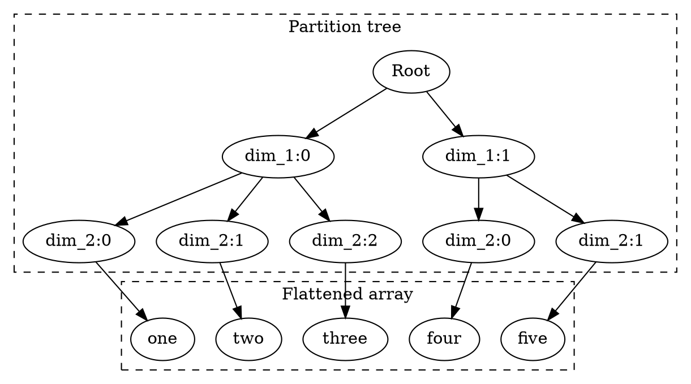

 <!-- go/markdown -->

# Koda Overview

This guide gives a quick 60-minute overview of **Koda**, geared mainly for new
users. You can see more detailed introduction in the
[Koda Fundamentals](fundamentals.md) guide.

Also see [Koda Cheatsheet](cheatsheet.md) for quick references.

* TOC
{:toc}

## Why Koda

### Koda Distinguishing Features

*   **Vectorization for complex data**: supports vectorized operations with C++
    grade performance not only for tables and arrays of primitives, but also for
    nested dicts, protos, structs, and graphs.
*   **Immutability**: enables modifications and keeping multiple, slightly
    varied versions of data without duplicating memory.
*   **Modular data**: data can be efficiently (usually for O(1)) split and
    joined, overlaid or enriched, and the data modules can be not just tables,
    columns and rows, but anything - from single attributes to proto updates to
    graph modifications.
*   **Computational graphs, lazy evaluation and serving support**: utilizes
    computational graphs that can be introspected and modified, and enable
    optimized data processing and serving.

### Why to Use Koda

*   **Interactivity in Colab**: transform interactively training data, design
    decision-making logic and evaluation flows (scoring, ranking, metrics etc.),
    work with models and more, where your data is tables, protos, structs,
    graphs etc.
*   **What-if experiments**: change input data, change evaluation
    logic, and get insights instantly.
*   **Zoom in on your data**: utilize **data views, updates, overlays,
    versions**, including when working with **large data sources**, and use only
    parts of the data needed at the moment.
*   **Performance**: computation is vectorized and performed in optimized C++.
*   **Evaluate in distributed environment or serve in production**: convert
    evaluation logic into **computational graphs**
    (ASTs) that can be introspected, optimized then evaluated in distributed
    environment or served in production.

## DataSlices and Items

Koda enables **vectorization** by utilizing *DataSlices*. DataSlices are arrays
with **partition trees**. They are stored and manipulated as **jagged arrays**
(irregular multi-dimensional arrays). Such partition trees are called
**JaggedShape**.

For example, the following DataSlice has 2 dimensions and 5 items. The first
dimension has 2 items and the second dimension has 5 items partitioned as `[3,
2]`.

```py
ds = kd.slice([["one", "two", "three"], ["four", "five"]])

ds.get_ndim() # 2
ds.get_shape() # JaggedShape(2, [3, 2])
```

Conceptually, it can be thought as partition tree + flattened array as shown in
the graph below.



**Items** are the elements of a DataSlice, and can be primitives (e.g. integers
or strings), or more complex data structures (e.g. lists, dicts and entities).

A zero-dimensional DataSlice is a scalar item. It is called a DataItem.

```py
kd.item(1, schema=kd.FLOAT32)  # 1.
kd.item(1, schema=kd.FLOAT32).to_py()  # python 1.
kd.list([10, 20, 30, 40])[2]  # 30
kd.dict({1: 'a', 2: 'b'})[2]  # 'b'
kd.from_py([{'a': [1, 2, 3], 'b': [4, 5, 6]}, {'a': 3, 'b': 4}])
kd.to_py(kd.dict({'a': [1, 2, 3], 'b': [4, 5, 6]})) # {'a': [1, 2, 3], 'b': [4, 5, 6]}

kd.slice([kd.list([1, 2, 3]), kd.list([4, 5])])  # DataSlice of lists
kd.slice([kd.dict({'a':1, 'b':2}), kd.dict({'c':3})])  # DataSlice of dicts
```

The DataSlice `kd.slice([kd.list([1, 2, 3]), kd.list([4, 5])])` is different
from the DataSlice `kd.slice([[1, 2, 3], [4, 5]])`, as the following example
shows. However, they can be converted from/to each other as we will see later.

```py
l1 = kd.list([1, 2, 3])
l2 = kd.list([4, 5])
list_ds = kd.slice([l1, l2])
list_ds.get_ndim()  # 1
list_ds.get_size()  # 2

int_ds = kd.slice([[1, 2, 3], [4, 5]])
int_ds.get_ndim()  # 2
int_ds.get_size()  # 5
```

DataSlices have different mechanisms around accessing and broadcasting compared
to tensors and nested lists. That is, they specialize in **aggregation** from
inner dimensions into outer ones.

```py
ds = kd.slice([[1, 2, 3], [4, 5]])
# Use .S for indexing
ds.S[1, 0]  # 4
ds.S[..., :2]  # [[1, 2],[4, 5]]

# Use .take for getting items in the last dimension
ds.take(1)  # [2, 5] - 1st item in the last dimension

# Use .L to work with DataSlices as with python lists
ds.L[0]  # kd.slice([1, 2, 3])
[int(y) for x in ds.L for y in x.L]  # [1, 2, 3, 4, 5]

kd.slice([5, 6]).expand_to(ds)  # [[5, 5, 5], [6, 6]]
ds + kd.slice([6, 7]) + kd.item(8)  # [[15, 16, 17], [19, 20]]
kd.agg_max(ds)  # [3, 5]
kd.map_py(lambda x, y: x*y, ds, 2)  # [[2, 4, 6], [8, 10]]

ds = kd.slice([4, 3, 4, 2, 2, 1, 4, 1, 2])
kd.group_by(ds)  # [[4, 4, 4], [3], [2, 2, 2], [1, 1]]
kd.group_by(ds).take(0)  # [4, 3, 2, 1]
kd.unique(ds)  # the same as above

# Group_by can be used to swap dimensions, which can be used to transpose a matrix
ds = kd.slice([[1, 2, 3], [4, 5, 6], [7, 8, 9]])
kd.group_by(ds.flatten(), kd.index(ds, dim=1).flatten())  # [[1, 4, 7], [2, 5, 8], [3, 6, 9]]
```

## Primitives

Koda supports INT32, INT64, FLOAT32, FLOAT64, STRING, BYTES, BOOLEAN, MASK as
primitive types.

```py
kd.int32(1) # INT32 DataItem
kd.int64([2, 3]) # 1-dim INT64 DataSlice
kd.float32([[1., 2.], [3.]]) # 2-dim FLOAT32 DataSlice
kd.str('string')
kd.bytes(b'bytes')
kd.bool(True)

# There is no native MASK type in Python, thus we have them directly in kd
kd.present
kd.missing
```

## Entities, Schemas, ItemIds and Universally-Unique ItemIds

To work with structured data, Koda utilizes a concept of **entities** that are
identified by **ItemIds** (128-bit ids) and can have attributes, which can be
primitives or other entities. **Entities** can have **schema** assigned, and
multiple entities can share the same schema, which improves performance for
vectorized operations.

```py
# kd.new creates new entities and assigns schemas to them
kd.new(x=1, y=2, schema='Point')

# Can also explicitly create schema with attributes before using.
my_schema = kd.named_schema('Point', x=kd.INT32, y=kd.INT32)
x = kd.new(x=1, y=2, schema=my_schema)
x.get_schema() == my_schema  # yes

# When converting from py, can specify schema
kd.from_py({'x': 1, 'y': 2}, schema=my_schema)

# It's possible to create nested entities
x = kd.new(a=1, b=kd.new(c=3, schema='Inner'), schema='Outer')
```

Entities are **immutable** by default, and it's possible to create multiple
slightly different versions with O(1) cost.

```py
x = x.with_attrs(d=4)  # add an attribute
x = x.updated(kd.attrs(x.b, c=5))  # update nested attribute 'c'

# Entities can be cloned or deep cloned
x = kd.new(a=1, b=kd.new(c=3, schema='Inner'), schema='Outer')
x1 = x.clone(a=2)
x1.get_itemid() != x.get_itemid()  # yes
x1.b.get_itemid() == x.b.get_itemid()  # yes
x2 = x.deep_clone(a=2)
x2.b.get_itemid() != x.b.get_itemid()  # yes

```

Both entities and schemas can be dynamically **allocated** or be
**universally-unique** (i.e. have the same ItemIds across processes/machines).

```py
# Instead of specifying schemas, can auto-allocate them
x = kd.new(a=1, b=kd.new(c=3))

# Entities with auto-allocated schemas cannot be mixed together in vectorized ops
kd.new(x=1).get_schema() != kd.new(x=1).get_schema()  # yes

# Auto-allocated schemas can be cast to have the same schema
x, y = kd.new(a=1), kd.new(b=2)  # two entites with different schemas
kd.slice([x, y.with_schema(x.get_schema())])

# Universally unique entities can be used similarly to named tuples
kd.uu(x=1, y=kd.uu(z=3))
kd.dict({kd.uu(x=1, y=2): 10, kd.uu(x=2, y=3): 20})[kd.uu(x=1, y=2)]  # 10

# Dynamically allocated entities have different ids
kd.new(x=1, y=2).get_itemid() != kd.new(x=1, y=2).get_itemid()  # yes
# Universally-uniquely allocated entities have always the same ids
kd.uu(x=1, y=2).get_itemid() == kd.uu(x=1, y=2).get_itemid()  # yes

# Can encode itemid's into strings
kd.encode_itemid(kd.new(x=1, y=2))  # always different, as ids are allocated
kd.encode_itemid(kd.uu(x=1, y=2)) == '07aXeaqDy6UJNv8EUfA0jz'  # always the same
```

## DataSlices of Structured Data, Explosion/Implosion and Attribute Access

When working with DataSlices of structured data (entities, lists, and dicts),
the operation is applied to **all the items** in the DataSlice
**simultaneously**.

```py
# Root
# ├── dim_1:0
# │   ├── dim_2:0 -> kd.new(x=1, y=20, schema='Point')
# │   └── dim_2:1 -> kd.new(x=2, y=30, schema='Point')
# └── dim_1:1
#     ├── dim_2:0 -> kd.new(x=3, y=40, schema='Point')
#     ├── dim_2:1 -> kd.new(x=4, y=50, schema='Point')
#     └── dim_2:2 -> kd.new(x=5, y=60, schema='Point')
kd.slice([
    [
      kd.new(x=1, y=20, schema='Point'),
      kd.new(x=2, y=30, schema='Point')
    ],
    [
      kd.new(x=3, y=40, schema='Point'),
      kd.new(x=4, y=50, schema='Point'),
      kd.new(x=5, y=60, schema='Point')
    ]
])

# Root
# ├── dim_1:0 -> kd.list([20, 30])
# └── dim_1:1 -> kd.list([40, 50, 60])
kd.slice([kd.list([20, 30]), kd.list([40, 50, 60])])

# Root
# ├── dim_1:0
# │   ├── dim_2:0 -> kd.dict({'a': 1,'b': 2})
# │   └── dim_2:1 -> kd.dict({'b': 3,'c': 4})
# └── dim_1:1
#     └── dim_2:0 -> kd.dict({'a': 5,'b': 6,'c': 7})
kd.slice([[kd.dict({'a': 1,'b': 2}), kd.dict({'b': 3,'c': 4})],
 [kd.dict({'a': 5,'b': 6,'c': 7})]])
```

As a result of **attribute access** of a **DataSlice of entities**, a new
DataSlice is returned, which contains attributes of every corresponding entity
in the original DataSlice.

```py
a = kd.slice([kd.new(x=1, schema='Foo'),
              kd.new(x=2, schema='Foo'),
              kd.new(x=3, schema='Foo')])
a  # [Entity(x=1), Entity(x=2), Entity(x=3)]
a.x  # [1, 2, 3]

a = kd.new(x=kd.slice([1, 2, 3]), schema='Foo')  # The same as above, but more compact

b = kd.slice([kd.new(x=1, schema='Foo'),
              kd.new(schema='Foo'),
              kd.new(x=3, schema='Foo')])
b  # [Entity(x=1), Entity(), Entity(x=3)]

b.maybe('x')  # [1, None, 3] - only the first one has an attribute 'x'
```

When accessing a **single element** of a **DataSlice of lists** or a **key** of
a **DataSlice of dicts**, a new DataSlice is returned with the corresponding
values in the original lists and dicts.

```py
a = kd.slice([kd.list([1, 2, 3]), kd.list([4, 5])])
# Access 1st item in each list
a[1]  # [2, 5] == [list0[1], list1[1]]

a = kd.slice([kd.dict({'a': 1, 'b': 2}), kd.dict({'b': 3, 'c': 4})])
a['c']  # [None, 4] == [dict0['c'], dict1['c']]
```

A common operation is **explosion** of DataSlices of lists, when we return a new
DataSlice with an **extra dimension**, where the innermost dimension is composed
of the values of the original lists.

```py
a = kd.slice([kd.list([1, 2, 3]), kd.list([4, 5])])
# Access 1st item in each list
a[1]  # [2, 5] == [list0[1], list1[1]]

# "Explosion": add another dimension to the DataSlice
# That is, 1-dim DataSlice of lists becomess 2-dim DataSlice
a[:]  # [[1, 2, 3],[4, 5]]

# "Explosion" of the first two items in each list
a[:2]  # [[1, 2], [4, 5]]
a[:].get_ndim() == a.get_ndim() + 1  # explosion adds one dimension
```

An opposite operation is **implosion**, when we return a DataSlice of lists with
one fewer dimension, where each list contains the values of the innermost
dimension of the original DataSlice.

```py
# Implode replaces the last dimension with lists
a = kd.slice([[1, 2, 3], [4, 5]])
kd.implode(a)  # kd.slice([kd.list([1,2,3]), kd.list([4,5])])
kd.implode(a)[:]  # == a
```

Getting all keys or values of a DataSlice of dicts will return a DataSlice with
one more dimension.

```py
a = kd.slice([kd.dict({'a': 1, 'b': 2}), kd.dict({'b': 3, 'c': 4})])

a.get_keys() # [['a', 'b'], ['b', 'c']]
a.get_values() # [[1, 2], [3, 4]]
# shortcut for get_value
a[:] # [[1, 2], [3, 4]]

# note, get_keys() doesn't guarantee to preserve the order, but we can sort before lookup
a[kd.sort(a.get_keys())]  # [[1, 2], [3, 4]]
a.get_keys().get_ndim() == a.get_ndim() + 1  # the keys DataSlice has one more dimension
```

Here is an example that puts everything together.

```py
a = kd.from_py([{'x': 1}, {'x': 3}], dict_as_obj=True)
b = kd.from_py([{'y': 2}, {'y': 4}])

a[:].x + b[:]['y']  # [3, 7]
kd.zip(kd.agg_sum(a[:].x), kd.agg_sum(b[:]['y']))  # [4, 6]
```

## Objects

To make possible mixing different primitives or entities/lists/dicts with
different schemas in a single DataSlice, Koda uses **objects**, which store
their schema in their data.

There are two main kinds of objects in Koda:

*   Primitives, such as integers and strings.
*   Objects that can have attributes and that use a special attribute to store
    their schemas. They are **similar to Python objects** that store their
    classes in the `__class__` attribute.

```py
kd.obj(x=2, y=kd.obj(z=3))

x = kd.uuobj(x=2, y=kd.uuobj(z=3))  # universally unique (always the same id)
kd.encode_itemid(x) == '07ZWVFWxz9lNirDW8RXBlw'  # always the same id

x = kd.from_py([{'a': 1, 'b': 2}, {'c': 3, 'd': 4}], dict_as_obj=True)
x[0]  # Obj(a=1, b=2)
x[:].maybe('a')  # [1, None]

# Mix objects with different schemas
kd.slice([kd.obj(1), kd.obj("hello"), kd.obj([1, 2, 3])])
kd.slice([kd.obj(x=1, y=2), kd.obj(x="hello", y="world"), kd.obj(1)])

kd.obj(x=1).get_schema() # kd.OBJECT
kd.obj(x=1).get_schema() == kd.obj(1).get_schema()  # yes

# Get per-item schemas stored in every object
kd.obj(x=1).get_obj_schema() # IMPLICIT_SCHEMA(x=INT32)
kd.obj(x=1).get_obj_schema() != kd.obj(1).get_obj_schema()  # yes, different actual schemas
kd.slice([kd.obj(x=1,y=2), kd.obj(x="hello", y="world"), kd.obj(1)]).get_obj_schema()
# [IMPLICIT_SCHEMA(x=INT32, y=INT32), IMPLICIT_SCHEMA(x=STRING, y=STRING), INT32]
```

Similar to entities, objects can be modified with a cost of O(1), cloned or deep
cloned.

```py
x = kd.obj(x=2, y=kd.obj(z=3))
x = x.with_attrs(a=4)  # add attribute
x = x.updated(kd.attrs(x.y, z=5))  # update nested attribute

x1 = x.clone(z=4)
x2 = x.deep_clone(z=5)
```

Entities and objects can be converted to each other.

```py
x, y = kd.new(a=1), kd.new(b=2)
kd.slice([kd.obj(x), kd.obj(y)])  # convert both entities to objects

# Objects can be converted to entities
my_schema = kd.named_schema('Point', x=kd.INT32, y=kd.INT32)
kd.obj(x=1, y=2).with_schema(my_schema)
kd.from_py({'x': 1, 'y': 2}, dict_as_obj=True).with_schema(my_schema)  # the same as above
```

Note: Compared to entities, objects have a higher **performance overhead**
during vectorized operations, as each object in a DataSlice has its own schema,
and different objects in the same DataSlice might have different sets of
attributes. For large data, the use of entities with explicit schemas is
recommended for faster execution.

Similar to entities, lists and dicts can be objects too.

```py
l1 = kd.list([1, 2])
l2 = kd.list(['3', '4'])
l_objs = kd.slice([kd.obj(l1), kd.obj(l2)])
l_objs[:]  # [[1, 2], ['3', '4']]
assert l_objs.get_schema() == kd.OBJECT
l_objs.get_obj_schema()  # [LIST[INT32], LIST[STRING]]

d1 = kd.dict({'a': 1})
d2 = kd.dict({2: True})
d_objs = kd.slice([kd.obj(d1), kd.obj(d2)])
d_objs[:]  # [{'a': 1}, {2: True}]
assert d_objs.get_schema() == kd.OBJECT
d_objs.get_obj_schema()  # [DICT{STRING, INT32}, DICT{INT32, BOOLEAN}]
```

Primitives are also objects. Their schemas are inferred from their values.

```py
kd.obj(1)
kd.obj(kd.int64(1))
kd.obj('hello')

assert kd.obj(1).get_schema() == kd.OBJECT
assert kd.obj(1).get_obj_schema() == kd.INT32

# Dict values are objects
# No need to wrap them using kd.obj
d = kd.dict({'a': 1, 'b': '2'})
d.get_schema()  # DICT{STRING, OBJECT}
```

## Sparsity and Masks

**Sparsity** is a first-class concept in Koda. Every item in a DataSlice can be
present or missing and all operators support missing values.

```py
a = kd.slice([[1, None], [4]])
b = kd.slice([[None, kd.obj(x=1)], [kd.obj(x=2)]])
a + b.x  # [[None, None], [6]]
kd.agg_any(kd.has(a)) # [present, present]
kd.agg_all(kd.has(a)) # [missing, present]
```

**Masks** are used to represent present/missing state. They are also used in
comparison and logical operations.

```py
# Get the sparsity of a DataSlice
kd.has(kd.slice([[1, None], [4]])) # [[present, missing], [present]]
kd.slice([1, None, 3, 4]) != 3  # [present, missing, missing, present]
kd.slice([1, 2, 3, 4]) > 2  # [missing, missing, present, present]
```

Using masks instead of Booleans in comparison and logical operations is useful
because masks have a 2-valued logic. In the presence of missing values, the
Booleans have a 3-valued logic (over True, False, missing), which is more
complex and confusing.

Masks can be used to **filter** or **select** items in a DataSlice. The
difference is that filtering does not change the shape of the DataSlice and
filtered out items become missing, while selection changes the shape by only
keeping selected items in the resulting DataSlice.

```py
x = kd.slice([1, 2, 3, 4])
y = kd.slice([4, 5, 6, 7])

# To filter a DataSlice based on masks, use kd.apply_mask or & as shortcut
kd.apply_mask(x, y >= 6)
x & (y >= 6) # ([None, None, 3, 4]

a = kd.obj(x=kd.slice([1,2,3]))
a.x >= 2  # [missing, present, present]
a &= a.x >= 2  # [None, kd.obj(x=2), kd.obj(x=3)]

# Can use 'select' to filter DataSlices
a = kd.slice([kd.obj(x=1), kd.obj(x=2), kd.obj(x=3)])
a1 = a.select(a.x >= 2)  # [Obj(x=2), Obj(x=3)]
a1 = a.select(lambda u: u.x >= 2)  # the same as above
a1 = (a & (a.x >= 2)).select_present()  # the same as above

# Can update attributes only of selected entities/objects
a.updated(kd.attrs(a1, y=a1.x*2))  # [Obj(x=1), Obj(x=2, y=4), Obj(x=3, y=6)]
```

**DataSlices** with compatible shapes can **coalesced** (i.e., missing items are
replaced by corresponding items of the other DataSlice).

```py
kd.str(None)  # "None" string
kd.str(None) | 'hello'  # 'hello'

kd.coalesce(kd.slice([1, None, 3]), kd.slice([4,5,6]))  # [1,5,3]
kd.slice([1, None, 3]) | kd.slice([4,5,6])  # the same as above
```

## Immutable Workflows and Bags (Collections of Attributes)

### Immutability

Koda's data structures are **immutable**. However, Koda offers various efficient
ways to create modified copies of your data, including complex edits and joins.
These copies share the same underlying memory whenever possible, and many
operations, such as edits and joins, are performed in O(1) time. Immutability
means that modifying an object or entity does *not* automatically update the
original objects or entities, even if they share the same ItemId.

NOTE: Mutable APIs is available only in advanced, high-performance workflows,
but with trade-offs. They require a deeper understanding of Koda data model and
it is easier to make mistakes which can be hard to debug.

```py
a = kd.obj(x=2, y=kd.obj(z=3))
# update existing attribute and add a new attribute
a1 = a.with_attrs(x=4, u=5)  # Obj(u=5, x=4, y=Obj(z=3))
# a stays the same as it is immutable
a # Obj(x=2, y=Obj(z=3))

b = kd.dict({'a': 1, 'b': 2})
# update with a new key/value pair
b1 = b.with_dict_update('a', 2) # Dict{'a'=2, 'b'=2}
# update with another dict
b2 = b.with_dict_update(kd.dict({'a': 3, 'c': 4})) # Dict{'c'=4, 'a'=3, 'b'=2}
# b stays the same as it is immutable
b # Dict{'a'=1, 'b'=2}

c = kd.list([1, 2, 3])
# Create a new list by concatenating two lists
c1 = kd.concat_lists(c, kd.list([4, 5]))  # List[1, 2, 3, 4, 5]
# Or create a new list by appending a DataSlice
c2 = kd.appended_list(c, kd.slice([4, 5]))  # List[1, 2, 3, 4, 5]
# c stays the same as it is immutable
c # List[1, 2, 3]
```

### Bags

To support modifications and joins in an immutable environment, Koda utilizes
**bags**. Bags are collections of attributes. Each attribute within a bag is a
mapping: `(itemid, attribute_name) -> value`. All data structures (including
entities, dicts, and lists) are represented in this manner, and associated bags
are accessible via the `get_bag()` method. These mappings are stored using a
combination of hash maps and arrays. This hybrid approach enables fast,
vectorized performance for table-like data while supporting data with complex
structure and sparsity. Bags are merged for O(1) by utilizing a concept of
**fallbacks** (when we don't find a mapping in one bag, we look it up in the
other ones). Such a chain of fallback bags can be merged into a single bag when
higher lookup performance is required.

NOTE: Almost all data (e.g. entities, dicts, lists, objects, schemas) are stored
as attributes in bags.

```py
a = kd.obj(x=2, y=kd.obj(z=3))

# Get the bag associated with a DataSlice
db = a.get_bag()
# Get quick stats of a bag, use its repr
db
# Print out all attributes
db.contents_repr()
# Print out only data attributes
db.data_triples_repr()
# Print out only schema attributes
db.schema_triples_repr()
# Get approximate size (e.g. number of attributes)
db.get_approx_size()
```

<section class='zippy'>

Optional: Understand how entities are represented as attributes.

```
a = kd.obj(x=2, y=kd.obj(z=3))

a.get_bag()
# DataBag $b933:
#   2 Entities/Objects with 3 values in 3 attrs
#   0 non empty Lists with 0 items
#   0 non empty Dicts with 0 key/value entries
#   2 schemas with 3 values
#
# Top attrs:
#   z: 1 values
#   y: 1 values
#   x: 1 values


a.get_bag().contents_repr()
# DataBag $b933:
# $004QVkgdETIyelSHQw2OHs.get_obj_schema() => #6wL3PlezPQ4FnldO95VeD6
# $004QVkgdETIyelSHQw2OHs.z => 3
# $004QVkgdETIyelSHQw2OHt.get_obj_schema() => #6wK1lU2l9FsTJjliNOPBih
# $004QVkgdETIyelSHQw2OHt.x => 2
# $004QVkgdETIyelSHQw2OHt.y => $004QVkgdETIyelSHQw2OHs
#
# SchemaBag:
# #6wK1lU2l9FsTJjliNOPBih.x => INT32
# #6wK1lU2l9FsTJjliNOPBih.y => OBJECT
# #6wL3PlezPQ4FnldO95VeD6.z => INT32
```

</section>

<section class='zippy'>

Optional: Understand how dicts are represented as attributes.

```
b = kd.dict({'a': 1, 'b': 2})

b.get_bag()
# DataBag $4863:
#   0 Entities/Objects with 0 values in 0 attrs
#   0 non empty Lists with 0 items
#   1 non empty Dicts with 2 key/value entries
#   1 schemas with 2 values
#
# Top attrs:


b.get_bag().contents_repr()
# DataBag $4863:
# $0UGItpaGKCXaPsOxEscFOA['a'] => 1
# $0UGItpaGKCXaPsOxEscFOA['b'] => 2
#
# SchemaBag:
# #7QRy2BAblHHNytHxFmpaGL.get_key_schema() => STRING
# #7QRy2BAblHHNytHxFmpaGL.get_value_schema() => INT32
```

</section>

<section class='zippy'>

Optional: Understand how lists are represented as attributes.

```
c = kd.list([1, 2, 3])

c.get_bag()
# DataBag $10cc:
#  0 Entities/Objects with 0 values in 0 attrs
#  1 non empty Lists with 3 items
#  0 non empty Dicts with 0 key/value entries
#  1 schemas with 1 values
#
# Top attrs:


c.get_bag().contents_repr()
# DataBag $10cc:
# $0FAMhn8RmKvHXJvcKuKJq3[:] => [1, 2, 3]
#
# SchemaBag:
# #7QUhePdHCvsoCyAWAHwtzx.get_item_schema() => INT32
```

</section>

### Representing Updates as Bags

Instead of creating a modified object/dict/list directly, we typically create a
**bag** that contains the data **updates**. Updates are applied in O(1) time by
the fallback mechanism described above. Updates overwrite existing attributes or
add new ones.

```py
a = kd.obj(x=2, y=kd.obj(z=3))
# update existing attribute and add a new attribute
upd = a.attrs(x=4, u=5)
# To see its contents, you can do
upd.contents_repr()
a1 = a.updated(upd) # Obj(u=5, x=4, y=Obj(z=3))

b = kd.dict({'a': 1, 'b': 2})
# update with a new key/value pair
upd = b.dict_update('a', 2)
b1 = b.updated(upd) # Dict{'a'=2, 'b'=2}
# update with another dict
upd = b.dict_update(kd.dict({'a': 3, 'c': 4}))
b2 = b.updated(upd) # Dict{'c'=4, 'a'=3, 'b'=2}

# Schemas are stored and can be updated in the same way
a = kd.new(x=1, schema='MySchema')
a.updated(kd.attrs(a.get_schema(), y=kd.INT32))  # update the schema
```

<section class='zippy'>

Optional: Understand how entity/object updates are represented as attributes.

```
a = kd.obj(x=2, y=kd.obj(z=3))
upd = a.attrs(x=4, u=5)

# Only modification is stored as attributes in the update bag
upd
# DataBag $7de8:
#   1 Entities/Objects with 2 values in 2 attrs
#   0 non empty Lists with 0 items
#   0 non empty Dicts with 0 key/value entries
#   1 schemas with 2 values
#
# Top attrs:
#   x: 1 values
#   u: 1 values


upd.contents_repr()
# DataBag $7de8:
# $004QVkgdETIyelSHQw2OHz.get_obj_schema() => #6wGECIg4UYvAsDXKvqtJQC
# $004QVkgdETIyelSHQw2OHz.u => 5
# $004QVkgdETIyelSHQw2OHz.x => 4
#
# SchemaBag:
# #6wGECIg4UYvAsDXKvqtJQC.u => INT32
# #6wGECIg4UYvAsDXKvqtJQC.x => INT32
```

</section>

<section class='zippy'>

Optional: Understand how dict update is represented as attributes.

```
b = kd.dict({'a': 1, 'b': 2})
upd = kd.dict_update(b, kd.dict({'a': 3, 'c': 4}))

upd
# DataBag $7806:
#   0 Entities/Objects with 0 values in 0 attrs
#   0 non empty Lists with 0 items
#   1 non empty Dicts with 2 key/value entries
#  1 schemas with 2 values
#
# Top attrs:


upd.contents_repr()
# DataBag $7806:
# $0UGItpaGKCXaPsOxEscFOG['a'] => 3
# $0UGItpaGKCXaPsOxEscFOG['c'] => 4
#
# SchemaBag:
# #7QRy2BAblHHNytHxFmpaGL.get_key_schema() => STRING
# #7QRy2BAblHHNytHxFmpaGL.get_value_schema() => INT32
```

</section>

Here is a more complex example that puts everything together.

```py
a = kd.obj(x=2, y=kd.obj(z=3), z=kd.dict({'a': 1, 'b': 2}), t=kd.list([1,2,3]))
upd = kd.attrs(a, x=4, u=5)  # create data update
a1 = a.updated(upd)
a1 = a.with_attrs(x=4, u=5)  # a shortcut for above
a2 = a.updated(kd.attrs(a.y, z=5))  # update a deep attribute a.y.z
a3 = a.updated(kd.dict_update(a.z, 'b', 3))  # update dict
a4 = a.updated(kd.dict_update(a.z, kd.dict({'b': 3, 'c': 4})))  # multi-update dict
a5 = a.with_attrs(t=kd.concat_lists(a.t, kd.list([4, 5])))  # lists need to be updated as whole
```

Instead of being applied immediately, updates can be accumulated and applied
later.

```py
# Updates can be composed using << and >>, which defines what overwrites what
kd.attrs(a, x=3, y=4) << kd.attrs(a, x=5, u=6)  # == kd.attrs(a, x=5, y=4, u=6)
kd.attrs(a, x=3, y=4) >> kd.attrs(a, x=5, u=6)  # == kd.attrs(a, x=3, y=4, u=6)

# Updates can be accumulated and applied later
a = kd.obj(x=2, y=kd.obj(z=3))
upd = kd.bag()  # empty update
upd <<= kd.attrs(a, x=a.x + 1)
upd <<= kd.attrs(a, x=a.updated(upd).x + 2)  # can use a.x with an update
upd <<= kd.attrs(a, u=a.y.z + a.updated(upd).x)
a6 = a.updated(upd)  # Obj(x=5, y=Obj(z=3), u=8)
```

All APIs and concepts mentioned above support vectorization using DataSlice.

```py
a = kd.new(x=kd.slice([1, 2, 3]), y=kd.slice([4, 5, 6]))  # [Entity(x=1, y=4), Entity(x=2, y=5), Entity(x=3, y=6)]
a.with_attrs(z=kd.slice([7, 8, 9]))  # [Entity(x=1, y=4, z=7), Entity(x=2, y=5, z=8), Entity(x=3, y=6, z=9)]
a.updated(kd.attrs(a, x=kd.slice([10, 11, 12])))  # [Entity(x=10, y=4), Entity(x=11, y=5), Entity(x=12, y=6)]
# Updates can target a subset of entities by utilizing sparsity
a.updated(kd.attrs(a & (a.y >=5), z=kd.slice([7, 8, 9]))).z  # [None, 8, 9]
```

### Enrichments

Data can be **enriched** with data from another source. Enrichment *only adds*
missing attributes without overwriting existing ones. This operation is also
O(1).

TIP: The key difference between update and enrichment is that update overrides
existing attributes while enrichment does not. Enrichment augments the
attributes using the fallback mechanism described above.

```py
a = kd.obj(x=2, y=kd.obj(z=3))
a_attrs = kd.attrs(a, x=1, u=5)

a.updated(a_attrs) # Obj(u=5, x=1, y=Obj(z=3))
a.enriched(a_attrs) # Obj(u=5, x=2, y=Obj(z=3))
```

### Extraction

Updates and enrichments merge multiple bags together. After enrichments and
updates, merged bags may contain attributes irrelevant to a specific object or
entity (e.g. enrichment with unrelated data). The `ds.extract_bag()` method
allows extracting a bag containing only relevant attributes (those recursively
accessible from `ds`). `ds.extract()` is equivalent to
`ds.with_bag(ds.extract_bag())`.

```py
a = kd.obj(x=2, y=kd.obj(z=3), z=kd.dict({'a': 1, 'b': 2}), t=kd.list([1, 2, 3]))
a.get_bag().get_approx_size()  # 20

ay1 = a.y.with_attrs(z=4, zz=5)  # Modify ay1 on its own
ay1.get_bag().get_approx_size()  # 25, as it contains all attributes from a

extracted_bag = ay1.extract_bag()
extracted_bag.get_approx_size()  # 5, only it only contain ay1 attributes

a.updated(extracted_bag)  # Apply the attributes from ay1 to a
a.enriched(extracted_bag)  # Instead, this augments the data without overwriting

# If data is enriched with unrelated data, we can use extract to remove it

b = kd.obj(x=1, y=2)
a9 = a.enriched(kd.attrs(b, z=3))  # adding an unrelated attribute
a9.extract()  # == a9 with inaccessible attributes removed
```

### Cloning

Cloning is another way to work in immutable way, but it allocates new ItemIds.
Thus, it is more expensive and data cannot be joined later.

```py
a = kd.obj(x=2, y=kd.obj(z=3))
a.clone(x=3).get_itemid() != a.get_itemid()  # yes
a.with_attrs(x=3).get_itemid() == a.get_itemid()  # yes
a.updated(a.clone(x=3).get_bag())  # doesn't overwrite x
a.updated(a.with_attrs(x=3).get_bag())  # overwrites x
```

## Functors and Lazy Evaluation

Koda supports both eager computation and lazy evaluation similar to TF, JAX and
PyTorch.

Lazy evaluation has the following benefits:

*   **Separation of computation logic from evaluation**: same computation logic
    can be evaluated on different inputs
*   **Graph optimization**: computation is converted to a graph representation
    which can be further optimized
*   **Parallel computation**: graph can be analyzed and partitioned into
    sub-graphs which can be evaluated in parallel
*   **Distributed computation**: graph can be serialized and evaluated in remote
    workers
*   **Serving**: graph can be evaluated in a C++ production environment

Koda uses **tracing** and converts Python functions into Koda **functors**
representing computational graphs. Koda functors are special Koda objects that
can be used for evaluation or could be stored together with data.

Same as JAX, in order for tracing works correctly, the Python function can only
contain Koda operators and Python control flow (i.e. `if`, `for` and `while`)
cannot be traced and is called only once during tracing. To trace a Python
function, we wrap it with `kd.fn(py_fn)`.

```py
# Convert python functions into functors
fn = kd.fn(lambda x, y: x+y, y=1)
fn(kd.slice([1, 2, 3]), y=10)  # [11, 12, 13]

# Functors can be used as normal Koda objects (assigned and stored)
fns = kd.obj(fn1=fn, fn2=fn.bind(y=5))
fns.fn2(kd.slice([1, 2, 3]))  # [6, 7, 8]

#
kd.dumps(fn)
```

**kd.py_fn** can be used in interactive workflows to wrap python functions
without tracing, which can make debugging in certain situations easier.

```py
# kd.fn uses tracing, and kd.py_fn wraps pythong functions "as-is", which is
# useful as not everything can be traced
fn = kd.py_fn(lambda x, y: x if kd.sum(x) > kd.sum(y) else y)
fn(x=kd.slice([1, 2, 3]), y=kd.slice([4, 5]))  # [4, 5]

# Can create functors that contain other functors with @kd.trace_as_fn,
# and which would be accessible as attributes
@kd.trace_as_fn(py_fn=True)  # py_fn=True, as below cannot be traced properly
def my_op(x, y):
  while (x > 0): y += x; x -= 1
  return y

@kd.trace_as_fn()
def final(x, y, z): return my_op(my_op(x, y), z)

fn = kd.fn(final)
fn(2, 3, 4)  # 9 = (2 + 3) + 4
fn.final(2, 3, 4)  # the same as above
fn.final.my_op(2, 3)  # 5 - access of the deeper functor
# "replace" functor with another one
fn.updated(kd.attrs(fn.final, my_op=kd.fn(lambda x, y: x * y)))(2, 3, 4)  # 24 = (2 * 3) * 4
```

## Convenience Features

Koda provides a comprehensive list of convenience features including:

**String manipulations**

```py
x, y = kd.slice([1, 2, 3]), kd.slice(["a", "b", "c"])
kd.fstr(f"i{x:i}-{y:s}")  # ['i1-a', 'i2-b', 'i3-c']
kd.strings.format("i{x}-{y}", x=x, y=y)  # the same as above
kd.strings.split(kd.slice(["a b", "c d e"]))  # [['a', 'b'], ['c', 'd', 'e']]
ds = kd.slice([['aa', 'bbb'], ['ccc', 'dd']])
kd.strings.agg_join(ds, '-')  # ['aa-bbb', 'ccc-dd']
kd.strings.agg_join(ds, '-', ndim=2)  # ['aa-bbb-ccc-dd']
kd.strings.length(ds)  # [[2, 3], [3, 2]]
```

**Math operators**

```py
# Math
x = kd.slice([[3., -1., 2.], [0.5, -0.7]])
y = kd.slice([[1., 2., 0.5], [0.9, 0.3]])
x * y
kd.math.agg_mean(x)
kd.math.log10(x)
kd.math.pow(x,y)
```

**Random Number & Sampling**

```py
# Random
x = kd.slice([[1., 2., 3.], [4., 5.]])
# Generate random integers
kd.randint_like(x, seed=123)  # fix seed
kd.sample(x, ratio=0.7, seed=42)
kd.sample_n(x, n=2, seed=342)
```

**Ranking**

```py
# Ranking
x = kd.slice([[5., 4., 6., 4., 5.], [8., None, 2.]])
kd.ordinal_rank(x)  # [[2, 0, 4, 1, 3], [1, None, 0]]
kd.ordinal_rank(x, descending=True)  # [[1, 3, 0, 4, 2], [0, None, 1]]
kd.dense_rank(x)  # [[1, 0, 2, 0, 1], [1, None, 0]]
```

**Containers to manage data and evaluation logic (e.g. ranking formulas)**

```py
# Editable containers
x = kd.container()
x.a = 1
x.d = kd.container()
x.d.e = 4
x.d.f = kd.list([1, 2, 3])
```

**Serialization**

```py
# DataSlice
serialized_bytes = kd.dumps(ds)
ds = kd.loads(serialized_bytes)

# Bag
serialized_bytes = kd.dumps(db)
db = kd.loads(serialized_bytes)
```

**Multi-threading**

```py
def call_slow_fn(prompt):
  return slow_fn(prompt)
kd.map_py(call_slow_fn, kd.slice(['hello', None, 'world']), max_threads=16)
```

## Mutable Workflows

While immutable workflows are recommended for most cases, certain situations
where the same Koda data structure has to be frequently modified (e.g. cache)
require mutable data structures. `fork_bag` returns a mutable version of data at
the cost of **O(1)** (without modifying the original one), while `freeze_bag`
returns an immutable version (also for O(1)) and *extract* and *clone* can
extract and return immutable pieces. Note, mutable workflows are not supported
in tracing and have more limited options for productionalization.

```py
# Modify the same dict many times
d = kd.dict()  # immutable
d = d.fork_bag()  # mutable
for i in range(100):
  # Insert random x=>y mappings (10 at a time)
  k = kd.random.randint_shaped(kd.shapes.new(10))
  v = kd.random.randint_shaped(kd.shapes.new(10))
  d[k] = v
d = d.freeze_bag()  # immutable

a = kd.obj(x=1, y=2).fork_bag()
a.y = 3
a.z = 4
a = a.freeze_bag()
```

## Interoperability

Koda can easily interoperate with normal Python, Pandas, Numpy and Proto.

**From/to PyObject**

```py
kd.obj(x=1, y=2).x.to_py()
kd.slice([[1, 2], [3, 4]]).to_py()
kd.obj(x=1, y=kd.obj(z=kd.obj(a=1))).to_py(max_depth=-1)
kd.list([1, 2, 3]).to_py()
kd.from_py([{'a': [1, 2, 3], 'b': [4, 5, 6]}, {'a': 3, 'b': 4}])
kd.to_py(kd.dict({'a': [1, 2, 3], 'b': [4, 5, 6]}))  # {'a': [1, 2, 3], 'b': [4, 5, 6]}
```

**From/to Pandas DataFrames**

```py
pdkd.from_dataframe(pd.DataFrame(dict(x=[1, 2, 3], y=[10, 20, 30])))
pdkd.to_dataframe(kd.obj(x=kd.slice([1, 2, 3]), y=kd.slice([4, 5, 6])), cols=['x', 'y'])
```

**From/to Numpy Arrays**

```py
npkd.to_array(kd.slice([1, 2, None, 3]))
npkd.from_array(np.array([1, 2, 0, 3]))
```

**From/to Proto**

```proto
message MessageA {
  optional string text = 1;
  optional MessageB b = 2;
  repeated MessageB b_list = 3;
}

message MessageB {
  optional int32 int = 1;
}
```

```py
p1 = MessageA(text='txt1', b_list=[MessageB(int=1), MessageB(int=2)])
p2 = MessageA(ext='txt2', b=MessageB(int=3))

ds1 = kd.from_proto(p1) # Entity(text='txt1', b_list=List[Entity(int=1), Entity(int=2)])
ds2 = kd.from_proto([p1, None, p2])
# [
#   Entity(text='txt1', b_list=List[Entity(int=1), Entity(int=2)]),
#   missing,
#   Entity(text='txt1', b=Entity(int=3)),
# ]

p = kd.to_proto(ds1, MessageA)
p_list = kd.to_proto(ds2, MessageA)
```
